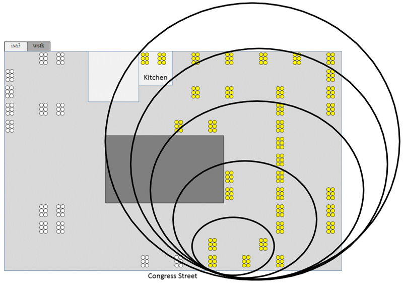

# Test Setup

The sections below describe the test setup used in two different scenarios. All nodes are in the same physical location and with transmission (TX) power adjusted to achieve the stated number of hops were used to allow for best comparability of the results. The nodes were located throughout an active office environment with typical Wi-Fi and other interference. No efforts were undertaken to shield the test network from that environment.

## Test Parameters

The applications used for this test effort generally have the following configurations.

Note that most of these settings are default settings for the base sample application used.

:::custom-table
| Configuration Item | Value | Default |
|--------------------|-------|---------|
| > | > | **Zigbee Table Sizes** |
| Neighbor table size | 26 | 16 |
| Routing table size | 200 | 16 |
| Source route table size | 200 | 7 |
| Discovery table size | 8 | 8 |
| Broadcast transaction table | 128 | 15 |
| > | > | **Zigbee Stack Profile Parameters** |
| Max hops | 30 | Default |
| MAC indirect Tx timeout | 7680 ms | Default |
| nwkMaxBroadcastRetries | 2 | Default |
| Passive Ack threshold | 6 | Default |
| Retry queue size | 29 | Default |
| > | > | **Radio Scheduler (Zigbee)** |
| ZB background RX | 255 | Default |
| ZB active RX | 255 | Default |
| ZB TX | 100 | Default |
| > | > | **Radio Scheduler (BLE)** |
| scan (min,max) | 191, 143 | Default |
| adv (min,max) | 175, 127 | Default |
| conn (min,max) | 135.0 | Default |
| init (min,max) | 55.15 | Default |
| threshold_coex | 175 | Default |
| rail_mapping_offset | 16 | Default |
| rail_mapping_range | 16 | Default |
| threshold_coex_req | 255 | Default |
| coex_pwm_period | 0 | Default |
| coex_pwm_dutycycle | 0 | Default |
| afh_scan_interval | 0 | Default |
| adv_step | 4 | Default |
| scan_step | 4 | Default |
:::

## General Test Methodology

This testing used a custom command line interface (CLI) to transmit a broadcast that has a unique signature in packet. Upon receipt of this special broadcast packet, `emDebugBinaryPrint()` is used to create the timestamp receipt of this packet to the packet trace interface (PTI) stream to ensuring that there is a timestamp on the transmitting device, and a timestamp on each receiving device.

Silabs-pti.jar was used to collect the PTI streams of all devices under test. This is a publicly available Silicon Labs tool that essentially runs Network Analyzer in a headless manner.

To keep time synchronization between all devices, Silicon Labs used the wireless starter kit (WSTK) adapter's time sync functions by setting up the transmit device as the time server and configuring all receiving devices as clients to that server.

## General Test Topology

Tests were performed on the Silicon Labs Boston office open wireless test network using a mixed collection of EFR32MG boards. For all testing conducted, a dozen EFR32MG21 boards and a dozen EFR32MG24 boards were used, and all other devices were EFR32MG12 boards.

Five network topology sizes are normally under test for large scale performance testing: 24, 48, 96, 144, and 192 devices. Each of these topologies uses the previous smaller topology set of devices plus the additional devices. For this test effort, Silicon Labs used 48, 96, and 192 device network sizes.

The same physical device is used as the Zigbee coordinator for every network topology, and this is the device that originates any broadcasts sent for the test scenarios. For example, below is a basic office floorplan layout showing the physical location of test devices, where the concentric circles approximate the devices used in each topology. The smallest circle shows the 24-node topology while the next larger circles illustrate the idea of including extra nodes farther away to create larger network topologies. The white devices just mean they are reserved and not important to this illustration.

