# Test Results

## Zigbee/BLE DMP Large Network Test Results (Broadcast)

### Test Setup Details

This test scenario is similar to the basic testing Silicon Labs does for Zigbee-only large network testing using broadcast packets to measure the reliability and latency of each discrete broadcast ([Zigbee Mesh Network Performance](https://docs.silabs.com/zigbee/latest/zigbee-mesh-network-performance/)) but adds a BLE advertising vector.

Two network size topologies were used for this testing: 96 and 192 devices.

A customized sample application, Zigbee - SoC DynamicMultiprotocolLight, was used for all testing. This app was configured the same for all devices, with the exception that the ZC (Zigbee Coordinator) was configured as a High RAM concentrator.

One set of tests were conducted with BLE advertisements disabled for all nodes, and another set of tests with all connectable BLE advertisement with max payload once every 152.5 ms enabled. All devices were configured with a passive ACK threshold of 6. The ZC was the broadcast originator for all testing.

Broadcast packets are not actively acknowledged. However, the Zigbee stack uses the notion of neighboring nodes rebroadcasting the same packet as "passive ack". So, setting the passive ACK threshold to 6 means that a node will wait for at least 6 rebroadcasts from neighboring nodes before deeming the broadcast transmission complete.

### Test Results

The following images show the time in milliseconds after transmission of the original broadcasts on the x-axis versus the percentage of nodes in the network to receive the broadcast in that given time. One specialty is the entry for -10ms, which includes broadcasts not received by all nodes in the network.

There are separate images for network sizes of 96 and 192 devices both with and without BLE advertisement. Additionally, the test was run with 5 broadcasts per second as well as 1 broadcast every two seconds. Each of the images includes results for broadcast payload sizes of 8, 16, 32, and 64 bytes represented by different shades of blue as explained in the legend.

#### Figures: 96 devices, 200 ms

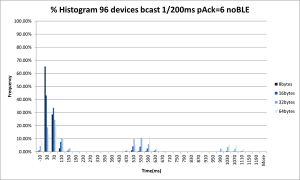  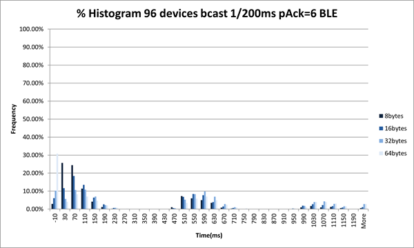

#### 96 devices, 2000 ms

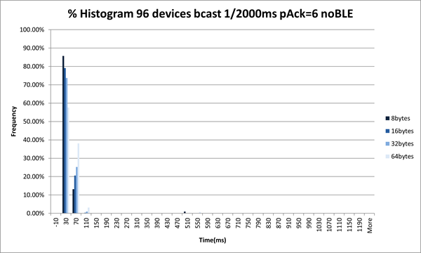  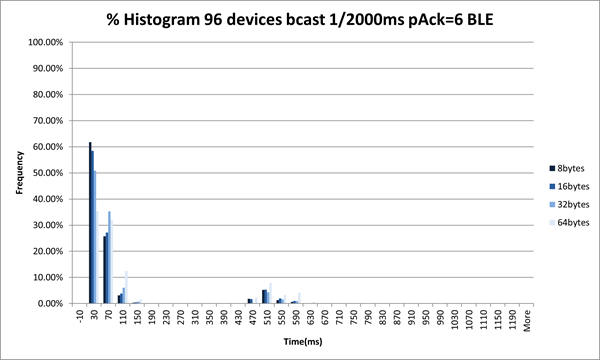

#### 192 devices, 200 ms

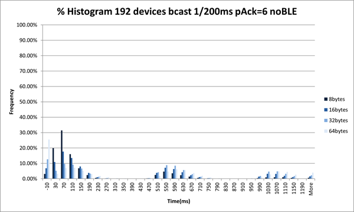  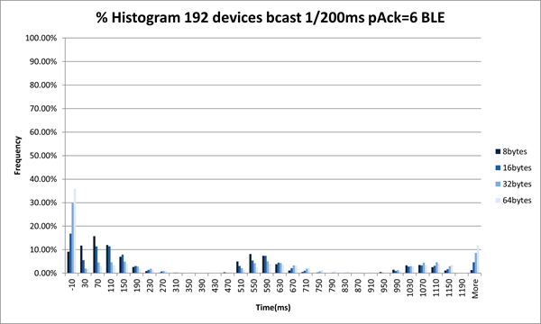

#### 192 devices, 2000 ms

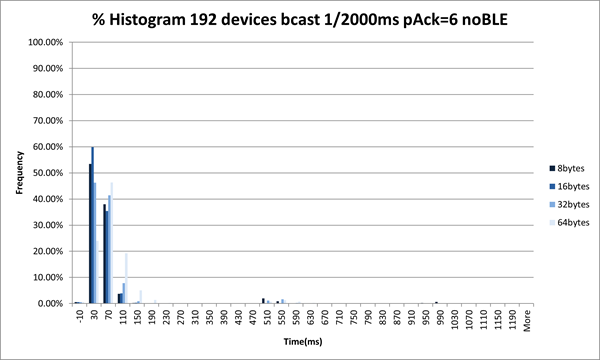  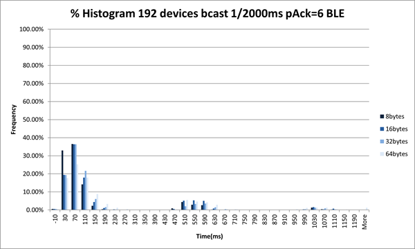

#### 192 devices, 5000 ms

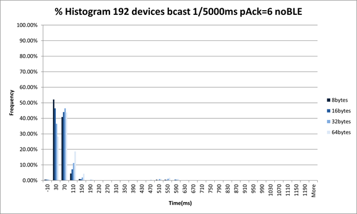  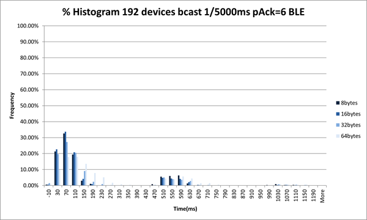

### Test Conclusion

The test results were within expectations.

With greater traffic rates we observe more latency and loss. We also observe greater latency and loss when all devices are sending BLE advertisements versus when they are not.

###

## Zigbee/BLE DMP Large Network with High Stress BLE Data Traffic Test Results

### Test Setup Details

For these test scenarios, several different functions were performed at the same time. To accomplish this, multiple Java threads were used that interact with the CLI of these devices.

Each of these Java threads collected different sets of metrics and combined them into a generated report, along with individual result sets for the Zigbee broadcast, Zigbee unicast, and BLE testing.

For Zigbee broadcast testing, as previously, the Zigbee coordinator always originated the broadcast. If a receiver did not receive a packet, a value of -10 was used, or the value was the time delta between transmit and receipt.

For Zigbee unicast testing, one device (not the Zigbee coordinator) was selected to transmit to all other devices in the network. A custom application CLI was used where, on receipt of this special unicast 50-byte packet, the receiving device transmitted a 50-byte packet back to the sender. A loss occurred if the sender did not receive this packet back within 500-1000 ms.

For Bluetooth testing, three pairs of other devices were selected to be the BLE devices under test. These devices opened a BLE connection for each pair and transmitted BLE data for a period of time, then close BLE connection and repeat. The devices that open BLE connections also send periodic Zigbee broadcasts where the broadcast interval is 60-300 seconds randomized.

### Test Topology Details

For these tests, four device types were part of the whole network under test. The meaning of device type was the function that each device was serving under the duration of the test. The map below of the Silicon Labs Boston office illustrates those roles.

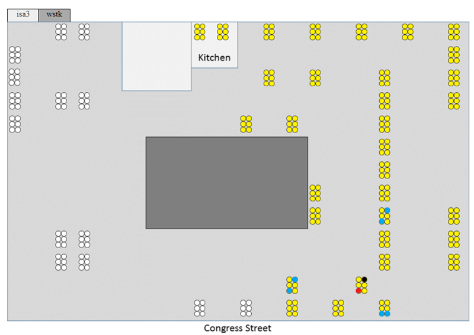

The yellow circles are the 192 nodes joined in a Zigbee network. Only 96 of these nodes were used for the 96-node scenarios.

The black circle indicates the ZC that forms the network and is also responsible for transmitting the broadcast packets under test.

The red circle indicates the ZR that is transmitting unicast in a round-robin fashion to the other nodes.

The blue circles indicate the devices that are doing BLE connection pairings. One device in each pair of blue nodes are configured to send Zigbee broadcasts as needed to introduce extra network traffic, as described in each test scenario later.

### Test Results

Most of the data described in this section are variable, such as which devices do what, rate, size, and duration.

Given that these testing scenarios have multiple network actions occurring at the same time, some timing measurements were added to the results to record when those actions started in the test and the duration of those actions.

The broadcast results are further displayed as a histogram representing both the loss and the latency of the broadcast test portion. As previously, a value of -10 indicates that a receiver missed a broadcast that was transmitted.

The broadcast time series illustrates the chronology of the test execution by displaying all receiver timings for each broadcast sequence transmitted. The ~500 milliseconds bumps are a symptom of Broadcasts being initiated in “waves” consisting of the initial broadcast and two re-transmissions with about 500ms in-between them. This was included in the results because the test was measuring the time from when the transmitter internally queued up the broadcast and before the packet was actually transmitted over the air by the radio.

### 48 Node EFR32MG12 Network

For this topology, only EFR32MG12 boards were used.

Also, for this test, the ZC was set to be a high RAM concentrator, and three other devices (one in each pair of the blue nodes) were configured to send periodic Zigbee broadcasts.

#### 48 devices, Zigbee Broadcasts every 2000 ms, no BLE

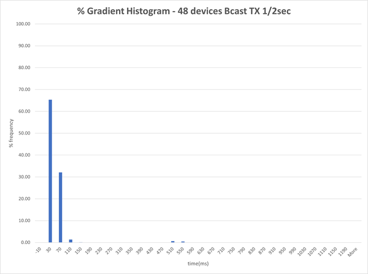  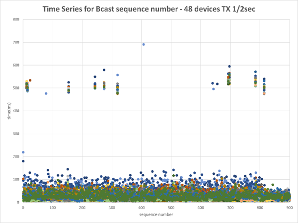

#### 48 devices, Zigbee Broadcasts every 2000 ms, BLE

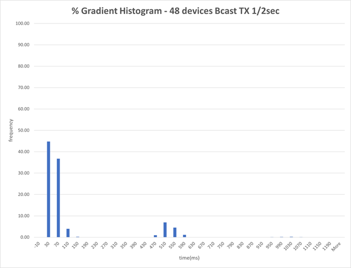  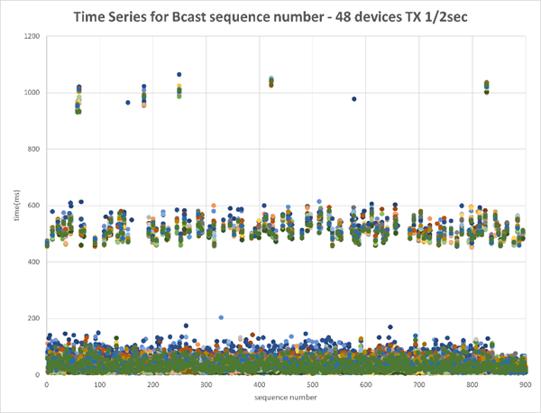

#### Summary Data

Below is the summary data of two additional tests where the ZC was a high RAM concentrator with a 60-300 randomized MTORR period. Devices that initiate BLE connections (in the BLE Data table) also each send periodic Zigbee broadcasts.

The BLE connection remained open for time approximately equal to the Duration divided by the ConnPass value, which was approximately 170 seconds in the below runs. The duration field is cumulative value of how long BLE connections were open for the entire test.

Zigbee Broadcast:

:::custom-table
| :custom-cell[TX Node]{style=table-cell-vertical} | :custom-cell[BLE Adv Enabled]{style=table-cell-vertical} | :custom-cell[Broadcast Rate (ms)]{style=table-cell-vertical} | :custom-cell[Size]{style=table-cell-vertical} | :custom-cell[# RXs]{style=table-cell-vertical} | :custom-cell[Broadcasts Sent]{style=table-cell-vertical} | :custom-cell[Unique Receives]{style=table-cell-vertical} | :custom-cell[Duration (sec)]{style=table-cell-vertical} | :custom-cell[Start Time (sec)]{style=table-cell-vertical} | :custom-cell[% Pass Rate]{style=table-cell-vertical} |
|---------|-----------------|---------------------|------|-------|-----------------|-----------------|----------------|------------------|-------------|
| 10.4.186.6 | False | 2000 | 25 | 47 | 900 | 43200 | 1919 | 1675458287 | 100.00 |
| 10.4.186.6 | True | 2000 | 25 | 47 | 900 | 43200 | 1918 | 1675460344 | 100.00 |
:::

Zigbee Unicast:

:::custom-table
| :custom-cell[TX Node]{style=table-cell-vertical} | :custom-cell[BLE Adv Enabled]{style=table-cell-vertical} | :custom-cell[Broadcast Rate (ms)]{style=table-cell-vertical} | :custom-cell[Size]{style=table-cell-vertical} | :custom-cell[RRLoop]{style=table-cell-vertical} | :custom-cell[# RXs]{style=table-cell-vertical} | :custom-cell[Unicast Sent]{style=table-cell-vertical} | :custom-cell[Responses Received]{style=table-cell-vertical} | :custom-cell[Duration (sec)]{style=table-cell-vertical} | :custom-cell[Start Time (sec)]{style=table-cell-vertical} | :custom-cell[% Pass Rate]{style=table-cell-vertical} |
|---------|-----------------|---------------------|------|--------|-------|--------------|--------------------|----------------|------------------|-------------|
| 10.4.186.9 | False | 200 | 50 | 120 | 47 | 5640 | 5610 | 1782 | 1675458287 | 99.47 |
| 10.4.186.9 | True | 200 | 50 | 120 | 47 | 5640 | 5624 | 1868 | 1675460344 | 99.72 |
:::

BLE Data:

:::custom-table
| :custom-cell[TX Node]{style=table-cell-vertical} | :custom-cell[RX Node]{style=table-cell-vertical} | :custom-cell[BLE Adv Enabled]{style=table-cell-vertical} | :custom-cell[Rate (ms)]{style=table-cell-vertical} | :custom-cell[Size]{style=table-cell-vertical} | :custom-cell[ConnAtt]{style=table-cell-vertical} | :custom-cell[ConnPass]{style=table-cell-vertical} | :custom-cell[Unicasts Sent]{style=table-cell-vertical} | :custom-cell[Responses Received]{style=table-cell-vertical} | :custom-cell[Duration (sec)]{style=table-cell-vertical} | :custom-cell[Start Time (sec)]{style=table-cell-vertical} | :custom-cell[% Pass Rate]{style=table-cell-vertical} |
|---------|---------|-----------------|-----------|------|---------|----------|---------------|--------------------|----------------|------------------|-------------|
| 10.4.186.12 | 10.4.186.13 | False | 100 | 185 | 10 | 10 | 7000 | 6999 | 1742 | 1675458287 | 99.99 |
| 10.4.186.18 | 10.4.186.19 | False | 100 | 185 | 10 | 10 | 7000 | 7000 | 1720 | 1675458287 | 100.00 |
| 10.4.186.96 | 10.4.186.97 | False | 100 | 185 | 10 | 10 | 7000 | 7000 | 1711 | 1675458287 | 100.00 |
| 10.4.186.12 | 10.4.186.13 | True | 100 | 185 | 10 | 10 | 7000 | 6299 | 1771 | 1675460344 | 89.99 |
| 10.4.186.18 | 10.4.186.19 | True | 100 | 185 | 10 | 10 | 7000 | 6300 | 1742 | 1675460344 | 90.00 |
| 10.4.186.96 | 10.4.186.97 | True | 100 | 185 | 10 | 10 | 7000 | 6999 | 1711 | 1675460344 | 89.99 |
:::

### 96-Node Mixed Network

For this topology, a mixed network comprised of x72 EFR32MG12, x12 EFR32MG21, and x12 EFR32MG24 was used.

Also, for this test, the ZC was set to be a high RAM concentrator, and three other devices (one in each pair of the blue nodes) were configured to send periodic Zigbee broadcasts.

#### 96 devices, Zigbee Broadcasts every 2000 ms, no BLE

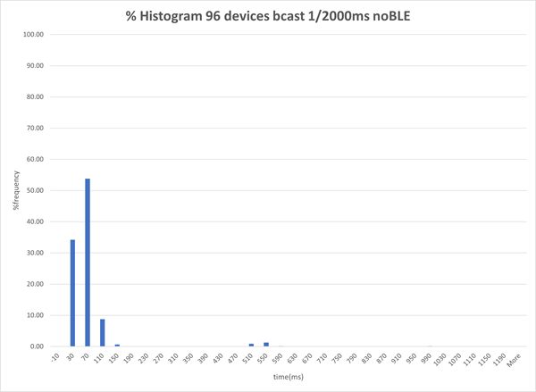  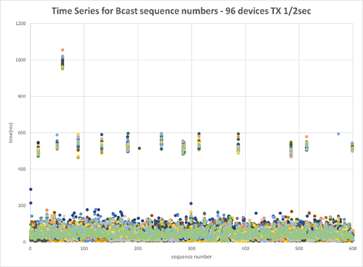

#### 96 devices, Zigbee Broadcasts every 2000 ms, BLE

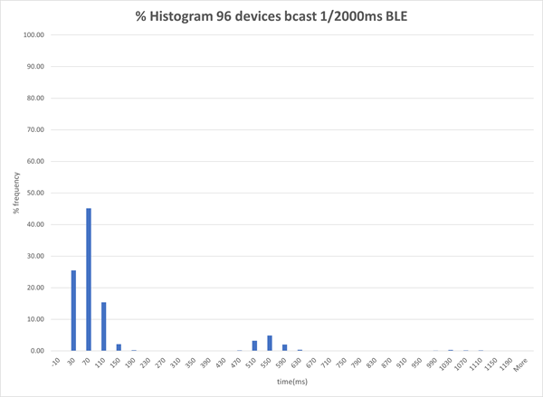  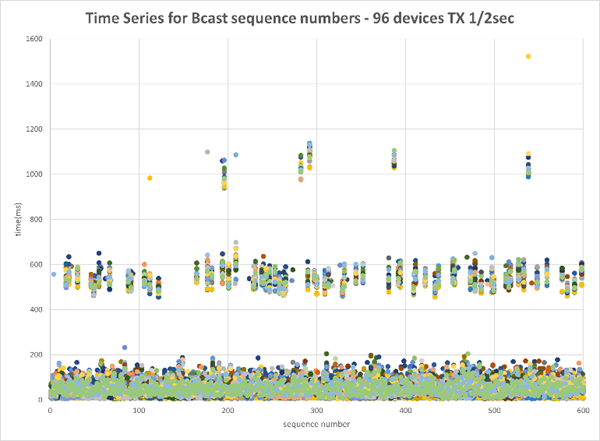

#### Summary Data

Zigbee Broadcast:

:::custom-table
| :custom-cell[TX Node]{style=table-cell-vertical} | :custom-cell[BLE Adv Enabled]{style=table-cell-vertical} | :custom-cell[Broadcast Rate (ms)]{style=table-cell-vertical} | :custom-cell[Size]{style=table-cell-vertical} | :custom-cell[# RXs]{style=table-cell-vertical} | :custom-cell[Broadcasts Sent]{style=table-cell-vertical} | :custom-cell[Unique Receives]{style=table-cell-vertical} | :custom-cell[Duration (sec)]{style=table-cell-vertical} | :custom-cell[Start Time (sec)]{style=table-cell-vertical} | :custom-cell[% Pass Rate]{style=table-cell-vertical} |
|---------|-----------------|---------------------|------|-------|-----------------|-----------------|----------------|------------------|-------------|
| 10.4.186.6 | False | 2000 | 25 | 95 | 600 | 57599 | 1227 | 1673119598 | 99.99 |
| 10.4.186.6 | True | 2000 | 25 | 95 | 600 | 57600 | 1227 | 1673130775 | 100.00 |
:::

Zigbee Unicast:

:::custom-table
| :custom-cell[TX Node]{style=table-cell-vertical} | :custom-cell[BLE Adv Enabled]{style=table-cell-vertical} | :custom-cell[Broadcast Rate (ms)]{style=table-cell-vertical} | :custom-cell[Size]{style=table-cell-vertical} | :custom-cell[RRLoop]{style=table-cell-vertical} | :custom-cell[# RXs]{style=table-cell-vertical} | :custom-cell[Unicast Sent]{style=table-cell-vertical} | :custom-cell[Responses Received]{style=table-cell-vertical} | :custom-cell[Duration (sec)]{style=table-cell-vertical} | :custom-cell[Start Time (sec)]{style=table-cell-vertical} | :custom-cell[% Pass Rate]{style=table-cell-vertical} |
|---------|-----------------|---------------------|------|--------|-------|---------------|--------------------|----------------|------------------|-------------|
| 10.4.186.9 | False | 200 | 50 | 40 | 95 | 3800 | 3793 | 1254 | 1673119598 | 99.82 |
| 10.4.186.9 | True | 200 | 50 | 40 | 95 | 3800 | 3780 | 1348 | 1673130775 | 99.47 |
:::

BLE Data:

:::custom-table
| :custom-cell[TX Node]{style=table-cell-vertical} | :custom-cell[RX Node]{style=table-cell-vertical} | :custom-cell[BLE Adv Enabled]{style=table-cell-vertical} | :custom-cell[Rate (ms)]{style=table-cell-vertical} | :custom-cell[Size]{style=table-cell-vertical} | :custom-cell[ConnAtt]{style=table-cell-vertical} | :custom-cell[ConnPass]{style=table-cell-vertical} | :custom-cell[Unicasts Sent]{style=table-cell-vertical} | :custom-cell[Responses Received]{style=table-cell-vertical} | :custom-cell[Duration (sec)]{style=table-cell-vertical} | :custom-cell[Start Time (sec)]{style=table-cell-vertical} | :custom-cell[% Pass Rate]{style=table-cell-vertical} |
|---------|---------|-----------------|---------------------|------|---------|----------|---------------|--------------------|----------------|------------------|-------------|
| 10.4.186.12 | 10.4.186.13 | False | 100 | 185 | 8 | 8 | 4800 | 4800 | 1182 | 1673119598 | 100.00 |
| 10.4.186.18 | 10.4.186.19 | False | 100 | 185 | 8 | 8 | 4800 | 4800 | 1203 | 1673119598 | 100.00 |
| 10.4.186.96 | 10.4.186.97 | False | 100 | 185 | 8 | 8 | 4800 | 4799 | 1215 | 1673119598 | 99.98 |
| 10.4.186.12 | 10.4.186.13 | True | 100 | 185 | 8 | 8 | 4800 | 4800 | 1223 | 1673130775 | 100.00 |
| 10.4.186.18 | 10.4.186.19 | True | 100 | 185 | 8 | 8 | 4800 | 4800 | 1168 | 1673130775 | 100.00 |
| 10.4.186.96 | 10.4.186.97 | True | 100 | 185 | 8 | 8 | 4800 | 4799 | 1166 | 1673130775 | 99.98 |
:::

**CPU Profiling**

CPU profiling is a little more complex as it requires manual use and observance on one device.

With BLE advertisements disabled:

- Given that Zigbee unicast was the most constrained in this test, monitoring of that device over most of the test found that the CPU was idle ~90% of the time with Zigbee using 6-7%.

- Another short run with similar results showed that the ZC showed similar results.

- The devices using the most CPU were the BLE devices that were doing the connection/data payloads. These showed about 60-65% idle: ~10% to Zigbee, 4% to BLE event, 2% to BLE link layer, and \<1% BLE stack.

With BLE advertisements enabled:

- The CPU generally used another 10% for CPU, with Zigbee hovering at 10-15%.

### 192-Node Mixed Network

For this topology, a mixed network comprised of x168 EFR32MG12, x12 EFR32MG21, and x12 EFR32MG24 was used.

At the time of publication, large networks under stress were outside the scope of the tool used to collect timing deltas so charts are not available but summarized reports are below.

Also, for this test, the ZC was set to be a high RAM concentrator, and three other devices (one in each pair of the blue nodes) were configured to send periodic Zigbee broadcasts.

Zigbee Broadcast:

:::custom-table
| :custom-cell[TX Node]{style=table-cell-vertical} | :custom-cell[BLE Adv Enabled]{style=table-cell-vertical} | :custom-cell[Broadcast Rate (ms)]{style=table-cell-vertical} | :custom-cell[Size]{style=table-cell-vertical} | :custom-cell[# RXs]{style=table-cell-vertical} | :custom-cell[Broadcasts Sent]{style=table-cell-vertical} | :custom-cell[Unique Receives]{style=table-cell-vertical} | :custom-cell[Duration (sec)]{style=table-cell-vertical} | :custom-cell[Start Time (sec)]{style=table-cell-vertical} | :custom-cell[% Pass Rate]{style=table-cell-vertical} |
|---------|-----------------|---------------------|------|-------|-----------------|-----------------|----------------|------------------|-------------|
| 10.4.186.6 | False | 2000 | 25 | 191 | 900 | 167773 | 1845 | 1673280624 | 97.09 |
| 10.4.186.6 | True | 2000 | 25 | 191 | 900 | 166463 | 1846 | 1673456545 | 96.33 |
:::

Zigbee Unicast:

:::custom-table
| :custom-cell[TX Node]{style=table-cell-vertical} | :custom-cell[BLE Adv Enabled]{style=table-cell-vertical} | :custom-cell[Broadcast Rate (ms)]{style=table-cell-vertical} | :custom-cell[Size]{style=table-cell-vertical} | :custom-cell[RRLoop]{style=table-cell-vertical} | :custom-cell[# RXs]{style=table-cell-vertical} | :custom-cell[Unicast Sent]{style=table-cell-vertical} | :custom-cell[Responses Received]{style=table-cell-vertical} | :custom-cell[Duration (sec)]{style=table-cell-vertical} | :custom-cell[Start Time (sec)]{style=table-cell-vertical} | :custom-cell[% Pass Rate]{style=table-cell-vertical} |
|---------|-----------------|---------------------|------|--------|-------|---------------|--------------------|----------------|------------------|-------------|
| 10.4.186.9 | False | 200 | 50 | 22 | 191 | 4202 | 3781 | 1829 | 1673280624 | 89.98 |
| 10.4.186.9 | True | 200 | 50 | 22 | 191 | 4202 | 2997 | 2365 | 1673456545 | 71.32 |
:::

BLE Data:

:::custom-table
| :custom-cell[TX Node]{style=table-cell-vertical} | :custom-cell[RX Node]{style=table-cell-vertical} | :custom-cell[BLE Adv Enabled]{style=table-cell-vertical} | :custom-cell[Rate (ms)]{style=table-cell-vertical} | :custom-cell[Size]{style=table-cell-vertical} | :custom-cell[ConnAtt]{style=table-cell-vertical} | :custom-cell[ConnPass]{style=table-cell-vertical} | :custom-cell[Unicasts Sent]{style=table-cell-vertical} | :custom-cell[Responses Received]{style=table-cell-vertical} | :custom-cell[Duration (sec)]{style=table-cell-vertical} | :custom-cell[Start Time (sec)]{style=table-cell-vertical} | :custom-cell[% Pass Rate]{style=table-cell-vertical} |
|---------|---------|-----------------|---------------------|------|---------|----------|---------------|--------------------|----------------|------------------|-------------|
| 10.4.186.12 | 10.4.186.13 | False | 100 | 185 | 10 | 10 | 7000 | 6286 | 1771 | 1673280624 | 89.80 |
| 10.4.186.18 | 10.4.186.19 | False | 100 | 185 | 10 | 10 | 7000 | 6983 | 1734 | 1673280624 | 99.76 |
| 10.4.186.96 | 10.4.186.97 | False | 100 | 185 | 10 | 10 | 7000 | 6982 | 1684 | 1673280624 | 99.74 |
| 10.4.186.12 | 10.4.186.13 | True | 100 | 185 | 10 | 10 | 7000 | 6980 | 1659 | 1673456545 | 99.71 |
| 10.4.186.18 | 10.4.186.19 | True | 100 | 185 | 10 | 10 | 7000 | 6284 | 1778 | 1673456545 | 89.77 |
| 10.4.186.96 | 10.4.186.97 | True | 100 | 185 | 10 | 10 | 7000 | 6289 | 1730 | 1673456545 | 89.84 |
:::

### Test Conclusion

The test results were within expectations.

As expected, we observe more loss when all devices are advertising BLE versus when they are not and also when multiple devices are configured to send periodic broadcasts versus when they are not.
