# Step by Step Guide to Qualify a Product on the Bluetooth SIG Website

With the introduction of Bluetooth QPRD v3.0 (released on 1 July 2024) and QPRD v4.0 (effective 21 July 2025), there are several updates to the Bluetooth qualification process.

The major changes include:

- **Updated terminology** used throughout the qualification process.

- **Removed dependency on product types**. For example, components no longer require renewal and remain valid as long as they are supported by the manufacturer.

- An **Inter-Layer Dependency (ILD)** check is now performed to ensure that all supported features are valid and consistent across protocol layers, from the lowest level (RF-PHY/RF in Core) up to the X2Core/Application layer (e.g., HID, A2DP, etc.).

- **No additional fees** are incurred for renewals such as updating to the latest TCRL or creating subsets.

- The **Qualification Workspace tool automatically verifies** whether any new or modified test cases have been introduced in the latest TCRL when inheriting designs compliant with earlier TCRL versions.

- **Increased flexibility**: Companies can now set their product’s Publication Date up to 180 days after completing the Bluetooth Qualification Process [3].

- **Expanded correction support**: Design corrections are now available for both **Design Numbers (DNs)** and **Qualified Design IDs (QDIDs)** in the Qualification Workspace [3].

- **Improved consistency checking**: The tool now automatically ignores invalid Implementation Conformance Statement (ICS) inconsistencies when the corresponding ICS does not exist, eliminating the need for a Test Coverage Waiver (TCW) [3].

> **Note**: This is **not an exhaustive list**. For more information, refer to the official Bluetooth SIG links and Knowledge Base articles below.

Reference Link:

1. [https://www.bluetooth.com/develop-with-bluetooth/qualification-updates/](https://www.bluetooth.com/develop-with-bluetooth/qualification-updates/)

2. [https://support.bluetooth.com/hc/en-us/articles/19866866810125-What-do-I-need-to-](https://support.bluetooth.com/hc/en-us/articles/19866866810125-What-do-I-need-to-know-about-the-new-Qualification-Program-Reference-Document-QPRD-v3)[know-about-the-new-Qualification-Program-Reference-Document-QPRD-v3](https://support.bluetooth.com/hc/en-us/articles/19866866810125-What-do-I-need-to-know-about-the-new-Qualification-Program-Reference-Document-QPRD-v3)

3. [https://qualification.support.bluetooth.com/hc/en-us/articles/36644517440525-](https://qualification.support.bluetooth.com/hc/en-us/articles/36644517440525-Qualification-Program-Reference-Document-QPRD-v4-effective-July-21-2025)[Qualification-Program-Reference-Document-QPRD-v4-effective-July-21-2025](https://qualification.support.bluetooth.com/hc/en-us/articles/36644517440525-Qualification-Program-Reference-Document-QPRD-v4-effective-July-21-2025)

4. [https://www.bluetooth.com/specifications/specs/html/?src=QPRD/out/en/index-en.html](https://www.bluetooth.com/specifications/specs/html/?src=QPRD/out/en/index-en.html) [Latest QPRD v4.0]

Below is the step-by-step guide to qualify a product design using the **Bluetooth Qualification Workspace tool**, developed by the Bluetooth SIG and available on the [Bluetooth website](https://www.bluetooth.com/). A product design (or multiple product designs) represents a **complete Bluetooth solution**, typically consisting of **Core-Controller** and **Core-Host** layers that together form a **Core-Complete Configuration**. This overall process is known as the **Bluetooth Qualification Process.**

To demonstrate the qualification process, we have created an example that combines **Silicon Laboratories’ qualified designs** to form a Core-Complete Configuration. The terminology used in this document is based on the **latest QPRD v4.0**, and we recommend reviewing that document if any part of this article is unclear.

In this example, the **qualified designs** used are:

- **QDID/DN Q306497** for the **RF-PHY** layer, **Bluetooth 5.4**.

- **QDID/DN 216508** or **DN Q301597** for other controller layers (**HCI**, **LL**) and host layers (**ATT**, **GAP**, **GATT**, **L2CAP**, **SM**), **Bluetooth 5.4**.

- It covers the scenario of combining **pre-qualified core layer designs** with same Bluetooth specification versions.

> **Note:** QDID/DN 216508 and DN Q301597 refer to the **same design**; you may reference **either one, but not both**. In other words, all the required **Controller and Host layer designs** are combined to form an **End Product**, a term defined in earlier QPRD versions (e.g., **QPRD v2.3**).

## Table of Contents

- [Step 1: Getting Started](#step-1-getting-started)
- [Step 2: Specify the Design](#step-2-specify-the-design)
  - [Exception for: Product Listing using an existing Core-Controller Configuration design and Core-Host Configuration design](#exception-for-product-listing-using-an-existing-core-controller-configuration-design-and-core-host-configuration-design)
- [Step 3: Layer Selection](#step-3-layer-selection)
- [Step 4a: ICS Selection – Resolve Consistency Issues](#step-4a-ics-selection-resolve-consistency-issues)
  - [Exception for: Combining pre-qualified core layer designs with different Bluetooth specification versions](#exception-for-combining-pre-qualified-core-layer-designs-with-different-bluetooth-specification-versions)
- [Step 4b: ICS Selection – Resolve Consistency Issues (Continued)](#step-4b-ics-selection-resolve-consistency-issues-continued)
- [Step 5: Test Plan and Documentation](#step-5-test-plan-and-documentation)
  - [Exception: Modified Designs](#exception-modified-designs)
- [Step 6: Product Qualification Fee](#step-6-product-qualification-fee)
- [Step 7: Submission Page](#step-7-submission-page)
- [Step 8: Check Product Status in Manage Submitted Products](#step-8-check-product-status-in-manage-submitted-products)

## Step 1: Getting Started

The new Bluetooth Qualification Workspace from the Bluetooth SIG appears as follows:

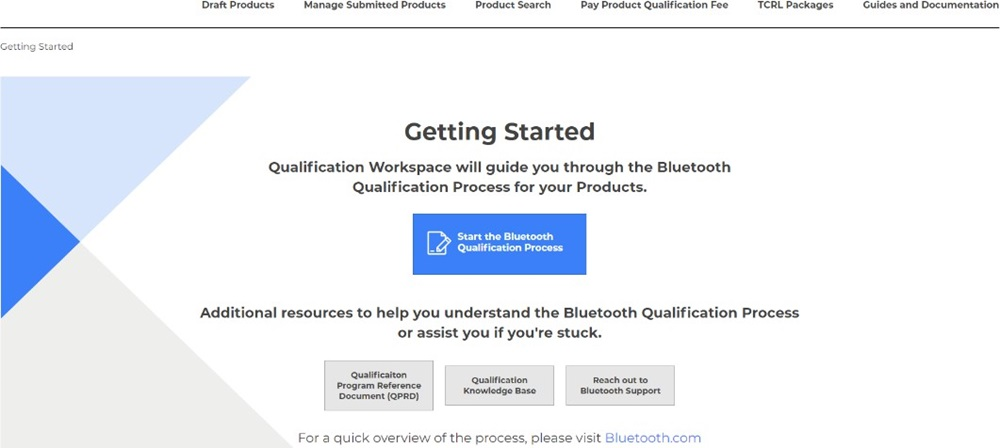

1. Log in to the **Bluetooth Qualification Workspace** on the Bluetooth SIG website: [https://qualification.bluetooth.com/](https://qualification.bluetooth.com/).

2. Click **Start the Bluetooth Qualification Process**. The Qualification Workspace tool will display the **Product Details** section.

3. In this section, enter your product information in the corresponding fields.

   - Members can import multiple products at once using the **Import multiple Products** option, which accepts entries in an Excel file format.

   - Alternatively, you can add a single product by selecting **Add an Individual Product**.

   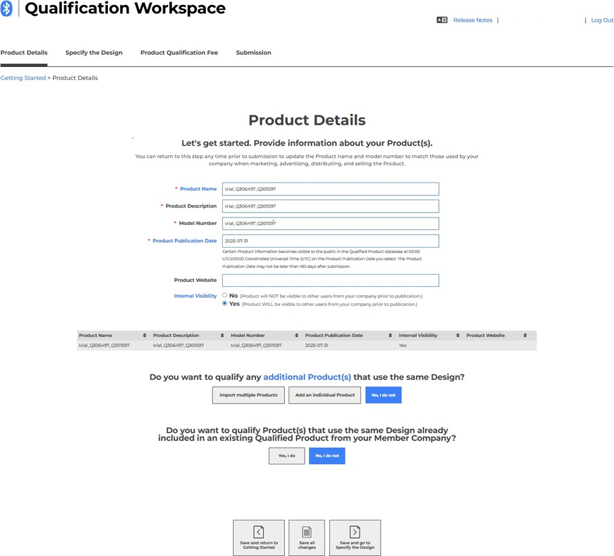

   It is assumed that **all listed products share the same Bluetooth design**, including both hardware and software elements related to Bluetooth technology.

4. After you enter all product details, click **Save and Go to Specify the Design**.

## Step 2: Specify the Design

> **Note**: This example pertains to [**Scenario A.1: Combining pre-qualified core layer designs with same Bluetooth specification versions**](./02-bluetooth-qualification.md#scenario-a1-combining-pre-qualified-core-layer-designs-with-same-bluetooth-specification-versions).

In this example, you add **Design Numbers (DNs) Q306497 and Q301597**, which cover the following layers: **RF-PHY**, **LL**, **HCI**, and Host layers (**ATT**, **GAP**, **GATT**, **L2CAP**, and **SM**).

1. Select **Yes, I do** to include the existing Silicon Laboratories qualified designs.

   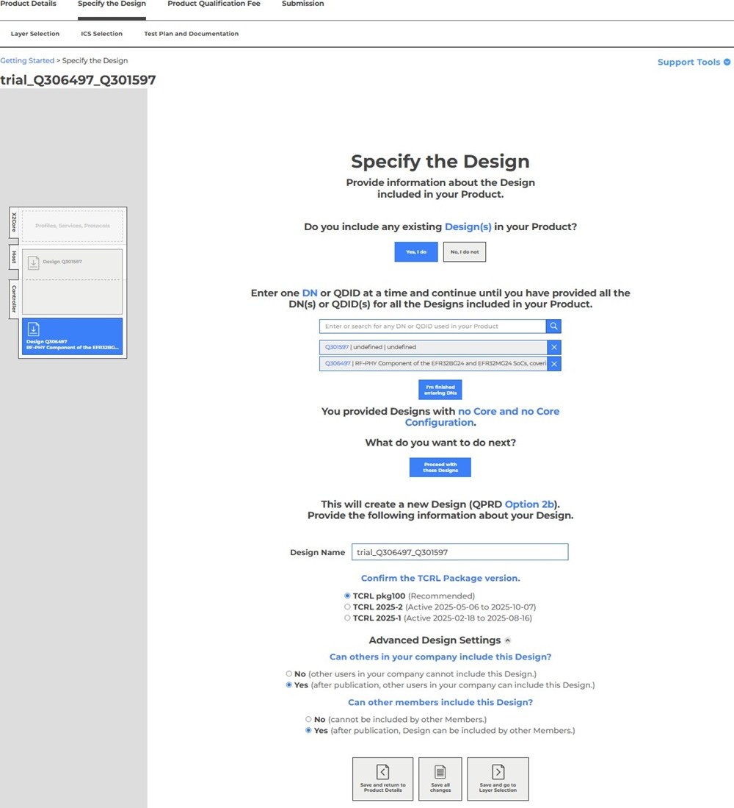

   As this product represents an **End Product design (Core-Complete Configuration)**, ensure that the **inherited designs include all essential Core layers**, namely **RF-PHY**, **LL**, **HCI**, **UHCI**, and Host layers (**ATT**, **GAP**, **GATT**, **L2CAP**, and **SM**).

2. After you add the appropriate designs, click **I’m finished entering DNs**.

   The tool will display a **summary of inherited design configurations**, showing **No Core** for DN Q306497 and **No Core** for DN Q301597.

3. Click **Proceed with these Designs**.

   The **Advanced Design Settings** options depend on your company’s preferences; for example, whether to **allow other users within your organization** or **external member companies** to inherit your product design.

4. When ready, click **Save and go to Layer Selection**.

### Exception for: Product Listing using an existing Core-Controller Configuration design and Core-Host Configuration design

> **Note**: The following steps are applicable only for [**Scenario B: Product Listing using an existing Core-Controller Configuration design and Core-Host Configuration design**](02-bluetooth-qualification.md#scenario-b-product-listing-using-existing-core-controller-configuration-design-and-core-host-configuration-design).

- This scenario covers the case where pre-qualified core-layer designs conform to **Core-Controller Configuration design and Core-Host Configuration design. The tool will automatically select the Bluetooth specification version from the two designs by choosing the lower version (if applicable)**.

In this example, the **qualified designs** used are:

- **DN Q375771** for the Core-Controller Configuration design covering RF-PHY layer, LL,HCI, Bluetooth 6.0

- **DN Q333162** for the **Core-Host Configuration** design covering host layers (**ATT**, **GAP**, **GATT**, **L2CAP**, **SM**), Bluetooth 6.0

- No changes have been made in hardware by following the Silicon Labs reference design as shown in datasheets, example modules, and unmodified software (SDK).

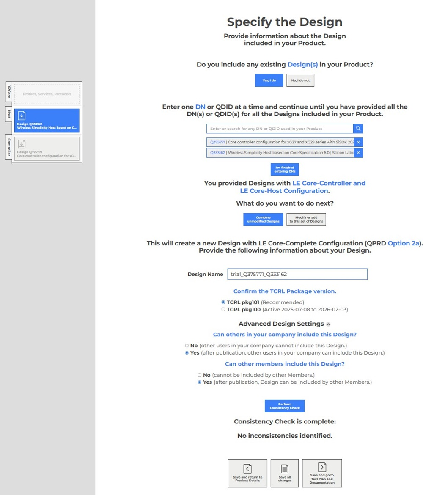

Follow the same process described in [Step 2: Specify the Design](#step-2-specify-the-design) above, with one difference:

1. After entering the design numbers, click **I’m finished entering DNs**.

   The tool will then display the summary of inherited designs, showing:

   - **LE Core-Controller** for DN Q375771

   - **LE Core-Host Configuration** for DN Q333162

2. Click **Combine unmodified Designs**.

   The **Advanced Design Settings** options depend on your company’s policies; for example, whether to allow other users within your organization or other member companies to inherit your product design.

3. When ready, click **Perform Consistency Check**.

4. Click **Save and go to Test Plan and Documentation**.

5. Finally, proceed with the steps shown in [Step 5: Test Plan and Documentation](#step-5-test-plan-and-documentation) to complete the process.

## Step 3: Layer Selection

The next step is Layer Selection.

1. Select **Yes** for **Core Configuration**, as this is an **End Product design**.

2. Select **Core-Complete Configuration** so that the Qualification Workspace tool recognizes it as a **complete Bluetooth Low Energy (LE) solution** with all essential layers included.

3. Choose **LE Core-Complete** as the desired Core configuration.

4. For dual-mode products, select **BR/EDR/LE Core-Complete**.

   **Exception: DN Q301597** was listed before the **UHCI** layer was introduced. Therefore, in this example, ensure that the **UHCI** layer is selected.

   As shown in the screenshot below, each layer is assigned its respective inherited Design Number.

5. After you select the layers, click **Save and go to ICS Selection**.

   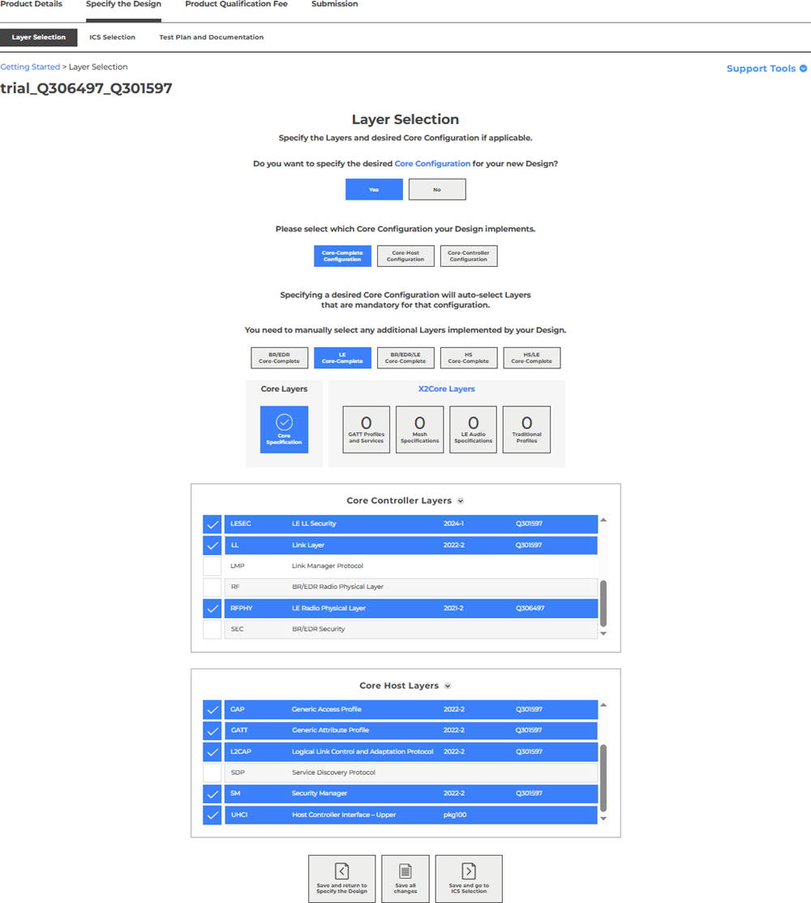

> **Note**: If the End Product design does not expose the **HCI** and **UHCI** layers to end users, remove the **HCI** layer from the **Core Controller Layers** section, and remove the **UHCI** layer from the **Core Host Layers** section.

## Step 4a: ICS Selection – Resolve Consistency Issues

The purpose of this step is to identify and resolve inconsistencies in feature selection, whether they arise from inherited designs or newly added features.

1. In the **ICS Selection** section, click **Consistency Check** on the right-hand side of the page.

   After you successfully clear all inconsistencies, a message will appear stating **All inconsistencies are resolved**.

2. If an inconsistency appears related to the **UHCI** layer, select the appropriate Bluetooth Core version based on the inherited host layer design. Then, click **Consistency Check** again to verify that no inconsistencies remain.

**Example: DN Q301597** was qualified before the **UHCI** layer was introduced. In this case, select **0/54 Upper HCI v5.4** under the **UHCI** layer to resolve the issue.

Another common issue occurs when some ICS feature links shown in the **Consistency Check** window do not exist or are not displayed in the respective layer. In such cases, in the **Enter Test Coverage Waiver** field, enter the Test Coverage Waiver (TCW) number **ES-25636**.

> **Important**: The TCW **ES-25636** waiver is not a universal fix for all inconsistency issues. **Using this number incorrectly or as a blanket solution may result in product qualification rejection**.

For other unresolved or unknown inconsistencies related to inherited designs, contact **Silicon Labs Technical Support**.

Alternatively, if you require additional guidance during qualification, consider reaching out to a [Bluetooth Qualification Consultant](https://www.bluetooth.com/develop-with-bluetooth/qualification-listing/qualification-consultants/) (BQC).

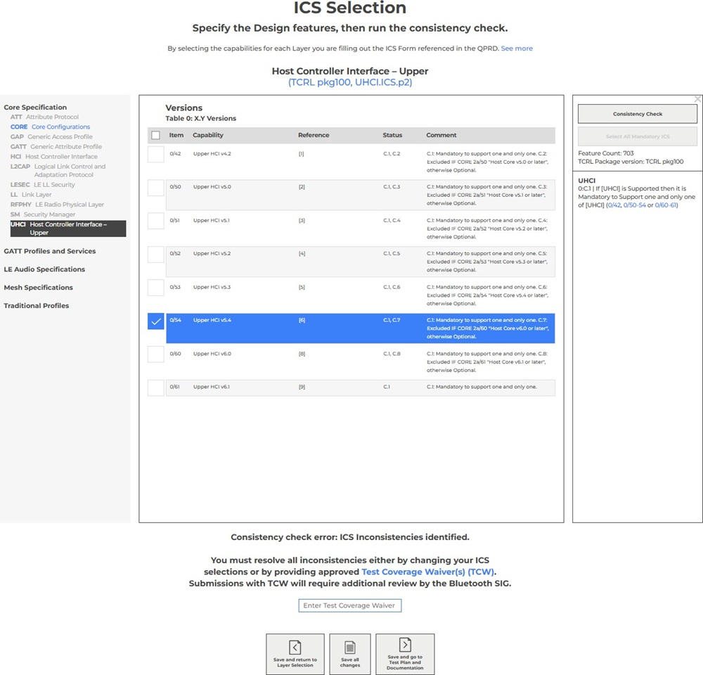

### Exception for: Combining pre-qualified core layer designs with different Bluetooth specification versions

> **Note**: This scenario is applicable only for [**Scenario A.2: Combining pre-qualified core layer designs with different Bluetooth specification versions**](./02-bluetooth-qualification.md#scenario-a2-combining-pre-qualified-core-layer-designs-with-different-bluetooth-specification-versions).

In this example, the **qualified designs** used are:

- **DN 231189** for the RF-PHY layer, Bluetooth 5.4

- **DN Q361244** for the controller layers (**HCI**, **LL**) and host layers (**ATT**, **GAP**, **GATT**, **L2CAP**, **SM**), Bluetooth 6.0

This scenario covers the case where pre-qualified core-layer designs conform to **different Bluetooth specification versions**.

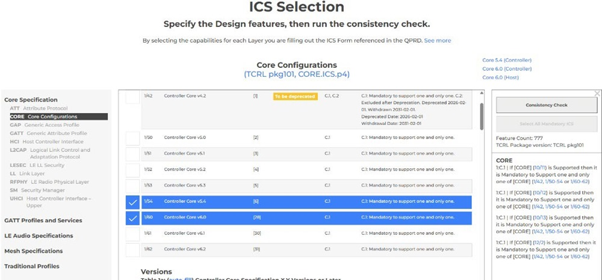

#### Resolving Core Version Conflicts

In the **Core Configurations** section, the Workspace tool automatically selects:

- **Core 5.4** from DN 231189

- **Core 6.0** from DN Q361244

Because a Core-Complete configuration must use **one consistent Bluetooth Core version**, this results in a conflict.

To resolve this:

1. De-select **1/54 Controller Core v5.4**.

   The tool will display a disclaimer indicating that the **RF-PHY layer will be unlocked**.

2. Click **Modify Core Version and Unlock Layer(s)**.

3. Run **Consistency Check**.

   If no further inconsistencies are found, the Workspace will show the same status as illustrated in 
   [Step 4: ICS Selection – Consistency Check](#step-4-ics-selection-consistency-check), with the **RF-PHY layer unlocked** (indicated in blue).

   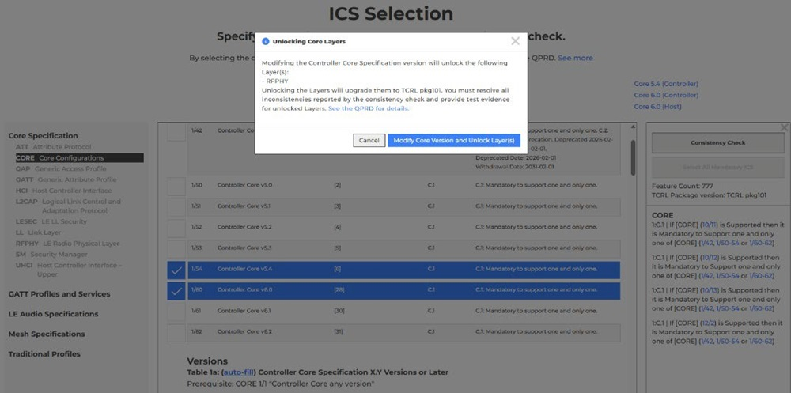

   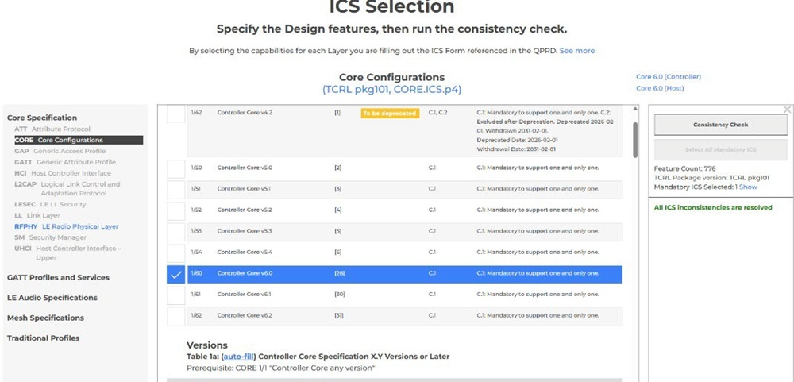

4. Click **Save and go to Test Plan and Documentation**.

   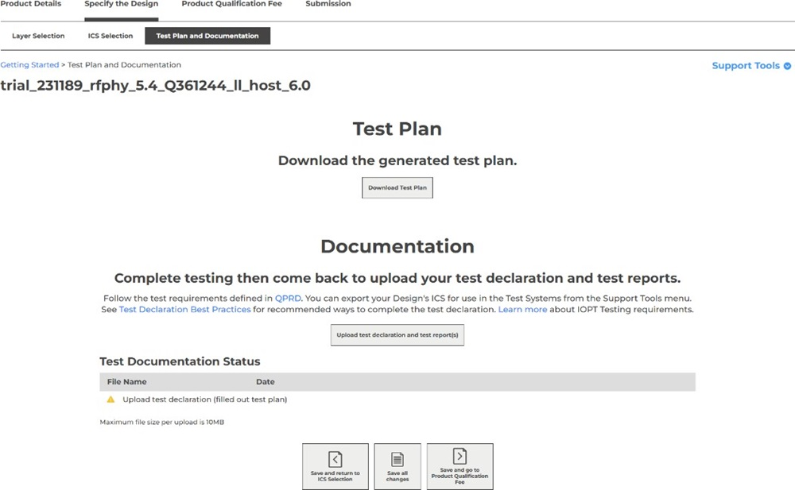

#### Important Note on Inheriting the RF-PHY Design

If the hardware **RF-PHY** layer has not been modified and continues to follow the **Silicon Labs reference design** (as documented in the datasheets), then the existing RF-PHY Design Number may still be eligible for inheritance/included. However, final approval is determined by the Bluetooth SIG.

Silicon Labs strongly recommends contacting a [Bluetooth Qualification Consultant](https://www.bluetooth.com/develop-with-bluetooth/qualification-listing/qualification-consultants/) (BQC) or submitting a [Support Request (requires Bluetooth.com account)](https://support.bluetooth.com/hc/en-us/requests) to confirm whether the RF-PHY design can be inherited/included in this mixed-version scenario.

Inheritance is more likely to be acceptable if **all** of the following conditions are true:

- No RF-PHY test case changes occurred between **Bluetooth 5.4** and **Bluetooth 6.0**

- The design is **not affected** by the latest **TCRL**

- The hardware continues to follow the **same reference design** shown in the Silicon Labs datasheets

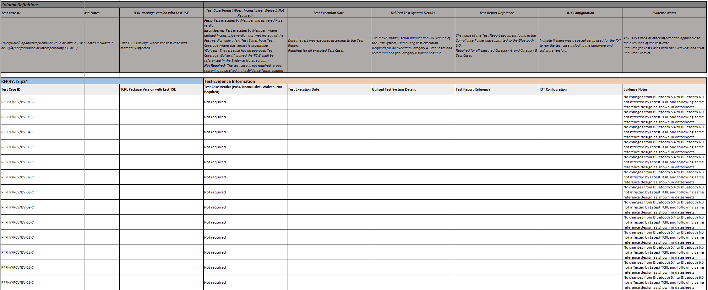

#### Proceeding With the Process

Proceed to [Step 5: Test Plan and Documentation](#step-5-test-plan-and-documentation) as shown below.

The only difference in this scenario is that you must **download the generated test plan**, complete it with the required information (as shown in the screenshot above), and then **upload it in the Documentation section**.

> **Note**: Some steps in this scenario may already have been completed in earlier sections. Skip any steps that are repeated or not applicable.

## Step 4b: ICS Selection – Resolve Consistency Issues (Continued)

After you resolve all consistency issues, the message **All inconsistencies are resolved** will be displayed.

Click **Save and go to Test Plan and Documentation**.

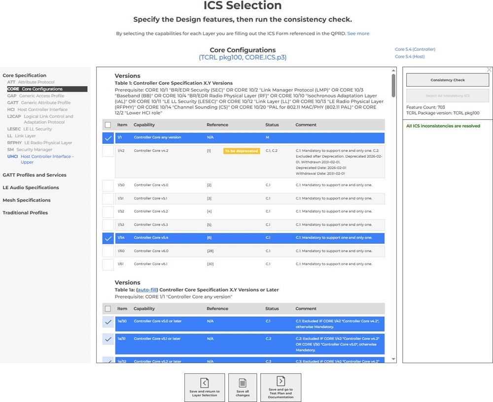

## Step 5: Test Plan and Documentation

In the **Test Plan and Documentation** section, **no test plan will be generated** in this example because, in this example, **inherited designs DN Q306497 and DN Q301597** cover the **RF-PHY**, **LL**, **HCI**, and Host layers (**ATT**, **GAP**, **GATT**, **L2CAP**, and **SM**).

Since no modifications have been made to the inherited designs, a new test plan is not required.

As this product represents an **End Product (Core-Complete Configuration)**, it ensures that all essential Core layers — **RF-PHY**, **LL**, **HCI**, **UHCI**, and Host layers (**ATT**, **GAP**, **GATT**, **L2CAP**, and **SM**) — are covered.

Silicon Labs offers multiple qualified designs on the [Bluetooth Qualification](./02-bluetooth-qualification.md) page, which you may include as part of your product qualification.

Inheriting designs implies that the **hardware (RF/RF-PHY)** follows **Silicon Laboratories’ reference design** as documented in the datasheets, and that **Silicon Laboratories’ software/firmware is used without modification.**

Click **Save and go to Product Qualification Fee**.

### Exception: Modified Designs

> **Note**: This section is applicable only for Modified Designs.

If you modify inherited designs (for example, by unlocking a layer to add new features) or introduce additional layers, a Test Plan will be automatically generated.

- Test cases in the plan must be executed at a **Bluetooth Qualification Test Facility [BQTF](https://www.bluetooth.com/develop-with-bluetooth/qualify/qualification-test-facilities/)**, particularly for **Category A test cases** in the lower layers (below HCI).

- The **BQTF representative** or a **Bluetooth Qualification Consultant (BQC)** can assist with testing and completing the **Test Declaration**.

- You can find details about which test cases are covered by **approved test systems** in the applicable **TCRL release** at [https://www.bluetooth.com/specifications/tcrl/](https://www.bluetooth.com/specifications/tcrl/).

> **Tip**: Test cases in **X2Core layers (profiles)** and **Host layers** can be tested **in-house** using the [Profile Tuning Suite (PTS)](https://www.bluetooth.com/develop-with-bluetooth/qualify/qualification-test-tools/) by the End Product Manufacturer listing the product on the Bluetooth SIG website.

Guidance on completing the Test Plan and uploading it with supporting reports is **beyond the scope of this article**, but you can refer to the [**Bluetooth SIG’s Test declaration best practices**](https://www.bluetooth.org/docman/handlers/DownloadDoc.ashx?doc_id=228307&_gl=1%2A1dm0376%2A_gcl_au%2ANTM2NTU1NjMxLjE3NTgwMjE0NDQ) documentation for further assistance, especially when using PTS for **X2Core** and **Host layers**.

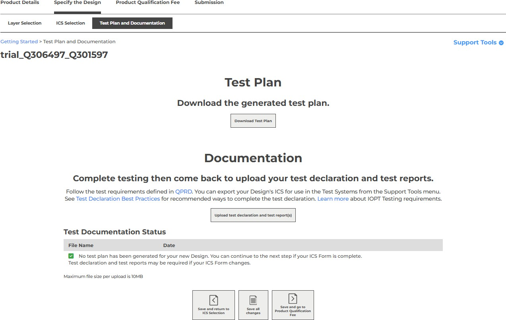

## Step 6: Product Qualification Fee

This step is self-explanatory. You can pay the Bluetooth SIG qualification fee either by invoice or credit card to obtain a **Receipt Number**.

The applicable fee depends on your **Bluetooth SIG membership type**. After payment is successfully processed, a **Receipt Number** will be generated, which can then be selected to associate with your product listing.

A single **Receipt Number** can cover one or multiple products, provided that the Bluetooth design (hardware and software) remains the same.

After you select the receipt, click **Save and go to Submission**.

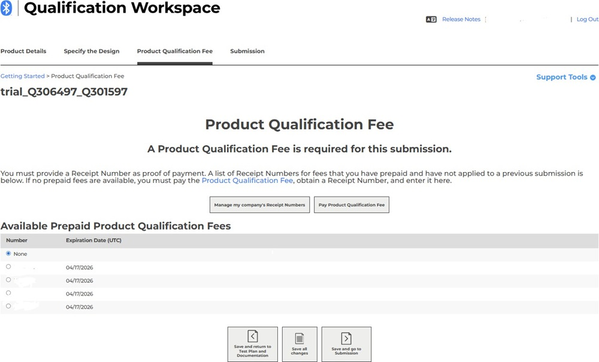

## Step 7: Submission Page

The **Submission page** is the final step of the Bluetooth Qualification Process. It provides an overview of all the information entered for your product(s).

Submission requirements are shown as green checkmarks for the six key sections:

1. **Product Details**
2. **Design Details**
3. **ICS Form**
4. **Test Declaration**
5. **Test Reports**
6. **Receipt Number**

When all six sections display a green status, it indicates that all requirements are met and the submission can be sent to the Bluetooth SIG for approval.

1. At the end of this page, check the three confirmation boxes to indicate that you have read, understood, and accepted the terms.

   It is essential that the **End Product Manufacturer** reviews and agrees to the **Bluetooth Qualification Workspace Terms of Use**, and then signs the acknowledgement in the signature field.

   > **Important Note**: Ensure that your **Compliance Folder** contains all product-related documentation. This is described in **Section 3.4.1 (“Compliance Folder”)** of the [Qualification Program reference document](https://www.bluetooth.com/specifications/specs/html/?src=QPRD/out/en/index-en.html&UUID-cf5449b2-e2d3-842c-f52e-bd9523ac1621) **(QPRD)**, which outlines the required contents to be stored for each qualified product.

   You can access the latest QPRD document at [https://www.bluetooth.com/documents-resources/](https://www.bluetooth.com/documents-resources/).

2. Click **Complete the Submission**. This is the final step. Once submitted, no further changes can be made.

   Upon submission, a **Design Number (DN)** will be automatically assigned to your product.

3. Save this confirmation page in your Compliance Folder for future reference.

   If the Qualification Workspace tool immediately approves the product, it means your product has **successfully completed the Bluetooth Qualification Process** and will be **listed on the Bluetooth SIG website**.

   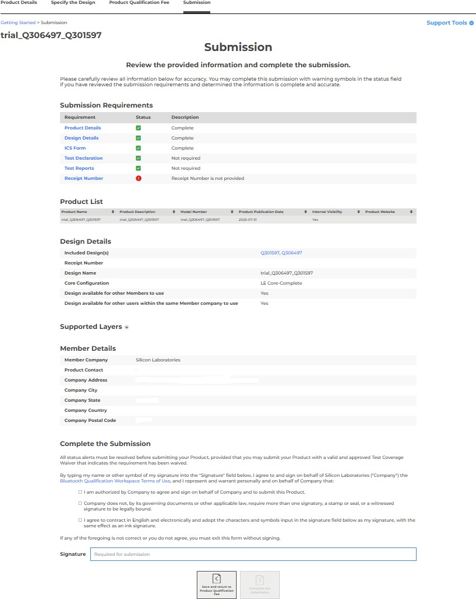

## Step 8: Check Product Status in Manage Submitted Products

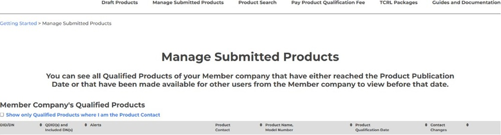

If your submission requires Bluetooth SIG review before approval, you will receive an email notification once the review is complete. In either case, you can monitor your submission status in the **Bluetooth Qualification Workspace** under the **Manage Submitted Products** section.

This page provides real-time updates on your product’s approval progress, publication date, and listing visibility on the Bluetooth SIG website.

For record-keeping, save a copy of the status page in your Compliance Folder.

**Congratulations!** Your product has successfully completed the Bluetooth Qualification Process and is now officially listed on the Bluetooth SIG website.
