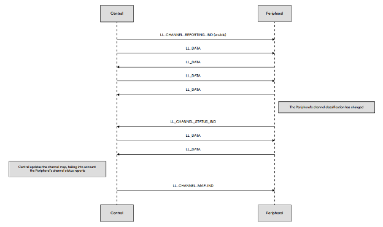
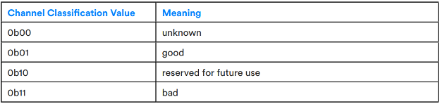
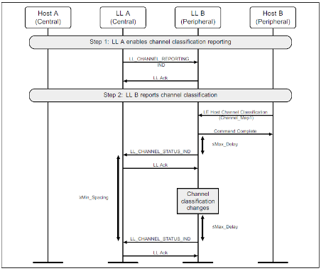

# LE Channel Classification

## Introduction

Peripheral devices are now able to provide a connected Central device with radio channel classification data which may be used by the Central device when performing channel selection during adaptive frequency hopping. This improves throughput and reliability by reducing susceptibility to interference taking place at the Peripheral when the Peripheral and Central devices are not physically close to each other.

Up to Bluetooth® Core 5.2, channel classification in Bluetooth LE is performed by the Central device only and the Central’s controller can use locally acquired measurements of channel performance or information provided by the host in determining the channel classifications.

Prior to Bluetooth® Core 5.3, Bluetooth LE channel classification was performed only by the Central device. However, if two connected devices are not in close proximity with each other, the radio conditions of one may differ from those experienced by the other. Consequently, when channel classification is performed only by the Central device, it is possible that the channel map can contain channels classified as used which are not a good choice for the remote Peripheral. This can result in packet collisions and generally degraded throughput and reliability.

Channel classification in Bluetooth LE may now be performed by the Peripheral device as well as the Central. The Peripheral can report its channel classifications to the connected Central device so that this data may also be considered when updating the Central’s channel map. This can result in only channels that are performing well for both devices being used in AFH and consequently improve throughput and reliability through reducing the number of collisions that might otherwise have occurred.

## Technical Highlights

A bit from the link layer FeatureSet bit mask has been allocated for indicating whether or not LE channel classification is supported.

The Central device’s link layer may enable LE channel classification in the remote Peripheral by performing the new Channel Classification Enable procedure. This involves the Central sending a `LL_CHANNEL_REPORTING_IND` PDU to the Peripheral. This PDU contains a flag which indicates whether channel reporting should be enabled or disabled and some timing parameters which the Peripheral will use to set the reporting schedule.

When enabled by the Central device, the Peripheral performs the link layer channel classification reporting procedure. When there has been a change in the Peripheral’s channel classification then subject to the timing parameters specified by the Central device, the Peripheral sends a `LL_CHANNEL_STATUS_IND` PDU to the Central.

The `LL_CHANNEL_STATUS_IND` PDU contains an array of thirty-seven 2-bit channel classification values, one for each of the general data channels. Defined classification values and their meaning are shown in below table.

## Enable the LE Channel Classification feature

Install the bluetooth_feature_channel_classification software component to enable this feature on devices operating in either the Central or Peripheral role.

When the feature is enabled on the Peripheral device, the Central device will receive the **sl_bt_evt_connection_channel_classification_id** event from the BLE stack whenever the Link Layer processes an `LL_CHANNEL_STATUS_IND` PDU received from the Peripheral.

Active AFH mode:

In this mode, the Peripheral’s Host does not need to issue the **sl_bt_gap_set_data_channel_classification** command for the Controller to send an LL_CHANNEL_STATUS_IND PDU to the Central. Instead, the Link Layer independently derives the channel classification using its own local information, without any involvement from the Host.

Passive AFH mode:

In this mode, the Peripheral’s Controller may obtain channel classification data from the Host via the **sl_bt_gap_set_data_channel_classification** command, and then transmit an LL_CHANNEL_STATUS_IND PDU to the Central.

When the Central device Host receives the **sl_bt_evt_connection_channel_classification_id** event in the Host application, it is up to the Host to send **sl_bt_gap_set_data_channel_classification** command to the BLE stack to send an `LL_CHANNEL_MAP_IND` PDU to the Peripheral device with the updated channel map.
