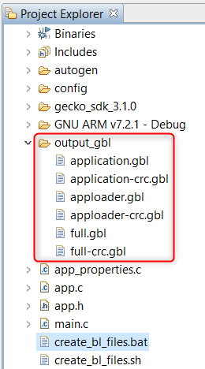
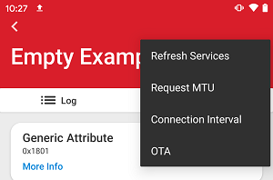
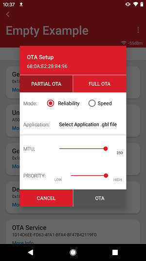
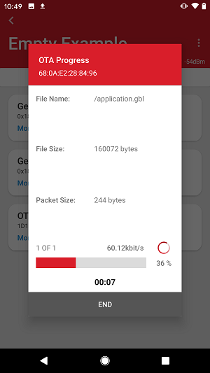

# Using Simplicity Connect for OTA DFU

## Introduction

This tutorial explains how to perform a Device Firmware Upgrade (DFU) with Bluetooth Over-The-Air (OTA) update. Any device that has OTA updates enabled in their GATT profile can have an OTA upgrade. Most of the example applications provided in the Bluetooth SDK already have OTA support built into the code. In these examples, the DFU mode is triggered through the Silicon Labs OTA service that is included as part of the application’s GATT database. OTA functionality can be added by installing the OTA DFU software component in your project.

For tutorial purposes, the `Bluetooth - SoC Empty` SDK example application will be upgraded to the `Bluetooth - SoC Thermometer` example application. Because the `Bluetooth - SoC Thermometer` has the Health Thermometer service for visual feedback, users can easily check that the functionality of the user application has changed.

### Requirements

- Wireless Starter Kit and Bluetooth-capable radio board
- Simplicity Studio 5
- Android or iOS mobile device

## First Steps

1. Download Simplicity Connect mobile app ([Android](https://play.google.com/store/apps/details?id=com.siliconlabs.bledemo) / [iOS](https://itunes.apple.com/us/app/silicon-labs-blue-gecko-wstk/id1030932759?mt=8)).

2. Connect the kit to your computer and select it in Simplicity Studio.

3. Create the `Bluetooth - SoC Empty` example project from Simplicity Studio Launcher.

4. Build the `Bluetooth - SoC Empty` project and flash the firmware image to the device.

5. Create the `Bluetooth - SoC Thermometre` example project.

6. Build the `Bluetooth - SoC Thermometer` project and double click on the `create_bl_files.bat/sh` script in the project tree. You may need to define two environment variables `PATH_SCMD` and `PATH_GCCARM` before running the script. The script creates a folder named `output_gbl` under your project and six `.gbl` upgrade image files in this folder:

    - `application.gbl`:  user application (including full Bluetooth stack)

    - `application-crc.gbl`:  user application with a CRC32 checksum

    - `apploader.gbl`:  AppLoader (including minimal Bluetooth stack)

    - `apploader-crc.gbl`:  AppLoader with a CRC32 checksum

    - `full.gbl`:  user application and AppLoader (full update) for UART DFU, **not needed** in this example.

    - `full-crc.gbl`:  user application and AppLoader (full update) with a CRC32 checksum for UART DFU, **not needed** in this example.

    A full update is needed only if the AppLoader needs to be updated. See [Using the Gecko Bootloader with Silicon Labs Bluetooth Applications](https://docs.silabs.com/bluetooth/latest/using-gecko-bootloader-with-bluetooth-apps/) for more details.

    

7. Transfer the `.gbl` files to your smartphone so the mobile app can find them. You can either transfer them via USB to any folder on your phone or place it to a cloud storage, which is available from your phone (e.g., Google Drive, Dropbox, iCloud, and so on).

8. Launch the Simplicity Connect mobile app.

## In the Simplicity Connect Mobile App

After you are in the app, do the following:

1. Go to the `Bluetooth Browser` and find and connect to your kit (default name "Empty Example").

2. Open the pop-up menu in the upper right corner and select `OTA`.

    

3. Select `Partial OTA` and look for the gbl file in your smartphone.

4. Finally, press `OTA` and your upgrade should start.

    

    

After the OTA process has finished, verify that the kit is now running the `Bluetooth - SoC Thermometer` example application. You can find the kit in the `Bluetooth Browser` with a new name "Thermometer Example".

## Note

To enable the Bluetooth OTA upgrade, the target device must be programmed with the Gecko Bootloader. This is an application bootloader, which requires that the new firmware image acquisition is managed by the application.

Running the "Demos" in Simplicity Studio will flash the bootloader and user application to the device. However, flashing an "Example Project" flashes the application only. If your OTA upload stops at 0% and you get a message on an Android phone saying "GATT CMD STARTED", that might indicate a missing or incorrect bootloader. In this case, do the following:

1. Click on Create New Project from the Launcher Perspective to create a Gecko Bootloader project for your kit. Select the **"Internal Storage Bootloader"** example project with a suitable configuration for your storage size.

2. In the `<projectname>.isc` file of the bootloader project, you can configure some options. For this example, press `Generate` with the default settings.

3. Build the project and find the bootloader image in the build directory named `“GNU ARM <compiler version number> - Default”`. For Series 1 devices, you need the `<projectname>-`**combined**`.s37` file that is the combined image of the first stage bootloader and the main bootloader with a CRC32 checksum. For Series 2 devices, you need the `<projectname>-`**crc**`.s37` file that is the main bootloader with a CRC32 checksum.

4. Flash the bootloader image to the device.

## Additional Resources

- [Using the Gecko Bootloader with Silicon Labs Bluetooth Applications](https://docs.silabs.com/bluetooth/latest/using-gecko-bootloader-with-bluetooth-apps/)

- [Silicon Labs Gecko Bootloader User's Guide for GSDK 4.0 and Higher (series 1 and 2 devices)](/bluetooth/{build-docspace-version}/bootloader-user-guide-gsdk-4)

- [Silicon Labs Gecko Bootloader User’s Guide for Series 3 and Higher](https://docs.silabs.com/mcu-bootloader/latest/bootloader-user-guide-series3-and-higher/)
