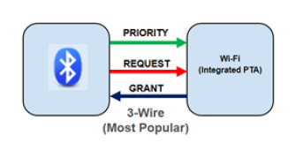
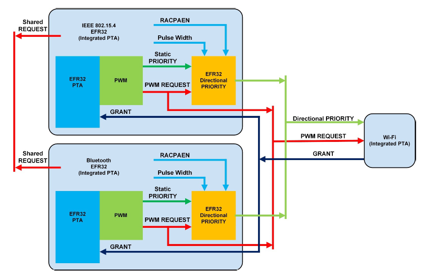

# PTA 3-Wire BLE Functional Overview

This section describes in practice what is the expected behavior of Packet Traffic Arbitration when using the three signals REQUEST, GRANT, and PRIORITY which is the most used configuration. This section also clarifies the noticeable differences between single EFR32 and multiple EFR32 scenarios.

The 3 wire PTA solution consists of three signals between a PTA master, the Wi-Fi chip, and one or several EFR32 peripherals:

- REQUEST, used by the EFR(s) to signify a request to transmit or receive to the Wi-Fi chip.

- PRIORITY, used by the EFR(s) to ensure that higher priority transmission/reception is processed first.

- GRANT, used by the Wi-Fi chip to grant a time slot to one EFR to transmit/receive. Note that in the case of multiple EFRs, the Wi-Fi PTA master does not control which EFR(s) has transmit/receive medium access. This arbitration is done between EFRs based on the logical state of the REQUEST signal.

Alternatively, in case of high Wi-Fi traffic load, the REQUEST signal can be PWM-ed to increase the opportunities of access to transmit/receive medium in a timely manner.

When the PWM feature is enabled and in the case of multiple EFRs, a back-channel REQUEST signal is shared between all EFRs for arbitration of the access to the PWM|REQUEST signal between the EFRs and the Wi-Fi chip (PTA central).

As described in [Wi-Fi Coexistence Fundamentals](https://docs.silabs.com/multiprotocol/latest/multiprotocol-wifi-coexistence-fundamentals/), the REQUEST back-channel is then used to arbitrate which EFR can access the shared PWM|REQUEST signal between the EFRs and the Wi-Fi chip. For more detail on signal settings please refer to the following section.
