# PTA Support Software Setup

>**Note**: GPIO interrupt numbers are based on the GPIO pin numbers and not the port. This can cause conflicts if the same pin is selected for different ports—for example, PD15 will conflict with PB15. Silicon Labs recommends avoiding these conflicts. If the conflict exists in hardware, manual macros can be added with the assistance of Silicon Labs Support.

## Standard Project Configuration

To enable PTA coexistence support, the following steps are required:

1. Create a Bluetooth or Bluetooth Mesh project in Simplicity Studio V5.

2. Select **RAIL Utility, Coexistence** and **RAIL Utility, Coexistence CLI**, and then click **Configure**.

   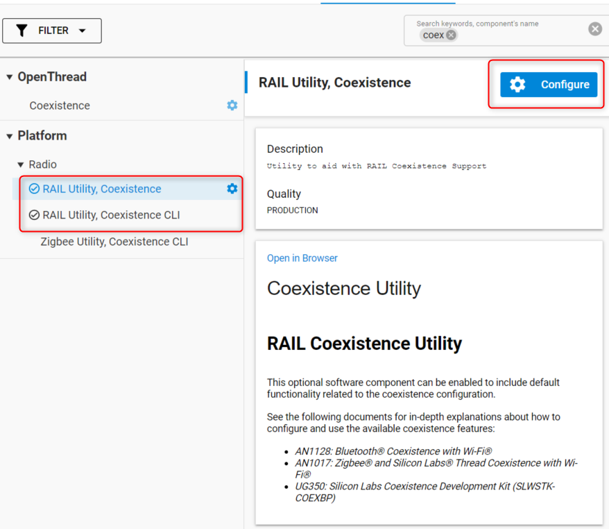

3. The polarity of the signals can be left unchanged. In the case of multiple EFR32s, the “shared mode” for each signal can be activated. For the common PTA 3 wire configuration, select the REQUEST, GRANT, and PRIORITY signals as shown.

   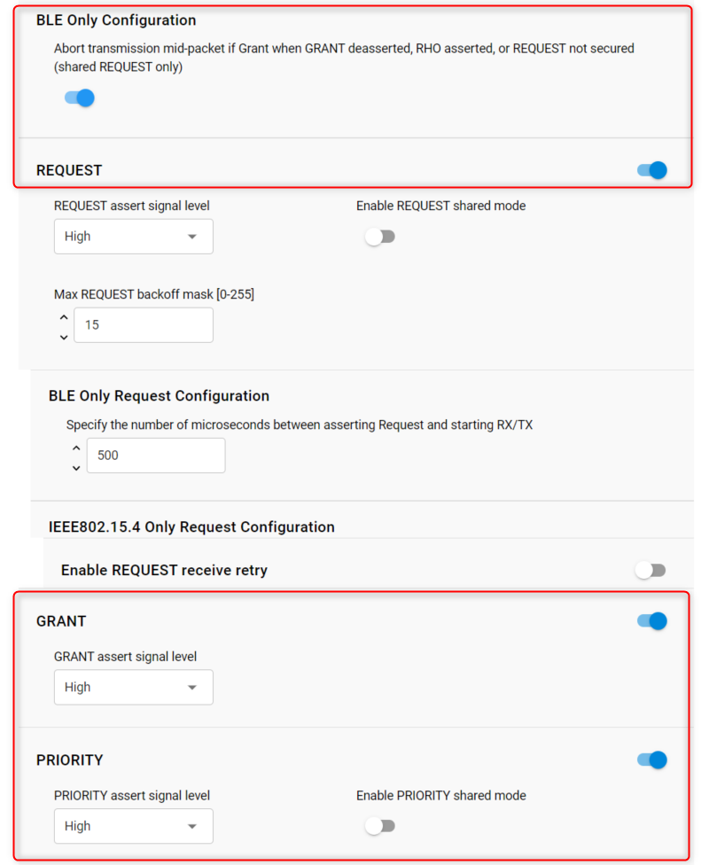

4. For each signal, select the corresponding GPIO:

   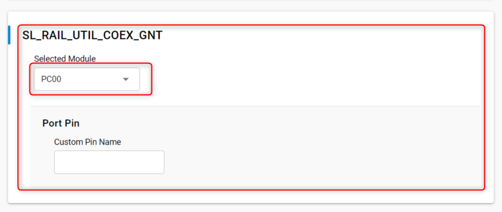

   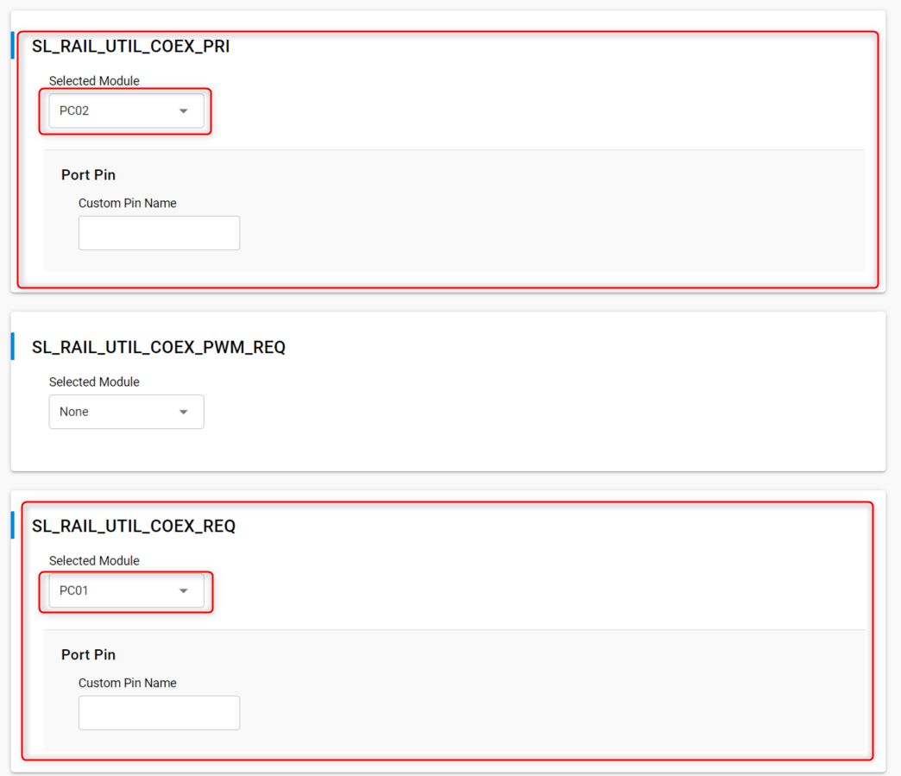

5. Finally, for debug purposes, ensure that the PRS component is installed in your project.

## PWM|REQUEST Project Configuration

In case high duty-cycle is required for high Wi-Fi throughput, the “PWM” feature offers a way for EFRs to pull up the REQUEST signal in a way that improves the probabilities to get a time slot granted from the PTA central device. For more details on the feature, refer to [Wi-Fi Coexistence Fundamentals](https://docs.silabs.com/multiprotocol/latest/multiprotocol-wifi-coexistence-fundamentals/).

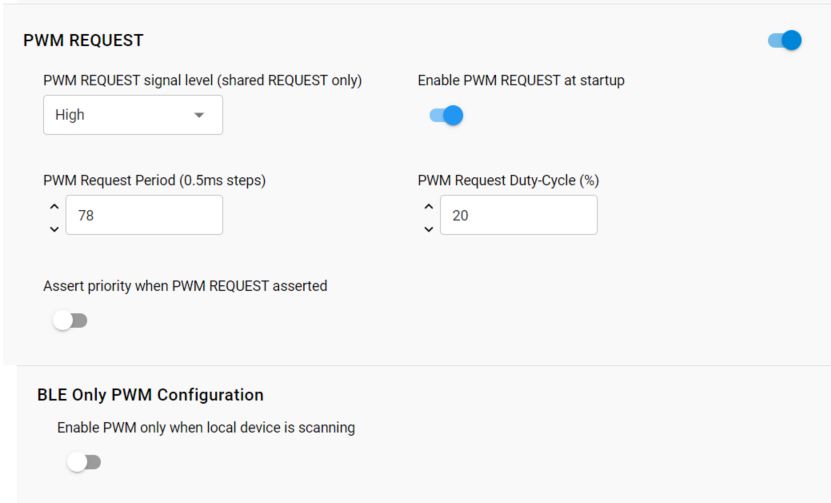

In this particular case, the **SL\_RAIL\_UTIL\_COEX\_REQ** signal corresponds to the REQUEST back-channel. The **SL\_RAIL\_UTIL\_COEX\_PWM\_REQ** corresponds to the PWM|REQ signal between the EFR(s) and the Wi-Fi chip.

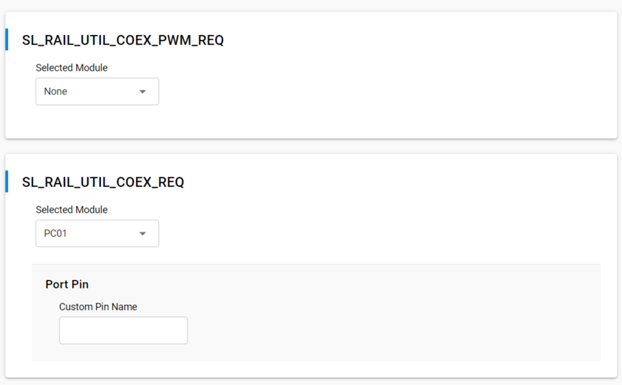

## PTA Signals

This section clarifies the settings that are specific to each signal.

### REQUEST Signal

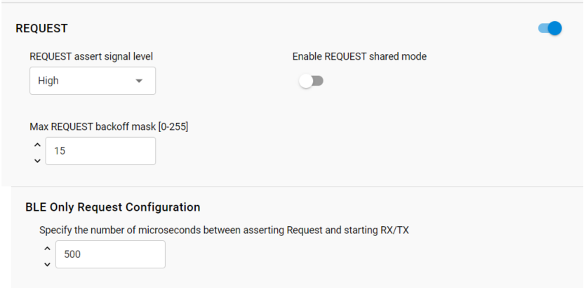

- BLE Only Request Configuration (Request Window)

   REQUEST Window adjusts the lead time for REQUEST assertion before the first Bluetooth TX or RX operation and after the REQUEST is asserted. A TX operation will proceed if GRANT is asserted at the end of the REQUEST Window. An RX operation will attempt to proceed regardless of GRANT asserted or de-asserted as Bluetooth RX does not impact other co-located radios. This feature’s setting needs to at least exceed the maximum time for Wi-Fi/PTA to provide GRANT asserted or de-asserted after the REQUEST is asserted.

- REQUEST signal is shared

  This helps the radio transceiver software to set the electrical status of the corresponding GPIO so it can be driven by other EFRs (open-drain). This should be disabled for single EFR operation.

- REQUEST signal max backoff mask

  REQUEST signal max backoff determines the random REQUEST delay mask (only valid if REQUEST signal is shared). The random delay (in µs) is computed by masking the internal random variable against the entered mask. The mask should be set to a value of 2n-1 to ensure a continuous random delay range.

In case the PWM feature is used:


PWM asserts REQUEST and optionally PRIORITY at a regular period and duty-cycle. PWM can be employed to create idle Wi-Fi TX windows to improve 100% Passive SCAN performance and is essential for Bluetooth mesh using ADV-Bearer to allow sufficient idle Wi-Fi TX time windows. **PWM Request Period** and **PWM Request Duty-Cycle** indicates the period and duty-cycle at reset.

PWM period should not be an integer sub-multiple of Wi-Fi beacon (typically 102.4 ms). This is required to prevent Wi-Fi from losing many beacons and disassociating. Also, the lowest duty-cycle providing sufficient BT performance is recommended as higher PWM duty-cycles reduce RF time available to Wi-Fi with associated reduction in Wi-Fi throughput.

However, for Bluetooth mesh using the ADV-Bearer method, a period of 39 ms and duty-cycle greater than 44% may be required to receive 99% of ADV-bearer messages (exact PWM requirement depends on Bluetooth mesh retry settings). If possible, Bluetooth mesh should use the GATT-bearer method from the co-located Bluetooth mesh radio to relay node.

If **Assert priority when PWM REQUEST asserted** is enabled, then REQUEST is **Shared REQUEST** between multiple EFR32 radios and is used to arbitrate which EFR32 controls PTA interface to Wi-Fi. Operating PWM on **Shared REQUEST** is incompatible with arbitration.  As such, the PWM_REQUEST pin becomes necessary. Shared REQUEST interconnects all EFR32 radios for arbitration and PWM_REQUEST is connected to all EFR32 radios, but drives the REQUEST signal to Wi-Fi/PTA.

If **Assert priority when PWM REQUEST asserted** is disabled, then REQUEST is not shared and is used to drive all PTA requests to Wi-Fi, both from radio states requests and from PWM.

### GRANT Signal

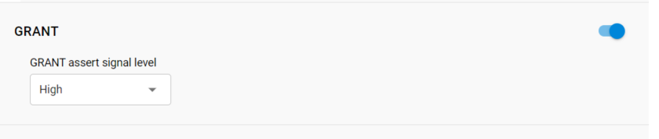

Many Wi-Fi/PTA devices use the term WLAN_DENY or BT_DENY and are considered active-high. These active-high deny signals correlate with EFR32 active-low GRANT.

In 1-wire PTA configurations based on REQUEST-only, GRANT is not implemented. If GRANT is not needed, you can disable the signal.

### TX Abort

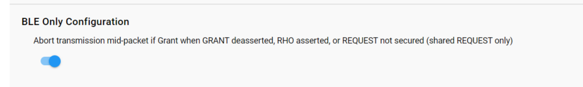

If enabled, losing GRANT (or RHO asserted) during a Bluetooth TX will abort the Bluetooth TX. If not enabled, losing GRANT (or RHO asserted) after the start of a Bluetooth TX will not abort the Bluetooth TX. If disabled, transmission won’t be aborted when GRANT/RHO/REQUEST are de-asserted.

If enabled, transmission will be aborted when GRANT/RHO/REQUEST are de-asserted.

### PRIORITY Signal

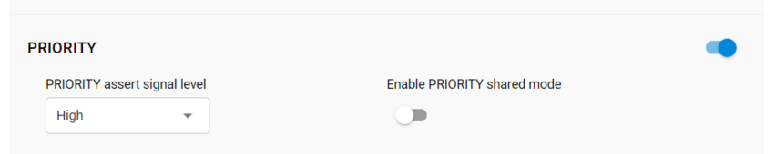

>**Note**: In 1-Wire or 2-Wire PTA configurations, PRIORITY is not implemented. For single EFR operation, the shared mode for PRIORITY should be disabled

### Radio Hold Off

Radio hold-off (RHO) is effectively a second GRANT signal. However, when RHO is asserted, Bluetooth TX operations are blocked.

>**Note**: In most EFR32BG coexistence applications, RHO is not needed. If RHO is not needed this can be just disabled.

### Directional Priority

PRIORITY can be “static” where it is asserted or de-asserted for the entire TX/RX/… or RX/TX/… event. Directional PRIORITY can be used to provide priority information and radio state (TX or RX). The EFR32 implementation of Directional PRIORITY is accomplished using static PRIORITY, REQUEST (or PWM_REQUEST if multi-EFR32 using Shared REQUEST), a TIMER, and up to 6 PRS channels. Because on-chip hardware resources are used with this feature, it is very important to understand which are used and ensure no conflicts. Directional PRIORITY is only supported for PTA implementations where REQUEST (PWM_REQUEST) and PRIORITY are active high.

As illustrated in [PTA 3-Wire BLE Functional Overview](./02-pta-3-wire-ble-functional-overview), the Directional PRIORITY signal is a combination of other signals:

- Static PRIORITY signal.

- The REQUEST signal.

- Radio controller state “FEM” (Front End Module) signals. In particular, RACPAEN which is the signal corresponding to the Power Amplifier on the transmit path.

- A Hardware timer for Directional PRIORITY time pulses.

- Additional PRS channels needed for signal routing.

For more details on the mechanisms used to generate the Directional Priority signal, refer to [Wi-Fi Coexistence Fundamentals](https://docs.silabs.com/multiprotocol/latest/multiprotocol-wifi-coexistence-fundamentals/).

If enabled, Directional PRIORITY drives a programmable pulse-width (1µs to 255µs) to indicate the priority of TX/RX/… or the priority of RX/TX/… events.  Following pulse, Directional PRIORITY signal is low for radio in RX state and high for radio in TX state. The Wi-Fi/PTA device can monitor the Directional PRIORITY signals to understand the priority of the TX/RX/… or RX/TX/… event and the current radio state. In this manner, simultaneous TX/TX and RX/RX can be allowed and conflicting TX/RX and RX/TX events can be prioritized by PTA mechanism.

To enable Directional PRIORITY, start by turning on the feature in the **RAIL Utility, Coexistence** component.

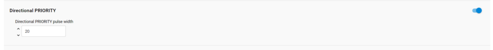

When the component UI is modified, the corresponding coexistence configuration files under the config directory in your project are automatically modified to reflect your latest changes:

- sl_rail_util_coex_common_config.h

- sl_rail_util_coex_config.h

The first file (sl_rail_util_coex_common_config.h) contains macros that are software switches for each coexistence feature.

The second file (sl_rail_util_coex_config.h) defines the hardware Inputs/Outputs and PRS and Timer peripherals.

The PRIORITY signal is not assigned a GPIO and is set disabled. It has no physical connection to the Wi-Fi PTA and is used as Static PRIORITY input to the Directional PRIORITY logic block with the remaining PRIORITY signal configuration options.

>**Note**: Component UI for PRIORITY configuration fields are disabled and therefore not editable when Enable PRIORITY is set to true. A workaround is to assign any GPIO to PRIORITY signal, edit the PRIORITY configuration options, and then set PRIORITY signal to disabled. This is valid for SDKs prior to GSDK 4.1.1.

1. Enable REQUEST, GRANT and Directional PRIORITY (the PRIORITY signal should also be enabled).

2. Under the REQUEST signal set "Specify the number of microseconds between asserting Request and starting RX/TX" to 50 us for example.

   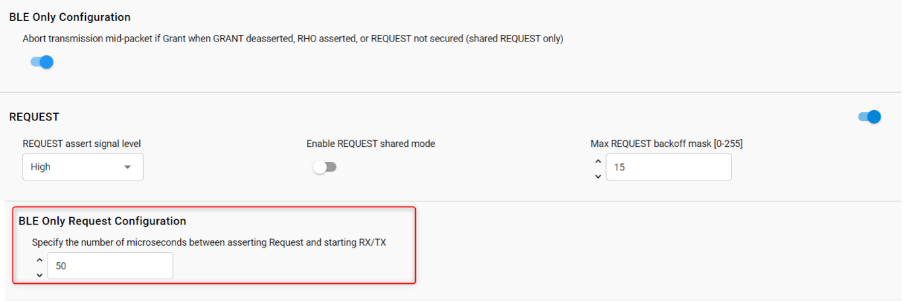

3. Set the pin settings for SL_RAIL_UTIL_COEX_GNT, SL_RAIL_UTIL_COEX_REQ, and SL_RAIL_UTIL_COEX_DP_OUT.

   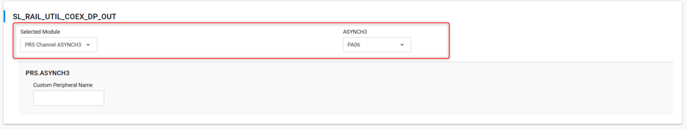

   Note that, for series 1, the signal SL_RAIL_UTIL_COEX_DP_REQUEST_INV should also be set according to the wanted polarity.

4. In some earlier version of the GSDK (prior to 4.1.1), the timer settings aren’t present by default in the component definition. In this case it has to be added manually by copy pasting the following snippet of code in the file "config/sl_rail_coex_config.h" and add the timer macros. This gives the expected Hardware Timer settings in the **“RAIL Utility, Coexistence”** component UI:

   ```text
   // Directional Priority timer module
   // <timer channel=CC0 optional=true> SL_RAIL_UTIL_COEX_DP_TIMER
   // $[TIMER_SL_RAIL_UTIL_COEX_DP_TIMER]
   #define SL_RAIL_UTIL_COEX_DP_TIMER_PERIPHERAL    TIMER1
   #define SL_RAIL_UTIL_COEX_DP_TIMER_PERIPHERAL_NO 1
   // [TIMER_SL_RAIL_UTIL_COEX_DP_TIMER]$
   #ifndef SL_RAIL_UTIL_COEX_DP_TIMER_PERIPHERAL
   #error "SL_RAIL_UTIL_COEX_DP_TIMER_PERIPHERAL undefined"
   #endif //SL_RAIL_UTIL_COEX_DP_TIMER_PERIPHERAL
   #endif //SL_RAIL_UTIL_COEX_DP_ENABLED

   #endif // SL_RAIL_UTIL_COEX_CONFIG_H
   ```

   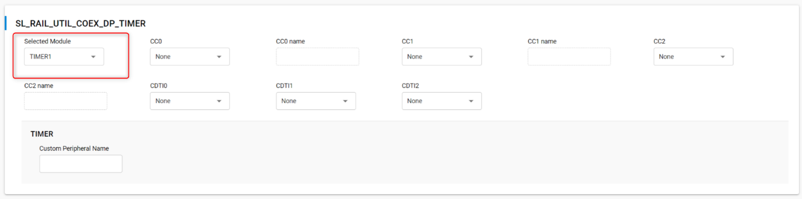

>**Note**: REQUEST will assert on valid BLE preamble/sync. REQUEST will also stay asserted through any follow-up TX/RX/... required for this RX packet.

As an extra, you can set the FEM and PTI pins so that the data being sent appear on the logic analyzer waveforms. To do so, in the **RAIL Utility, PTI** component, configure the desired signals as illustrated:

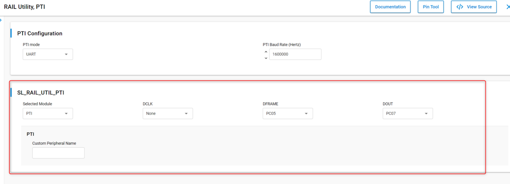

Install the FEM component **Radio Utility, FEM** (this section is optional – for debugging purposes):

   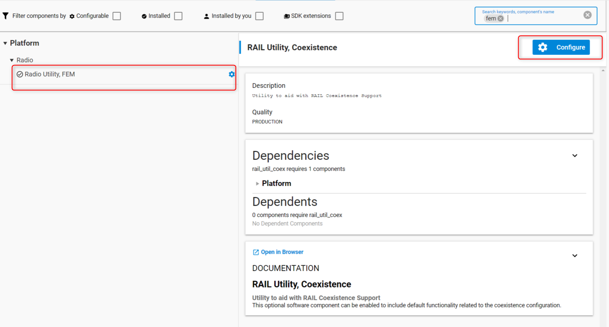

   1. In that component, in the **FEM Configuration** pane, toggle on **Enable RX Mode** and **Enable TX Mode**.

      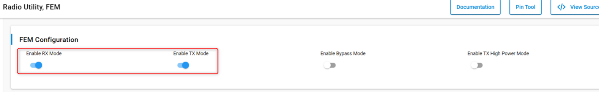

   2. Then after enabling the RX (Radio Controller LNA or RACLNA Enabled in short) and TX (Radio Controller PA signals or RACPA  Enabled used for DP generation), set the RX (RACLNAEN) and TX (RACPAEN) pins.

      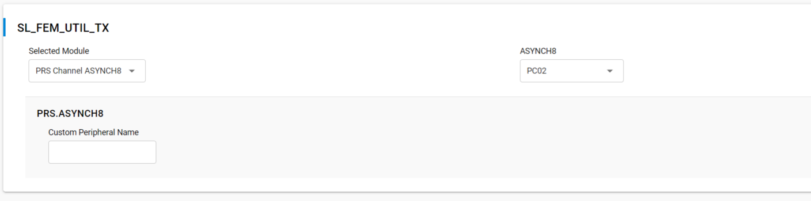

      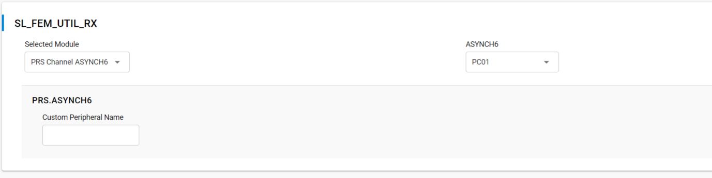

An example of signals waveform generated (BLE active scanning) by a project configured as above would look like the following on a logic analyzer:

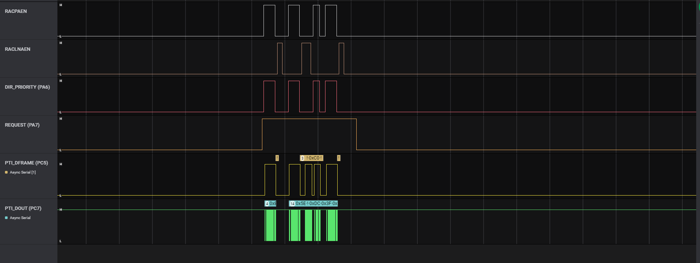

The above illustrates a BLE advertising packet being sent on the three primary channels. You can see the RACPAEN pull up during transmit and then RACLNAEN begin pulled up for a short while. The second advertising has an active scanning packet (RACPAEN being pulled after reception for a little while).

### Wi-Fi TX (EFR32xG24 only)

On the EFR32xG24 chip family, a hardware feature is available that allows the radio transceiver driver to take advantage of interframe spaces in high duty cycles. For this chip family, this can be an alternative to the PWM|REQUEST feature. When used, this enables a signal detector searching for waves characteristic of IoT devices (802.15.4 and BLE) during Wi-Fi transmission.

The following screenshots illustrate how the feature and the corresponding Wi-Fi TX GPIO can be configured:

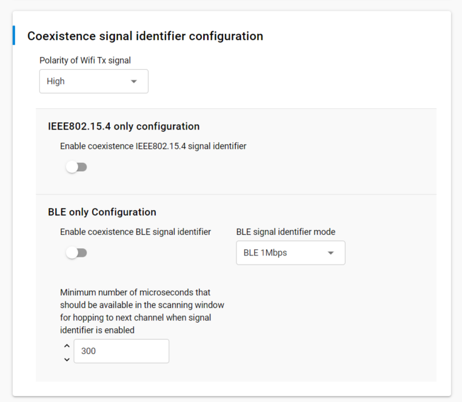

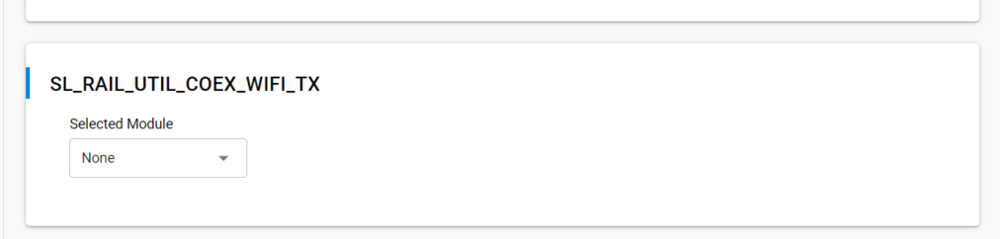

For more information on how the feature works, refer to [Wi-Fi Coexistence Fundamentals](https://docs.silabs.com/multiprotocol/latest/multiprotocol-wifi-coexistence-fundamentals/).

## PTA Code Reference for Older SDKs

This section is a reference for customers using older SDKs (prior to GSDK 3.0.0.0).

Add code to initialize and configure coexistence:

- Add include file to app.c:

    ```#include "coexistence-ble.h"```

- Add one of following variable definition to app.c:

    ```uint8 myCoexConfig[] = { 255, 255, 39, 20 }; // for duty-cycled SCAN and no BT Mesh ADV-Bearer```

   or

    ```uint8 myCoexConfig[] = { 175, 175, 39, 20 }; // for 100% Passive SCAN or BT Mesh ADV-Bearer```

   which is based on the following definition:

  ```text
   typedef struct{
        uint8_t threshold_coex_pri; /** Priority line is toggled if priority is below this*/
        uint8_t threshold_coex_req; /** Coex request is toggled if priority is below this*/
        uint8_t coex_pwm_period;    /** PWM Period in ms, if 0 pwm is disabled*/
        uint8_t coex_pwm_dutycycle; /** PWM dutycycle percentage, if 0 pwm is disabled, if >= 100
                                          pwm line is always enabled*/
      }sl_bt_ll_coex_config;

      //Default coex configuration
      #define SL_BT_COEX_DEFAULT_CONFIG { 175, 255, HAL_COEX_PWM_REQ_PERIOD, HAL_COEX_PWM_REQ_DUTYCYCLE
  ```

- Add one of following variable definition to app.c:

  ```text
   // for duty-cycled SCAN and no BT Mesh ADV-Bearer and default link layer priorities
   uint8 myLinkLayerPriorities[] = { 191, 143, 175, 127, 135, 0, 55, 15, 16, 16, 0, 4, 4 }
  ```

  or

  ```text
  // for duty-cycled SCAN and no BT Mesh ADV-Bearer
  uint8 myLinkLayerPriorities[] = { 223, 175, 174, 127, 135, 0, 55, 15, 16, 16, 0, 4, 4 };
  ```

   which is based on following definition:

  ```text
  typedef struct {
      uint8_t scan_min;
      uint8_t scan_max;
      uint8_t adv_min;
      uint8_t adv_max;
      uint8_t conn_min;
      uint8_t conn_max;
      uint8_t init_min;
      uint8_t init_max;
      uint8_t rail_mapping_offset;
      uint8_t rail_mapping_range;
      uint8_t afh_scan_interval;
      uint8_t adv_step;
      uint8_t scan_step;

  }sl_bt_bluetooth_ll_priorities;
  //Default priority configuration
  #define SL_BT_BLUETOOTH_PRIORITIES_DEFAULT { 191, 143, 175, 127, 135, 0, 55, 15, 16, 16, 0, 4, 4 }
  ```

- Enable or disable Passive SCAN.

  ```#define SCAN_PASSIVE                        (0)```

   or

  ```#define SCAN_PASSIVE                        (1)```

- Add point to custom link layer table in config variable in sl_bluetooth.c (instead of the default stack definition SL_BT_CONFIG_DEFAULT):

  ```text
   static const sl_bt_configuration_t config = {
   .config_flags = SL_BT_CONFIG_FLAGS,                                        \
   .sleep.flags = SL_BT_SLEEP_FLAGS_DEEP_SLEEP_ENABLE,                        \
   .bluetooth.max_connections = SL_BT_CONFIG_MAX_CONNECTIONS,                 \
   .bluetooth.max_advertisers = SL_BT_CONFIG_MAX_ADVERTISERS,                 \
   .bluetooth.max_periodic_sync = SL_BT_CONFIG_MAX_PERIODIC_ADVERTISING_SYNC, \
   .bluetooth.mem_pool = sl_bt_default_mem_pool,                              \
   .bluetooth.mem_pool_size = sizeof(sl_bt_default_mem_pool),                 \
   .bluetooth.sleep_clock_accuracy = SL_BT_CONFIG_SLEEP_CLOCK_ACCURACY,       \  // use modified Link Layer Priorities
   .bluetooth.linklayer_priorities = myLinkLayerPriorities, // default = NULL
  
   .scheduler_callback = SL_BT_CONFIG_LL_CALLBACK,                            \
   .stack_schedule_callback = SL_BT_CONFIG_STACK_CALLBACK,                    \
   .gattdb = &bg_gattdb_data,                                                 \
   .max_timers = SL_BT_CONFIG_MAX_SOFTWARE_TIMERS,                            \
   .rf.tx_gain = SL_BT_CONFIG_RF_PATH_GAIN_TX,                                \
   .rf.rx_gain = SL_BT_CONFIG_RF_PATH_GAIN_RX,};
  ```

- Add the coexistence initialization function call and initialize threshold_coex_req and threshold_code_pri within main() in main.c.

   ```text
   …
   // Initialize stack
   sl_bt_init();

   // Initialize coexistence
   sl_bt_init_coex_hal();

   // Initialize threshold_coex_req and threshold_code_pri
   sl_bt_coex_set_parameters(myCoexConfig[0],myCoexConfig[1],myCoexConfig[2],myCoexConfig[3]);
   ```

## Run-Time PTA Re-configuration

The following PTA options can also be re-configured at runtime:

1. Disable/Enable the PTA feature

   At runtime, the following code disables the PTA feature:

   ```sl_bt_coex_set_options(SL_COEX_OPTION_ENABLE,0);```

   At runtime, the following code enables the PTA feature:

   ```sl_bt_coex_set_options(SL_BT_COEX_OPTION_ENABLE, 1);```

2. REQUEST Window

   At runtime, the following code can be used to change the REQUEST_WINDOW:

   ```text
   sl_bt_coex_set_options(SL_BT_COEX_OPTION_REQUEST_WINDOW_MASK, desired_request_window << SL_BT_COEX_OPTION_REQUEST_WINDOW_SHIFT);
   ```

   Where `desired_request_window` is the REQUEST_WINDOW in µs.

3. Abort transmission mid packet if GRANT is lost.

   At runtime, the following code disables Abort transmission mid packet if GRANT is lost:

   ```Csl_bt_coex_set_options(SL_BT_COEX_OPTION_TX_ABORT, 0);```

   At runtime, the following code enables Abort transmission mid packet if GRANT is lost:

   ```sl_bt_coex_set_options(SL_BT_COEX_OPTION_TX_ABORT, 1);```

4. PRIORITY Escalation capability

   At runtime, the following code disables PRIORITY assertion:

   ```sl_bt_coex_set_options(SL_BT_COEX_OPTION_HIGH_PRIORITY, 0);```

   At runtime, the following code enables PRIORITY assertion:

   ```sl_bt_coex_set_options(SL_BT_COEX_OPTION_HIGH_PRIORITY, 1);```

5. Channel Map Masking

   If an EFR32BG device enters CONNECTION state as a central device, it controls which of the 37 data channels are used during the AFH. As a CONNECTION central device, the EFR32BG can also update this channel map and communicate this update to a peripheral device. This feature can be used to make Bluetooth avoid being co-channel to Wi-Fi.

   If EFR32 becomes the connection central device, the Bluetooth channel map can be specified using this function call:

   ```text
   sl_status sl_bt_gap_set_data_channel_classification(size_t channel_map_len, const uint8_t*
   channel_map)
   ```

   This command can be used to specify a channel classification for data channels. This classification persists until overwritten with a subsequent command or until the system is reset.

   `channel_map` is 5 bytes and contains 37 1-bit fields. The *n*th such field (in the range 0 to 36) contains the value for the link layer channel index *n*:

   0: Channel *n* is bad.

   1: Channel *n* is unknown.

   The most significant bits are reserved and shall be set to 0 for future use. At least two channels shall be marked as unknown.

   ```threshold_coex_req, threshold_code_pri, pwm_period, and pwm_dutycycle```

   It may be required during application execution to change the two coex thresholds and PWM period/duty-cycle. These settings can be changed at run time using this function call:

   ```sl_status sl_bt_coex_set_parameters(uint8_t priority, uint8_t request, uint8_t pwm_period, uint8_t pwm_dutycycle)```

6. Link Layer Priority Table

   It may be required during application execution to change the link layer priority table. This table can be changed at run time using this functional call:

   ```sl_status_t sl_bt_system_linklayer_configure (uint8 key,uint8 data_len, const uint8* data)```

   where `data` is an array containing:

   ```text
   typedef struct {
     uint8_t scan_min;
     uint8_t scan_max;
     uint8_t adv_min;
     uint8_t adv_max;
     uint8_t conn_min;
     uint8_t conn_max;
     uint8_t init_min;
     uint8_t init_max;
     uint8_t rail_mapping_offset;
     uint8_t rail_mapping_range;
     uint8_t afh_scan_interval;
     uint8_t adv_step;
     uint8_t scan_step;
   } sl_bt_bluetooth_ll_priorities;
   ```

This full array is 17 bytes in length. However, if `data_len` is less than 17, only first `data_len` entries will be modified. For example, if `data_len=2`, only `scan_min` and `scan_max` are updated.

## Run-Time PTA Debug Counters

At runtime, PTA Debug Counters are also available and can be accessed and reset via the following function:

```text
sl_status_t sl_bt_coex_get_counters(uint8_t reset,
                                    size_t max_counters_size,
                                    size_t \*counters_len,
                                    uint8_t \*counters);
```

where:

- `reset = 0` leaves counters unchanged

- `reset = 1` resets all counters to 0 (after reading current counter values)

   where, since startup or last reset:

  - `result` is success (== 0) or failure (!= 0) of `sl_bt_coex_get_counters()` command

  - `max_counters_size` is the size of output buffer passed in pointer counters.

  - `counters_len` is a pointer to the buffer length variable.

  - `counters` is the counters buffer. Counters in the list are in following order: low priority requested, high priority requested, low priority denied, high priority denied, low-priority TX aborted, and high-priority TX aborted. Passing a non-zero value also resets counter.

## Coexistence Configuration Setup Examples for Different Wi-Fi/PTA Applications

### Example 1: Configure EFR32 PTA support to operate as single EFR32 with typical 3-Wire Wi-Fi/PTA (for Series 1)

- Single EFR32 radio

- REQUEST unshared, active high, PC10

  - Compatible 3-Wire Wi-Fi/PTA devices sometimes refer to this signal as RF_ACTIVE or BT_ACTIVE (active high)

- GRANT, active low, PF3

  - Compatible 3-Wire Wi-Fi/PTA devices sometimes refer to this signal as WLAN_DENY (deny is active high, making grant active low)

- PRIORITY, active high, PD12

  - Compatible 3-Wire Wi-Fi/PTA devices sometimes refer to this signal as RF_STATUS or BT_STATUS (active high)

  - PRIORITY is static, not directional. If operated with a 3-Wire Wi-Fi/PTA expecting directional:

    - Static high PRIORITY is interpreted as high PRIORITY and always in TX mode, regardless of actual TX or RX

    - Static low PRIORITY is interpreted as low PRIORITY and always in RX mode, regardless of actual TX or RX

- REQUEST_WINDOW is 50 µs

- Disabled Abort transmission mid packet if GRANT is lost

- PRIORITY is always high

- RHO unused

The required #defines in `sl_rail_util_coex_config.h` and `sl_rail_util_coex_common_config.h` are:

```text
// $[COEX]
#ifndef SL_RAIL_UTIL_COEX_CONFIG_H
#define SL_RAIL_UTIL_COEX_CONFIG_H

#define SL_RAIL_UTIL_COEX_REQ_PIN                             (10U)
#define SL_RAIL_UTIL_COEX_REQ_PORT                            (gpioPortC)
#define SL_RAIL_UTIL_COEX_PWM_REQ_ASSERT_LEVEL                    (1)
#define SL_RAIL_UTIL_COEX_REQ_WINDOW                          (50U)
#define SL_RAIL_UTIL_COEX_REQ_SHARED                          (0)
#define SL_RAIL_UTIL_COEX_REQ_BACKOFF                         (15U)

#define SL_RAIL_UTIL_COEX_GNT_PIN                             (3U)
#define SL_RAIL_UTIL_COEX_GNT_PORT                            (gpioPortF)
#define SL_RAIL_UTIL_COEX_GNT_ASSERT_LEVEL                    (0)
#define SL_RAIL_UTIL_COEX_TX_ABORT                            (0)
#define SL_RAIL_UTIL_COEX_PRI_PIN                             (12U)
#define SL_RAIL_UTIL_COEX_PRI_PORT                            (gpioPortD)
#define SL_RAIL_UTIL_COEX_PRI_ASSERT_LEVEL                    (1)
#define SL_RAIL_UTIL_COEX_PRIORITY_DEFAULT                    (1)
#define SL_RAIL_UTIL_COEX_PRI_SHARED                          (0)

#define SL_RAIL_UTIL_COEX_PWM_DEFAULT_ENABLED                 (0)
#define SL_RAIL_UTIL_COEX_PWM_REQ_PERIOD                      (39U)
#define SL_RAIL_UTIL_COEX_PWM_REQ_DUTYCYCLE                   (20U)
#define SL_RAIL_UTIL_COEX_PWM_PRIORITY                        (0)

#define SL_RAIL_UTIL_COEX_DP_ENABLED                          (0)
// [COEX]$
```

The logic analyzer capture in the following figure shows the PTA interface, Wi-Fi TX state, and EFR32 radio state for an EFR32 radio configured for typical 3-Wire Wi-Fi/PTA during a CONNECTION event (peripheral):

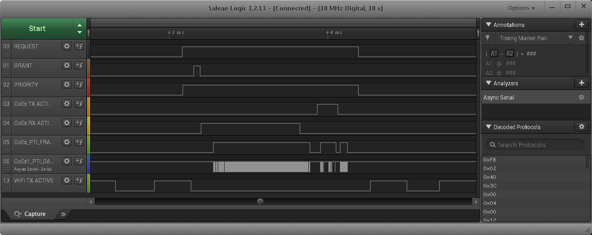

where:

- **REQUEST**: active high, push-pull REQUEST output
- **nGRANT**: active low GRANT input
- **PRIORITY**: active high PRIORITY output
- **CoEx TX ACTIVE**: EFR32 TX Active control signal (configured via sample code in [Application Code Coexistence Extensions](./04-application-code-coexistence-extensions))
- **CoEx RX ACTIVE**: EFR32 RX Active control signal (configured via sample code in [Application Code Coexistence Extensions](./04-application-code-coexistence-extensions))
- **CoEx PTI FRAME**: EFR32 Frame Control Data Frame signal (packet trace frame/synch)
- **CoEx PTI DATA**: EFR32 Frame Control Data Out signal (packet trace data)
- **WiFi TX ACTIVE**: Wi-Fi TX Active signal

The logic analyzer sequence above shows:

1. Wi-Fi is transmitting and EFR32BG asserts REQUEST, then high PRIORITY.

2. GRANT is momentarily de-asserted by Wi-Fi/PTA but is reasserted as Wi-Fi finished.

3. EFR32 radio enables RX mode awaiting central TX.

4. EFR32 radio receives the central TX.

5. EFR32 radio exits receive mode.

6. At start of 150µs IFS, EFR32 radio transmits back to central.

7. After transmit, EFR32 reasserts PRIORITY and then REQUEST.

8. Wi-Fi resumes transmission.

### Example 2: Configure EFR32 PTA support to operate with multi-radio 2-Wire PTA with active-low REQUEST (for Series 1)

- Multiple EFR32 radios (external 1 kΩ ±5% pull-up required on REQUEST)

- REQUEST shared, active low, PC10

- GRANT, active low, PF3

- PRIORITY unused

- REQUEST_WINDOW is 50 µs

- Disabled Abort transmission mid packet if GRANT is lost

- RHO unused

The required #defines in sl_rail_util_coex_common_config.h and sl_rail_util_coex_config.h are:

```text
// $[COEX]

#define SL_RAIL_UTIL_COEX_REQ_PIN                             (10U)
#define SL_RAIL_UTIL_COEX_REQ_PORT                            (gpioPortC)
#define SL_RAIL_UTIL_COEX_REQ_ASSERT_LEVEL                    (0)
#define SL_RAIL_UTIL_COEX_REQ_WINDOW                          (50U)
#define SL_RAIL_UTIL_COEX_REQ_SHARED                          (1)
#define SL_RAIL_UTIL_COEX_REQ_BACKOFF                         (15U)

#define SL_RAIL_UTIL_COEX_GNT_PIN                             (3U)
#define SL_RAIL_UTIL_COEX_GNT_PORT                            (gpioPortF)
#define SL_RAIL_UTIL_COEX_GNT_ASSERT_LEVEL                    (0)
#define SL_RAIL_UTIL_COEX_TX_ABORT                            (0)

#define SL_RAIL_UTIL_COEX_PWM_DEFAULT_ENABLED                 (0)
#define SL_RAIL_UTIL_COEX_PWM_REQ_PERIOD                      (78U)
#define SL_RAIL_UTIL_COEX_PWM_REQ_DUTYCYCLE                   (20U)
#define SL_RAIL_UTIL_COEX_PWM_PRIORITY                        (0)

#define SL_RAIL_UTIL_COEX_DP_ENABLED                          (0)
// [COEX]$
```

The logic analyzer capture below shows the PTA interface, Wi-Fi radio state, and EFR32 radio state for an EFR32 radio configured for multi-radio 2-Wire PTA with active-low REQUEST:

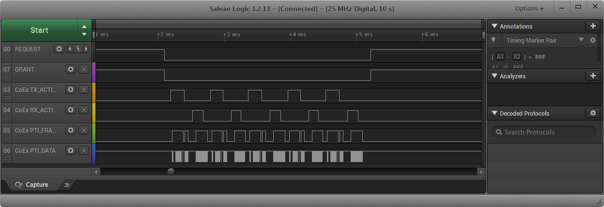

where:

- **REQUEST**: active low, shared (open-drain) REQUEST input/output

- **GRANT**: active low GRANT input

- **CoEx TX ACTIVE**: EFR32 TX Active control signal (configured via sample code in [Application Code Coexistence Extensions](./04-application-code-coexistence-extensions))

- **CoEx RX ACTIVE**: EFR32 RX Active control signal (configured via sample code in [Application Code Coexistence Extensions](./04-application-code-coexistence-extensions))

- **CoEx PTI FRAME**: EFR32 Frame Control Data Frame signal (packet trace frame/synch)

- **CoEx PTI DATA**: EFR32 Frame Control Data Out signal (packet trace data)

The logic analyzer sequence above shows:

1. At REQUEST_WINDOW before the CONNECTION event, Shared REQUEST signal is tested and found not asserted by another EFR32 radio, so EFR32 radio asserts REQUEST.

2. Wi-Fi/PTA responds with GRANT asserted.

3. At end of REQUEST_WINDOW (start of CONNECTION event), EFR32 tests GRANTS, which is asserted.

4. With GRANT asserted at start of CONNECTION event, EFR32 executes transmit.

5. After transmit is complete and before end if 150µs IFS, EFR32 enables receive to capture expected response from CONNECTION peripheral device.

6. EFR32 device receives device and disables receive.

7. EFR32 repeats transmit/receive for four additional cycles as part of this first anchor point.

8. After last receive, EFR32 de-asserts REQUEST.

9. Wi-Fi/PTA responds with GRANT deasserted.
