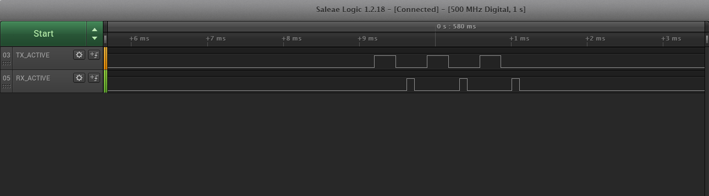

# Application Code Coexistence Extensions

## Code Example TX_ACTIVE/RX_ACTIVE on Series 1

It is helpful to access the EFR32 radio state during PTA coexistence debugging. The following code examples create the TX_ACTIVE and RX_ACTIVE signals seen in the previous logic analyzer captures. This EFR32MG1P232F256GM48 example pushes TX_ACTIVE out PD10 and RX_ACTIVE out PD11. Other GPIOs can be used with changes in #defines. Consult the design-specific EFR32xG datasheet and reference manual for details on changing #defines values to other EFR32 devices and to alternate GPIOs.

```text
   // Enable TX_ACT signal through GPIO PD10
   #define PRS_CH_CTRL_SOURCESEL_RAC2             (0x00000020UL<< 8)
   #define PRS_CH_CTRL_SIGSEL_RACPAEN             (0x00000004UL<< 0)
   #define TX_ACTIVE_PRS_SOURCE PRS_CH_CTRL_SOURCESEL_RAC2
   #define TX_ACTIVE_PRS_SIGNAL PRS_CH_CTRL_SIGSEL_RACPAEN

   #define TX_ACTIVE_PRS_CHANNEL 5
   #define TX_ACTIVE_PRS_LOCATION 0
   #define TX_ACTIVE_PRS_PORT gpioPortD
   #define TX_ACTIVE_PRS_PIN 10
   #define TX_ACTIVE_PRS_ROUTELOC_REG ROUTELOC1
   #define TX_ACTIVE_PRS_ROUTELOC_MASK (~0x00003F00UL)
   #define TX_ACTIVE_PRS_ROUTELOC_VALUE PRS_ROUTELOC1_CH5LOC_LOC0 // PD10
   #define TX_ACTIVE_PRS_ROUTEPEN PRS_ROUTEPEN_CH5PEN

   // Enable RX_ACT signal through GPIO PD11
   #define PRS_CH_CTRL_SOURCESEL_RAC2             (0x00000020UL<< 8)
   #define PRS_CH_CTRL_SIGSEL_RACRX               (0x00000002UL<< 0)
   #define RX_ACTIVE_PRS_SOURCE PRS_CH_CTRL_SOURCESEL_RAC2
   #define RX_ACTIVE_PRS_SIGNAL PRS_CH_CTRL_SIGSEL_RACRX

   #define RX_ACTIVE_PRS_CHANNEL 6
   #define RX_ACTIVE_PRS_LOCATION 13
   #define RX_ACTIVE_PRS_PORT gpioPortD
   #define RX_ACTIVE_PRS_PIN 11
   #define RX_ACTIVE_PRS_ROUTELOC_REG ROUTELOC1
   #define RX_ACTIVE_PRS_ROUTELOC_MASK (~0x003F0000UL)
   #define RX_ACTIVE_PRS_ROUTELOC_VALUE PRS_ROUTELOC1_CH6LOC_LOC13 // PD11
   #define RX_ACTIVE_PRS_ROUTEPEN PRS_ROUTEPEN_CH6PEN

   CMU_ClockEnable(cmuClock_PRS, true); // enable clock to PRS

   // Setup PRS input as TX_ACTIVE signal
   PRS_SourceAsyncSignalSet(TX_ACTIVE_PRS_CHANNEL, TX_ACTIVE_PRS_SOURCE, TX_ACTIVE_PRS_SIGNAL);
   // enable TX_ACTIVE output pin with initial value of 0
   GPIO_PinModeSet(TX_ACTIVE_PRS_PORT, TX_ACTIVE_PRS_PIN, gpioModePushPull, 0);
   // Route PRS CH/LOC to TX Active GPIO output
   PRS->TX_ACTIVE_PRS_ROUTELOC_REG = (PRS->TX_ACTIVE_PRS_ROUTELOC_REG & TX_ACTIVE_PRS_ROUTELOC_MASK) | TX_ACTIVE_PRS_ROUTELOC_VALUE;
   PRS->ROUTEPEN |= TX_ACTIVE_PRS_ROUTEPEN;

   // Setup PRS input as RX_ACTIVE signal
   PRS_SourceAsyncSignalSet(RX_ACTIVE_PRS_CHANNEL, RX_ACTIVE_PRS_SOURCE, RX_ACTIVE_PRS_SIGNAL);
   // enable RX_ACTIVE output pin with initial value of 0
   GPIO_PinModeSet(RX_ACTIVE_PRS_PORT, RX_ACTIVE_PRS_PIN, gpioModePushPull, 0);
   // Route PRS CH/LOC to RX Active GPIO output
   PRS->RX_ACTIVE_PRS_ROUTELOC_REG = (PRS->RX_ACTIVE_PRS_ROUTELOC_REG & RX_ACTIVE_PRS_ROUTELOC_MASK) | RX_ACTIVE_PRS_ROUTELOC_VALUE;
   PRS->ROUTEPEN |= RX_ACTIVE_PRS_ROUTEPEN;
   ```

## Code Example TX_ACTIVE/RX_ACTIVE on Series 2

It is helpful to access the EFR32 radio state during PTA coexistence debugging. The following code examples create the TX_ACTIVE and RX_ACTIVE signals seen in the previous logic analyzer captures. This EFR32MG21 example pushes TX_ACTIVE out PD02 and RX_ACTIVE out PD03. Other GPIOs can be used with changes in #defines. Consult the design-specific EFR32xG21 reference manual to get information relative to PRS sources and signals. Note that on series 2, PRS channels aren’t available on all GPIO ports.

```
// Enable TX_ACT and RX_ACT signal through GPIO PD02 and PD03

/* Signals */
#define RAC_RX_PRS_SOURCE (0x00000031UL\<\< 8)
#define RAC_RX_PRS_SIGNAL (0x03)
#define RAC_RX_PRS_CHANNEL 6
#define RAC_RX_PRS_PORT gpioPortD
#define RAC_RX_PRS_PIN 2

#define RAC_TX_PRS_SOURCE PRS_ASYNC_CH CTRL_SOURCESEL_RAC
#define RAC_TX_PRS_SIGNAL (0x04)
#define RAC_TX_PRS_CHANNEL 7
#define RAC_TX_PRS_PORT gpioPortD
#define RAC_TX_PRS_PIN 3

static void initPrs(void)
{

  /* On xG21 chips, PRS ASYNC Chan 6 11 are on port C/D. ASYNC chan 1 to 5 are on Port A/B. */
  PRS_SourceAsyncSignalSet( RAC_RX_PRS_CHANNEL, RAC_RX_PRS_SOURCE, RAC_RX_PRS_SIGNAL);
  PRS_SourceAsyncSignalSet( RAC_TX_PRS_CHANNEL, RAC_TX_PRS_SOURCE, RAC_TX_PRS_SIGNAL);

  /* Route output to PD02/PD03. No extra PRS logic needed here. */
  PRS_PinOutput(RAC_RX_PRS_CHANNEL,prsTypeAsync, RAC_RX_PRS_PORT , RAC_RX_PRS_PIN);
  PRS_PinOutput(RAC_TX_PRS_CHANNEL,prsTypeAsync, RAC_TX_PRS_PORT , RAC_TX_PRS_PIN);

  /* Enable PRS clock */
  CMU_ClockEnable(cmuClock_PRS, true);
}

static void initGpio(void)
{
  // Set Pins
  GPIO_PinModeSet(RAC_RX_PRS_PORT, RAC_RX_PRS_PIN, gpioModePushPull, 0);
  GPIO_PinModeSet(RAC_TX_PRS_PORT, RAC_TX_PRS_PIN, gpioModePushPull, 0);

  /* Set up GPIO clock */
  CMU_ClockEnable(cmuClock_GPIO,true);
}

void app_init(void)
{
  /////////////////////////////////////////////////////////////////////////////
  // Put your additional application init code here!                         //
  // This is called once during start-up.                                    //
  /////////////////////////////////////////////////////////////////////////////
  initGpio();
  initPrs();
}
```

The following illustrate a device advertising on the three primary channels. On each channel, the radio transceiver transmits a legacy advertisement and then transition back to the receive state for a short period of time to listen for incoming advertising request (active scanning).


