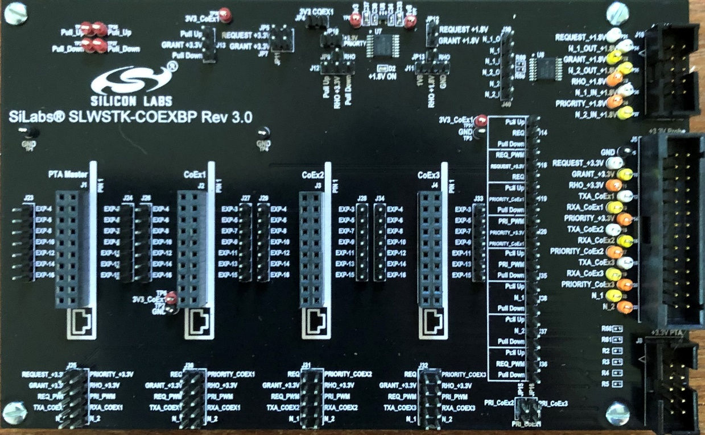

# Coexistence Backplane Evaluation Board (EVB)

For evaluating the Silicon Labs EFR32 software coexistence solution, order EFR32MG Wireless SoC Starter Kit (WSTK) #SLWSTK6000B and Coexistence Backplane EVB (#SLWSTK-COEXBP). Detailed instructions for using the Starter Kit and Backplane EVB are found in [Silicon Labs Coexistence Development Kit (SLWSTK-COEXBP)](https://docs.silabs.com/multiprotocol/latest/coexistence-development-kit/). To see a demonstration of Wi-Fi coexistence and obtain links to additional coexistence documentation, visit the [Silicon Labs Wi-Fi Coexistence Learning Center](https://www.silabs.com/products/wireless/learning-center/wi-fi-coexistence).

