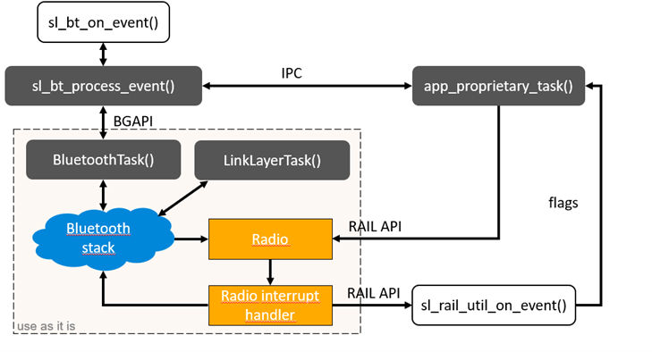

# Software Architecture of a Bluetooth/Proprietary DMP application

DMP applications require an RTOS. The RTOS helps run the Bluetooth and Proprietary protocols in parallel and independently. In this document, the term RTOS refers both to the Micrium RTOS and the FreeRTOS, included with Silicon Labs Bluetooth SDK version 3.1.0. The adaptation layer has been designed to work with Micrium RTOS and FreeRTOS.

Since the Bluetooth stack itself is just a collection of functions, Bluetooth needs separate tasks to run the stack. The `BluetoothTask()` and the `LinkLayerTask()` are responsible for this, and they can be used as they are. The functions of the Bluetooth stack can be accessed through these tasks using BGAPI, as in the case of an RTOS-less or an NCP application. The Bluetooth application (handling Bluetooth events and calling Bluetooth commands) has to be implemented by the developer in `sl_bt_on_event()`, which is (indirectly) called from the `sl_bt_event_handler_task()`. For details, refer to [Integrating v3.x Silicon Labs Bluetooth Applications with Real-Time Operating Systems](https://docs.silabs.com/bluetooth/latest/integrating-v3x-bluetooth-applications-with-rtos/).

The proprietary protocol is implemented in the `app_proprietary_task()`. Unlike Bluetooth, the proprietary protocol can access the radio directly through the RAIL API. RAIL events need a callback function – `sl_rail_util_on_event()` – to be defined. This function is called every time a new RAIL event is generated, and can notify the application about the event.

>**Note**: `sl_rail_util_on_event()` is called from interrupt context, so only time-critical functions should be implemented in it. Everything else should be done in the application.

Although the Bluetooth and Proprietary applications are independent, they can communicate using inter-process communication (IPC).

