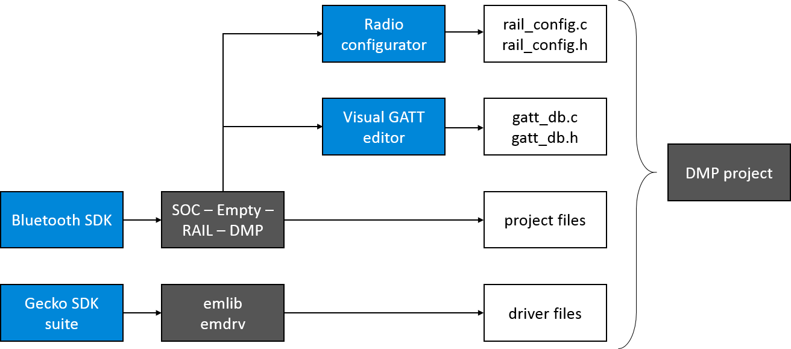
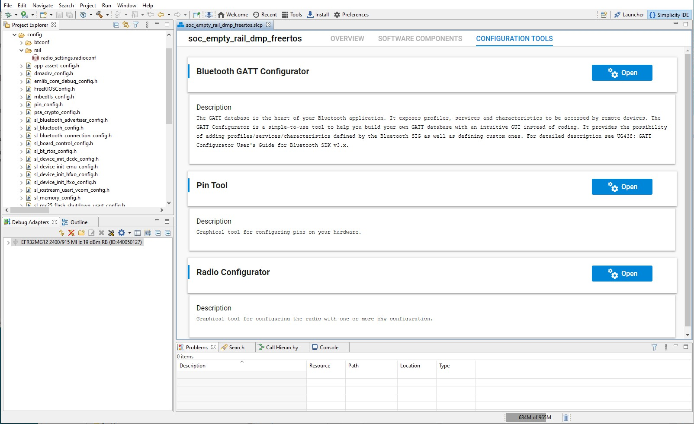
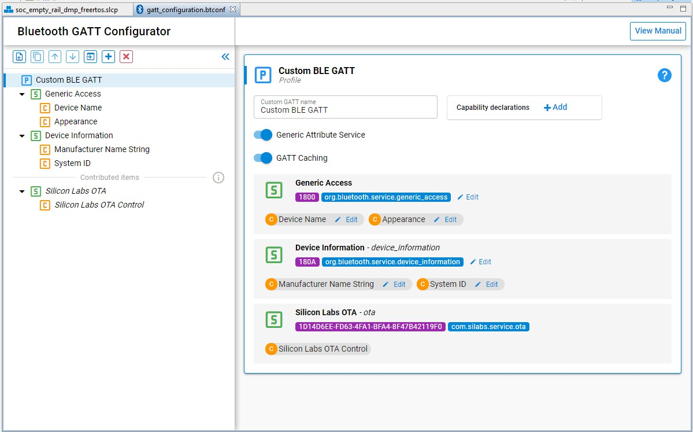
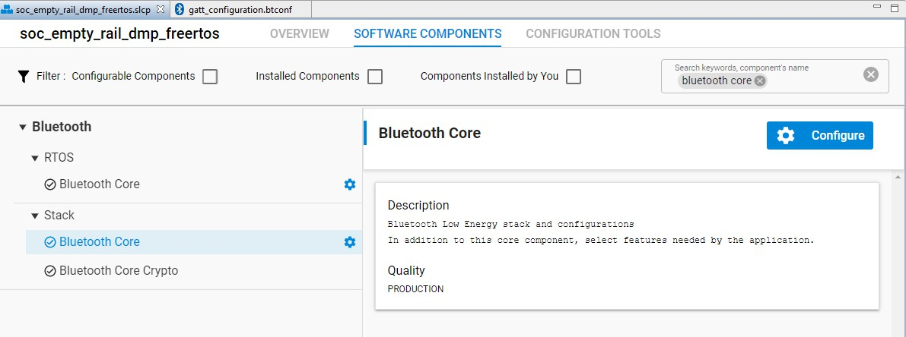
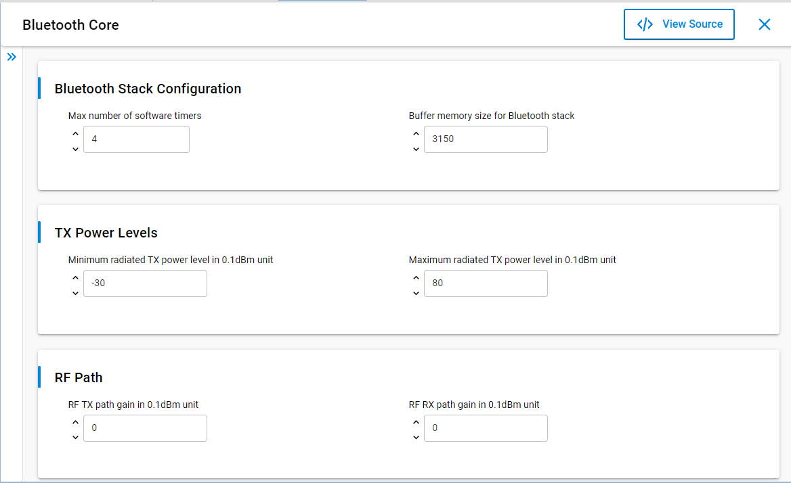
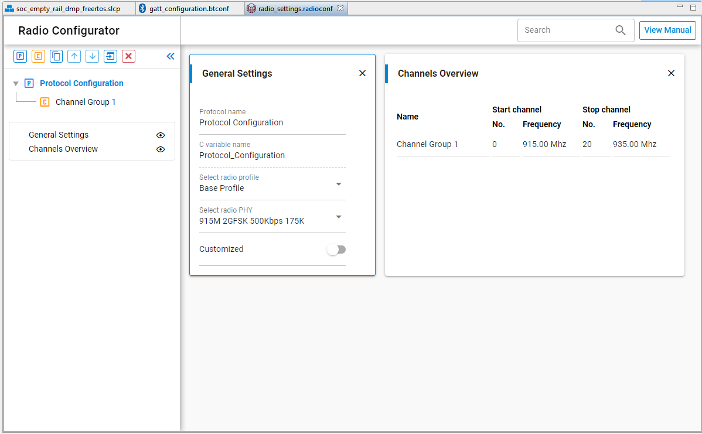
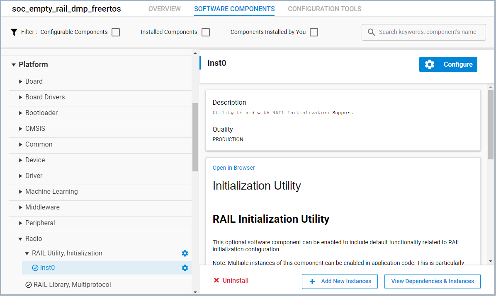
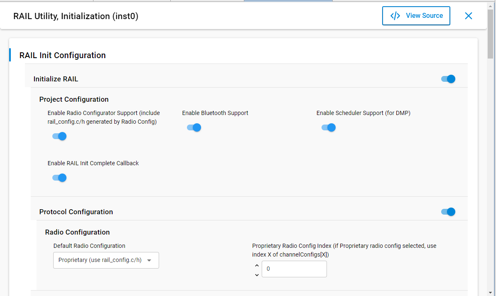
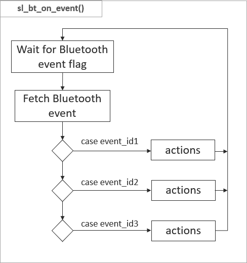
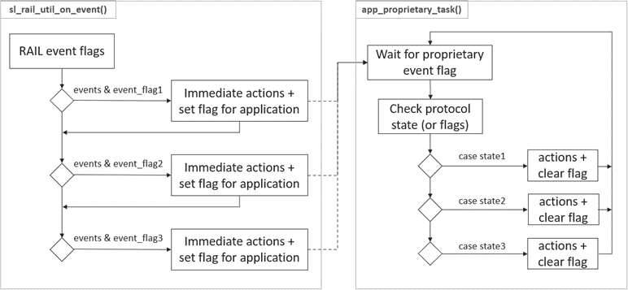

# Developing a Bluetooth/Proprietary DMP Project

Three steps are required when developing a Bluetooth/Proprietary DMP project:

1. [Create the project](#create-a-new-project)

2. [Configure Bluetooth](#configure-bluetooth)

3. [Configure the Proprietary Protocol](#configure-the-proprietary-protocol)

## Create a New Project

Silicon Labs Bluetooth SDK (v3.2 or later) include four software samples, which can be used as a starting point for every Bluetooth/Proprietary application.

- Bluetooth - SoC Empty RAIL DMP FreeRTOS

- Bluetooth - SoC Empty RAIL DMP Micrium OS

- Bluetooth - SoC Empty Standard DMP FreeRTOS

- Bluetooth - SoC Empty Standard DMP Micrium OS

Each sample:

- Includes the multiprotocol RAIL library

- Includes the Bluetooth library

- Includes the selected RTOS

- Has a default Bluetooth GATT database configuration

- Has a default RAIL configuration

- Has a default RTOS configuration

- Implements Bluetooth initialization

- Implements RAIL initialization

- Implements RTOS initialization

The sample types differ in that the 'RAIL' samples contain a radio configurator, so they can be used for any proprietary protocol, whereas the 'standard' samples uses the IEE802.15.4 standard protocol.

The only thing you have to do is to modify the configurations according to your needs and implement the Bluetooth application task and the Proprietary application task. As default, the `app_proprietary_task()` is defined and implemented in the files *app\_proprietary.c* and *app\_proprietary.h*.

For the Bluetooth part, the default implementation contains the Bluetooth event handler, `the sl_bt_on_event()` function, defined in the *app\_bluetooth.c* file.

The GATT database can be configured with the visual GATT Configurator in Simplicity Studio 5, while the RAIL configuration can be generated with the Radio Configurator tool. You may also need to add some **emlib** and **emdrv** files to your project to support peripheral configuration. The general workflow to create a DMP project looks like this:

To create a new project:

1. Open Simplicity Studio 5.

2. Select a connected device in the Debug Adapters view, or select a part in the My Products view.

3. Click **File \> New \> Silicon Labs Project Wizard**.

4. Review your SDK and toolchain. If you have more than one GSDK version installed, verify that Gecko SDK Suite v3.x is shown. If you wish to use IAR instead of GCC, be sure to change it here. Once you have created a project, it is difficult to change toolchains. Click **NEXT**.

5. On the Example Project Selection dialog, filter on Bluetooth and select **Bluetooth - SoC Empty RAIL DMP FreeRTOS**. Click **NEXT**.

6. Name your project. Click [**FINISH**].

## Configure Bluetooth

>**NOTE**: This file has a bad title because it carried over text (since removed) from the preceding topic.

Configuring Bluetooth consists of two steps:

- Configuring the local GATT database.

- Configuring the Bluetooth stack.

To configure the local GATT database, use Simplicity Studio 5's GATT Configurator.

   1. Open the .slcp file in the project (if it is not already open).

   2. Click the CONFIGURATION TOOLS tab.

   3. Click **Open** next to **Bluetooth GATT Configurator**.

      

   4. Add your custom services and characteristics as described in the [Bluetooth Getting Started Guide](https://docs.silabs.com/bluetooth/latest/bluetooth-getting-started-overview/) (or use the default GATT database).

   5. Your changes are automatically saved and project files are generated.

To configure the Bluetooth stack:

1. Go to the SOFTWARE COMPONENTS tab.

2. Find Bluetooth \> Stack \> Bluetooth Core component.

    

3. Change the configuration according to your needs. For details, see [Silicon Labs Bluetooth C Application Developers Guide](https://docs.silabs.com/bluetooth/latest/bluetooth-c-soc-dev-guide-sdk-v9x/) (or use the default configuration).

     

## Configure the Proprietary Protocol

- [Using the Radio Configurator](#using-the-radio-configurator)

- [Using the Standard Protocol APIs](#using-standard-protocol-apis)

### Using the Radio Configurator

Configuring the proprietary protocol consists of two steps:

- Configuring the radio channels (for example, base frequency and modulation)

- Configuring the RAIL

To configure the radio channels, use Simplicity Studio 5's Radio Configurator tool:

1. Open the .slcp file in the project (if it is not already open).

2. Click the CONFIGURATION TOOLS tab.

3. Click **Open** next to **Radio Configurator**.

   

4. Select **Base Profile** from the radio profiles.

5. Select a predefined radio PHY from the list, or select **Customized**, and apply your settings. For details, see [Proprietary Radio Configurator Guide](https://docs.silabs.com/rail/latest/proprietary-radio-configurator-guide/).

   

To configure RAIL:

1. On the Software Components tab, select Platform \> Radio \> RAIL Utility, Initialization \> inst0.

   

2. Click **Configure**. Change configurations as needed.

   

### Using Standard Protocol APIs

In the “Bluetooth - SoC Empty Standard DMP” sample project, the radio is configured with APIs. The sample project contains a default configuration for the IEE802.15.4 standard protocol. This configuration is set in the function “*app\_proprietary\_init()*”. For more information about the possible configurations, refer to the API documentation on [docs.silabs.com](https://docs.silabs.com/).

## Develop Bluetooth Application

Bluetooth applications have to be implemented the same way as in a non-DMP scenario:

- BGAPI commands can be called from anywhere (except from interrupt context).

- BGAPI events have to be fetched from the internal event queue of the Bluetooth stack. This is typically done in an infinite loop.

A single protocol Bluetooth application can run with or without RTOS. The DMP Bluetooth application can, however, only run over RTOS. As described in [Software Architecture of a Bluetooth/Proprietary DMP application](./03-software-architecture-of-a-bluetooth-proprietary-dmp-application), you must implement Bluetooth event handling in the Bluetooth application task. The skeleton of this task is implemented in main.c. To handle new Bluetooth events, simply add new case statements with the appropriate event IDs. The general process can be seen in the following figure:

## Develop Proprietary Application

Proprietary application uses RAIL directly:

- RAIL API commands can be called from anywhere.

- RAIL API events have to be handled in the events callback function.

Almost all RAIL APIs can be used in DMP, but a few are incompatible (like `RAIL_HoldRxPacket()`), and a few work slightly differently. For example, automatic state transitions are defined differently due to the concept of background Rx, which is specific on DMP. See the [Dynamic Multiprotocol User’s Guide](https://docs.silabs.com/connect/latest/multiprotocol-dynamic-ug/) for details.

By default, the events callback function is set to `sl_rail_util_on_event()`, just like in a regular RAIL application. An empty `sl_rail_util_on_event()` function is implemented as a weak function in `sl_rail_util_callbacks.c`. It can be overloaded in the application. This function is called every time a new radio event intended for the proprietary protocol is received from RAIL. Each RAIL event sets a specific flag in the 64-bit bitfield. Be aware that multiple flags may be set, so you may have to handle multiple events within one callback. Note: The events callback function is almost always called from an interrupt context, so you have to handle it as an interrupt handler! Do only quick calculations, and set a flag to inform your main loop about the changes.

In the DMP context, you should also prepare for more error events: `RAIL_EVENT_SCHEDULER_STATUS` should be implemented, as that is the event which is triggered if a proprietary radio is interrupted by Bluetooth.

Upon completing a finite radio task (like transmission), `RAIL_YieldRadio()` or `RAIL_Idle()` should be called to let the radio scheduler know that other protocols might use the radio.

The main loop to process the radio events is implemented in the `app_proprietary_task()`, which runs parallel to the `sl_bt_event_handler_task()` that ultimately calls the `sl_bt_on_event()` event handler. It is the developer’s job to decide how to communicate between the radio event handler (`sl_rail_util_on_event()`) and the `app_proprietary_task()`, but in general, use the services of the RTOS, like semaphores, flags, and message queues.

The general process is shown in the following figure:

## Communication between Bluetooth and Proprietary Protocol

Bluetooth and the proprietary protocol are running parallel in two independent tasks. However, often they need to be synchronized, for example if you want to send out a proprietary packet when a value changed in the local GATT database, or you want to change a value in the local GATT database when you received a proprietary packet.

To notify the proprietary task from the Bluetooth task, or the other way around, the easiest way is to set an RTOS flag. You can define a queue for events and use that to notify the other task. From the proprietary task, you can also set an external event to the Bluetooth stack, using the function `sl_bt_external_signal()`. This will generate an `sl_bt_evt_system_external_signal_id` event in the Bluetooth stack.
