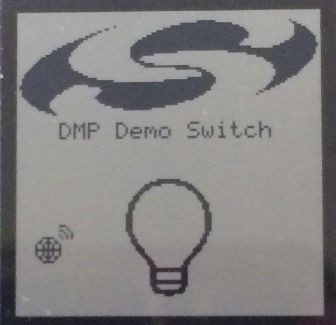
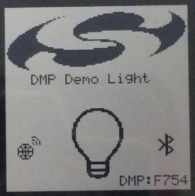

# Examples

## Sending Proprietary Packets

This simple example sends out a proprietary packet every time a specific characteristic in the local GATT database is written.

1. Create a new **Soc Empty Rail Dmp** project as described in [Create a New Project](./04-developing-a-bluetooth-proprietary-dmp-project.md#create-a-new-project).

2. In the GATT configurator, add a new characteristic to the GATT database (as described in the [Bluetooth Getting Started Guide](https://docs.silabs.com/bluetooth/latest/bluetooth-getting-started-overview/)) with the following parameters:

   i. Name: Proprietary characteristic

   ii. ID: prop_char

   iii. Value type: hex

   iv. Length: 16 byte

   v. Properties: Read, Write, Notify

3. Define a CHARACTERISTIC_CHANGED flag. This flag will be used in the communication between `sl-bt-on-event()` and the `app_proprietary_task`, as part of the proprietary_event_flags flag group.

   ```text
    #define CHARACTERISTIC_CHANGED ((OS_FLAGS)0x01)
   ```

4. Create a Tx FIFO. Define the following in *app\_proprietary.c*:

   ```text
   #define RAIL_TX_FIFO_SIZE (64)
   static uint8_t txFifo[RAIL_TX_FIFO_SIZE];
   ```

5. In the Bluetooth application task (more precisely in sl_bt_on_event()):

   i. Add a new event handler to the switch – case statement to handle characteristic value changes.

   ii. Check if it is the prop_char that has changed.

   iii. Set a flag to notify the proprietary protocol.

    ```text
    case sl_bt_evt_gatt_server_attribute_value_id:
    if (evt->data.evt_gatt_server_attribute_value.attribute == gattdb_prop_char)
       {
                  OSFlagPost(&proprietary_event_flags,
                                    CHARACTERISTIC_CHANGED,
                                    OS_OPT_POST_FLAG_SET,
                                    &err);
        }
   break;
   ```

6. In the `app_proprietary_task()` – before the infinite loop:

   i. Set up the Tx FIFO for RAIL.

   ii. Define scheduler info for the packet to be sent.

      ```text
       RAIL_SetTxFifo(railHandle, txFifo, 0, RAIL_TX_FIFO_SIZE);
       RAIL_SchedulerInfo_t txSchedulerInfo = (RAIL_SchedulerInfo_t){ .priority = 100,
                                               .slipTime = 100000,
                                               .transactionTime = 800 };
      ```

7. Within the infinite loop of the `app_proprietary_task()`:

   i. Wait for the CHARACTERISTIC_CHANGED flag.

   ii. Copy the content of the characteristic into the Tx FIFO.

   iii. Send out the packet.

   ```text
      while (DEF_TRUE) {
                 RTOS_ERR err;
                 OSFlagPend(&proprietary_event_flags,
                            CHARACTERISTIC_CHANGED,
                            (OS_TICK)0,
                             OS_OPT_PEND_BLOCKING \
                             + OS_OPT_PEND_FLAG_SET_ANY \
                             + OS_OPT_PEND_FLAG_CONSUME,
                             NULL,
                             &err);

                  sl_status_t result;;
                         result = sl_bt_gatt_server_read_attribute_value(gattdb_prop_char, 0, 16, data_len,
      dataPacket);
                RAIL_WriteTxFifo(railHandle, dataPacket, data_len, true);
                RAIL_StartTx(railHandle, 0, RAIL_TX_OPTIONS_DEFAULT, &txSchedulerInfo);
      }
   ```

8. In `sl_rail_util_on_event()`:

    Check for the packet_sent event, and do not forget to yield the radio.

    ```text
    static void sl_rail_on_event(RAIL_Handle_t railHandle,
                                  RAIL_Events_t events)
    {
            if (events & RAIL_EVENT_TX_PACKET_SENT) {
                RAIL_YieldRadio(railHandle);
            }
    }
    ```

## Receiving Proprietary Packets

This example implements a receiver for the transmitter implemented in the previous section. Once a proprietary packet is received, the example updates a characteristic in the local GATT database.

To implement a receiver, use the transmitter project described in the previous section and extend it with the following procedure.

1. Define a new flag for signaling packet reception to the proprietary application.

   ```text
   #define PACKET_RECEIVED ((OS_FLAGS)0x02)
   ```

2. Create an Rx FIFO. Define the following in *app\_proprietary.c*:

   ```text
   #define RAIL_RX_FIFO_SIZE (64)
   static uint8_t rxFifo[RAIL_RX_FIFO_SIZE];
   ```

3. In the `app_proprietary_task()` – before the infinite loop:

   i. Set Rx transition in order to automatically restore Rx state after packet reception.

   ii. Set the Rx priority lower than the Tx priority.

   iii. Start Rx (before the infinite loop).

   ```text
   RAIL_StateTransitions_t stateTransition = (RAIL_StateTransitions_t){
                                                        .success = RAIL_RF_STATE_RX,
                                                        .error = RAIL_RF_STATE_RX };
   RAIL_SetRxTransitions(railHandle,&stateTransition);
   RAIL_SchedulerInfo_t rxSchedulerInfo = (RAIL_SchedulerInfo_t){ .priority = 200 };
   RAIL_StartRx(railHandle, 0, &rxSchedulerInfo);
   ```

4. In the radio event handler, `such as sl_rail_util_on_event()`:

   i. Check if a packet was successfully received.

   ii. Copy the packet content to your local Rx FIFO.

   iii. Set a flag to notify the proprietary protocol about the new packet.

    ```text
    if (events & RAIL_EVENT_RX_PACKET_RECEIVED) {
        RAIL_RxPacketInfo_t packetInfo;
        RTOS_ERR err;

        RAIL_GetRxPacketInfo(railHandle,
                RAIL_RX_PACKET_HANDLE_NEWEST,
                &packetInfo);
        if (packetInfo.packetStatus == RAIL_RX_PACKET_READY_SUCCESS) {
           RAIL_CopyRxPacket(rxFifo,&packetInfo);
           OSFlagPost(&proprietary_event_flags,PACKET_RECEIVED,OS_OPT_POST_FLAG_SET,&err);
        }
    }
    ```

5. Within the infinite loop of the `app_proprietary_task()`:

   i. Check for two event flags: CHARACTERISTIC_CHANGED and PACKET_RECEIVED. You can wait for both of them and then check which one was set.

   ii. If the PACKET_RECEIVED flag is set then write the content of the received packet into the local GATT database and

   iii. Notify the Bluetooth stack that the value has changed (using a Bluetooth external signal).

   ```text
   while (DEF_TRUE) {
         RTOS_ERR err;
         OS_FLAGS active_flags = OSFlagPend (&proprietary_event_flags,
                                              CHARACTERISTIC_CHANGED \
                                              + PACKET_RECEIVED,
                                              (OS_TICK)0,
                                              OS_OPT_PEND_BLOCKING \
                                              + OS_OPT_PEND_FLAG_SET_ANY \
                                              + OS_OPT_PEND_FLAG_CONSUME,
                                              NULL,
                                              &err);
         if (active_flags & CHARACTERISTIC_CHANGED)
         {
             sl_status_t result;
                    result = sl_bt_gatt_server_read_attribute_value(gattdb_prop_char, 0, 16, data_len, dataPacket);
             RAIL_WriteTxFifo(railHandle, dataPacket 16, true);
             RAIL_StartTx(railHandle, 0, RAIL_TX_OPTIONS_DEFAULT, &txSchedulerInfo);
         }

         if (active_flags & PACKET_RECEIVED)
         {
              sl_bt_gatt_server_write_attribute_value(gattdb_prop_char,0,16,rxFifo);
              sl_bt_external_signal(CHARACTERISTIC_CHANGED);
         }
   }
   ```

6. In `sl_bt_on_event()`:

   i. Add a new event handler for the external signal.

   ii. Check if you got a CHARACTERISTIC_CHANGED signal.

   iii. Send out a notification.

   ```text
   case sl_bt_evt_system_external_signal_id:
      if (bluetooth_evt->data.evt_system_external_signal.extsignals &
                                                              CHARACTERISTIC_CHANGED)
      {
          sl_bt_cmd_gatt_server_send_characteristic_notification(0xff, gattdb_prop_char,
                                                                 16, rxFifo, &sent_len);
      }
   break;
   ```

## Light/Switch Example

This section provides details on working with the Light/Switch multiprotocol example code.

### Working with the Light/Switch Example

The **Flex (RAIL) - Switch** and **Bluetooth - SoC Ligh /RAIL DMP** applications are generated, built, and uploaded in the same way as other applications in their SDKs.

- To see details about installing Simplicity Studio and the Flex SDK and building an example application, see [Proprietary Flex SDK v3.x Quick-Start Guide](https://docs.silabs.com/connect-stack/latest/proprietary-flex-sdk-v3x-quick-start-guide/).

- To see details about installing Simplicity Studio and the Bluetooth SDK and building an example application, see the [Bluetooth Getting Started Guide](https://docs.silabs.com/bluetooth/latest/bluetooth-getting-started-overview/).

>**Note**: In a demonstration configuration with multiple RAIL/Bluetooth dynamical protocol light devices and a single switch device, unpredictable behavior may occur. We recommend testing with a single light device and a single switch device.

The following is a summary procedure.

### Building the RAIL:Switch Application

1. Open Simplicity Studio 5.

2. Select a connected device in the Debug Adapters view.

3. Select File \> New \> Silicon Labs Project Wizard ...

4. Review the SDK and toolchain, and change as necessary. Click **NEXT**.

5. On the Example Project Selection dialog, filter on Proprietary and select **Flex (RAIL) - Switch**. Click **NEXT**.

6. Name your project. Click [**FINISH**].

7. Either automatically compile and flash using the debug button, or manually compile and then load.

Application load success indicators are code-dependent. With the **Flex (RAIL) - Switch** example, the LCD displays a short menu before changing over to the light bulb display.



### Building the Bluetooth Light Application

The Bluetooth Light application requires the Gecko Bootloader to be loaded on the device. The Gecko Bootloader is loaded when you load the precompiled **SOC-Light-Rail-Dmp** demonstration. Alternatively, you can build and load your own Gecko Bootloader combined image (called \<projectname\>-combined.s37), as described in *UG266: Silicon Labs Gecko Bootloader User's Guide for GSDK 3.2 and Lower*, [Silicon Labs Gecko Bootloader User's Guide for GSDK 4.0 and Higher (series 1 and 2 devices)](https://docs.silabs.com/mcu-bootloader/latest/bootloader-user-guide-gsdk-4/), or [Silicon Labs Gecko Bootloader User’s Guide for Series 3 and Higher](https://docs.silabs.com/mcu-bootloader/latest/bootloader-user-guide-series3-and-higher/).

1. Open Simplicity Studio 5.

2. Select the connected device in the Debug Adapters view.

3. Select File > New > Silicon Labs Project Wizard ...

4. Review the SDK and toolchain, and change as necessary. Click **NEXT**.

5. On the Example Project Selection dialog, filter on Bluetooth and select **Soc Light Rail Dmp**. Click **NEXT**.

6. Name your project. Click [**FINISH**].

7. Either automatically compile and flash using the debug button, or manually compile and then load.

Application load success indicators are code-dependent. With the **Bluetooth - SoC Light RAIL DMP** example, the LCD displays a light bulb.



### Changing the PHY Configuration

The default PHY configuration for the RAIL/Bluetooth example is a sub-gigahertz configuration. You may want to modify this PHY configuration as you begin to develop applications for your own hardware.

To change the PHY configuration:

1. Open the **Flex (RAIL) - Switch** project.

2. Open the .slcp file in the project, and click the **Configuration Tools** tab.

3. Click **Open** next to Radio Configurator.

4. Select a new PHY.

5. The new config will be generated into the folder *autogen*, with the names of rail_config.c and rail_config.h.

6. Open the **Bluetooth - SoC Light RAIL DMP** project.

7. Import the modified radio configuration file (radio_settings.radioconf) from the Switch project.

8. Rebuild and flash both projects as you would normally.
