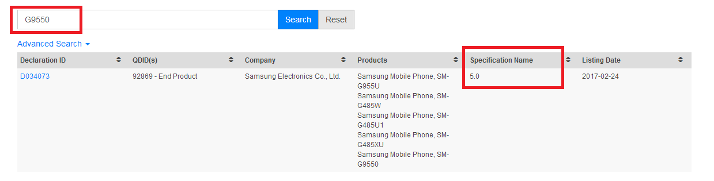
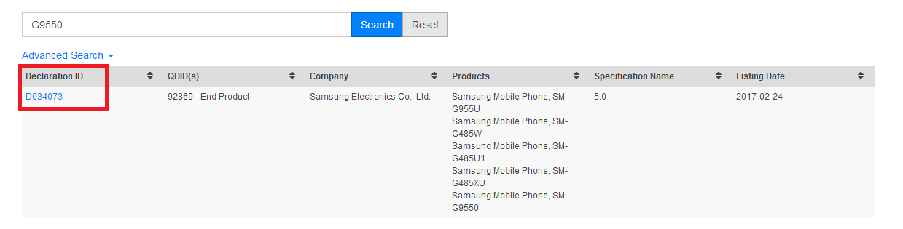
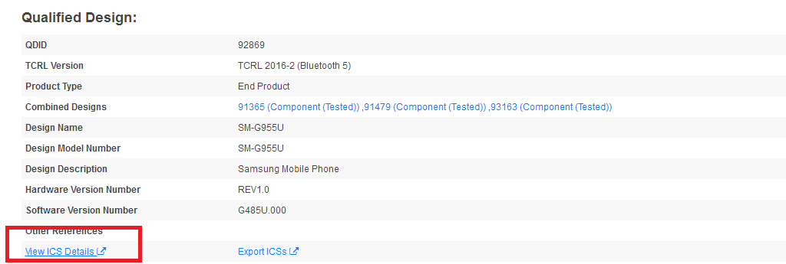
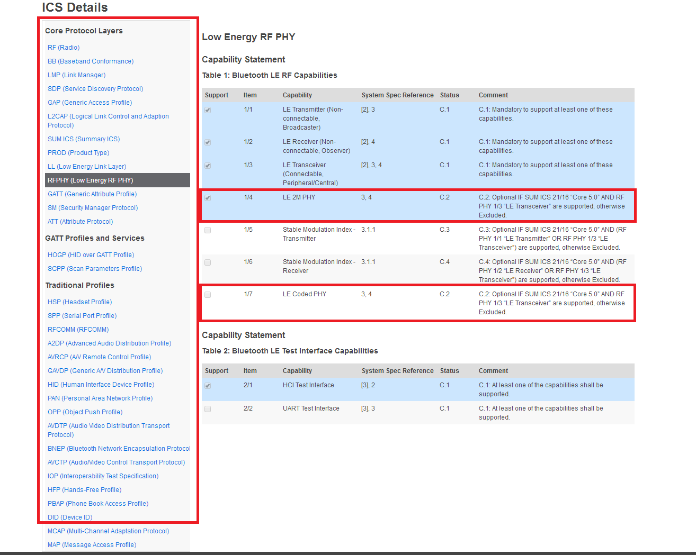

# Finding the Bluetooth Features of Smartphones

## Introduction

Many new features which were introduced in the Bluetooth 5.0 specification (such 2M PHY, LE coded PHY, and advertisement extensions) have not been adopted by all smartphone models. Some require new hardware (such as the new PHYs) but others are mostly software-based features. Often, it's difficult to know what is supported by a given smartphone model. However, the Bluetooth SIG qualification listings provide detailed insight into all Bluetooth features supported under each declaration.

## Searching the SIG Qualification Listings

Example below shows how to get the listing information of Samsung Galaxy S8+, the model name is SM-G9550. You can search for any other listed devices following the steps below.

- Open the Bluetooth SIG [launchstudio](https://launchstudio.bluetooth.com/listings/search).

- Type the model name into the search box and click the search button. If the device is listed in Bluetooth SIG, the declaration ID should appear, including high-level information, such as specification name, products under that declaration ID, listing date, and so on.

    

- Click the Declaration ID and the declaration details will show on the page.

    

- Click “View ISC details”.

    

- The full listing is available. The left area shows all categories, while the right area shows all items included in the selected category. The image below shows a search for “LE 2M PHY” and “LE Coded PHY” where you can see that the LE 2M PHY is supported but the LE Coded PHY is not.

    

## Conclusion

The Bluetooth SIG launch studio allows searching for the declarations of Bluetooth end products and/or components (such as the Silicon Labs link layer or host stack), which provides insight into the features supported. This is extremely useful in finding specific Bluetooth features supported by smartphones.
