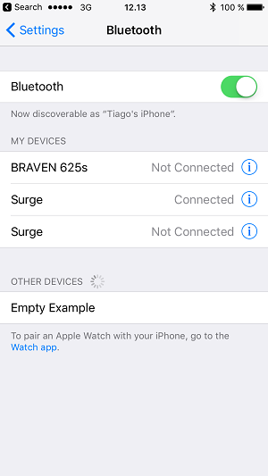

# Seeing BLE Devices on the iOS Bluetooth Settings Page

According to [Apple support](https://forums.developer.apple.com/thread/71627), it is not possible to see BLE devices listed on the Bluetooth Settings page. Only Bluetooth 2.1/3.0 devices are listed, such as keyboards and headsets ([source](http://stackoverflow.com/questions/27211573/bluetooth-low-energy-advertising-to-be-discoverable-in-ios-settings)). For BLE devices, use the device's own app or any other third party app which uses CoreBluetooth.

However, it seems that iOS does list BLE devices when they advertise some of the adopted services such as the [Heart Rate](https://www.bluetooth.com/specifications/gatt/viewer?attributeXmlFile=org.bluetooth.service.heart_rate.xml) service. By advertising this service, your device can be visible in the Bluetooth Settings page. Test this by following these steps:

- Create an soc-empty project
- Add the Heart Rate service in the Visual GATT Editor
- Tick "Advertise" and click "Generate"
- Build and flash the project

(**Disclaimer:** There was no information source to verify that iOS does indeed list BLE devices when certain adopted services are advertised)

