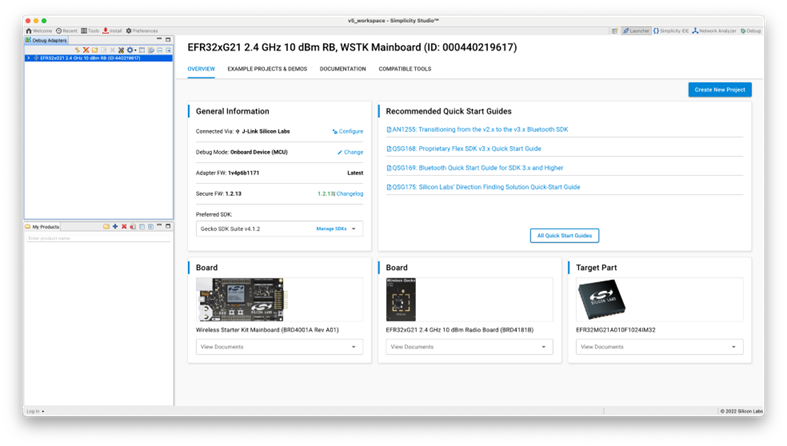
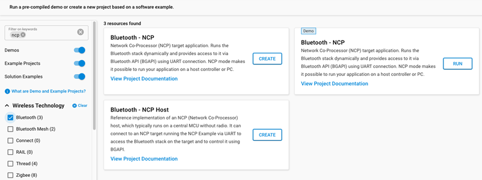
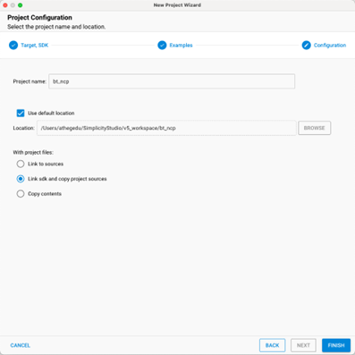

# NCP Target Development

This page describes the available tools for compiling and flashing the NCP target firmware.

Before proceeding with compiling and flashing C-based firmware, install Simplicity Studio 5 (SSv5). You can download it from the Silicon Labs website: [http://www.silabs.com/simplicity](http://www.silabs.com/simplicity). Once Simplicity Studio is installed, follow the prompts to install the Gecko SDK Suite (GSDK) containing the Bluetooth SDK. See the online [Simplicity Studio 5 User's Guide](https://docs.silabs.com/simplicity-studio-5-users-guide/latest/ss-5-users-guide-overview/) for details on installation and using Simplicity Studio. See the [Bluetooth Getting Started Guide](https://docs.silabs.com/bluetooth/latest/bluetooth-getting-started-overview/) for additional details about the Bluetooth SDK.

>**Note**: [Using the Silicon Labs Bluetooth Stack v3.x and Higher in Network Co-Processor Mode](https://docs.silabs.com/bluetooth/latest/bluetooth-network-coprocessor-mode/) describes in detail how the NCP is implemented in the Gecko SDK v2. This application note explains the code and tools on both the target and host side.

To develop in C, you not only need Simplicity Studio 5 but also a supported compiler. The Bluetooth SDK release notes and [Silicon Labs Bluetooth C Application Developers Guide](https://docs.silabs.com/bluetooth/latest/bluetooth-c-soc-dev-guide-sdk-v9x/) list the supported compilers.

The NCP target firmware comes with the Bluetooth SDK. It is available in a precompiled binary format and as a project file you can build. The following procedures describe how to install the precompiled binary image and how to build and install the example project. Note that Simplicity Studio only shows the relevant examples for the preferred SDK, so you have to select **Gecko SDK Suite vn.n.n** first, as shown in the following figure. (Note: Your SDK version may be different from the one shown in the figure.)

The following procedure describes how to build and load the example code. This procedure assumes you have already loaded a Gecko Bootloader in one of the following ways:

- Loaded the Gecko Bootloader precompiled binary from the list of Demos. For an NCP application, load the NCP BGAPI UART DFU bootloader.

- Built and loaded your own Gecko Bootloader as described in *UG266: Silicon Labs Gecko Bootloader User’s Guide in GSDK 3.2 and Lower*, [Silicon Labs Gecko Bootloader User's Guide for GSDK 4.0 and Higher (series 1 and 2 devices)](https://docs.silabs.com/mcu-bootloader/latest/bootloader-user-guide-gsdk-4/), or [Silicon Labs Gecko Bootloader User’s Guide for Series 3 and Higher](https://docs.silabs.com/mcu-bootloader/latest/bootloader-user-guide-series3-and-higher/).

1. Click **Example Projects & Demos**, select **Bluetooth - NCP** and click **Create**.

   >**Note**: The **Bluetooth - NCP** example does not contain a GATT database. The dynamic GATT API can be used for building it. Host software examples in the Bluetooth SDK build their GATT database dynamically, by default.

   

2. Name the project and click **Finish**.

   

3. Now the project is ready to build and flash. Click **Debug** (bug icon) in the top left menu to do it in one step. You may also use the precompiled NCP demos in Simplicity Studio, which are shipped with bootloader included.

   >**Note**: If you get an error when you click **Debug**, click the project *.isc* file in the Project Explorer view. It may not be fully selected.
