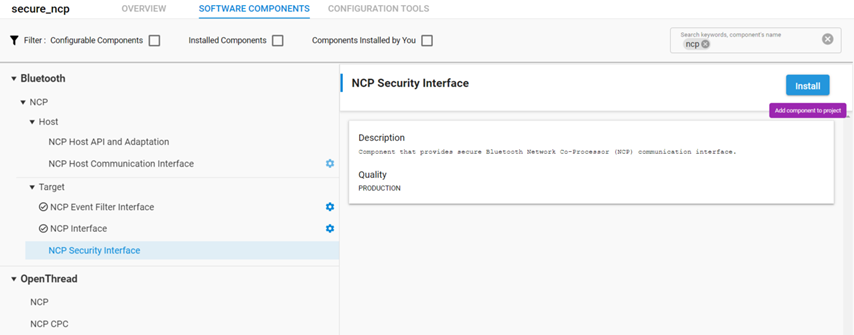

# Secure NCP

Secure NCP secures communication between the NCP Host and target by encrypting the commands, events, and any data transmitted between the target and the host.

## Target Side

To enable this feature on the target side, install the NCP Security Interface component.



By default, the NCP target boots without using this encryption. It will be requested by the Host part, and after the security is increased, only encrypted messages are sent and accepted by the target.

## Host Side

To build the NCP Host project with secure mode, use the following command:

```C
make SECURITY=1
```

This requires the openssl package to be installed. Install it to your MSYS2 environment with:

```C
pacman -S mingw-w64-x86_64-openssl
```

After the project is built, the encryption can be enabled by calling the .exe file with the command line parameter `-s`:

```C
.\empty.exe -s
```

```C
$ ./empty.exe -u COM21 -s
[I] NCP host initialised.
[I] Resetting NCP target...
[I] Press Ctrl+C to quit
[I] Start encryption
[I] Communication encrypted
[I] Bluetooth stack booted: v3.2.1-b216
[I] Bluetooth public device address: 00:0B:57:A7:84:15
[I] Started advertising.
```

Running the exe file without this option will start a normal NCP Host application without encryption.
