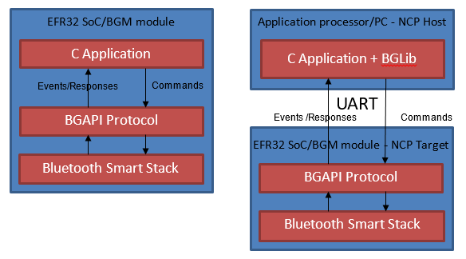

# Introduction

> **Note: This section replaces *AN1259: Using the Silicon Labs *Bluetooth*® Stack v3.x and Higher in Network Co-Processor Mode* for Simplicity SDK 2024.12.2 and up. Further updates to this application note will be provided here**.

These pages are an essential reference for anyone developing a system for the Silicon Labs Wireless Gecko products using the Silicon Labs v3.x Bluetooth Stack in Network Co-Processor (NCP) mode. They cover the C language application development flow,  walks through the examples included in the stack, and shows how to customize them.

The Silicon Labs Bluetooth SDK allows you to develop System-On-Chip (SoC) firmware in C on a single microcontroller. The SDK also supports the Network Co-Processor (NCP) system model.

These pages provide a guide on how to get started with software development of an NCP system. They describe the development tools and example projects, then highlight the most important steps you need to follow when writing your own application.

## SoC vs NCP System Models

On an SoC system, the Application code, the Bluetooth Host, and Controller code run on the same Wireless MCU.

On an NCP system, the Application runs on a Host MCU, and the Host and Controller code run on a Target MCU. The Host and Target MCUs communicate on a serial interface. The communication between the Host and Target is defined in the Silicon Labs Proprietary Protocol called BGAPI. The physical interface is UART. BGLib v3.x is an ANSI C reference implementation of the BGAPI protocol, which can be used in the NCP Host Application.

