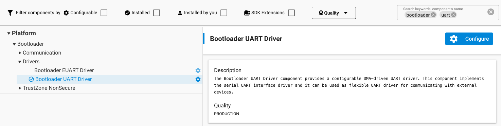
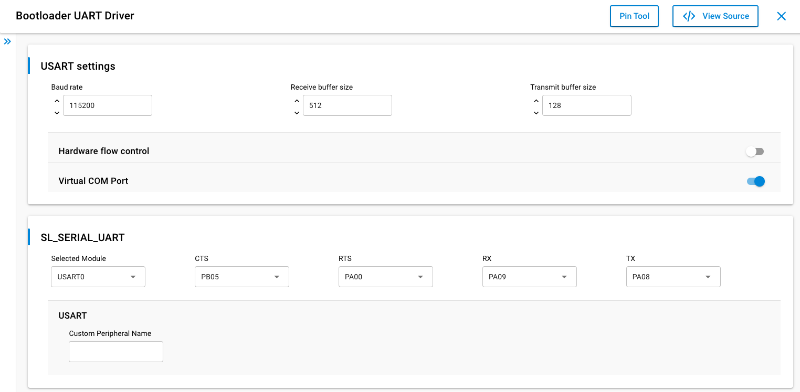
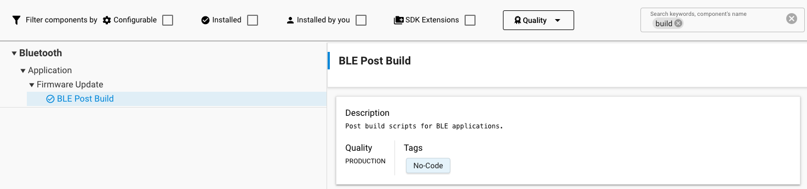

# BGAPI UART Device Firmware Upgrade (DFU)

This is the firmware upgrade used in Network Co-Processor (NCP) Bluetooth applications. For more information on NCP applications, see [Using the Silicon Labs Bluetooth Stack v3.x and Higher in Network Co-Processor Mode](https://docs.silabs.com/bluetooth/latest/bluetooth-network-coprocessor-mode/).

In the BGAPI UART DFU implementation a GBL image containing the new firmware is written to target device using UART as the physical interface.

## UART DFU Options

The target device must be programmed with the Gecko Bootloader sample project **Bootloader - NCP** **BGAPI UART DFU**. Gecko Bootloader is configured automatically for the selected radio board. The BGAPI UART DFU bootloader is a standalone bootloader, so no storage area needs to be configured. During UART DFU upgrade the bootloader writes the new firmware image directly on top of the old firmware image and therefore no temporary download area is needed.

### GPIO Settings

The default settings are suitable for testing with a WSTK (Wireless Starter Kit). These settings can be easily changed by through the Software Components tab. Select the Bootloader UART Driver component. Here, Hardware Flow Control can be enabled or disabled, and the baud rate and pinout can be configured.

Flow control settings of the radio board and the WSTK must match. The WSTKs flow control can be configured through the admin console. More information on the admin console can be found in the user guide for the respective development kit. To configure the flow control through the admin console:

- In Simplicity Studios Debug Adapters view, right click on the connected device.

- Select Launch Console.

- In the Admin tab, type *serial vcom config handshake disable/enable*, depending on if you want to disable or enable flow control.





## UART DFU Process

The basic steps involved in the UART DFU, using NCP, are as follows:

1. Boot the target device into DFU mode by calling the bootloader API `bootloader_rebootAndInstall()`. In NCP-mode, this can be achieved by calling `sl_bt_user_reset_to_dfu()`. When using Series 1 devices, reset into DFU is achieved with `sl_bt_system_reset(1)`. Alternatively, if you have GPIO activation enabled in the bootloader, press the bootloader activation pin while the device is reset.

2. Wait for the `sl_bt_evt_dfu_boot` event.

3. Send the command `sl_bt_dfu_flash_set_address(address)` to start the firmware upgrade.

4. Send the entire contents of the GBL upgrade image with `sl_bt_dfu_flash_upload(data)`.

5. After sending all data, the host sends the command `sl_bt_dfu_flash_upload_finish()`.

6. To finalize the upgrade, the host resets the target device into normal mode with `sl_bt_system_reboot()`. If using Gecko SDK 4.4.x and older, the device is reset with `sl_bt_system_reset(0)`.

A detailed description of the DFU-related BGAPI commands is found in the Bluetooth Software API Reference Manual.

At the beginning of the upgrade, the NCP host uses the command `sl_bt_dfu_flash_set_address` to define the start address. The start address shall always be set as zero. During the data upload (step 4 above) the target device calculates the flash offset automatically. The host does not need to explicitly set any write offset.

The UART DFU procedure may fail if the update image is either corrupted or data upload is interrupted for some reason. Failure due to either of these conditions is detected by the CRC check performed by the UART DFU bootloader before jumping into the main program. In this case, a `dfu_boot_failure` event is sent by the stack. The returned reason codes align with the `sl_status` codes, as shown in the platform documentation.

## Creating Upgrade Images for the Bluetooth NCP Application

Building a C-based NCP project in Simplicity Studio does not generate the UART DFU upgrade images (GBL files) automatically. The GBL files need to be created separately by using the [Post-Build Editor](./06-post-build-editor.md) or by running a script located in the application projects root folder. Before running the script, the application must be compiled.

Three scripts are provided in the SDK examples:

- create_bl_files.bat (for Windows)

- create_bl_files.sh (for Linux / Mac)

- create_bl_files.py (multiplatform)

The GBL files can be generated by invoking the script from the project directory. As of now, all three are available in the latest releases. In the future releases, the Python version will enjoy exclusive support and the others are going to be deprecated. If they are not present in the project, the **BLE Post Build** component must be installed to make them available. On Unix platforms, the scripts might have to be re-saved with "LF" end of line sequences instead of "CRLF" to avoid interpretation issues.



You need to define two environment variables, `PATH_SCMD` and `PATH_GCCARM` before running the script, as shown in the following table.

<table>
    <colgroup>
        <col width="20%"/>
        <col width="80%"/>
    </colgroup>
    <thead>
        <tr>
            <th>Variable Name</th>
            <th>Example Variable Values</th>
        </tr>
    </thead>
    <tbody>
        <tr>
            <td valign="top">PATH_SCMD</td>
            <td>
                <p>C:\SiliconLabs\SimplicityStudio\v5\developer\adapter_packs\commander</p>
                <p>/Applications/Simplicity Studio 5.app/Contents/Eclipse/developer/adapter_packs/commander</p>
                <p>~/SimplicityStudio_v5/developer/adapter_packs/commander</p>
            </td>
        </tr>
        <tr>
            <td valign="top">PATH_GCCARM</td>
            <td>
                <p>C:\SiliconLabs\SimplicityStudio\v5\developer\toolchains\gnu_arm\12.2.rel1_2023.7</p>
                <p>/Applications/Simplicity Studio 5.app/Contents/Eclipse/developer/toolchains/gnu_arm/12.2.rel1_2023.7</p>
                <p>~/SimplicityStudio_v5/developer/toolchains/gnu_arm/12.2.rel1_2023.7</p>
            </td>
        </tr>
    </tbody>
</table>

Running the **create\_bl\_files** script creates multiple GBL files in a subfolder named **output\_gbl**. The file named **full.gbl** is the upgrade image used for UART DFU. The other files are related to OTA upgrades, and they can be ignored.

If signing and/or encryption keys (named **app-sign-key.pem**, **app-encrypt-key.txt**) are present in the same directory, then the script also creates secure variants of the GBL files. More information on creating secure firmware for DFU can be found in our training document: [Secure Firmware Upgrade using OTA](https://www.silabs.com/documents/public/training/wireless/bg22-thunderboard-workshop-secure-ota-ssv5.pdf).

## UART DFU Host Example

The UART DFU host example is a C program that is located under the Bluetooth SDK examples in the following directory (the exact path depends on the installed SDK version):

```sh
~\SimplicityStudio\SDKs\<simplicity_sdk|gecko_sdk>\app\bluetooth\example_host\bt_host_uart_dfu
```

In Windows this program can be built using MinGW. (It is recommended that you use the MSYS2 development toolchain, available at [https://www.msys2.org/](https://www.msys2.org/). Follow the instructions found in that location on installing GCC.) In Linux or Mac, the program can be built using the GCC toolchain.

The project is built by running `make` (or `mingw32-make`) in the project root directory. After a successful build, an executable is created in the subfolder named **exe**. The executable filename is **bt\_host\_uart\_dfu(.exe)**.

Before running the example, you need to check the COM port number or TCP/IP address associated with your NCP target. For more details, see [Using the Silicon Labs Bluetooth Stack v3.x and Higher in Network Co-Processor Mode](https://docs.silabs.com/bluetooth/latest/bluetooth-network-coprocessor-mode/).

The bt_host_uart_dfu program requires three command line arguments:

- Serial port (-u) or TCP/IP address (-t) – TCP port is not needed

- Baud rate (-b) – in case of Serial port

- Name of the (full) GBL file

Furthermore, the device must be flashed with the **BGAPI UART DFU Bootloader** and an NCP-application.

Example usage and expected output in v4.0 or higher:

```sh
./bt_host_uart_dfu -u /dev/tty.usbmodem0004402253201 -b 115200 ./full.gbl
[I] NCP host initialised.
[I] Reset NCP target in bootloader mode...
[I] DFU booted: v0x03000000
[I] Pressing Crtl+C aborts the update process.
[I] WARNING! If the update process is aborted, the device will stay in bootloader mode.

259648/259648 (100%)
[I] DFU finished successfully. Resetting the device.
```

The number of bytes uploaded in one DFU flash upload command is configurable. The UART DFU host example included in the SDK uses a 48-byte payload. The maximum usable payload length is 128 bytes. The maximum number of bytes sent in one command is specified using a C preprocessor directive named MAX_DFU_PACKET. The value of MAX_DFU_PACKET must be divisible by four.
