# Bluetooth OTA Upgrade

This is the firmware upgrade method used in SoC-mode Bluetooth applications. A GBL file containing new firmware is sent to a target device through a Bluetooth connection. The firmware upgrade image can be stored to an empty flash area and applied later by the user application, or immediately overwrite the original application using a component called AppLoader. The table below shows the differences between AppLoader-based and Application-based OTA.

| Feature | AppLoader-based OTA | Application-based OTA |
|---------|---------------------|-----------------------|
| **Implementation** | Integrated into the bootloader | Implemented in the user application |
| **Supported Devices** | Series 1 & 2 | Series 2 & 3 |
| **Storage slot required** | No, the old firmware is directly overwritten. | Yes, the new firmware must be stored in flash before overwriting. |
| **Supported PHY** | 1M | 1M, 2M, Coded |
| **Connection Encryption** | Not supported | Supported |

**Currently, it is recommended to use the Application-based OTA as it enables improved security and customizability.** (While GBL signing and encryption is supported for both, the AppLoader approach makes for a less secure connection.) Furthermore, AppLoader is not supported in Series 3 devices. The two available options are described in more detail in the sections, *Application-based OTA* below and [AppLoader (Not recommended for new development)](#apploader-not-recommended-for-new-development). An example of creating the GBL files and using the Application-based OTA is shown in the [OTA DFU Example](#ota-dfu-example) section.

## Application-based OTA

Application-based OTA is completely implemented in the user-application. This makes it possible to use a custom GATT service instead of the Silicon Labs OTA service used in the AppLoader. Furthermore, in case of UART DFU updates, the application can be designed to support other protocols and interfaces than BGAPI and UART. The user application can also be designed to support both OTA and UART DFU updates if needed.

To use this update mechanism, any application bootloader using internal or external storage may be used. At least one storage area must be defined, and the area must be large enough to fit the full GBL file, while not overlapping with the user application. These parameters can be controlled by configuring the **Bootloader Storage Slot Setup (bootloader\_storage\_slots)** component included in the bootloader project.

The basic steps for the update process are described below:

1. Application initializes the Gecko bootloader by calling `bootloader_init()`.

2. The download area for the new firmware is erased by calling `bootloader_eraseStorageSlot(0)`.

3. The update image (full GBL file) is received either over-the-air or through some physical interface like UART.

4. The application writes the received bytes to the download area by calling `bootloader_writeStorage()`.

5. (optional) Application can verify the integrity of the received GBL file by calling `bootloader_verifyImage()`.

6. Before rebooting, call `bootloader_setImageToBootload(0)` to specify the slot ID where new image is stored.

7. Reboot and instruct Gecko bootloader to perform the update by calling `bootloader_rebootAndInstall()`.

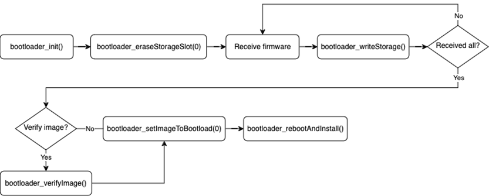

It is assumed here that only one download area is configured and therefore the slot index in the above function calls is set to 0. The general firmware upgrade sequence is explained in [Silicon Labs Gecko Bootloader User’s Guide for GSDK 4.0 and Higher](https://docs.silabs.com/mcu-bootloader/latest/bootloader-user-guide-gsdk-4/).

Note that the erase procedure in step 2 above takes several seconds to complete. If the new image is downloaded over a Bluetooth connection, the supervision timeout must be set long enough to avoid connection drops. Alternatively, the download area can be erased in advance, before the Bluetooth connection is opened. A third alternative is to erase the download area one flash page at a time during the writing progresses. This can be done using `bootloader_eraseRawStorage()`.

### Enabling the Gecko Bootloader API

To call the required Gecko Bootloader functions from the user application, the following interface sources must be included in the project:

**btl\_interface.c** (common interface)

**btl\_interface\_storage.c** (interface to storage functionality)

These source files and their corresponding header files are copied to SDK sample projects by default and can be found in the SDK under:

```sh
<simplicity_sdk|gecko_sdk>\platform\bootloader\api\
```

When using the functions in the application, the correct header files can be included with:

```sh
#include "btl_interface.h"
#include "btl_interface_storage.h"
```

> **Note**: If UARTDRV (and DMADRV) is used inside the application (i.e. for logging via UART), that might cause LDMA channel conflict with the Bootloader storage access, thus preventing a successful OTA. To avoid this, both the bootloader and the application need to be configured appropriately by reducing the “Number of available channels” in the DMADRV Configuration UI of the application, allowing the Bootloader to utilize a DMA channel above it.

## AppLoader (Not recommended for new development)

The AppLoader, introduced in Series 1, can be viewed as a small extension that manages everything related to OTA DFU. It contains a minimal version of the Bluetooth stack including only features that are necessary to perform OTA updates. Any Bluetooth features that are not necessary to support OTA updates are disabled in AppLoader to minimize the flash footprint.

The AppLoader features and limitations are summarized below:

- Enables OTA updating of user application.

- Only one Bluetooth connection is supported, GATT server role only.

- Bluetooth parameters used during firmware upgrade, such as advertisement and connection interval, can’t be changed.

- Encryption and other security features such as bonding are not supported.

The AppLoader is placed before the user application in flash. The default linker script provided in the SDK places the user application so that it starts at the flash sector following the AppLoader. The user application contains a full-featured version of the Bluetooth stack, and it can run independently of the AppLoader. If in-place OTA update is not needed, the AppLoader can be removed completely to free up flash for other use (code space or data storage).

### Series 1 vs Series 2

From GSDK v4.1.0 and higher, there is a clear distinction between the integration of Apploader for Series 1 and Series 2 devices. For Series 1 devices, the Apploader is a separate application from both the main and the bootloader.

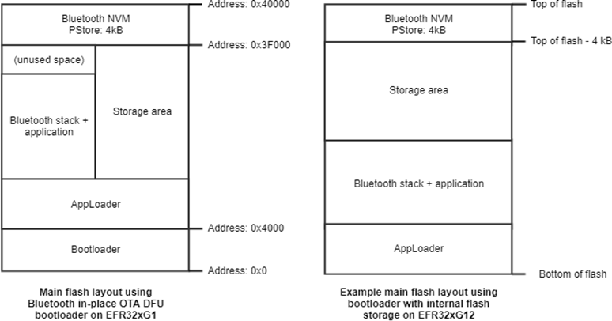

For Series 2 devices, the AppLoader is added as a part of the bootloader. This results in the following for Series 2 devices:

- The AppLoader cannot be upgraded or flashed by itself.

- The AppLoader is upgraded by upgrading the bootloader.

- The OTA advertising data cannot be changed.

- The size of the combined bootloader and AppLoader is much larger than that of a regular bootloader, and it does not fit into the regular bootloader area.

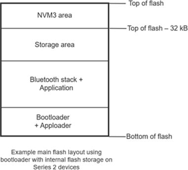

### AppLoader OTA Process

Most of the OTA functionality is handled autonomously by the AppLoader. The minimum requirement for the user application is to trigger a reboot into DFU mode. After the upload is complete, AppLoader will reboot the device back into normal mode.

Reboot into DFU mode can be triggered in a variety of ways. It is up to the application developer to decide which is most applicable. Most of the example applications provided in the Bluetooth SDK already have OTA support built into the code. In these examples, the DFU mode is triggered through the Silicon Labs OTA service that is included as part of the application’s GATT database. An example of a user defined trigger can be found in [Triggering Reboot into DFU Mode from the User Application](#triggering-reboot-into-dfu-mode-from-the-user-application).

AppLoader supports two types of updates:

- Partial update: only the user application is updated

- Full update: both AppLoader and the user application are updated (1)

  > **Note**: For Series 1 devices using older than v4.1.0 versions of GSDK, we recommend a combined upgrade of Bootloader and AppLoader to avoid 0x84 (NOT_SUPPORTED) parsing errors and a separate application upgrade step to avoid the 0x87 (APPLICATION_OVERLAP_APPLOADER) error. For detailed error explanations, see [OTA Error Codes](#ota-error-codes).

  For Series 2 devices, the same steps can be followed, but the AppLoader is updated as part of the bootloader, after which the application must be updated. For this, the bootloader must be converted into .gbl format by using Simplicity Commander:

  ```sh
  commander gbl create bootloader-apploader.gbl --bootloader bootloader-apploader.s37
  ```

The partial update process using AppLoader consists of the following steps:

1. OTA client connects to target device.

2. Client requests target device to reboot into DFU mode.

3. After reboot, client connects again.

4. During the 2nd connection, target device is running AppLoader (not the user application).

5. New firmware image is uploaded to the target.

6. AppLoader copies the new application on top of the existing application.

7. When upload is finished and connection closed, AppLoader reboots back to normal mode.

8. Update complete.

With partial update, it is possible to update the Bluetooth stack and user application. AppLoader is not modified during partial update.

Full update enables updating both the AppLoader and the user application. A full update is always recommended when moving from one SDK version to another. The size of AppLoader can vary depending on the SDK version, so this may prevent a partial OTA update if the new application image overlaps with the old AppLoader version.

Full update is done in two steps. Updating the AppLoader always erases the user application and therefore the AppLoader update must be followed by an application update.

The first phase of full update updates the AppLoader, and it consists of following steps for Series 1 devices:

1. OTA client connects to the target device.

2. The Client requests target device to reboot into DFU mode.

3. After reboot, the client reconnects.

4. During the 2nd connection, the target device is running AppLoader (not the user application).

5. New AppLoader image is uploaded to the target.

6. AppLoader copies the image into the download area (specified in Gecko bootloader configuration).

7. When the upload is finished and the connection closed, AppLoader reboots and requests Gecko Bootloader to install the downloaded image.

8. Gecko Bootloader updates AppLoader using the downloaded image and reboots.

9. After reboot, the new AppLoader is started.

At the end of the AppLoader update, the device does not contain a valid user application and therefore AppLoader will remain in DFU mode. To complete the update, a new user application is uploaded following the same sequence of operations that were described for the partial update.

### Configuring the AppLoader

In order to use OTA for firmware upgrades, the user must first configure the bootloader (only for Series 2) and the application to support the AppLoader. Once this is done, the user is ready to generate the .gbl file, as described in [Creating the GBL Files](#creating-the-gbl-files).

#### Bootloader

This step is only required for Series 2. If you are using a Series 1 device, you can move on to [the application](#application).

Configuring the bootloader for OTA can be done in two ways. The most straightforward method is to include the sample Bootloader project, **SoC Bluetooth AppLoader OTA DFU**, where all necessary configurations are already set.

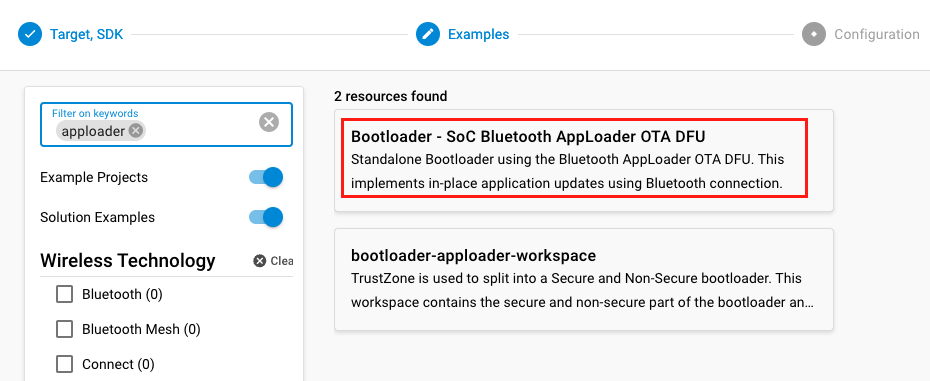

Alternatively, you can add the **Bluetooth AppLoader OTA DFU (bootloader\_apploader)** software component to your already existing bootloader. After this component is added, the **Base address of bootloader upgrade image** must be updated in the **Bootloader Core** component. This is done to prevent the new bootloader from overwriting itself during the OTA update. Any appropriate value can be used as long as the base address is larger than the size of the bootloader itself. The recommended value is 0x18000.

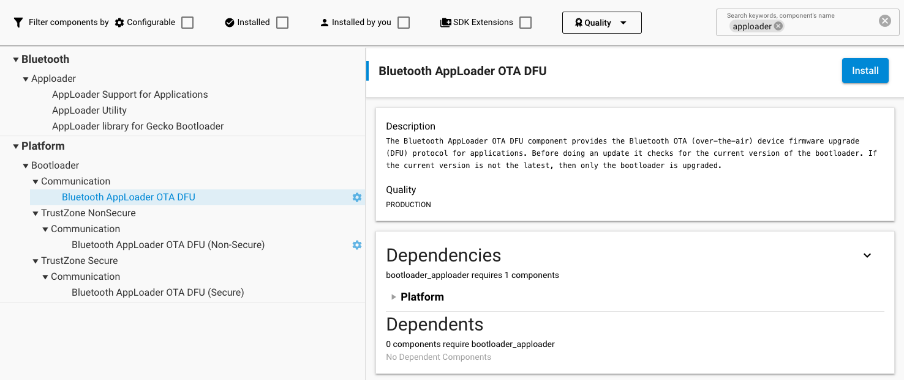

#### Application

In your application project, only the **In-Place OTA DFU (in\_place\_ota\_dfu)** component needs to be added. If you are using a sample project, this component might be included by default.

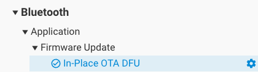

The **In-Place OTA DFU (in\_place\_ota\_dfu)** component requires the following components, which are automatically included:

- **AppLoader Support for Applications (apploader)** which on:

- Series 1 devices: includes the AppLoader binary as an additional prebuilt library.

- Series 2 devices: moves the application start address to give space for an AppLoader OTA DFU Bootloader. It also requires a Gecko Bootloader with an AppLoader OTA DFU plugin to be present on the device.

- **AppLoader Utility (apploader\_util)**, which provides utility functions related to OTA DFU, such as a unified API for resetting the device to DFU mode.

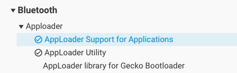

### Triggering Reboot into DFU Mode from the User Application

The minimum functional requirement to enable OTA in the user application is to implement a ‘hook’ that allows the device to be rebooted into DFU mode.

1. The code checks if the OTA control characteristic was written, and if so, sets `boot_to_dfu` to true. After this, the connection is closed.

2. The device is rebooted into DFU mode with `sl_bt_system_reset(2)` or `sl_apploader_util_reset_to_ota_dfu()`. Parameter value 2 indicates that the device is to be rebooted into OTA DFU mode. The rest of the OTA upgrade is managed by AppLoader and no further actions are needed from the user application.

3. This code is now incorporated into the `sl_bt_in_place_ota_dfu.c` source file, part of the **In-Place OTA DFU (in\_place\_ota\_dfu)** component.

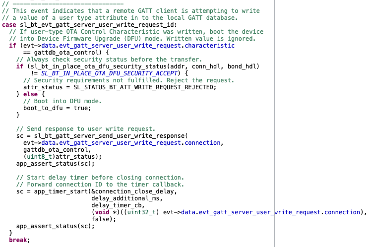

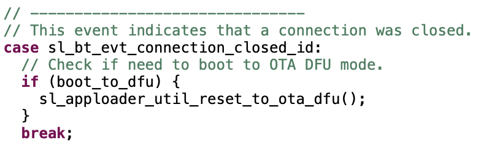

## OTA DFU Example

The Bluetooth SDK includes an OTA host reference implementation that can be used for testing OTA. The example is written in C and uses a WSTK in Network Co-Processor (NCP) mode. The OTA host application itself runs on the host computer. For more information on the NCP mode of operation, see [Using the Silicon Labs Bluetooth Stack v3.x and Higher in Network Co-Processor Mode](https://docs.silabs.com/bluetooth/latest/bluetooth-network-coprocessor-mode/).

The target device to be upgraded over-the-air is identified by its Bluetooth address.

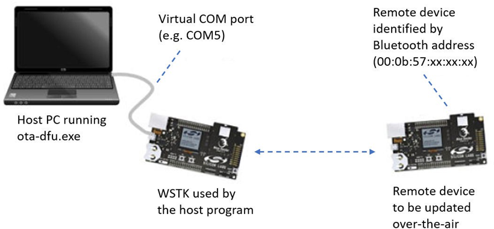

In this example, we will use the application-based OTA, but AppLoader can also be used.

### Preparing the SoC Application

In this example, we use the **Bluetooth – SoC Empty** sample application, together with one of the internal-storage bootloaders.

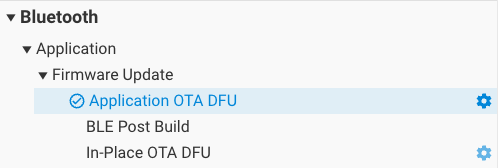

As the **In-Place OTA DFU (in\_place\_ota\_dfu)** is not used, it can be removed from the project. The source of **Application OTA DFU (app\_ota\_dfu)** can be found at:

```sh
<simplicity_sdk|gecko_sdk>\app\bluetooth\common\app_ota_dfu
```

### Creating the GBL files

Once the Application-based OTA has been added, the project can be compiled. After compiling, the GBL files must be created separately by using the [Post-Build Editor](./06-post-build-editor.md) or by running one of the following scripts from the project root folder:

Three scripts are provided in the SDK examples:

- create_bl_files.bat (for Windows)

- create_bl_files.sh (for Linux / Mac)

- create_bl_files.py (multiplatform)

The GBL files can be generated by invoking the script from the project directory. As of now, all three are available in the latest releases, but in future releases the Python version will enjoy exclusive support with the others being deprecated. If they are not present in the project, the **BLE Post Build** component must be installed to make them available. On Unix platforms, the scripts might have to be resaved with "LF" end of line sequences, instead of "CRLF" to avoid interpretation issues.

Before running the scripts, two environment variables must be defined, `PATH_SCMD` and `PATH_GCCARM`, as seen in the table below:

<table>
    <colgroup>
        <col width="20%"/>
        <col width="80%"/>
    </colgroup>
    <thead>
        <tr>
            <th>Variable Name</th>
            <th>Example Variable Values</th>
        </tr>
    </thead>
    <tbody>
        <tr>
            <td valign="top">PATH_SCMD</td>
            <td>
                <p>C:\SiliconLabs\SimplicityStudio\v5\developer\adapter_packs\commander</p>
                <p>/Applications/Simplicity Studio 5.app/Contents/Eclipse/developer/adapter_packs/commander</p>
                <p>~/SimplicityStudio_v5/developer/adapter_packs/commander</p>
            </td>
        </tr>
        <tr>
            <td valign="top">PATH_GCCARM</td>
            <td>
                <p>C:\SiliconLabs\SimplicityStudio\v5\developer\toolchains\gnu_arm\12.2.rel1_2023.7</p>
                <p>/Applications/Simplicity Studio 5.app/Contents/Eclipse/developer/toolchains/gnu_arm/12.2.rel1_2023.7</p>
                <p>~/SimplicityStudio_v5/developer/toolchains/gnu_arm/12.2.rel1_2023.7</p>
            </td>
        </tr>
    </tbody>
</table>

Running the **create\_bl\_files** script creates GBL files in a subfolder named output_gbl. The **application.gbl** file is the relevant file for OTA.

If signing and/or encryption keys (named **app-sign-key.pem**, **app-encrypt-key.txt**) are present in the project directory then the script also creates secure variants of the GBL files. More information on creating secure firmware for DFU can be found in our training document: [Secure Firmware Upgrade using OTA](https://www.silabs.com/documents/public/training/wireless/bg22-thunderboard-workshop-secure-ota-ssv5.pdf).

If properly named bootloader binaries (such as bootloader-second-stage.s37 or bootloader-apploader.s37) are present in the application project folder, the **create\_bl\_files** script will incorporate those in the final GBL file.

### Preparing the NCP Application

The development kit that is used on the host side should be programmed with firmware that is suitable for NCP mode. The Bluetooth SDK includes an example project called “**Bluetooth NCP**” that can be used for this purpose.

The WSTK features an on-board USB-to-UART converter so that the board will be seen as a virtual Serial port by the host computer. The WSTK also has an Ethernet controller which can be used for the NCP connection.

### Preparing the Host Application

The OTA host example is found in the following directory under the SDK installation tree (the exact path depends on the installed SDK version), but for example:

{@Manual intervention TextBox Need consider what to do}

The project folder contains a makefile that allows the program to be built using for example MinGW. (It is recommended that you use the MSYS2 development toolchain, available at [https://www.msys2.org/](https://www.msys2.org/). Follow the instructions there on how to install GCC.) Alternatively, use make in any Unix environment. An executable file is created in subfolder named **exe**. The executable filename is **bt\_host\_ota\_dfu(.exe)**.

### Running OTA with the NCP Host Example

The OTA host program expects the following command-line arguments:

- Serial port (-u) or TCP/IP address (-t) – TCP port is not needed

- Baud rate (-b) – in case of Serial port

- Name of the GBL file to be uploaded into target device (-g)

- Bluetooth address of the target device (-a)

- (optional) Force write without response (possible values 0 / 1, default is 0) (-w)

A full OTA upgrade is done in two parts and it requires two separate GBL files, one for the bootloader and another for the user application. If the bootloader and application has been combined into one image, as described in [Creating the GBL Files](#creating-the-gbl-files) or [Silicon Labs Gecko Bootloader User's Guide for GSDK 4.0 and Higher](https://docs.silabs.com/mcu-bootloader/latest/bootloader-user-guide-gsdk-4/), the upgrade can be done in one part.

For upgrading the bootloader and application separately, the host application must be invoked twice:

```sh
./bt_host_ota_dfu -u /dev/tty.usbmodem0004402253201 -b 115200 -g ./ bootloader-second_stage.gbl -a 00:0B:57:0B:49:23
./bt_host_ota_dfu -u /dev/tty.usbmodem0004402253201 -b 115200 -g ./application.gbl -a 00:0B:57:0B:49:23
```

> **Note: The GBL files can also be uploaded using the Simplicity Connect mobile application, as described in [Using Simplicity Connect for OTA DFU](https://docs.silabs.com/mobile-apps/latest/mobile-apps-using-connect-for-ota-dfu/).**

If the application alone is going to be upgraded, then the host program is run once, with the **application.gbl** file passed as parameter.

### OTA Host Example Internal Operation

The OTA host example is implemented as a state machine. The key steps in the OTA sequence are summarized below. Note that the program execution is independent of the type of upgrade image that is used. The program simply uploads one GBL file into the target device. It is up to the user to invoke the program either once or twice, depending on the upgrade type (partial OTA or full OTA).

The following diagram illustrates the state transitions in the OTA host example program in a slightly simplified form.

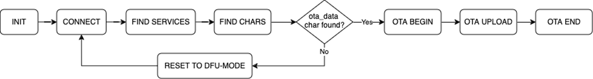

**INIT**: The program checks the total size of the GBL file that is passed as a command-line parameter. The GBL file content is not parsed. It is enough to know the file size so that the entire content can be uploaded to target device.

**CONNECT**: The program tries to open a connection to the target device whose Bluetooth address is given as a command line parameter. The host program does not scan for devices. If the target device is not advertising, then the connection open attempt causes the program to be blocked.

**FIND SERVICES**: After a connection has been established, the program performs a service discovery. In this case only the OTA service is of interest, and therefore the program performs discovery of services with that specific UUID using the API call `sl_bt_gatt_discover_primary_services_by_uuid`. More information on the OTA service can be found in [Silicon Labs OTA GATT Service](#silicon-labs-ota-gatt-service).

**FIND CHARACTERISTICS**: After the service has been found, the characteristics of the OTA service are queried using API call `sl_bt_gatt_discover_characteristics`. The handle value for the **ota\_control** needs to be discovered in order to proceed with the OTA procedure.

**RESET TO DFU**: If the target is not already in the DFU-mode, the host program requests reboot into DFU mode by writing value 0x00 to the ota_control characteristic. The execution then jumps back to the **CONNECT** state.

**OTA BEGIN**: If both ota_data and ota_control characteristic handles have been detected, the host program initiates OTA by writing value `0x00` to the `ota_control` characteristic. This does not cause reboot or any other side effects because the target device is already in DFU mode.

**OTA UPLOAD**: This is where the GBL file is uploaded to the target device. The whole content of the GBL file is uploaded to the target device, by performing multiple write operations into the ota_data characteristic. The host program uses the write-without-response transfer type to optimize throughput. Note that even if the write-without-response operations are not acknowledged at the application level, error checking (and retransmission when needed) at the lower protocol layers ensures that all packets are delivered reliably to the target device.

**OTA END**: Once the OTA upload is completed, the host program ends the OTA procedure by writing value `0x03` to the `ota_control` characteristic. Finally, the program terminates.

Some error cases have been omitted from the state diagram for simplicity. For example, the program exits with an error code if the OTA service is not found when performing service discovery or if the `ota_control` characteristic is not discovered in **FIND CHARACTERISTICS** state.

> **Note**: When the target device reboots into DFU mode, the host program must perform full service and characteristic discovery again. It is not possible to store the `ota_control` and `ota_data` characteristic handles in memory and use those cached values during the second connection. This is because the target device has two GATT databases that are independent of each other: one that is used by the application in normal mode and the other that is used by AppLoader in OTA DFU mode. While both of these GATT databases might include the Silicon Labs OTA service, the characteristic handles are likely to have different values. Therefore any kind of GATT caching cannot be used.

## OTA GATT Database and Generic Attribute Service

When booted into DFU mode, the AppLoader uses a GATT database that is different than the normal GATT used by the application. The OTA DFU GATT database used by AppLoader contains following services:

- Generic Attribute (UUID 0x1801)

- Generic Access (UUID 0x1800)

- Silicon Labs OTA service (UUID 0x1d14d6ee-fd63-4fa1-bfa4-8f47b42119f0)

The Bluetooth specification requires that, if GATT-based services can change in the lifetime of the device, then the **Generic Attribute Service** (UUID 0x1801) and the **Service Changed** characteristic (UUID 0x2A05) shall exist in the GATT database. For details, please see [Bluetooth Core specification](https://www.bluetooth.com/specifications/specs/), Version 6.0, Vol. 3, Part G, 7 DEFINED GENERIC ATTRIBUTE PROFILE SERVICE.

The Generic Attribute service is automatically included in the AppLoader GATT database used during OTA. To avoid any interoperability issues due to GATT caching, it is strongly recommended that the application GATT database used in normal mode also enables this service. Generic Attribute service is enabled by default in the SDK example applications.

> **Note**: AppLoader does not generate a service changed indication when rebooting to DFU mode or rebooting back to normal mode.

Automatic service changed indication requires that the client is bonded and has enabled the indication for this characteristic. AppLoader does not support bonding and therefore the service changed indication is not generated.

The Generic Attribute Service can also be explicitly defined in the application’s GATT database using the same XML notation that is used for other services. The Generic Attribute service must be the first service in the list, to ensure it is aligned with the Generic Attribute Service that is used during OTA. The Bluetooth specification requires that the attribute handle of the Service Changed characteristic shall not change and therefore this service must be first on the list (the same as in the OTA GATT database).

More details on the Generic Attribute Service can be found on the Bluetooth SIG website:

[https://www.bluetooth.com/specifications/specs/](https://www.bluetooth.com/specifications/specs/)

Note also that AppLoader does not support the GATT caching enhancements that were introduced in the Bluetooth Core Specification 5.1 and Silicon Labs Bluetooth SDK 2.11.1.

## Silicon Labs OTA GATT Service

The following XML representation defines the Silicon Labs OTA service. It is a custom service using 128-bit UUID values. The service content and the UUID values are fixed and must not be changed.

The OTA service characteristics are described in the following table. The UUID value of the service itself is 1d14d6eefd63-4fa1-bfa4-8f47b42119f0.

| Characteristic | UUID | Type | Length | Support | Properties |
|----------------|------|------|--------|---------|------------|
| OTA Control Attribute | F7BF3564-FB6D-4E53-88A4-5E37E0326063 | Hex | 1 byte | Mandatory | Write (4) |
| OTA Data Attribute (1) | 984227F3-34FC-4045-A5D0-2C581F81A153 | Hex | Variable; max 244 bytes | Mandatory | Write without response; Write |
| AppLoader version (2) (Bluetooth stack version 2,3) | 4F4A2368-8CCA-451E-BFFF-CF0E2EE23E9F | Hex | 8 | Optional | Read |
| OTA version (2) | 4CC07BCF-0868-4B32-9DAD-BA4CC41E5316 | Hex | 1 | Optional | Read |
| Gecko Bootloader version (2) | 25F05C0A-E917-46E9-B2A5-AA2BE1245AFE | Hex | 4 | Optional | Read |
| Application version | 0D77CC11-4AC1-49F2-BFA9-CD96AC7A92F8 | Hex | 4 | Optional | Read |

**Notes**:

1. This characteristic is excluded from the user application GATT database.

2. Version information is automatically added by AppLoader when running in DFU mode. These are optional in the application GATT database.

3. This characteristic exposes the AppLoader version.

4. Silicon Labs highly recommends that the default property (i.e, write) be used only over bonded connections to prevent uploading of new firmware by untrusted/unknown devices.

The table below provides possible control words written to the OTA control characteristic.

| Hex value | Description |
|-----------|-------------|
| 0x00 | OTA client initiates the upgrade procedure by writing value 0. |
| 0x03 | After the entire GBL file has been uploaded the client writes this value to indicate that upload is finished. |
| 0x04 | Request the target device to close connection. Typically the connection is closed by OTA client but using this control value it is possible to request that disconnection is initiated by the OTA target device. |
| Other values | Other values are reserved for future use and must not be used by application. |

In DFU mode, AppLoader uses the full OTA service described above. The GATT database of the user application includes only a subset of the full OTA service. The minimum application requirement is to include the OTA Control characteristic. The application must not include the OTA Data characteristic in its GATT database (unless the OTA update is implemented fully in application code, as described in [Application-Based OTA](#application-based-ota).)

From the user application viewpoint, only the OTA Control Attribute is relevant. In the OTA host example reference implementation included in the SDK, the OTA procedure is triggered when the client writes value 0 to the OTA Control Attribute. The user application does not handle data transfers related to OTA upgrades, so the OTA Data Attribute is excluded from the user applications GATT.

It is also possible to use an application-specific trigger to enter OTA mode, and therefore it is not necessary to include the OTA Control Attribute in the application’s GATT database. If reboot into DFU mode is handled using some other mechanism, then it is possible to exclude the whole OTA service from the application GATT. However, it should be noted that to be compatible with the OTA host example from the SDK or the Si Connect smartphone app the OTA trigger must be implemented as described above.

The presence of the OTA Data Attribute in the GATT database is used by the OTA host example application to check whether the target device is running in normal mode (user application) or DFU mode (AppLoader). Therefore, the OTA Data Attribute must not be included in the user application’s GATT. The OTA-enabled examples in the Bluetooth SDK only expose the OTA Control Attribute.

The four characteristics after the OTA Data Attribute are automatically added in the GATT database that is used by AppLoader. These include version information that can be read by the OTA client before starting the firmware update. For example, by checking the AppLoader version, the OTA client may check if a full or partial update is needed.

The AppLoader version is a 8-byte value that consists of four two-byte fields, indicating the AppLoader version in the form \<major\>.\<minor\>.\<patch\>-\<build\>. For example, value 010000000000170b can be interpreted as version “1.0.0-2839”.

The OTA version is a 1-byte value that indicates the OTA protocol version for compatibility checking. This version number is incremented only when needed, if there are some changes in the OTA implementation that may cause backward compatibility issues.

The Gecko Bootloader version is a 4-byte value that is configured in a Gecko Bootloader project in **config/btl\_core\_config.h**. The two most significant bytes are the major and minor numbers. The other two bytes are customer-specific, and they can be set to indicate certain Gecko Bootloader configuration options (for example, whether secure boot is required or not). As an example, value 00000401 indicates that the Gecko Bootloader version is “1.4” and the customer-specific part is 0x0000 (this is the default if no customer-specific version info has been configured in the Gecko Bootloader project).

The application version is a 4-byte value, and it is initialized to the same value that is defined in **config/app\_properties\_config.h**. The encoding of this value is application specific. The application properties file is discussed in more detail in [Application Properties in OTA Mode](#application-properties-in-ota-mode).

AppLoader does not include support for encryption or bonding and therefore there are no access restrictions on any of the characteristics listed in [Silicon Labs OTA GATT Service](#silicon-labs-ota-gatt-service). Because the user application has its own GATT database it is possible to include additional security requirements there as needed. For example, the user application can require that the OTA Control Attribute is writable only by a bonded client so that only bonded client can trigger reboot into DFU mode.

For additional security, it is recommended to configure the Gecko Bootloader to use secure boot and signed GBL images.

## OTA Advertising Data

The default OTA advertising data includes the device name, TX power, advertising flags, and the Bluetooth device address. The following text snippet illustrates typical default raw OTA advertising data and how it is dissected into different advertising data elements.

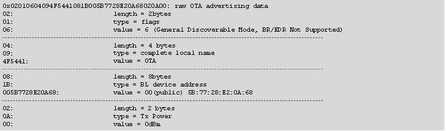

For Series 1 devices, `sl_bt_ota_set_advertising_data(packet_type, adv_data_len, adv_data)` can be used to set custom OTA advertising data (only available in GSDK releases). The packet type identifies whether data is intended for advertising packets or scan response packets.

2: OTA advertising packets

4: OTA scan response packets

You can set a maximum of 31 bytes of data.

> **Note**: The OTA configuration commands must be called after NVM3 (PS) initialization has been done; that is, after `sl_bt_init()`.

The Bluetooth device address that is used in OTA mode is determined as follows:

- Use a static random address if it has been enabled in the OTA configuration flags.

- If the user application has overridden the default Bluetooth address (using command `sl_bt_system_set_identity_address(address, type)`), then use this address.

- The default Bluetooth address (programmed into the device in production) is used if neither a static random address nor custom address has been defined.

For Series 1 devices, in OTA mode, the TX power is hardcoded to 0 dBm. For Series 2 devices, the TX power level can be configured using the **Bluetooth AppLoader OTA DFU (bootloader\_apploader)** component inside the bootloader-apploader project.

## Application Properties in OTA Mode

The source file **app\_properties.c** must be included in projects that use OTA and the Gecko Bootloader. This file is included in the SDK examples by default. Application properties are stored in a fixed location in code flash so that AppLoader can access the data when the device is running in OTA mode. The properties include a 32-bit version number that is application-specific. It is up to the application designer to decide how this value is encoded. This value is exposed in the GATT database used by AppLoader so that the OTA client can read it over the Bluetooth connection after the device has been rebooted into OTA mode.

The version information is set using following #define in **config/app\_properties\_config.h**:

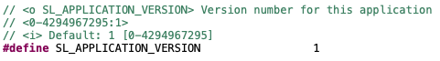

The default value is set to 1, but it is strongly recommended that meaningful version number information is added here so that the OTA client can check the exact version that is installed on the target device. This allows better management of OTA updates of units that are deployed in the field, especially in cases where units are running different versions of the application. If AppLoader does not detect any valid application at all, then the application version in the GATT database is initialized to value zero.

## OTA Error Codes

When a new GBL file is being uploaded, the AppLoader performs various checks. AppLoader can signal possible errors to the OTA client in two ways:

1. Response to the OTA termination code (0x03) that is written to the OTA Control characteristic.

2. Response to writes to the OTA Data characteristic.

Option 2 is not available if the client uses unacknowledged writes. In that case, the possible error code is not available until the entire file has been uploaded and client finishes the upload by writing to the OTA Control characteristic.

The OTA client must always check the response value to the last write to the OTA Control characteristic. Any non-zero value indicates that the update was not successful. In that case, the device is not able to boot into the main program but rather stays in OTA mode. This makes it possible to try the update again.

The following table summarizes the possible result codes returned by AppLoader.

<table>
    <colgroup>
        <col width="20%"/>
        <col width="20%"/>
        <col width="60%"/>
    </colgroup>
    <thead>
        <tr>
            <th>Result Code</th>
            <th>Name</th>
            <th>Description</th>
        </tr>
    </thead>
    <tbody>
        <tr>
            <td>0x0000</td>
            <td>OK</td>
            <td>Success / No errors found.</td>
        </tr>
        <tr>
            <td>0x0480</td>
            <td>CRC_ERROR</td>
            <td>CRC check failed, or signature failure (if enabled).</td>
        </tr>
        <tr>
            <td>0x0481</td>
            <td>WRONG_STATE</td>
            <td>This error is returned if the OTA has not been started (by writing value 0x0 to the control endpoint) and the client tries to send data or terminate the update.</td>
        </tr>
        <tr>
            <td>0x0482</td>
            <td>BUFFERS_FULL</td>
            <td>AppLoader has run out of buffer space.</td>
        </tr>
        <tr>
            <td>0x0483</td>
            <td>IMAGE_TOO_BIG</td>
            <td>New firmware image is too large to fit into flash, or it overlaps with AppLoader.</td>
        </tr>
        <tr>
            <td>0x0484</td>
            <td>NOT_SUPPORTED</td>
            <td>
                <p>GBL file parsing failed. Potential causes are for example:
                    <ol>
                        <li>Attempting a partial update from one SDK version to another (such as 2.3.0 to 2.4.0).</li>
                        <li>The file is not a valid GBL file (for example, client is sending an EBL file).</li>
                    </ol>
                </p>
            </td>
        </tr>
        <tr>
            <td>0x0485</td>
            <td>BOOTLOADER</td>
            <td>The Gecko bootloader cannot erase or write flash as requested by AppLoader, for example if the download area is too small to fit the entire GBL image.</td>
        </tr>
        <tr>
            <td>0x0486</td>
            <td>INCORRECT_BOOTLOADER</td>
            <td>Wrong type of bootloader. For example, target device has UART DFU bootloader instead of OTA bootloader installed.</td>
        </tr>
        <tr>
            <td>0x0487</td>
            <td>APPLICATION_OVERLAP_APPLOADER</td>
            <td>New application image is rejected because it would overlap with the AppLoader.</td>
        </tr>
        <tr>
            <td>0x0488</td>
            <td>INCOMPATIBLE_BOOTLOADER_VERSION</td>
            <td>AppLoader in requires Gecko Bootloader v1.11 or higher.</td>
        </tr>
        <tr>
            <td>0x0489</td>
            <td>ATT_ERROR_APPLICATION_VERSION_CHECK_FAIL</td>
            <td>AppLoader fails checking application version.</td>
        </tr>
    </tbody>
</table>

Note that the error codes listed above are applicable only when testing with the NCP host example. The upper half of the result code (0x04\*\*) is generated by the BLE stack running on the NCP host device. The size of the ATT error code that is transmitted over the air is one octet. Values in the range 0x80-0x9F are reserved for application-specific errors in the Bluetooth specification.

## Firmware Upgrade from PS Store to NVM3

If an application is already in the field using PS Store and should be upgraded to use NVM3, it can be upgraded using OTA DFU with new firmware that already uses NVM3.

However, in this case the data stored in the PS Store cannot be preserved. All bonding information and stored user data will be lost. Nevertheless, the new application can reinitialize the NVM area (at the end of the main flash) to use NVM3 instead of PS Store, and after the upgrade NVM3 will be functional.

Upgrading software from PS Store to NVM3 is challenging, mostly because the application provides information to the AppLoader through non-volatile memory (PS Store / NVM3), which gets upgraded as well. The following are the detailed steps to perform an OTA upgrade from PS Store to NVM3, where the device doing the upgrade is bonded with the device to be upgraded.

> **Note**: The procedure illustrates the situation where the upgrader and the device to be upgraded are bonded to highlight all the challenges. Bonding is not a condition for upgrading from PS Store to NVM3.

1. The device uses an application with PS Store.

2. The application sets `random address OTA flag` and `OTA device name` in PS Store 10.2_2020q4.

3. The Smartphone opens a connection to this device and gets bonded (if not bonded already).

4. The application stores bonding information in PS Store.

5. The Smartphone resets the device into OTA mode by writing 0x00 into the OTA control characteristic.

6. AppLoader (with PS Store support) starts.

7. AppLoader advertises with a random address and the OTA device name.

8. The Smartphone connects and uploads a new AppLoader (with NVM3 support).

9. The device resets and applies the new AppLoader image.

10. The new AppLoader (with NVM3 support) starts.

11. The AppLoader advertises with the public address and with the default name ("AppLoader"), because it cannot read the random address flag and the OTA device name from PS Store.

12. The Smartphone sees the device as bonded because bonding information is associated with the public address, but AppLoader does not support bonding.

13. The Smartphone removes bonding information for the device before re-connecting.

14. The Smartphone connects and uploads a new application (with NVM3 support).

15. The new application starts.

16. The application initializes NVM3 by reformatting the NVM area.

17. The application sets `random address OTA flag` and `OTA device name` in NVM3.

18. The Smartphone opens a connection and gets bonded (again).

19. The application stores bonding information in NVM3.

After this, NVM3 to NVM3 update will work normally:

1. The device uses an application with NVM3.

2. The application sets `random address OTA flag` and `OTA device name` in NVM3.

3. The Smartphone opens a connection to this device and gets bonded (if not bonded already).

4. The application stores bonding information in NVM3.

5. The Smartphone resets the device into OTA mode by writing 0x00 into the OTA control characteristic.

6. AppLoader (with NVM3 support) starts.

7. AppLoader advertises with a random address and the OTA device name.

8. The Smartphone connects and uploads a new AppLoader (with NVM3 support).

9. The device resets and applies the new AppLoader image.

10. The new AppLoader (with NVM3 support) starts.

11. AppLoader advertises with a random address and the OTA device name.

12. The Smartphone connects and uploads a new application (with NVM3 support).

13. The new application starts.

14. The Smartphone opens a connection and encrypts the connection with existing bonding information.

15. Bonding information is still stored in NVM3.
