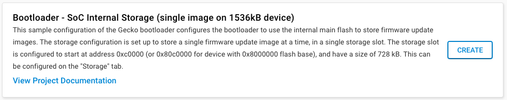
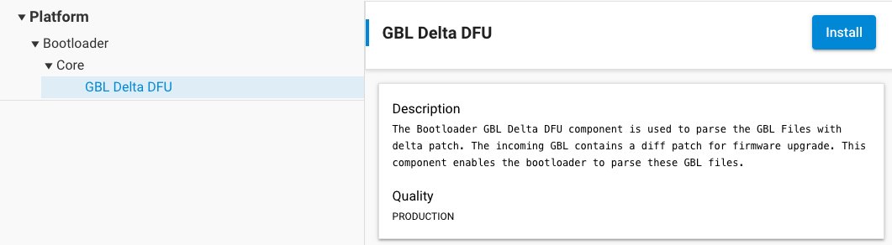
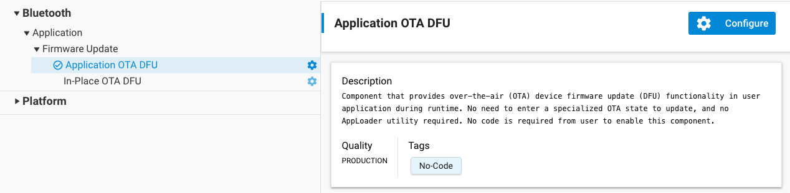

# OTA Delta DFU

SiSDK 2024.6.1 introduced a new feature called Delta DFU. This feature can be used to speedup OTA DFU and is especially useful in large wireless networks when upgrading large amounts of devices. Delta DFU is accomplished by:

1. Comparing the current and new application firmwares

2. Creating a patch file based on the comparison

3. Only uploading the patch file to the target device

Delta DFU is not supported when using AppLoader. Instead, OTA must be implemented in the application as described in Section [OTA DFU Example](./03-bluetooth-ota-upgrade.md#ota-dfu-example), with an internal-storage bootloader. The storage space must be large enough to hold the patch file and the reconstructed firmware. We recommend the implementation of an additional handshake process to determine the current firmware version before the appropriate previously-generated Delta DFU image is being selected for upload.

## Preparing the Bootloader

In Delta DFU, the bootloader takes care of applying the patch file to the current application firmware. For this, we need to prepare the bootloader:

1. Create an internal-storage bootloader project

   

2. Add the **GBL Delta DFU (bootloader\_gbl\_delta\_dfu)** software component

   

## Preparing the Application

Both the current and the new application must support application-based OTA. Sample applications include the **In-Place OTA DFU (in\_place\_ota\_dfu)** software component by default. However, OTA Delta DFU does not use the in-place method for DFU. Therefore, **In-Place OTA DFU (in\_place\_ota\_dfu)** must be replaced by the **Application OTA DFU (app\_ota\_dfu)** software component.



## Creating a Patch File

The patch file can be created using Simplicity Commander. For this, we need both the current firmware file, and the new version.

```sh
commander gbl create patch.gbl --app app_v2.out --delta-app app_v1.out
```

For this to work, an ELF file with the same name must exist next to the application image. Once the patch file is created it can further be compressed using LZMA or LZ4. More information on creating a patch file can be found in [Simplicity Commander Reference Guide](https://docs.silabs.com/simplicity-commander/latest/simplicity-commander-start/).

> **Note**: Patch-file creation with GBL4 is not supported.

## Delta DFU process

Once a patch file has been created, it can be uploaded to the target device via OTA just as before in a partial update. When the patch file has been uploaded, the bootloader will reconstruct it into a full firmware image. This firmware image will then be written over the old image.

## Delta DFU and Secure Boot

When using Delta DFU with Secure Boot, make sure both the current firmware and the new version (app_v1 and app_v2, respectively) are signed using the same private key before creating the patch file. When the patch file is created, as described in [Creating a patch file](#creating-a-patch-file), the signature of app_v2 will be included in the patch. Therefore, the reconstructed firmware will have the signature of app_v2, and the new application will boot as expected.
