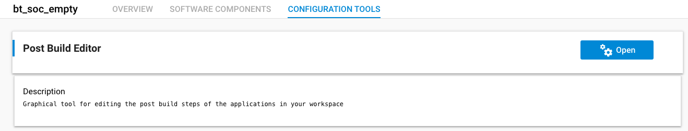
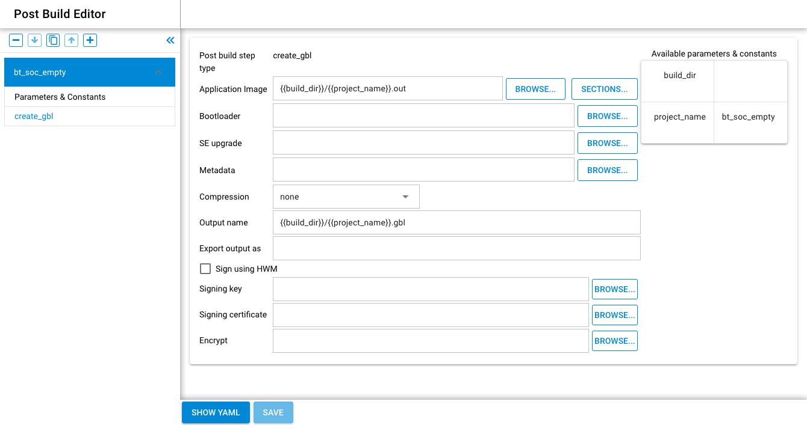

# Post Build Editor

From SiSDK 2024.12.0 and after, there is a new way of generating the GBL files for OTA (GBL3 format only, as of now) via a convenient graphical user interface instead of by using the command line solutions introduced previously. The option is to be found among the CONFIGURATION TOOLS:

Every previously introduced configuration option is available here, including compression, signing, and encryption:

