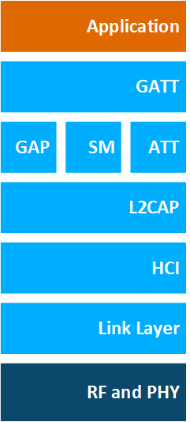

# Bluetooth LE Architecture

The Bluetooth LE architecture is illustrated in the following figure:

The components are as follows:

- **Physical Layer**: Controls radio transmission/receiving.

- **Link Layer**: Defines packet structure, includes the state machine and radio control, and provides link layer-level encryption.

These two layers are often grouped into a Controller, with the remaining layers grouped into a host. A Host-to-Controller interface (HCI) standardizes communication between the controller and the host. The host layers are:

- **L2CAP**: Logical Link Control and Adaptation Protocol. L2CAP acts as a protocol multiplexer and handles segmentation and reassembly of packets. It also provides logical channels, which are multiplexed over one or more logical links. The L2CAP used in Bluetooth low energy technology is an optimized and simplified protocol based on the classic Bluetooth L2CAP. Typically, application developers do not need to care about the details of interacting with the L2CAP layer. The interaction is handled by the Bluetooth stack, and the details of the L2CAP operation are not covered in this guide.

- **ATT**: Attribute Protocol. The attribute protocol provides means to transmit data between Bluetooth low energy devices. It relies on a Bluetooth low energy connection and provides procedures to read, write, indicate, and notify attribute values over that connection. ATT is used in most Bluetooth low energy applications and occasionally in BR/EDR applications.

- **GATT**: Generic Attribute Profile. The GATT is used to group individual attributes into logical services, for example the Heart Rate Service, which exposes the operation of a heart rate sensor. In addition to the actual data, the GATT also provides information about the attributes, that is, how they can be accessed and what security level is needed.

- **GAP**: Generic Access Profile. The GAP layer provides means for Bluetooth low energy devices to advertise themselves or other devices, make device discovery, open and manage connections, and broadcast data.

- **SM**: Security Manager. Provides means for bonding devices, encrypting and decrypting data, and enabling device privacy.

These components are discussed in more detail in the following sections.
