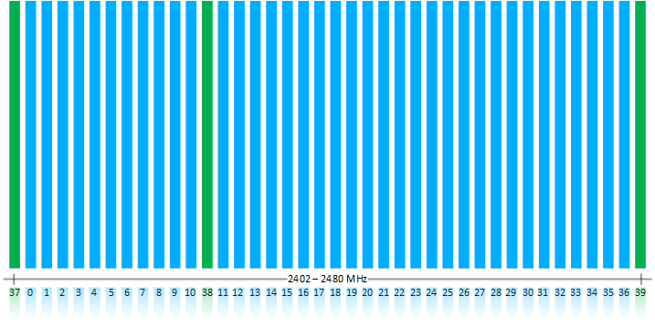

# Physical Layer

Bluetooth LE operates in the 2.4 GHz ISM (Industrial Scientific Medical) band (2402 MHz - 2480 MHz), which is license-free in most countries. The Bluetooth 4 specification defines 40 RF channels with 2 MHz channel spacing (see the following figure). Three of the 40 channels are advertising channels (shown in green), used for device discovery, connection establishment, and broadcast. The advertising channel frequencies are selected to minimize interference from IEEE 802.11 channels 1, 6 and 11, which are commonly used in several countries.

In the Bluetooth 5 specification, the three advertisement channels highlighted below are called the primary advertisement channels. The 37 remaining channels are either used as secondary advertisement channels or data channels that can be used for additional advertisement data transmission.

Data channels are used for bidirectional communication between connected devices. AFH (Adaptive FHSS) is used to select a data channel for communication during a given time interval. AFH is reliable, robust, and adapts to interference.

All physical channels use GFSK (Gaussian Frequency Shift Keying) modulation, with a modulation index of 0.5, which allows reduced peak power consumption. In Bluetooth 4.0, 4.1, and 4.2 specification, the physical layer data rate is 1 Mbps.

The Bluetooth 5 standard introduces an additional  2M PHY rate for faster throughput or shorter TX and RX times.

The recent changes in the Bluetooth and regulatory standards allow Bluetooth Smart devices to transmit up to 100 mW (20 dBm) transmit power. However not all countries allow the 100 mW transmission power to be used because Bluetooth LE radio can drop down to two RF channels when there is significant interference.

The requirements for a Bluetooth LE radio are as follows:

| Feature |Value |
|-|-|
| Minimum TX power |0.01 mW (-20 dBm) |
| Maximum TX power |100 mW (20 dBm) |
| Minimum RX sensitivity |-70 dBm (BER 0.1%) |

The typical range for Bluetooth LE radios is as follows:

| TX power |RX sensitivity |Antenna gain |Range |
|-|-|-|-|
| 0 dBm |-92 dBm |-5 dB |160 meters |
| 10 dBm |-92 dBm |-5 dB |295 meters |

The range to a smart phone is typically 0-50 meters due to limited RF performance of the phones.
