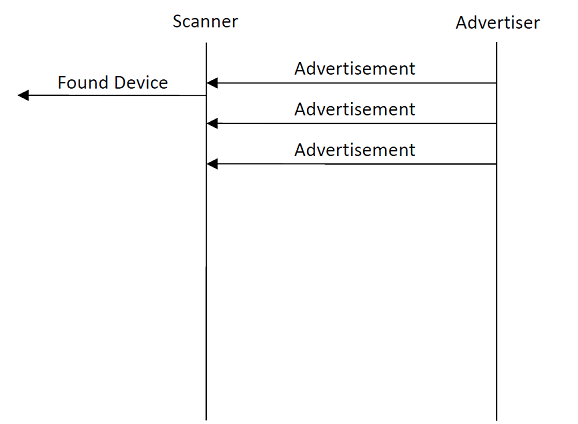
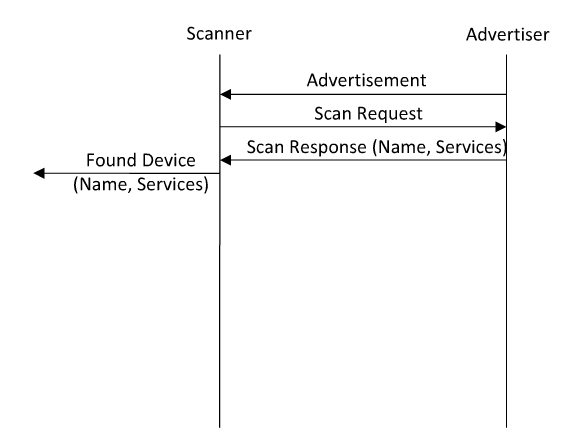
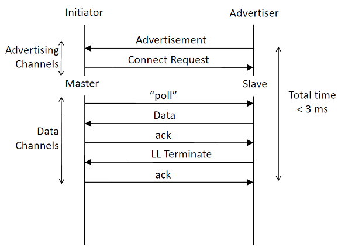
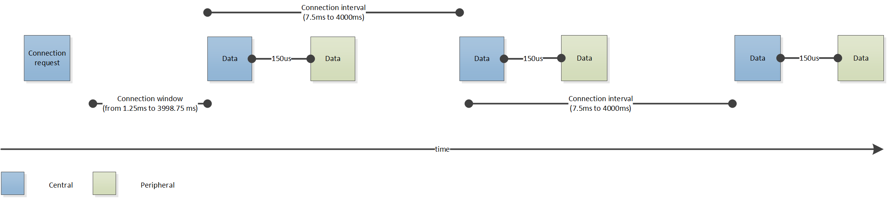
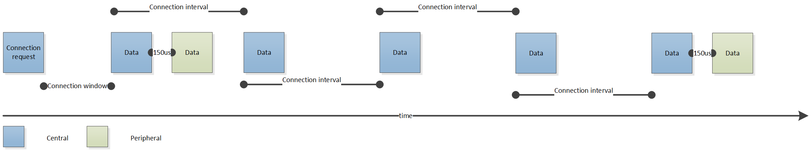
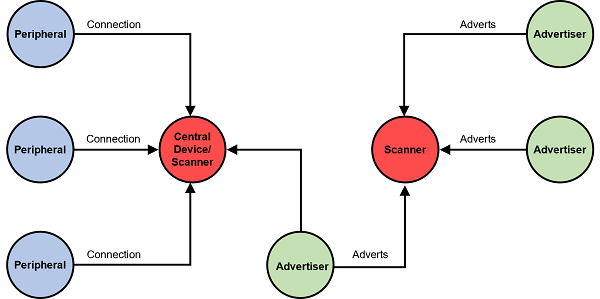
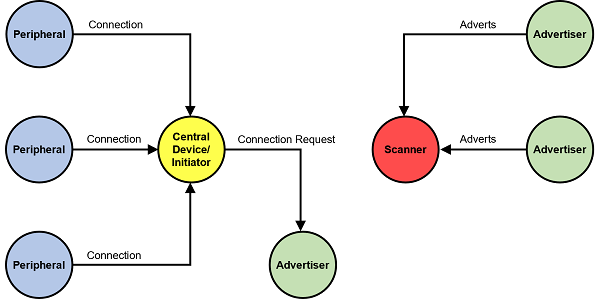

# Link Layer

The Bluetooth LE link layer provides the first level of control and data structure over the raw radio operations and bit stream transmission and reception. For example, the link layer defines the following:

- Bluetooth state machine and state transitions

- Data and advertisement packet formats

- Link Layer operations

- Connections, packet timings, retransmissions

- Link layer level security

Application developers do not need to understand these in detail, but some essential concepts affect the application design, development, and the end device operation. Summaries of these concepts are provided in this section.

## Link Layer Operations

This section describes the basic Bluetooth LE link layer operations, including:

- Advertising

- Scanning

- Connection establishment

### Advertisement

Advertisement is one of the most fundamental operations in Bluetooth LE wireless technology. Advertisement provides a way for devices to broadcast their presence, allow connections to be established, and optionally broadcast data like the list of supported services, or the device name and TX power level.

The following figure illustrates a Bluetooth LE device that is advertising broadcasts packets on one or multiple advertisement channels, which remote devices can then pick up.

The application typically has control of the following advertisement parameters.

:::custom-table{width=20%,30%,50%}
| Parameter | Values | Description |
|-|-|-|
| Advertisement interval |20 ms to 10240 ms |Defines the interval between the advertisement events. Each event consist of 1 to 3 advertisement packets depending on the configuration. A random 0-10 ms is added by the link layer to every advertisement interval to help avoid packet collisions. |
| Advertisement channels |37, 38 and 39 (primary channels); 0-10 and 11-36 (BT 5 secondary channels) |The physical RF channels used to transmit the advertisement packets. For most reliable operation all channels should be used, but reducing the number of channels used will reduce power consumption at the cost of reliability. |
| Discoverability mode |Not Discoverable; Generic Discoverable; Limited Discoverable; Broadcast |Defines how the advertiser is visible to other devices. |
| Connectability mode |Not Connectable; Directed Connectable; Undirected Connectable |Defines if the advertiser can be connected or not |
| Payload |0 to 31 B (primary advertisement); 0 to 255 B (BT5 secondary advertisement) |0-31 bytes of data can be included in each primary advertisement packet. 0-255 bytes of data can be included in each secondary advertisement packet (Bluetooth 5) |
:::

### Scanning

Scanning is the operation where a scanner is listening for incoming advertisement in order to discover, discover and connect, or simply to receive the data broadcast by the advertising devices.

Two types of scanning modes are supported: passive scanning and active scanning.

In passive scanning mode, the scanner simply listens for incoming advertisement packets. The scanner cycles through each advertisement channel in a round-robin fashion, listening to one channel at a time.

In active scanning mode, the scanner listens for incoming advertisement packets and, upon receiving one, sends an additional scan request packet to the advertiser in order to learn more about it. Typically the scan response contains information like the list of supported services and friendly name, but the application has full control of the scan response data payload.

The application typically controls the following scan parameters.

:::custom-table{width=20%,30%,50%}
| Parameter | Values | Description |
|-|-|-|
| Scan interval |2.5 ms to 10240 ms |The interval is ms from the beginning of a scan event to a beginning of a consecutive scan event. Must be equal or larger than scan window. |
| Scan window |2.5 ms to 10240 ms |The scan window defines the duration of the listening (RX) window during a scan event. |
| Scan type |Limited; Generic; Observation |Defines which type of advertisers the scanner reports. |
| Scan mode |Active; Passive |Defines if active or passive scanning is performed. |
| Connectability mode |Not Connectable; Directed Connectable  Undirected Connectable   |Defines if the advertiser can be connected to or not. |
:::

### Connections

Connections allow application data to be transmitted in a reliable and robust manner, as Bluetooth LE connections use CRCs, acknowledgements, and retransmissions of lost data to ensure correct data delivery. In addition, the Bluetooth LE connections use Adaptive Frequency Hopping (AFH) to detect and adapt to the surrounding RF conditions and provide a reliable physical layer. Connections also support encryption and decryption of data to ensure its confidentiality.

The Bluetooth LE connection always starts by a scanner receiving an advertisement packet that includes the fact that the advertiser allows connections. The following figure illustrates how Bluetooth LE connection establishment happens.

The application typically controls the following connection parameters.

:::custom-table{width=20%,30%,50%}
| Parameter | Values | Description |
|-|-|-|
| Minimum Connection Interval |7.5 ms |Minimum allowed connection interval |
| Maximum Connection Interval |4000 ms |Maximum allowed connection interval |
| Connection (peripheral) latency |0 to 500 (connection intervals) |The amount of connection events the peripheral is allowed to skip if it has no data to send. |
| Supervision timeout |100 ms to 32000 ms |Defines how long the break in communications can be (for example due to out of range situation) before the connection is dropped and an error is presented to the user. |
:::

The connection parameters can be updated during the life time of a connection using a connection update message.

The connection event starts when the central device sends a packet to the peripheral at the defined connection interval. The peripheral can respond 150 µs after it has received a packet from the central device. If the peripheral has no data to send, it can skip a certain number of connection events defined by the peripheral latency parameter. If no packets are received by the central or peripheral device within the time defined by the supervision timeout, the connection is terminated.

If the peripheral has more data to send than can be fitted into a single packet, the connection event will automatically extend and the peripheral can send as many packets as there is time until the beginning of next connection interval. This can only be used with attribute protocol operations that do not require an acknowledgement.

## Network Topologies

Device roles in Bluetooth LE technology are:

- **Advertiser**: A device that broadcasts advertisement packets, but is not able to receive them. It can allow or disallow connections.

- **Scanner**: A device that only listens for advertisements. It can connect to an advertiser.

- **Peripheral**: A device connected to a single central device (BT 4.0) or multiple central devices (BT 4.1 and newer).

- **Central Device**: A device that is connected to one or more peripherals. Theoretically, a central device can have an unlimited number of peripheral devices connected to it, but in practice the central device can connect 4-20 peripherals at a time.

- **Hybrid**: It is possible for a device to advertise and scan at the same time or be connected to a central device and advertise or scan simultaneously. This is, however, vendor-specific, and the exact features that are supported should be checked with the vendor.

Examples of Bluetooth LE topologies are shown in the following two figures.

Devices can change roles and topologies, as illustrated in the following figure.

