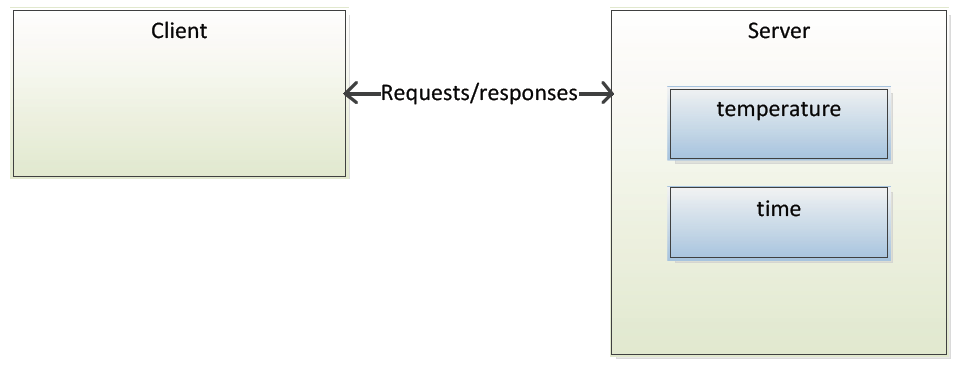
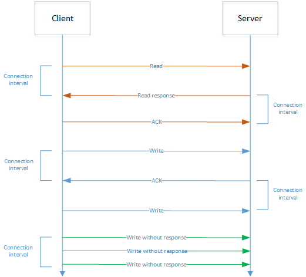

# Attribute Protocol (ATT)

Bluetooth LE profiles expose a state of a device. The state is exposed as one or more values called attributes. The protocol to access these attributes is called the Attribute Protocol (ATT). The ATT defines the communication between two devices playing the roles of server and client, respectively, on top of a dedicated L2CAP channel. The Attribute protocol defines two roles:

- **Server**: The device that stores the data as one or more attributes

- **Client**: The device that collects the information for one or more servers

The client can access the server's attributes by sending requests, which trigger response messages from the server. For greater efficiency, a server can also send to a client two types of unsolicited messages that contain attributes: notifications, which are unconfirmed; and indications, which require the client to send a confirmation. A client may also send commands to the server in order to write attribute values. Request/response and indication/confirmation transactions follow a stop-and-wait scheme.

This section describes attributes and provides a summary of protocol methods.

## Attributes

Attributes are arrays that can vary from 0 to 512 bytes, as shown in the following example, and they can be fixed or variable length.

**Example**

| Value |
|-|
| 0x0000 |
| 0x426c75656769676120546563686e6f6c6f67696573 |

All attribute have handles, which are used to address an individual attribute, as shown in the following example. The client accesses the server's attributes using the handle.

**Example**

| Handle | Value |
|-|-|
| 0x0001 | 0x0000 |
| 0x0002 | 0x426c75656769676120546563686e6f6c6f6769657 |

Attributes also have a type, described by a UUID (Universally Unique Identifier), as shown in the following example. The UUID determines what the attribute value means.

Two types of UUIDs are used:

- Globally unique 16-bit UUID, defined in the characteristics specification ([https://www.bluetooth.com/specifications/bluetooth-core-specification](https://www.bluetooth.com/specifications/bluetooth-core-specification))

- Manufacturer-specific 128-bit UUIDs, which can be generated online (for example, [https://www.uuidgenerator.net/](https://www.uuidgenerator.net/))

**Example**

| Handle | UUID | Value | Description |
|-|-|-|-|
| 0x0001 | 0x1804 | 0x0000 | TX power as dBm |
| T0x0002 | 0x2a00 | 0x426c75656769676120546563686e6f6c6f6769657 | Device name, UTF-8 |

Attributes also have permissions, which can be:

- Readable / Not readable

- Writable / Not writable

- Readable and writable / Not readable and not writable

The attributes may also require the following:

- Authentication to read or write

- Authorization to read or write

- Encryption and pairing to read or write

The attribute types and handles are public information, but the permissions are not. Therefore, a read or write request may result in an error, ‘Read/Write Not Permitted’ or ‘Insufficient Authentication’.

## Attribute Protocol Operations

The Attribute Protocol is a stateless sequential protocol, meaning that no state is stored in the protocol and only one operation can be performed at a time.

The available Attribute Protocol methods are described in the following table:

:::custom-table{width=30%,50%,20%}
| Method | Description | Direction |
|-|-|-|
| Find Information (starting handle, ending handle) |Used to discover attribute handles and their types (UUIDs) |Client -> Server |
| Find By Type Value (starting handle, ending handle, type, value) |Returns the handles of all attributes matching the type and value |Client -> Server |
| Read By Group Type (starting handle, ending handle, type) |Reads the value of each attribute of a given type in a range |Client -> Server |
| Read By Type (starting handle, ending handle, type) |Reads the value of each attribute of a given type in a range |Client -> Server |
| Read (handle) |Reads the value of given handle; maximum payload: 250 bytes |Client -> Server |
| Read Blob (handle, offset) |Can be used to read long attributes larger than 250 bytes; maximum payload: 64 kB |Client -> Server |
| Read Multiple ([Handle]*) |Used to read multiple values at the same time |Client -> Server |
| Write (handle, value) |Writes the value to the given handle, with no response; maximum payload: 250 bytes |Client -> Server |
| Prepare Write (handle, offset, value) and Execute (exec/cancel) |Prepares a write procedure, which is queued in server until the write is executed. |Client -> Server |
| Handle Value Notification (handle, value) |Server notifies client of an attribute with a new value; maximum payload: 250 bytes |Server -> Client |
| Handle Value Indication (handle, value) |Server indicates to client an attribute with a new value. Client must confirm reception. maximum payload: 250 bytes |Server -> Client |
| Error response |Any request can cause an error and error response contains information about the error |Server -> Client |
:::

## Acknowledgements

ATT operations can optionally require acknowledgements (ACKs). This allows the application to know what data packets have been successfully transmitted and can be used to design extremely reliable applications.

Because the server must wait for an ACK from the client, data throughput is affected.

Non-ACKed operations can be used in applications requiring high throughput, since multiple operations can be performed within a connection interval. The Link Layer still retransmits lost packets, so reliability is not affected, but the application cannot know which packets have been transmitted successfully.

Both operations are illustrated in the following figure.

