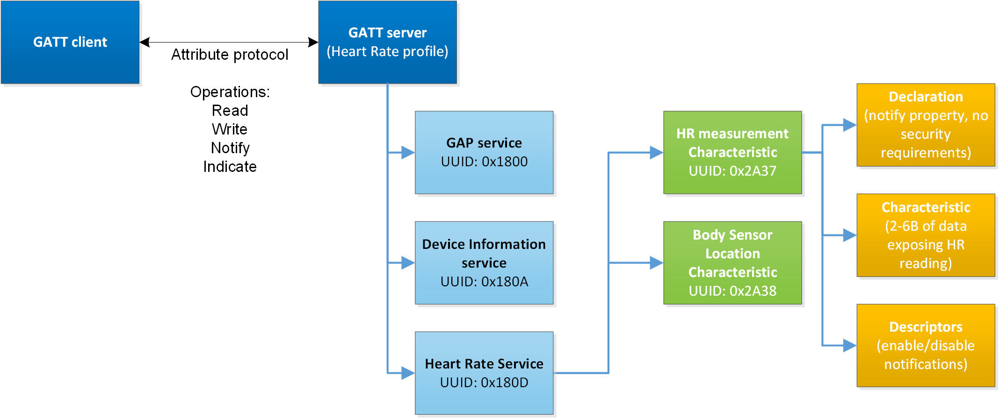

# Generic Attribute Profile (GATT)

Generic Attribute Profile (GATT) is built on top of the Attribute Protocol (ATT) and establishes common framework for the data transported and stored by the Attribute Protocol. GATT defines two roles: Server and Client.

The GATT server stores the data transported over the Attribute Protocol and accepts ATT requests from the GATT client. The GATT server on the other hand sends responses to requests and, when configured, sends indication and notifications to the GATT client when events occur on the GATT server. GATT also specifies the format of data contained on the GATT server.

Attributes, as transported by the Attribute Protocol, are formatted as services and characteristics. Services may contain a collection of characteristics. Characteristics contain a single value and any number of descriptors describing the characteristic value.

Bluetooth profiles specify the structure in which data is exchanged. The profile defines elements, such as services and characteristics, used in a profile, but it may also contain definitions for security and connection-establishment parameters. Typically a profile consists of one or more services that are needed to accomplish a high-level use case, such as heart-rate or cadence monitoring. Standardized profiles allow device and software vendors to build inter-operable devices and applications.

Bluetooth SIG standardized profiles are defined in profiles specifications. These are available at [https://www.bluetooth.com/specifications/specs/](https://www.bluetooth.com/specifications/specs/).

## Services

Services are collections of data composed of one or more characteristics used to accomplish a specific function of a device, such as battery monitoring or temperature data, rather than a complete use case.

Standardized Bluetooth SIG are defined in service specifications, which are available at [https://www.bluetooth.com/specifications/specs/](https://www.bluetooth.com/specifications/specs/).

## Characteristics

A characteristic is a value used in a service, either to (1) expose and/or exchange data and/or (2) control information. Characteristics have a well-defined, known format. They also contain information about how the value can be accessed, what security requirements must be fulfilled, and, optionally, how the characteristic value is displayed or interpreted. Characteristics may also contain descriptors that describe the value or permit configuration of characteristic data indications or notifications.

Standardized characteristics are defined in the Characteristic Specification, which are available at [https://www.bluetooth.com/specifications/specs/](https://www.bluetooth.com/specifications/specs/).

The figure below illustrates the relationship between GATT client, GATT server, services, characteristics and characteristics declaration, data, and descriptors.

