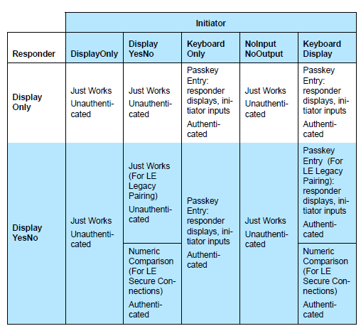
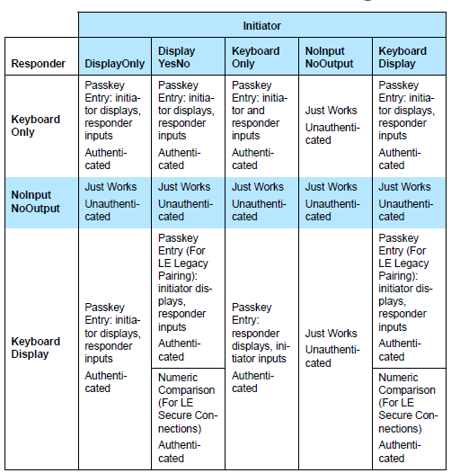

# Bluetooth LE Security

To make sure the communication over Bluetooth LE technology is always secure and protected, the technology provides several features to ensure the trust, integrity, privacy, and encryption of the data.

The first section provides an overview of Bluetooth LE security technology. Subsequent sections discuss the following topics in more detail:

- Pairing

- Encryption

- Privacy

## What Protection Does Bluetooth Security Provide?

The Bluetooth specification defines security features to protect the user’s data and identity. The security features used by Bluetooth LE technology are either NIST compliant or FIPS approved.

Bluetooth LE technology provides three basic security services:

- **Authentication and Authorization**: Establishing trusted relationships between devices

- **Encryption and Data Protection**: Protecting data integrity and confidentiality

- **Privacy and Confidentiality**: Preventing device tracking

The Bluetooth security model includes five security features:

- **Pairing**: the process for creating shared secret keys

- **Bonding**: storing the keys created during pairing so they can be used later

- **Device Authentication**: verification of stored keys

- **Encryption**: data confidentiality

- **Message Integrity**: protection against data alteration

The Security Manager is responsible for:

- Pairing

- Key distribution

- Generating hashes and short term keys

The Link Layer, on the other hand, is responsible for data encryption and decryption.

The Bluetooth LE security features provide protection against the following common threats in wireless communications.

### Man-in-the-Middle Protection

A Man-in-the-Middle (MITM) attack requires the ability to monitor, alter, or inject messages into a communications. This can be done, for example, with active eavesdropping where the attacker listens and relays messages between two parties who think are directly communicating with each other over a private connection, which is actually fully controlled by the attacker.

Bluetooth LE technology provides protection against MITM attacks if the devices are paired either by using the passkey entry or out-of-band pairing method. Alternatively, LE Secure connections and the numeric comparison pairing method can be used in devices that use Bluetooth 4.2 or newer standards.

### Protection against Passive Eavesdropping

Passive Eavesdropping means that someone is passively listening (for example by using a sniffer) to the communication of others. To protect against passive eavesdropping, LE Secure Connection uses ECDH public key cryptography, which provides a very high degree of strength against passive eavesdropping attacks as it allows the key exchange over unsecured channels.

### Privacy Protection

Since most Bluetooth LE devices have an address associated to them and the address is carried in the advertisement packets, it is possible to associate the address to devices in order to track them. The privacy feature in Bluetooth LE technology and the frequently changing address can be used to protect against tracking.

## Pairing and Bonding

The Bluetooth pairing is the process where the parties involved exchange their identity information in order to set up a trusted relationship and generate encryption keys used for data exchange. The Bluetooth LE technology provides multiple options for pairing, depending on the security requirements of the application.

Bluetooth LE standard versions 4.0 and 4.1 use the Secure Simple Pairing model, in which users can choose one method from Just Works, Passkey Entry, and Out-of-Band mechanisms based on the input/output capability of the devices.

In Bluetooth LE standard version 4.2, security is enhanced by the new LE Secure Connections pairing model, by adding a numeric comparison method, and by introducing the Elliptical Curve Diffie-Hellman (ECDH) key exchange algorithm.

The tables below summarize the association models that can be used between both parties depending on their supported I/O capabilities (BLUETOOTH SPECIFICATION Version 4.2 [Vol 1, Part A] 5.4.1 Association Models).

The term pairing means the generation and exchange of security keys, and the term bonding refers to the storage of the security keys so they can be used later.

## Encryption

Bluetooth LE technology uses AES-CCM cryptography for encryption, and the encryption is performed by the Bluetooth LE controller. This encryption function generates 128-bit encrypted using the AES-128-bit block cypher as defined in FIPS-1971.

## Privacy

Bluetooth LE technology also supports a feature that reduces the ability to track a Bluetooth LE device over a period of time. This is achieved by changing the Bluetooth device address on a frequent basis. The changing address is called the public address and the bonded devices are able to resolve the private (non-changing) address from the public address.

In order to resolve the private address the devices need to be previously bonded. The public address is generated using the device’s IRK (Identity Resolving Key) exchanged during the previous pairing or bonding procedure.

In Bluetooth 4.0 and 4.1 standards, the private addresses are resolved and generated at the host. In Bluetooth 4.2 and newer standards, the private addresses are resolved and generated at the controller without involving the host.
