# Working with the Zigbee/Bluetooth Examples

This section describes:

- How to build and flash the dynamic multiprotocol applications supplied with the Zigbee EmberZNet SDK.

- How to add Bluetooth to a Zigbee project and turn it into a dynamic multiprotocol project.

## Application Generation

To work with Zigbee/Bluetooth dynamic multiprotocol applications as decribed in this application note, you must install SDK 4.0 or higher. The applications can be built with GCC (The GNU Compiler Collection) or IAR-EWARM. See [Zigbee EmberZNet Quick-Start Guide for SDK 7.0 and Higher](https://docs.silabs.com/zigbee/latest/zigbee-7x-quick-start-guide/) for information on installing the SDKs and setting up compilers.

Dynamic multiprotocol applications are generated, built, and uploaded in the same way as other applications. If you are not familiar with these procedures, see [Zigbee EmberZNet Quick-Start Guide for SDK 7.0 and Higher](https://docs.silabs.com/zigbee/latest/zigbee-7x-quick-start-guide/) for details. The dynamic multiprotocol applications included with the EmberZNet SDK are:

- **Zigbee BLE – DynamicMultiprotocolLight** is an application designed to demonstrate a DMP device with Zigbee 3.0 coordinator capabilities.

- **Zigbee BLE – DynamicMultiprotocolLightSed** is an application designed to demonstrate a DMP device with SED capabilities.

The following summary procedure uses the **DynamicMultiprotocolLight** example application.

1. In Simplicity Studio, create a new project based on the **DynamicMultiprotocolLight** example.

2. Once the project is created, open the workspace in your IDE and click **Build** (hammer icon) to build the application image.

3. To flash the application image, move to the Devices Tab in Studio, right-click the application .s37 file, and select **Flash Target**.

   If you have more than one device connected, select the desired target. The Flash Programmer opens.

4. Select the desired .s37 file and click **Flash** to flash the file to the target.

5. Application load success indicators are code-dependent. If the example projects are being used on a development board that supports LCD functionality, the LCD displays the following screen on power up. Press button PB0 to change to the light display. On other development boards that do not have additional peripherals to support a fully featured user interface, use the command line interface to run various commands.

   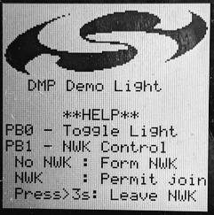  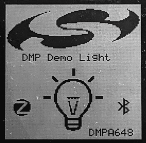

>**Note**: Silicon Labs examples require a bootloader. If the bootloader gets erased, an easy way to load a bootloader is to run the Dynamic Multiprotocol Light demo. This installs a combined bootloader/application image. Then you can flash your own application image to update only the application area. If you are using a board that is not compatible with the available demos, then you can load a bootloader by selecting an example, such as **SPI Flash Storage Bootloader (single image)**, and building it and flashing it as described above.

## Converting a Zigbee Application to a Zigbee/Bluetooth LE Dynamic Multiprotocol Application

This section describes the configuration changes required to convert a working Zigbee application into a Zigbee/Bluetooth LE Dynamic Multiprotocol application. The instructions present the generic steps for the conversion, with specific examples based on turning the Z3Light example into the equivalent of **DynamicMultiprotocolLight.**

Requirements:

- Zigbee application set up to build with IAR ARM or GCC (these instructions use Z3 Light)

- Any EFR32 part with a minimum of 512 kB of flash and 64 kB of RAM

>**Note**: The Dynamic Multiprotocol examples do not support OTA updates out of the box. To support OTA updates, uninstall the Zigbee LCD component. This frees up the port pins that are multiplexed with the external flash.

### Generate and Build the Zigbee Application

The purpose of this step is to verify that the base Zigbee application had loaded and is working correctly, and that output is printing to the console. This example uses the Z3Light sample application. It begins with the default settings, so that the configuration changes are clear. Generate and build the project, load it to the board and check the Serial 1 output to make sure it is up and running.

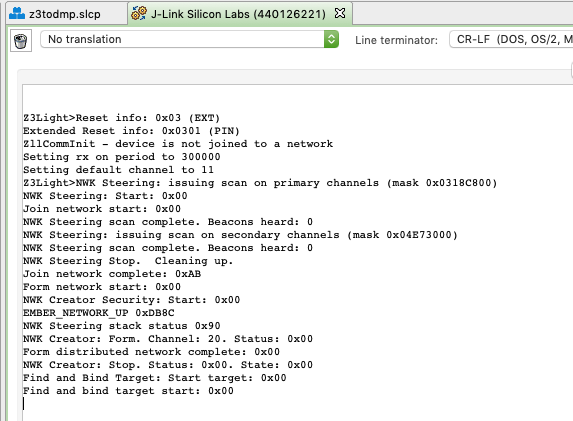

### Configure the Project

To convert the Z3Light application into a Zigbee-Bluetooth LE multiprotocol application similar to the DMP Light, follow the steps below:

1. Navigate to the SOFTWARE COMPONENTS tab on the Z3Light project and search for and add the following components.

- **Bluetooth Core** - Reason: This is the Bluetooth stack core component

>**Note**: Installing this enables multiple protocol stacks on the project and thereby also enables the CMSIS RTOS2 layer and FreeRTOS kernel, which is the default RTOS implementation. Micrium RTOS is also supported.

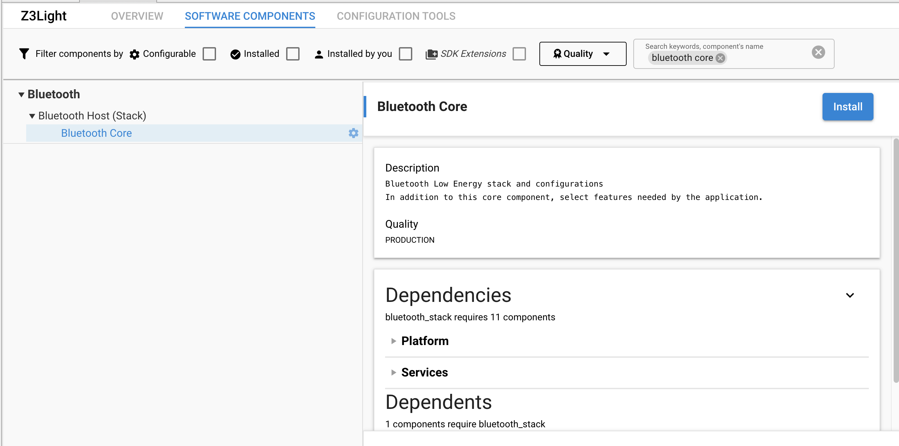

- **GATT Client, GATT Server (Static GATT database), Security Manager, System** - Reason: Basic Bluetooth building blocks.

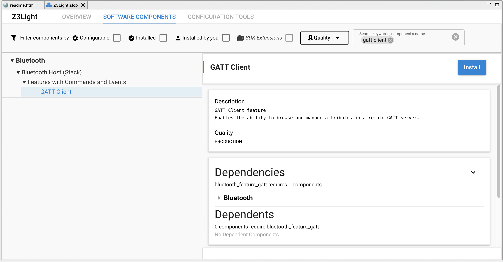

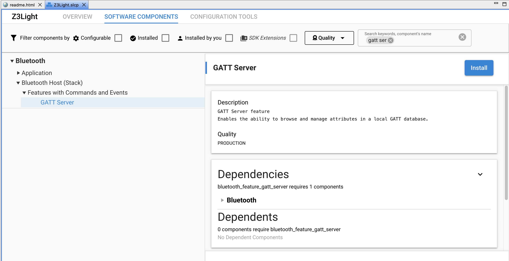

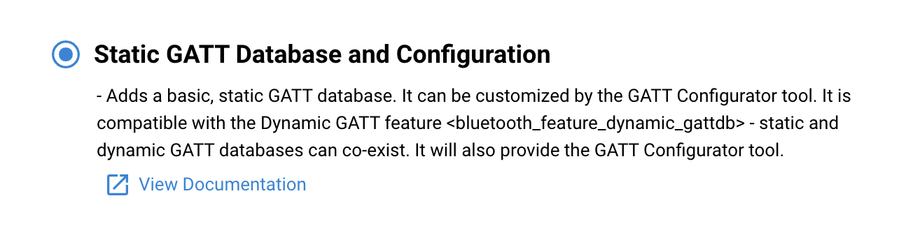

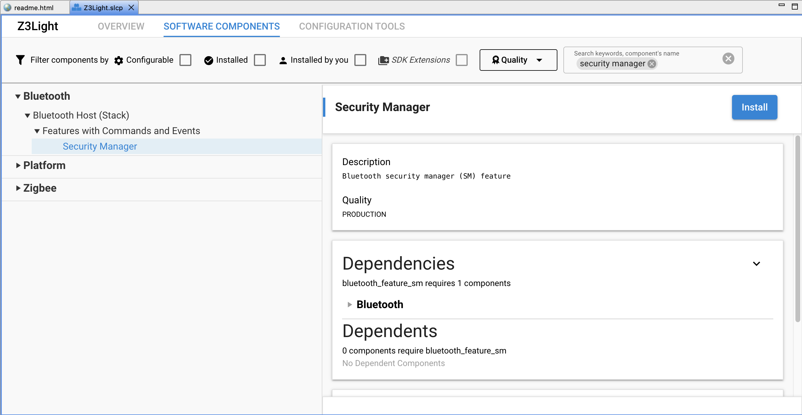

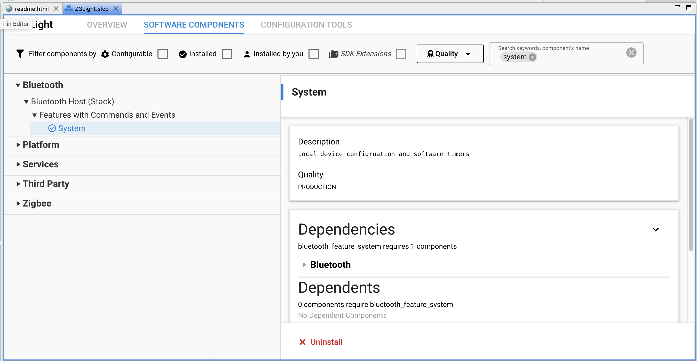

- **Legacy Advertising, Connection, Scanner**. Reason: Basic Bluetooth features.

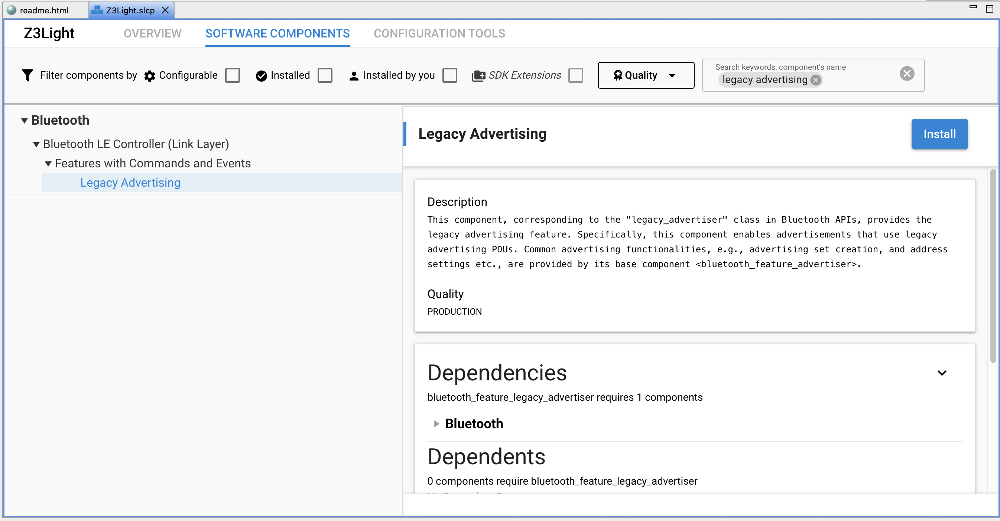

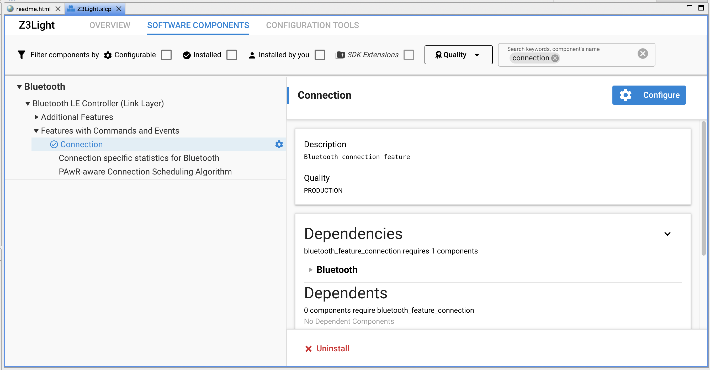

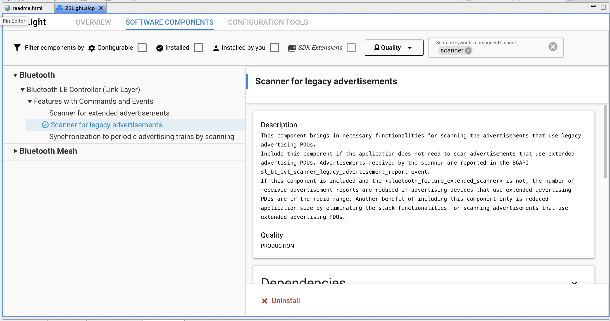

- **If your application uses Free RTOS, configure FreeRTOS component and increase Timer task priority to 53.** Reason: Due to the usage of RTOS event flags in the Bluetooth stack, the timer task priority must be higher than all of the Bluetooth RTOS task priorities.

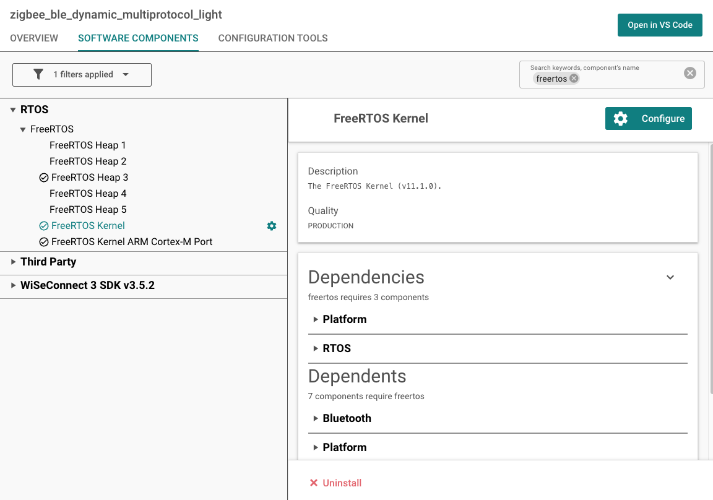

2. Add an implementation of `sl_bt_on_event(sl_bt_msg_t\* evt)` in your app.c file. The following is an example implementation of the Bluetooth LE event handler that starts advertisements on boot and prints out information as some of the most common events occur:

```C
#include "sl_bluetooth.h"
#include "sl_bluetooth_advertiser_config.h"
#include "sl_bluetooth_connection_config.h"

#include "gatt_db.h"
uint8_t adv_handle;

#define DEVNAME_LEN 8
#define UUID_LEN 16 // 128-bit UUID

// to convert hex number to its ascii character
uint8_t ascii_lut[] = { '0', '1', '2', '3', '4', '5', '6', '7', '8', '9', 'A', 'B', 'C', 'D', 'E', 'F' };

void zb_ble_dmp_print_ble_address(uint8_t *address)
{
  sl_zigbee_app_debug_print("\nBLE address: [%02X %02X %02X %02X %02X %02X]\n",
                            address[5], address[4], address[3],
                            address[2], address[1], address[0]);
}

void enableBleAdvertisements(void)
{

  sl_status_t status;

  /* Create the device Id and name based on the 16-bit truncated bluetooth address
     Copy to the local GATT database - this will be used by the BLE stack
     to put the local device name into the advertisements, but only if we are
     using default advertisements */
  uint8_t type;
  bd_addr ble_address;
  static char devName[DEVNAME_LEN];

  status = sl_bt_system_get_identity_address(&ble_address, &type);
  if ( status != SL_STATUS_OK ) {
    sl_zigbee_app_debug_println("Unable to get BLE address. Errorcode: 0x%x", status);
    return;
  }
  uint16_t devId = ((uint16_t)ble_address.addr[1] << 8) + (uint16_t)ble_address.addr[0];

  devName[0] = 'D';
  devName[1] = 'M';
  devName[2] = 'P';
  devName[3] = ascii_lut[( (ble_address.addr[1] & 0xF0) >> 4)];
  devName[4] = ascii_lut[(ble_address.addr[1] & 0x0F)];
  devName[5] = ascii_lut[( (ble_address.addr[0] & 0xF0) >> 4)];
  devName[6] = ascii_lut[(ble_address.addr[0] & 0x0F)];
  devName[7] = '\0';

  sl_zigbee_app_debug_println("devName = %s", devName);
  status = sl_bt_gatt_server_write_attribute_value(gattdb_device_name,
                                                   0,
                                                   strlen(devName),
                                                   (uint8_t *)devName);

  if ( status != SL_STATUS_OK ) {
   sl_zigbee_app_debug_println("Unable to sl_bt_gatt_server_write_attribute_value device name. Errorcode: 0x%x", status);
    return;
  }

  status = sl_bt_advertiser_set_timing(adv_handle,
                                       (100 / 0.625), //100ms min adv interval in terms of 0.625ms
                                       (100 / 0.625), //100ms max adv interval in terms of 0.625ms
                                       0,   // duration : continue advertisement until stopped
                                       0);   // max_events :continue advertisement until stopped
  if (status != SL_STATUS_OK) {
    return;
  }
  status = sl_bt_advertiser_set_report_scan_request(adv_handle, 1);   //scan request reported as events
  if (status != SL_STATUS_OK) {
    return;
  }
  /* Start advertising in user mode and enable connections*/
  status = sl_bt_legacy_advertiser_start(adv_handle,
                                         sl_bt_advertiser_connectable_scannable);

  if ( status ) {
    sl_zigbee_app_debug_println("sl_bt_legacy_advertiser_start ERROR : status = 0x%0X", status);
  } else {
    sl_zigbee_app_debug_println("BLE custom advertisements enabled");
  }
}

/** @brief
*
* This function is called from the BLE stack to notify the application of a
* stack event.
*/
void sl_bt_on_event(sl_bt_msg_t* evt)
{
  switch (SL_BT_MSG_ID(evt->header)) {

  case sl_bt_evt_system_boot_id: {
    bd_addr ble_address;
    uint8_t type;
    sl_status_t status = sl_bt_system_hello();
    sl_zigbee_app_debug_println("BLE hello: %s",
                                (status == SL_STATUS_OK) ? "success" : "error");

    status = sl_bt_system_get_identity_address(&ble_address, &type);
    zb_ble_dmp_print_ble_address(ble_address.addr);

    #define SCAN_WINDOW 5
    #define SCAN_INTERVAL 10

    status = sl_bt_scanner_set_parameters(sl_bt_scanner_scan_mode_active,
                                          (uint16_t)SCAN_INTERVAL,
                                          (uint16_t)SCAN_WINDOW);

    status = sl_bt_advertiser_create_set(&adv_handle);
    if (status) {
      sl_zigbee_app_debug_println("sl_bt_advertiser_create_set status 0x%02x", status);
    }

    // start advertising
    enableBleAdvertisements();
  }
  break;

  case sl_bt_evt_connection_opened_id: {
    sl_zigbee_app_debug_println("sl_bt_evt_connection_opened_id \n");
    sl_bt_evt_connection_opened_t *conn_evt =
      (sl_bt_evt_connection_opened_t*) &(evt->data);

    //preferred phy 1: 1M phy, 2: 2M phy, 4: 125k coded phy, 8: 500k coded phy
    //accepted phy 1: 1M phy, 2: 2M phy, 4: coded phy, ff: any
    sl_bt_connection_set_preferred_phy(conn_evt->connection, sl_bt_gap_phy_1m, 0xff);

    enableBleAdvertisements();
    sl_zigbee_app_debug_println("BLE connection opened");
  }
  break;

  case sl_bt_evt_connection_phy_status_id: {
    sl_bt_evt_connection_phy_status_t *conn_evt =
      (sl_bt_evt_connection_phy_status_t *)&(evt->data);
    // indicate the PHY that has been selected
    sl_zigbee_app_debug_println("now using the %dMPHY\r\n",
                                conn_evt->phy);
    }
    break;

    case sl_bt_evt_connection_closed_id: {
      sl_bt_evt_connection_closed_t *conn_evt =
        (sl_bt_evt_connection_closed_t*) &(evt->data);

      // restart advertising, set connectable
      enableBleAdvertisements();
      sl_zigbee_app_debug_println(
        "BLE connection closed, handle=0x%02x, reason=0x%02x",
        conn_evt->connection, conn_evt->reason);
    }
    break;

    default:
      break;
  }
}
```

3. Save your new Z3Light project and click **Generate** in the project overview pane.

   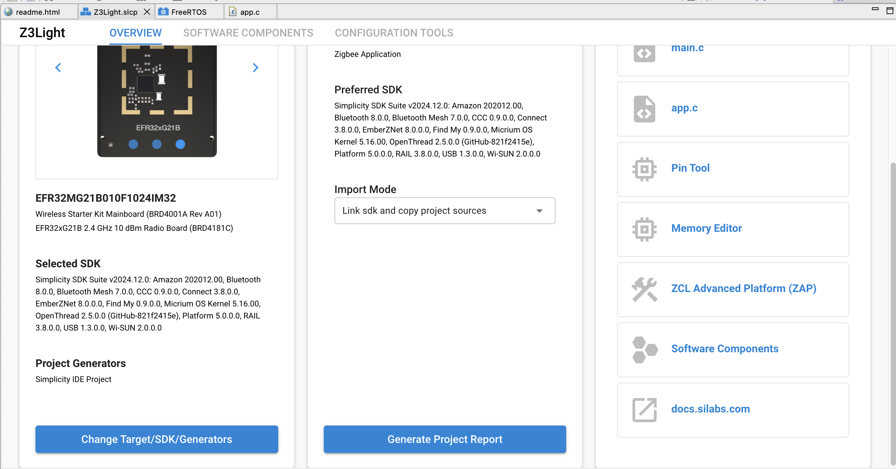

4. Build and flash the project and look for the device in the “Connected Lighting demo” screen of the Simplicity Connect smartphone app.

   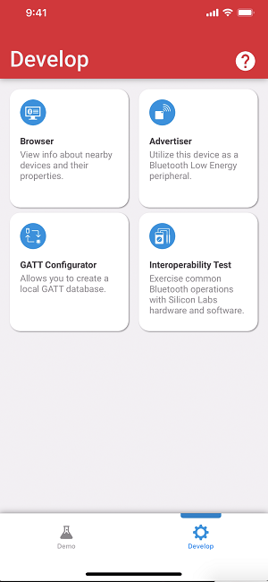 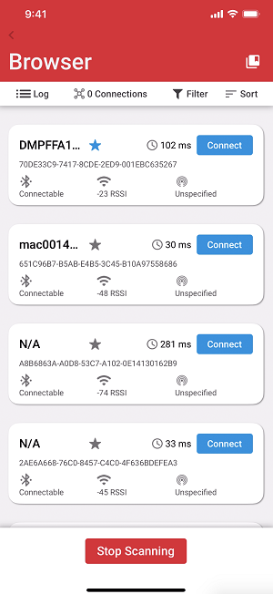 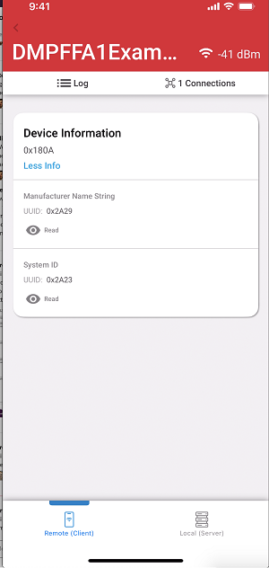

You can also see Bluetooth LE activity related printing in the Serial 1 tab of the console.

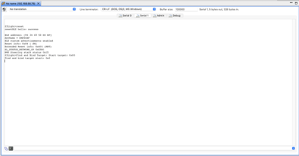

This is very basic Bluetooth functionality. To learn more about programming Bluetooth LE functionality, see [Getting Started with Silicon Labs Bluetooth LE Development](https://docs.silabs.com/bluetooth/latest/bluetooth-getting-started-overview/).
