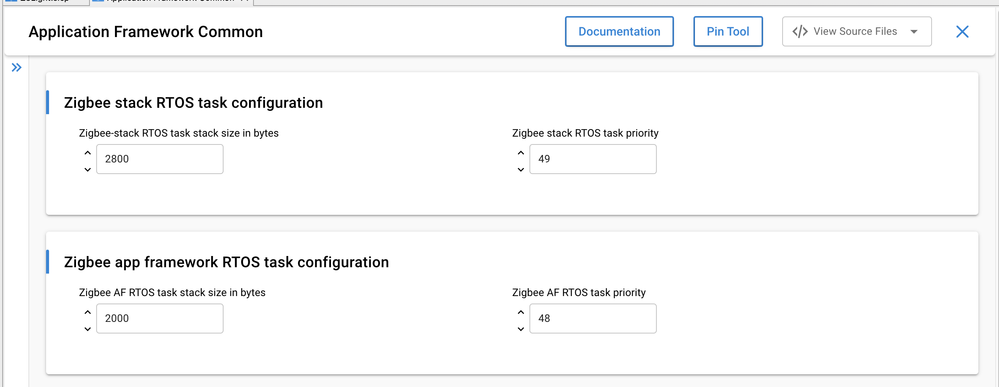
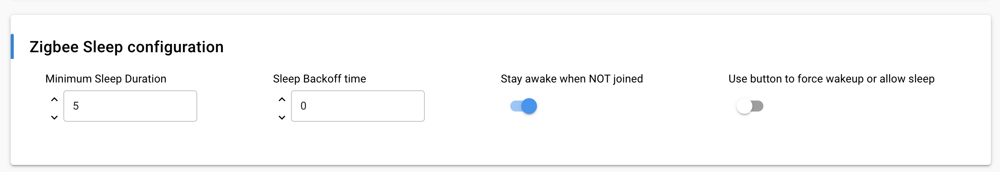
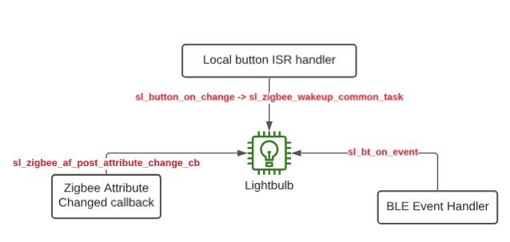
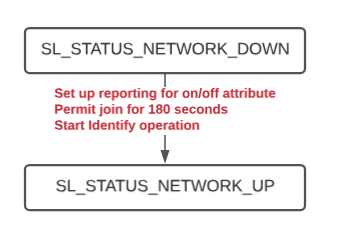
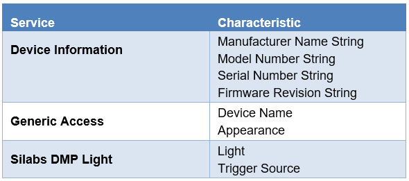
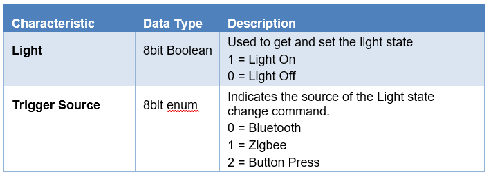
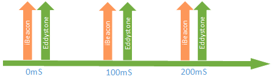
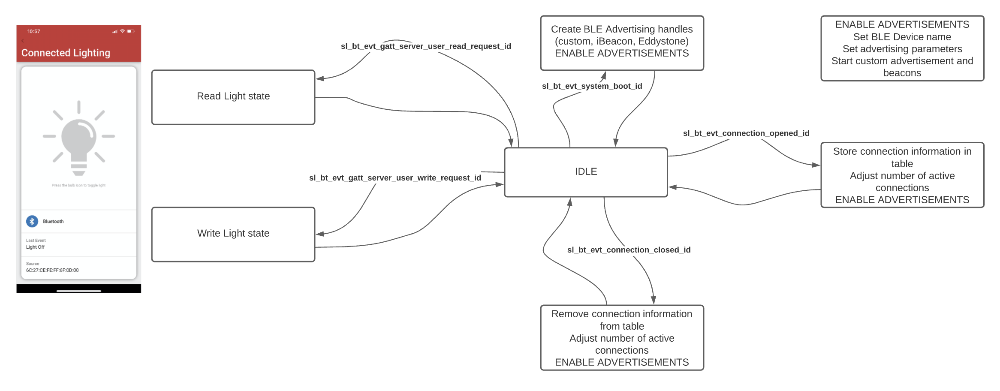
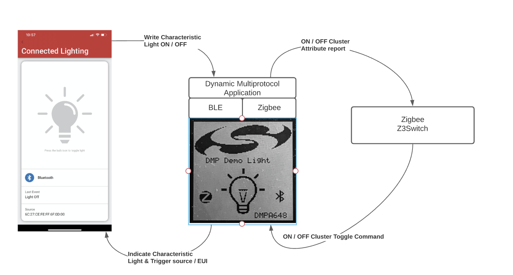

# About the Zigbee/Bluetooth LE Examples

The Zigbee/Bluetooth LE Dynamic Multiprotocol examples demonstrate a light that can be controlled via Bluetooth LE and Zigbee. Software examples may be compiled using the sample SoC appliations in the EmberZNet SDK. The purpose of the examples is to show how to implement a dynamic multiprotocol application using the Silicon Labs stack.

The Dynamic Multiprotocol Demo application has these main components.

1. Mainboard User Interface (LCD, Buttons, LEDs (optional for parts with these peripherals))

2. Zigbee application (Coordinator or Sleepy End Device)

3. Bluetooth application

4. CLI interface

## Mainboard User Interface

The mainboard-interface application code has three main components. These help to enhance the user experience, but are not essential to the core DMP functionality. If your demo radio board does not support LCD, a minimal version of these applications is automatically chosen and the buttons, LED and LCD components are automatically removed from the project.

### Buttons

The DynamicMultiprotocol sample applications use two buttons on the mainboard. This functionality is provided using two instances  of the **Simple Button** component and can be easily uninstalled if the mainboard does not have buttons. Button PB0 toggles the local state of the light. Button PB1 controls network operations such as form, join, and leave.

### LED

The sample app displays the current state of the On/Off light using the two LEDs on the mainboard. This application code is provided using two instances of the **Simple LED** component.

### LCD

The LCD enhances the overall user experience by providing helpful instructions and displaying the state of the node. This functionality is provided using the **Zigbee LCD Display** component. This component provides APIs to update the text and graphic on the LCD. These APIs are invoked from the application’s Zigbee callbacks and Bluetooth event handlers.

## Command Line Interface Task (CLI)

The CLI task runs as a relatively low priority task and processes commands and displays output. CLI commands post the semaphore and allow  Zigbee RTOS tasks to run by invoking the function `sl_zigbee_wakeup_common_task ()` in the post command hook.

## Zigbee Application

The **DynamicMultiprotocolLight** sample application is a Zigbee coordinator and **DynamicMultiprotocolLightSed** is a Zigbee sleepy end device. Both sample applications demonstrate a wireless light that can be controlled locally using a button or wirelessly using a Zigbee switch or a Bluetooth LE mobile application.

The following cluster set is supported by both the **DynamicMultiprotocolLight** and **DynamicMultiprotocolLightSed** applications:

- Basic

- Identify

- Scenes

- Groups

- On/Off

- ZLL Commissioning

The **DynamicMultiprotocolLight** example also supports Green Power Proxy Basic endpoint. Note that the examples were developed with a focus on demonstrating dynamic multiprotocol features and may not be Zigbee-certifiable.

The On/Off cluster controls the LEDs and the bulb icon on the mainboard LCD to represent the state of the light.

### Zigbee RTOS Task

The DMP sample applications utilize CMSIS-RTOS2 constructs and therefore are structured to support either Micrium OS or FreeRTOS. Micrium OS is set up as default RTOS. Free RTOS is also supported. The RTOS tasks are:

- Bluetooth link layer task (priority: 52)

- Bluetooth host stack task (priority: 51)

- Bluetooth event handler task (priority: 50)

- Zigbee stack task (priority: 49)

- Zigbee app framework task (priority: 48)

- Command Line Interface task (priority: 16)

Zigbee RTOS task-related configuration is in the Zigbee **Application Framework Common** component. Note that the Zigbee and Bluetooth task priorities must not be changed from their defaults in order to ensure that the application works as intended. Any application RTOS tasks must be lower priority than the Zigbee stack and Zigbee app framework tasks.



#### Custom RTOS Tasks

Custom tasks may be created following the example example code below. As of SiSDK 2024.6, all stack and application APIs are thread-safe.

```C
static osThreadId_t task_id;
__ALIGNED(8) static uint8_t task_stack[TASK_STACK_SIZE];
__ALIGNED(4) static uint8_t task_cb[osThreadCbSize];
static osThreadAttr_t task_attr;

void create_new_task(void)
{
  task_attr.name = "Custom task";
  task_attr.stack_mem = &task_stack[0];
  task_attr.stack_size = sizeof(task_stack);
  task_attr.cb_mem = task_cb;
  task_attr.cb_size = osThreadCbSize;
  task_attr.priority = (osPriority_t)TASK_PRIORITY;
  task_attr.attr_bits = 0;
  task_attr.tz_module = 0;
  task_id = osThreadNew(task,
                        NULL,
                        &task_attr);
  assert(task_id != NULL);
}
```

#### Power Modes and Sleep

The Zigbee codebase utilizes power manager to provide input that enables entry and exit into Stack and application framework Several application override mechanisms control whether the microcontroller is allowed to enter sleep (EM2) or idle (EM1) modes. These flags, in combination with the time to the closest application or stack event, control how long the Zigbee RTOS tasks yield for. Zigbee app framework specific options are also configured in the **Application Framework Common** component.



### Application Code

On either DMP light application, once the Zigbee stack is set up to run, subsequent interactions with the stack occur via event handlers. The following figure shows the 3 ways to change the state of the light (local button press, Zigbee message from a switch, BLE message from the Simplicity Connect app) and the handlers that fire in each of these cases.



Each enabled cluster must have a corresponding component that handles the callbacks for the cluster. Alternatively, this can be provided by a custom implementation in the project callbacks file. In addition, the Zigbee callbacks file subscribes to optional stack callbacks, such as stack status callbacks, to show the network state and perform other operations based on change of state.

Whenever the coordinator sample application starts pjoin, it starts identifying and also puts all the connected lights in identify mode. This helps the joining switch to identify all the lights present in the network. The sleepy sample application does the same on the steering status callback.



The On/Off attribute can be changed locally using the button PB0. The button_on_change ISR routine fires on change of the button state. Note that, since this routine is executed from an interrupt context, printing messages in this routine is not recommended. For this reason, once time stamps are recorded and states are set, a separate event handler is set to active to further process the button press. Since the event handler runs from the Zigbee task context, the semaphore must be posted by invoking the function `sl_zigbee_ wakeup_common_task()`.

The On/Off attribute may also be changed by receiving a Zigbee on-off toggle command from a remote device like the Z3Switch. This path follows the `sl_zigbee_af_post_attribute_change_cb`. Any change to the attribute will also trigger a notification over a Bluetooth LE connection, if one is open. In addition to the state, the trigger source and the EUI of the trigger source are recorded for tracking.

The On/Off attribute may also be modified using the Simplicity Connect mobile application. The light displays on the app as “DMPxxxx” where xxxx are the last four digits of the Bluetooth LE MAC address. The characteristic can be read and written using the mobile application. This triggers a change to the Zigbee attribute.

>**CAUTION for SDK 4.4 and older: The Zigbee stack APIs are not thread-safe. As such, all calls to EmberZNet functions should be made from the Zigbee task to avoid the risk of concurrency issues. To avoid the risk of shared resources, if you want to send Zigbee messages or use EmberZNet functions from a task other than the Zigbee Stack Task, you must schedule a custom event from within the non-Zigbee Stack task. In the corresponding event handler function for the custom event the Zigbee stack APIs can be used, as the event handler will be called from the Zigbee Stack Task context.**

>**As of SiSDK 2024.6, Zigbee stack APIs are thread-safe. Application framework APIs are protected by a mutex in the CLI task context. If they are to be called from a custom RTOS task, you are expected to surround the calls with `sl_zigbee_af_acquire_lock` and `sl_zigbee_af_release_lock`. It is also important to note that this version also introduced the standardization of all function names. Refer to the [Zigbee API Reference Manual](https://docs.silabs.com/zigbee/latest/zigbee-api-ref-v7-vs-v8/02-renaming-changes-in-zigbee) for more details.**

## Bluetooth Application

The Bluetooth application supports following services and characteristics. These are pre-selected in the GATT editor during project generation.



### Silabs DMP Light Service

In the above table the ‘Silabs DMP Light’ is a custom service with a UUID of bae55b96-7d19-458d-970c-50613d801bc9. This custom UUID is used to uniquely identify the Light by the Simplicity Connect application.

The Service has two characteristics,



### Beacons

The application implements both an iBeacon as well as an Eddystone beacon. The default behavior is to transmit each beacon at 100mS intervals.



### Bluetooth Event Handling

The Bluetooth stack is initialized as part of the Bluetooth task. The Bluetooth task handles the Bluetooth LE link layer messaging and management. A number of events that are called in the context of the Zigbee task allow the user application to interact with the Bluetooth stack. The following diagram describes the Bluetooth-related events..

>**Note**: Bluetooth event handling is same for both DMP demos.



### Bluetooth and Zigbee Interaction

The primary purpose of the example applications is to show Zigbee and Bluetooth working together on a device. For this purpose, when the Light receives a command to change its state through one protocol, it executes the command and sends out a notification to the other devices using the other protocol to keep everything in sync. Their interaction is the same in both examples.

Two basic operations are described below, first a write to Light characteristics from a Bluetooth connected device (shown in the following figure) and then a change in the Light state from a Zigbee device.



#### Write from the Bluetooth Connected Device

The application’s services and characteristics are pre-selected in the GATT configurator in Simplicity Studio. On generation the characteristics are #define in the gatt_db.h. Using the #define reference, the characteristics can then be coupled to read and write Bluetooth requests. For example, the Light characteristic is reference from GATT as gatt_light_state which is then tied to an application-specific write API of writeLightState in the AppCfgGattServerUserWriteRequest in `sl_bt_event_handler.c`.

The application implements the Zigbee attribute write and a Bluetooth write response in the writeLightState function. Since ember functions are not thread-safe, the application posts a Zigbee event and a semaphore to wake the Zigbee task and invoke the `sl_zigbee_af_write_attribute` function.

The sl_zigbee_af_write_attribute function is used to write the attribute table of the Zigbee application with the value supplied by the Bluetooth connected device above. Since the on-off attribute of the on-off server cluster is a reportable attribute, it is reported to all devices setup in the binding table of the Light.

The `sl_zigbee_af_post_attribute_change_cb` function is then used to change the state of the LEDs and the LCD to indicate the state of the light on the WSTK main board.

#### Write from the Zigbee Connected Device

Any on-off client on the same network as the Light can send an on-off cluster’s On, Off or Toggle command to the Light to change its state. Once such a command is received over the Zigbee interface, the Silicon Labs Zigbee framework interprets it and calls an appropriate handler to change the value of the on-off attribute of the on-off server cluster. In the example **Z3Switch** application, the on-off client sends a Toggle command to the Light, which toggles the value of the on-off attribute and triggers the `sl_zigbee_af_post_attribute_change_cb`. The callback is then used to change the state of the light as well as send notifications for both Trigger Source and Light characteristics to the connected Bluetooth devices and to update the LEDs and the LCD to indicate the change in the Light state. Example code for the callback can be found in the project callbacks file.
