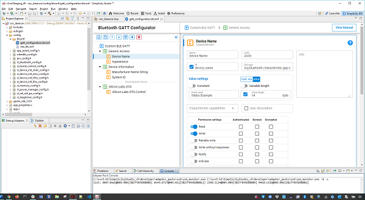
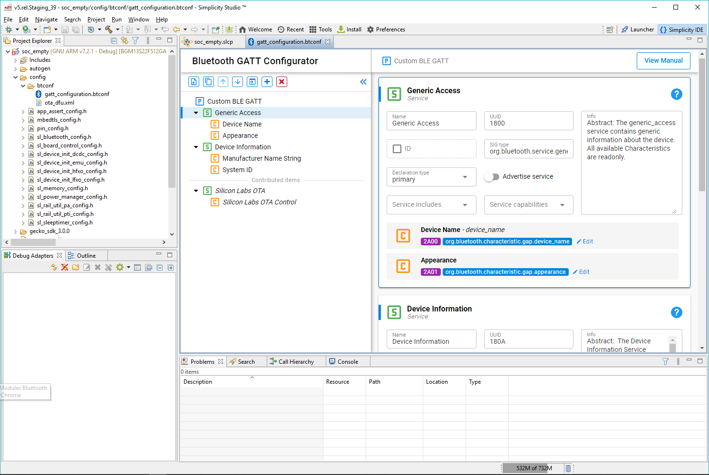
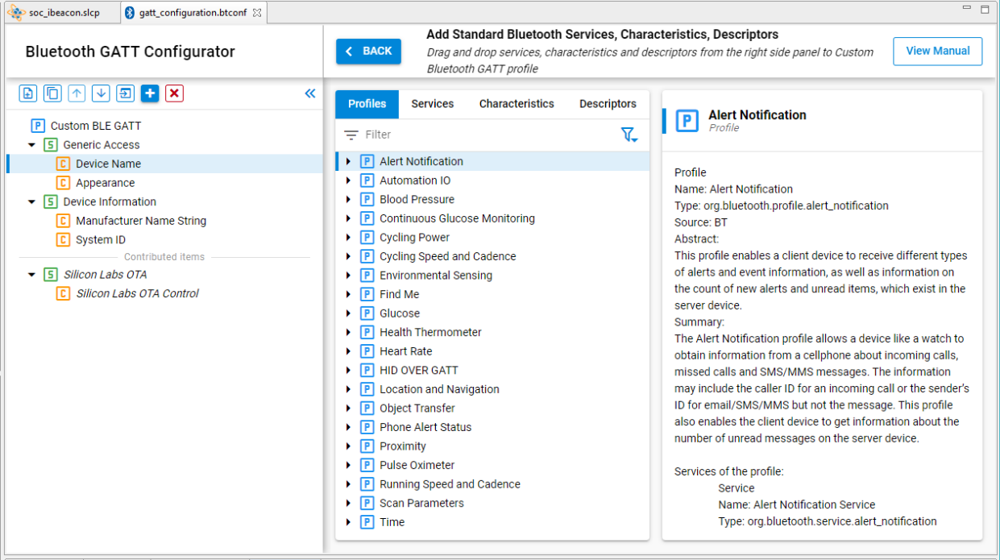
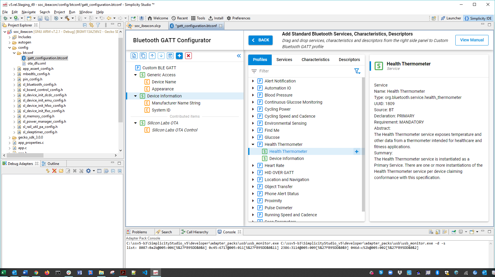
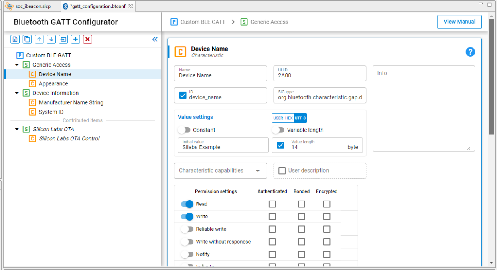
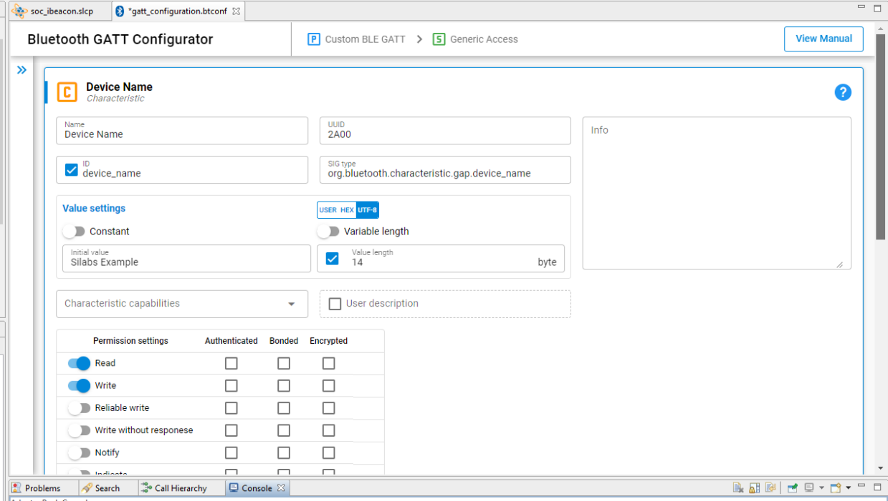
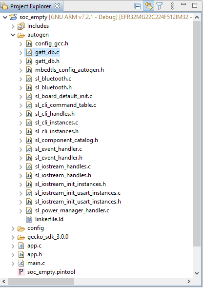

# GATT Configurator Overview

The GATT Configurator is a simple-to-use tool to help you build your own GATT database. A list of project Profiles/Services/Characteristics/Descriptors is shown on the left and details about the selected item is shown on the right.

The GATT Configurator is composed of a Custom GATT editor on the left, showing a list of project Profiles/Services/Characteristics/Descriptors, and a Settings editor on the right. A SIG selector allows you to add standard elements to the profile.

An options menu is provided at the top of the Custom GATT editor.

The Custom GATT editor is always visible, and the Settings editor opens by default.

The GATT Configurator menu is:

From left the right, the buttons are for the following:

1. Add an item.

2. Duplicate the selected item.

3. Move the selected item up.

4. Move the selected item down.

5. Import a GATT database.

6. Add Predefined (opens the SIG editor).

7. Delete the selected item.

Click Add Predefined to open the SIG selector.

## SIG Selector

The SIG Selector displays a list of predefined Profiles, Services, Characteristics, and Descriptors. These items can be filtered, using the filter pane. Tabs allow you to switch between different lists. As shown in the following figure, the pane on the right side of the list displays textual information about the latest selection. To add an item to the Custom GATT editor, mouse over it and click + on the right. The item can then be edited in the Settings Section. The selected SIG service/characteristic/descriptor will be added under the highlighted profile/service/characteristic. Click **\< BACK** to return to the Setting Editor.

## Custom GATT Editor

The Custom GATT Editor displays the items present in the current configuration file. This includes a Custom GATT Profile, Services, Characteristics, and Descriptors displayed as a hierarchical list. The order of items shown reflects the order in which they exist in the GATT database. When the Settings Editor is open, select an item to see its properties and configuration.

The \* next to the configuration file name indicates unsaved changes in the configuration.

>**Note**: The Generic Attribute Service is not listed in the Custom GATT database structure (on the left in the previous figure). This is a special service that is maintained by the stack, and can be added by enabling the **Generic Attribute Service** slider in the settings of the Custom BLE GATT profile. Once enabled, the service will be part of the database. It still will not appear in the Custom GATT database structure, nor on iOS devices as iOS hides this service, but you may see it on Android devices, for example.

### Contributed Items

Some services are listed in the configurator as “contributed items”. This means that their content is defined in other components, and they cannot be edited from this view.

## Settings Section

The Settings editor allows you to configure the properties of items such as Profiles, Services, Characteristics and Descriptors that are present in the Custom GATT editor. Selecting an item populates the relevant configuration options such as the name, ID, properties and capabilities. Any changes made in this section reflect immediately for the selected item. You can minimize the Custom GATT editor while editing if you want. All Characteristics for a Service are included in the same Settings editor pane.

## Generating the GATT Database

Database generation happens automatically when the configuration is saved. The generated source files can be found in the directory named “autogen”.

