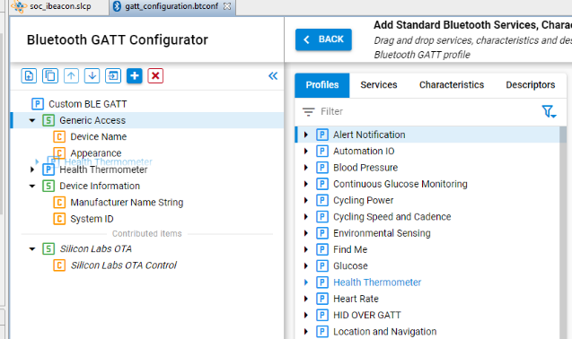
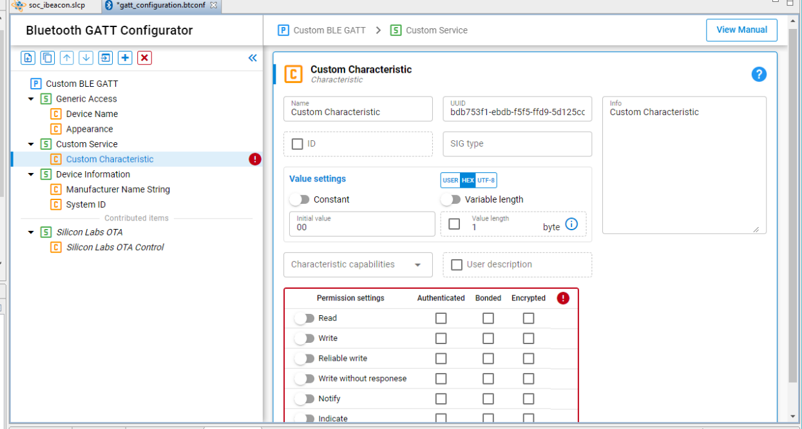
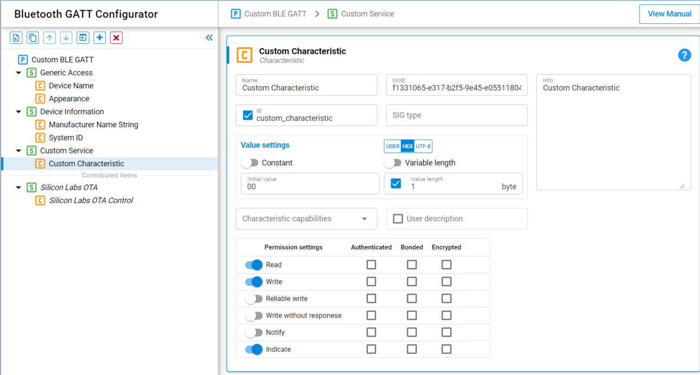
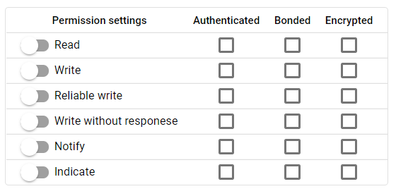
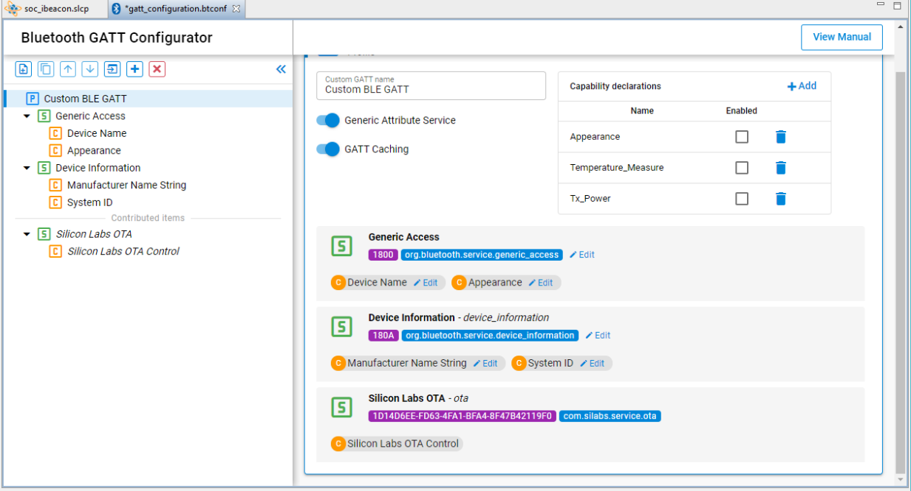
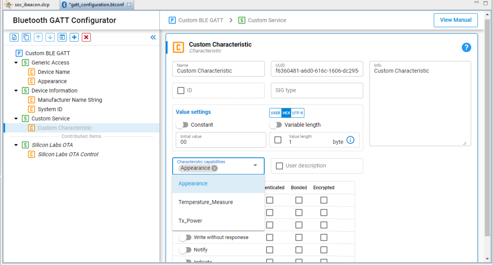
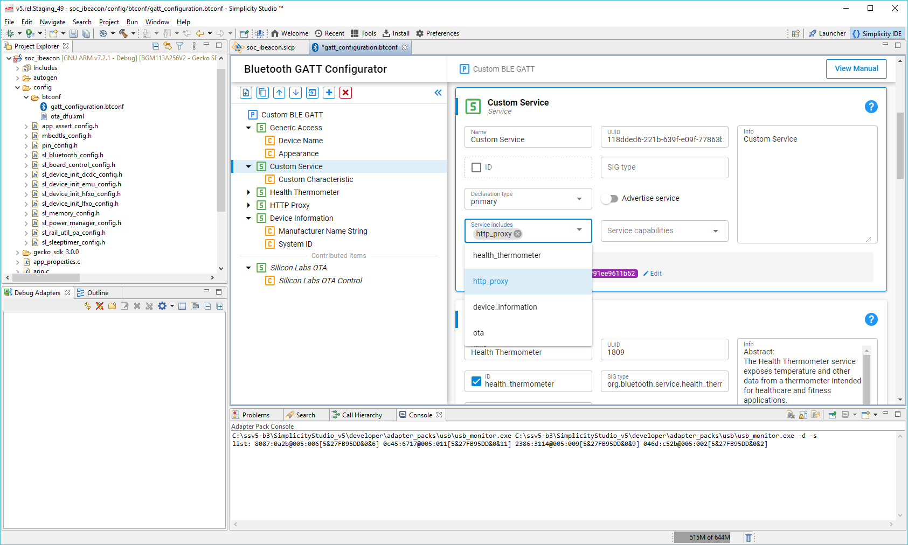
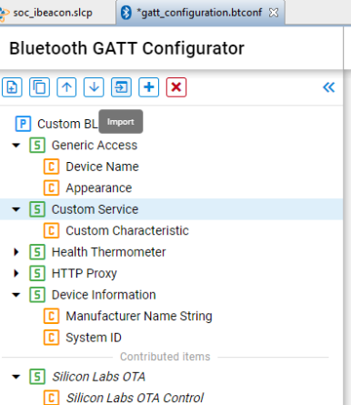

# Use Cases

This chapter describes common tasks performed with the GATT Configurator.

## Drag and Drop

To include predefined items from the source list in your application, drag and drop the item from the Source Section to the Custom GATT section. When you drag and drop a profile or a service, all the Characteristics and Descriptors in the levels underneath get included automatically. Maintaining the hierarchical structure, Descriptors can only be included under Characteristics, which go under Services.



Within the Custom GATT section, drag and drop can be used to reorder items. This saves the trouble of including and configuring the item again. Similarly, an item can be duplicated and moved around in the section.

## Create New Item

Use the Add an item (1) menu option to add a new item in the Custom GATT editor. If the profile is selected, a new Service will be created. If a Service is selected, a new Characteristics is created under the selected item. Descriptors can only be created when you have selected a Characteristic.

When a new item is selected, the Settings section displays the default properties of the item. Here the item can be configured as per the requirements.



The application gets local access to the GATT database using the characteristic ID. You can enter this by selecting the checkbox and entering a unique ID.



Upon generation, this ID gets a macro in the `gatt_db.h` file as shown below.

```C
extern const struct bg_gattdb_def bg_gattdb_data;
#define gattdb_service_changed_char             3
#define gattdb_device_name                      7
#define gattdb_ota_control                     21
#define gattdb_custom_characteristic           24
```

UUID or Universally Unique identifier are numbers used to identify Services, Characteristics, and Descriptors uniquely. There are two types of UUID:

1. **16 bit**: These 16-bit UUIDs are predefined by the Bluetooth SIG. Being short they are energy and memory efficient. For example, the Blood Pressure Service has a UUID of 0x1810 whereas the Battery level Characteristic has a UUID of 0x2A19.

2. **128 bit**: This overcomes the limitation of running out of 16-bit UUIDs and gives the power to declare your own UUIDs for Custom Services and Characteristics. These randomly generated UUIDs in the GATT Configurator are of version 4 (random) variant 1. You can use any UUID for a custom Service or Characteristic if it does not overlap with Bluetooth base UUID: xxxxxxxx-0000-1000-8000-00805F9B34FB.

While there is no central authority ensuring other devices don’t use the same UUID, there is very little chance (1 in 340 undecillion) that two devices end up with the same UUID.

## Adding Permissions

Permissions define what actions can be performed for a given Characteristic or Descriptor. For example, in the Blood Pressure Profile, the Blood Pressure Feature has a Mandatory Read property. For more information about access types and security requirements see the Properties section of [Blue Gecko Bluetooth Profile Toolkit Developer's Guide](https://docs.silabs.com/bluetooth/latest/bluetooth-profile-toolkit-developers-guide/).

First the required access types can be enabled with the sliders, and then the security requirements can be selected with the checkboxes.



>**Note**: The *notify* and *indicate* attribute is stored in the SIG defined Client Characteristic Configuration Descriptor (a descriptor with the UUID 0x2902, which will be autogenerated when notifications are enabled). If you manually add a CCCD to the characteristic, the descriptor’s value will overwrite this setting. A warning will be displayed on the UI for this case.

## Adding Capabilities

Bluetooth SDK 2.4 introduced a new feature called Polymorphic GATT that can be used to dynamically show or hide GATT Services and Characteristics. The GATT Configurator implements this feature using GATT capabilities. This section describes how to do it.

To summarize how capabilities work, each Service/Characteristic can declare several capabilities and the state of the capabilities (enable/disable) determines the visibility of those Services/Characteristics as a bit-wise OR operation. For example, the Service/Characteristic is visible when at least one of its capabilities is enabled and it is not visible when all its capabilities are disabled.

Always start by declaring the GATT-level capabilities and defining their default value. Select the Custom BLE GATT profile, and click the **+** control in the **Capability declarations** table. After adding a capability, you can change the name and default value. For example, Appearance, Temperature_Measure and Tx_power are added to the profile as shown in the following figure.



Once those capabilities are added, they become available on each of the services and characteristics. They can be declared from the dropdown list in the **Characteristic capabilities** section.

On the Service and Characteristic level declared capabilities count as enabled, and the ones which were not selected are disabled.



>**Note**: The capabilities state should not be changed during a connection, as that can cause misbehavior. The safest way is to change the capabilities when no devices are connected.

## Including Services

In a Service definition, you can add one or more references to other services, using the Service includes feature. Include definitions consist of a single attribute (the include declaration) that contains all the details required for the client to reference the included service.

Included services can help avoid duplicating data in a GATT server. If a service will be referenced by other services, you can use this mechanism to save memory and simplify the layout of the GATT server.

Start by declaring an ID for each service that needs to be included. Services without an ID cannot be referenced. This is done by selecting the ID checkbox and providing an identifier text for the Service. Next, select the Service to be referenced from the dropdown list, named “Service includes”.



## Import and Export a GATT Database

### Import

The Import control in the Custom GATT toolbar allows you to import an existing GATT database, using a .btconf file. Note that this will overwrite the existing GATT data.



### Export

There is no separate export function. Another project can directly import the GATT database of this project (named gatt_configuration.btconf)
