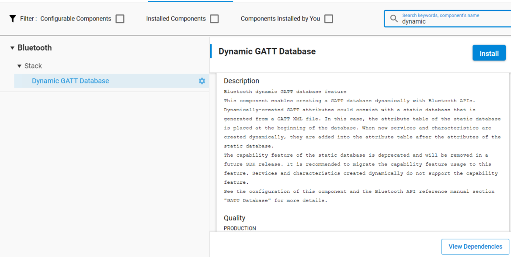

# Dynamic GATT Configuration

## Overview

Silicon Labs Bluetooth SDK v3.2 introduced the ability to create the GATT database dynamically with Bluetooth APIs. These dynamically-created GATT attributes can coexist with a static database generated from a GATT XML file. In this case, the attribute table of the static database is placed at the beginning of the database. When new services and characteristics are created dynamically, they are added into the attribute table after the attributes of the static database.

This feature is recommended for NCP projects. With this method, the target application where the GATT database is located does not need to be modified. Therefore, the database can be built from the host side with the APIs. In other cases, the GATT Configurator is the preferred solution.

## Usage

The “Dynamic GATT Database” feature is not included in projects by default. It needs to be installed from the Software Components tab.



Operations on the GATT database are done in a “session”. The changes are saved when a session is finished by “committing” the changes. Unsaved changes are invisible to a connected remote GATT client. The modifications only takes effect when the session is finished.

Each added service and characteristic needs to be started with the appropriate API, or they will not be visible to the connected clients. This start and stop mechanism can be used to have a polymorphic GATT database, as the capability feature is not supported in the dynamic GATT databases.

The following code snippet shows how to add the Health Thermometer Service and the Temperature Measurement characteristic dynamically to the database. See the Bluetooth API reference manual section "GATT Database" for more details.

```C
//create a session for the database update
  sl_bt_gattdb_new_session(&session);
  //add the Thermometer service (UUID: 0x1809) to the database, as an advertised primary service
  sl_bt_gattdb_add_service(session, sl_bt_gattdb_primary_service,
                                    SL_BT_GATTDB_ADVERTISED_SERVICE,2,uuid_service, &service);
  //add the Temperature measurement (UUID:0x2A1C) characteristic to the service
  sl_bt_gattdb_add_uuid16_characteristic(session, service, SL_BT_GATTDB_CHARACTERISTIC_INDICATE,
                                         0, 0, uuid_characteristic, sl_bt_gattdb_fixed_length_value,
                                         1, 1, 0, &characteristic);
  //activate the new service
  sl_bt_gattdb_start_service(session, service);
  //activate the new characteristic
  sl_bt_gattdb_start_characteristic(session, characteristic);
  //save changes and close the database editing session
sl_bt_gattdb_commit(session);
```
