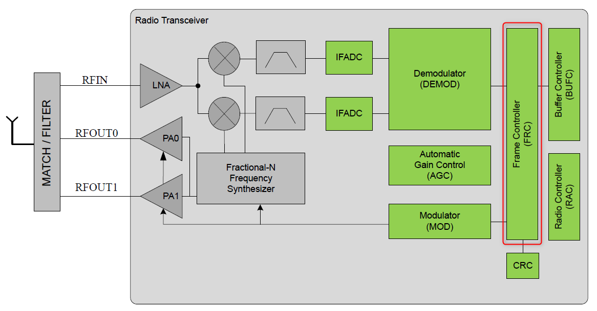
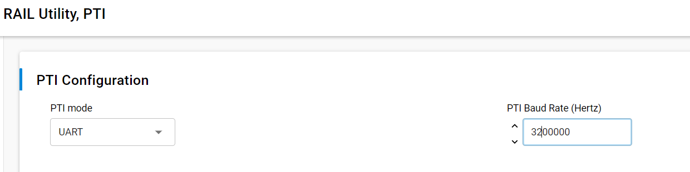
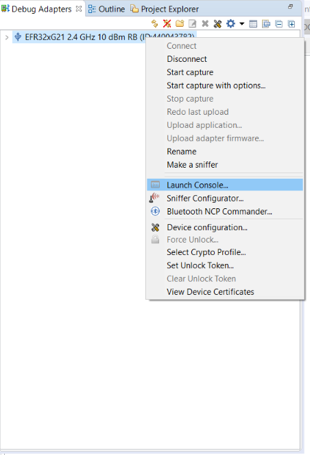
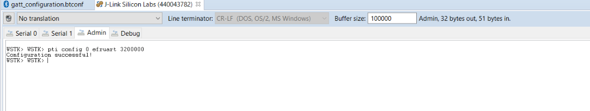
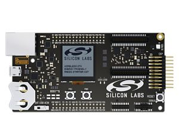
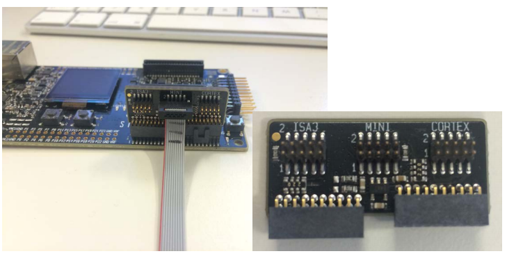
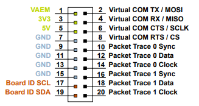
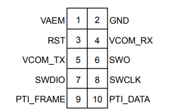

# Hardware and Packet Trace Interface (PTI)

On the EFR32 series 1 and 2, a mechanism is provided for the user to be able to tap into the data buffers at the radio transmitter/receiver level. From the embedded software perspective, this is available through the **RAIL Utility, PTI** component in Simplicity Studio. That component is effectively a simple packet trace interface driver.

## Packet Trace Interface

The Packet Trace Interface (PTI) is an interface giving serial data access directly to the radio transmitter/receiver frame controller. The following figure describes at a high level the architecture of the radio transceiver.

A clock and data signal are connected to the frame controller to monitor all packets received/transmitted by the chip. At the chip level, a signal is dedicated to trigger the timestamping of each PTI frame by the WSTK board controller. The PTI is a non-intrusive sniffer of data, radio state and time stamp information.

A single-pin UART signal is used for PTI data transfer. This can be configured in the **RAIL Utility,** **PTI** component. The baud rate is selectable. The default baud rate is 1.6 Mbps. The maximum baud rate is 3.2 Mbps.

When using 2M PHY with Bluetooth Low Energy, the default PTI-over-UART speed (1.6 Mbps) must be increased to a higher baud rate. The following shows an example:

Additionally, the speed at which the PTI frames are forwarded from the EFR32 back to USB/UART must also be increased. This is done by setting the PTI config corresponding to your adapter at the correct baud rate through the Admin Console interface.

In the Debug Adapters view, right-click the device. In the context menu, select **Launch Console…**

Select the Admin tab, and execute the command:

`pti config 0 efruart 3200000`

## Hardware Kit and PTI

As described previously, the WSTK can be used to monitor the wireless traffic. The WSTK can be connected to the PC via USB or Ethernet:

- USB - The simplest solution. This is used throughout this document.

- Ethernet - Recommended for best performance and scalability.

Alternatively, it is possible to use the PTI on custom hardware if the corresponding pins are exposed (via the 20-pin Simplicity Connector on the WSTK or the Simplicity Mini connector on the debug adapter for example):

For more detail, refer to *AN958: Debugging and Programming Interfaces*.
