# Network Analyzer Features

This section describes the main features of the Network Analyzer user interface.

## Tool Access and Preference Page

Network Analyzer is provided with Simplicity Studio. For easy access, on the toolbar click **Tools**, and select **Network Analyzer**.

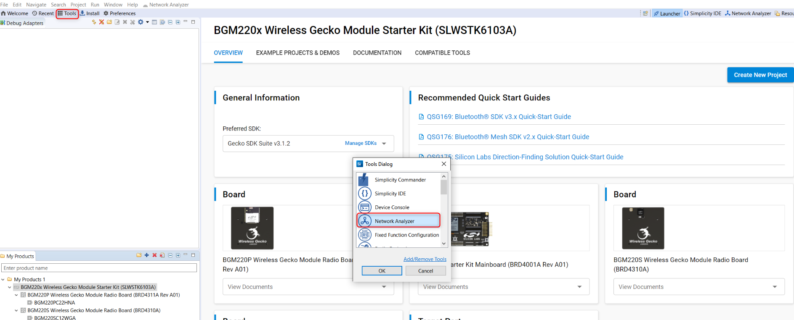

With Network Analyzer Preferences, accessed by **Windows \> Preferences** or the **Preferences** control on the toolbar, you can tune the tool, add security keys, and modify displays and icons.

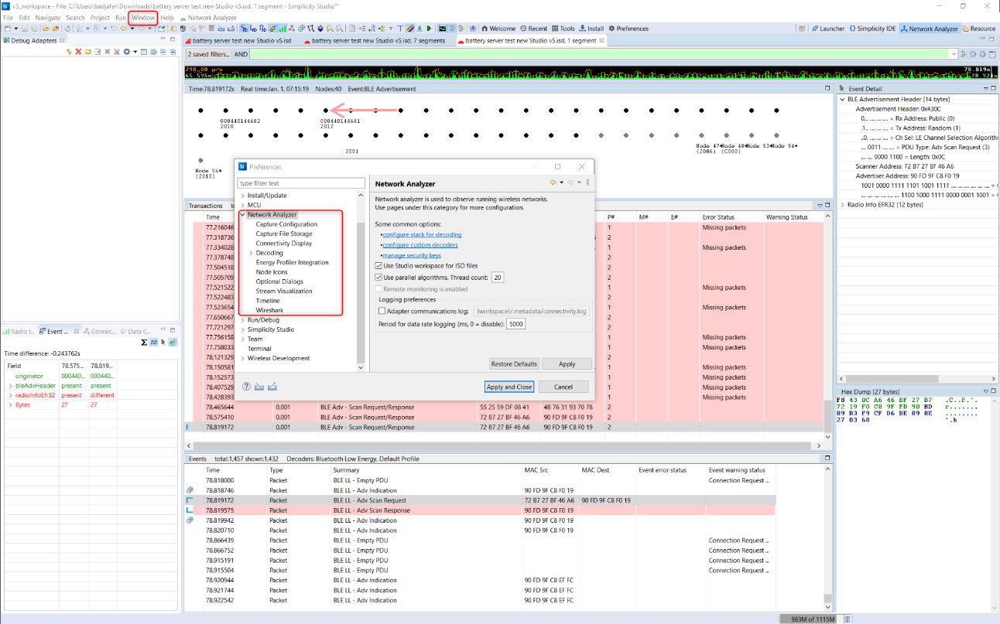

You can also modify the Bluetooth protocol decoder in great detail (under the Decoding menu), define the integration with other tools (Energy profiler, Wireshark), and add Security keys (see section [Keys](./04-network-analyzer-for-bluetooth-le-and-mesh.md#keys) for more information).

## Interface

### Large File Editor

Because radio traffic contained in a captured session can be very large, a pane allowing time interval selection is opened first, as shown in the following figure. The interface implementing that feature is called the Large File Editor. It gives a complete overview of the capture session and allows you to select a specific time interval of study.

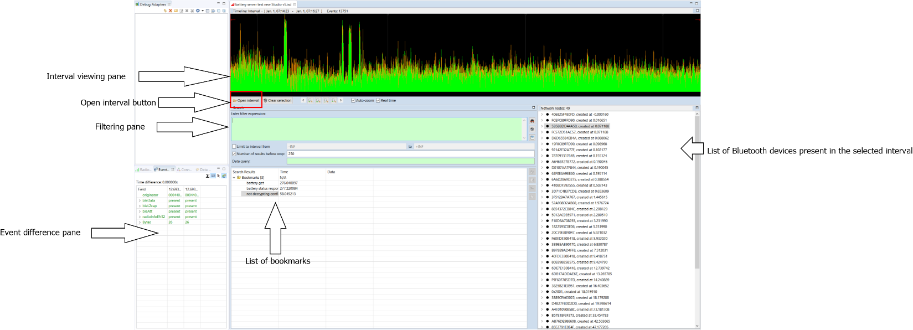

**Interval viewing pane**: Displays the traffic data present in the ISD live or recorded session. The data points corresponding to the green curve represent the number of packets per unit of time. Further display options are available through the right-click context menu.

**Open Interval button**: Once you have selected the area of interest in the interval view, click **Open Interval** to see traffic detail. This opens a subsequent window in which transaction and events are listed, as shown in section [Interval Editor](#interval-editor).

**List of nodes**: In the right pane, the list of nodes present in the selected time interval is shown.

**Filtering pane**: Some packet filtering can be done on the selected time interval. In practice, this is more useful in the transaction/event pane. Filters are explained in more detail in section [Filters](#filters).

**Bookmarks and Event Difference pane**: Those functions are explained in detail in sections [Bookmarks](#bookmarks) and [Network Analyzer for Bluetooth LE](./04-network-analyzer-for-bluetooth-le-and-mesh.md#network-analyzer-for-bluetooth-le), respectively

The following figure illustrates a selected interval (using the mouse directly on the waveform). The interval of interest appears in clear, whereas the rest of the interval viewing pane is greyed out.

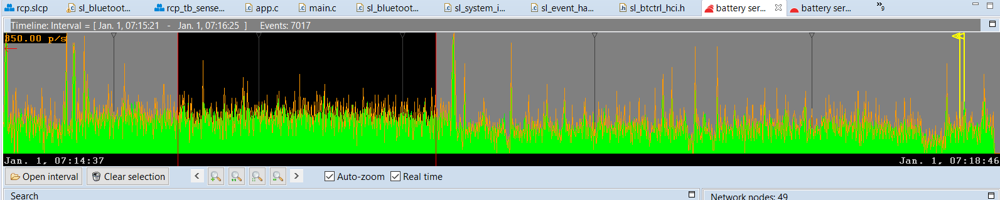

### Interval Editor

The Editor is laid out as follows:

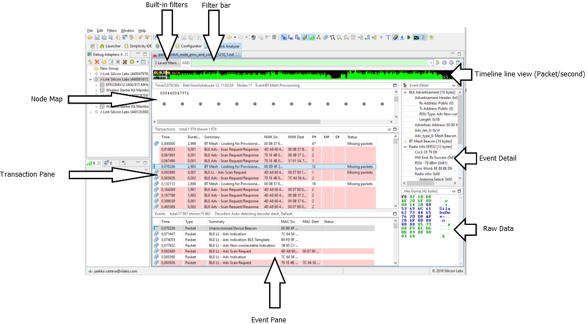

The events displayed in the event pane are directly linked to the transactions displayed in the transaction pane. When a transaction is selected, Network Analyzer jumps to the corresponding events in the event pane.

Press CTRL+SHIFT+Up/Down to toggle between events in a transaction.

In the **Status** field, “Missing packets” indicates that a packet expected in the transaction has not been received within the current timeout window.

   >**Note**: A transaction is a group of related packets that together form a higher layer protocol procedure or message exchange. In the case of Bluetooth Low Energy (and Bluetooth mesh), a “transaction” refers to an actual Bluetooth Low Energy transaction as defined in the core specification. This corresponds most of the time to a Bluetooth Low Energy procedure. Equally, the event pane displays the actual Bluetooth Low Energy events corresponding to the transaction or procedure. For more details, refer to the Bluetooth Core specification document.

The filtering capabilities of the tool are explained in detail in section [Filters](#filters).

**Event detail pane**: The event detail pane exhibits all the data present in the corresponding Bluetooth LE packet. The data are displayed in a decoded format allowing the user to unpack the information at all layer levels, from radio information up to the GATT protocol and Bluetooth mesh Access layer. Using the Option menu in the top right corner of the Event Detail pane, you can expand the bit fields and toggle between hexadecimal and decimal format.

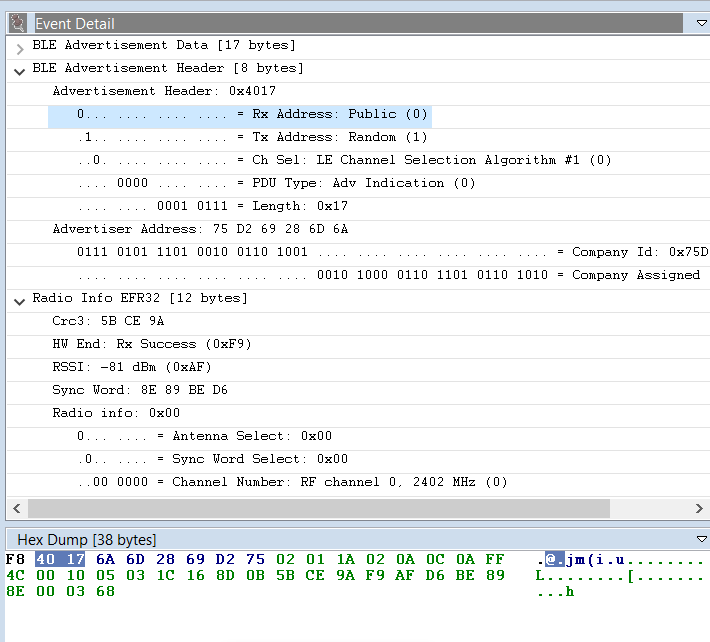

Note that when a bit field is selected, the corresponding data is automatically highlighted in the hex dump view of the packet.

Various layers of decoding exist, which can be viewed in the Hex Dump Pane (for Bluetooth mesh, result of Network decryption, Application decryption, Defragmentation of various levels and so on).

## ISD File

Network Analyzer can capture data from nodes of any connected adapters, either from one node at a time or from multiple nodes. It can display data from Live sessions as well as Recorded sessions.

Network Analyzer saves session data to an ISD (.isd) file, which is a compressed file that stores session data and the network state. Network state includes display settings such as map modifications, which Network Analyzer restores when you reload the session file.

The following procedure describes how to start a network data capture on a single device:

1. In **Preferences \> Simplicity Studio \> SDKs** select the desired SDK.

2. In **Preferences** \> **Network Analyzer** \> **Decoding** \>**Stack Version,** Make sure “Bluetooth Low Energy” is added in the decoding preferences.

3. If using encryption with known keys, make sure the security keys are added (see section [Keys](./04-network-analyzer-for-bluetooth-le-and-mesh.md#keys) for more detail).

4. Connect to the adapter.

      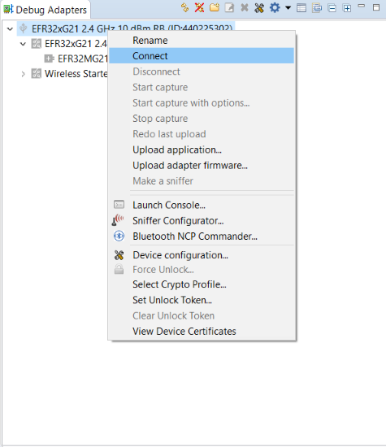

5. Start capture.

      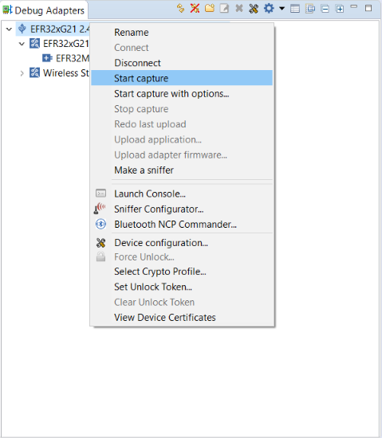

To start capturing on several adapters, press and hold the CTRL key and, in the Debug Adapters view:

1. Select more than one adapter.

2. Right-click and select **Connect**.

3. Right-click and select **Start Capture.**

4. Release the CTRL key.

a) 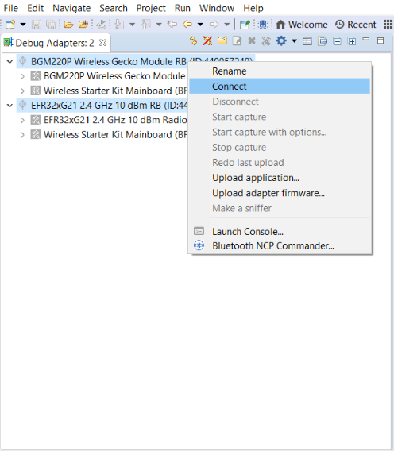

b) 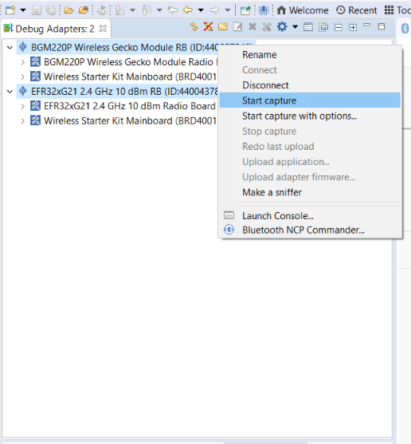

**a)** Connect to a Group of Adapters

**b)** Start Capture on a Group of Adapters

With Bluetooth mesh, when working in a busy environment, capturing from multiple nodes makes more sense than capturing from only one, because Bluetooth mesh nodes are constantly scanning for incoming packets.

For example, some nodes might be emitting Bluetooth mesh messages or beacons at the same time the node being used for capturing is answering a configure request. As a result, the data that were sent will not be received, simply because the link layer of the underlying Bluetooth LE stack was in the advertising state and not scanning. Additionally, there are three primary advertising channels and the radio transceiver can only listen to one channel at a time.

This should not be mistaken for an error or a malfunction in the stack. Rather, this is simply a by-product of the technology reliance on primary advertising channels and advertising PDUs. Apart from the GATT bearer scenario (relying on Bluetooth LE connections), there is no communication collision control.

>**Note**: It is possible to use “Duplicate Detection”, i.e. when the same packet is detected on multiple adapters it will only be displayed once. See **Preferences-\>Network Analyzer-\>Capture Configuration** for more details.

## Bookmarks

Bookmarks can be used for marking events. As the name indicates, those are actual bookmarks that point to a certain Bluetooth LE or mesh event. Those are useful for pinpointing a certain event in a transaction that can be problematic and then sharing it with somebody else.

The following procedure shows how to set and navigate through bookmarks:

1. Select the event and right-click it.

   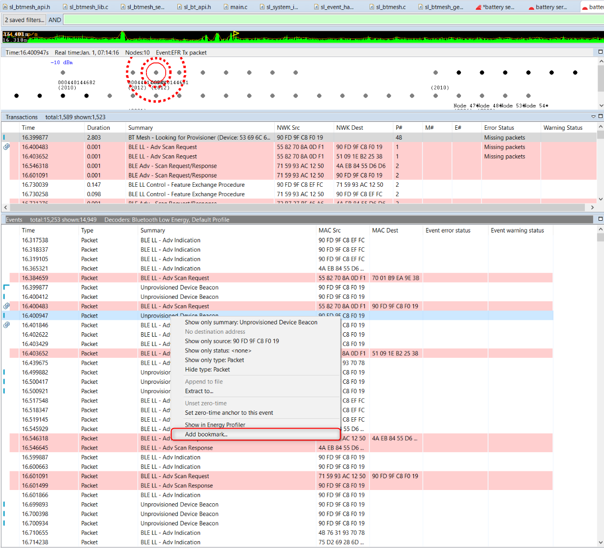

2. Enter the bookmark name.

   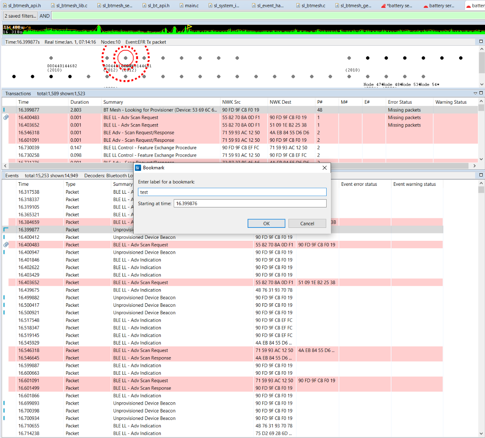

3. See the bookmark recorded (highlighted in yellow).

   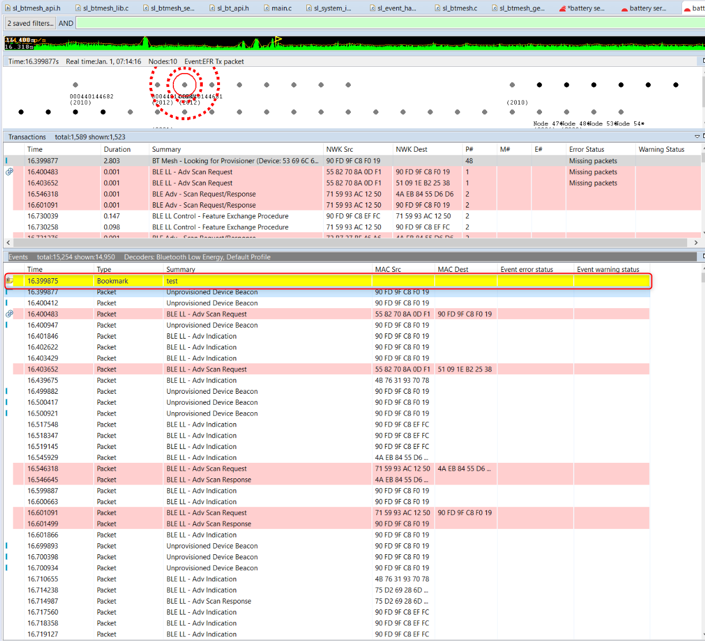

## Set Zero-Time Anchor

When studying a particular event or transaction, it is sometime useful to set it as the time reference. Practically, this means setting the timestamp corresponding to that event or transaction to zero, and then seeing all subsequent timestamps updated according to the new time reference. Using this Network Analyzer feature is also an excellent way to verify the Bluetooth Low Energy advertising or connection timings (advertising interval, connection interval, and so on).

The following describes how this can be done, using a Bluetooth LE Initiating connection (CONNECT_IND) state as an example. Select the particular transaction or event, right-click to open the context menu, and then click **Set zero-time event anchor to this event.**

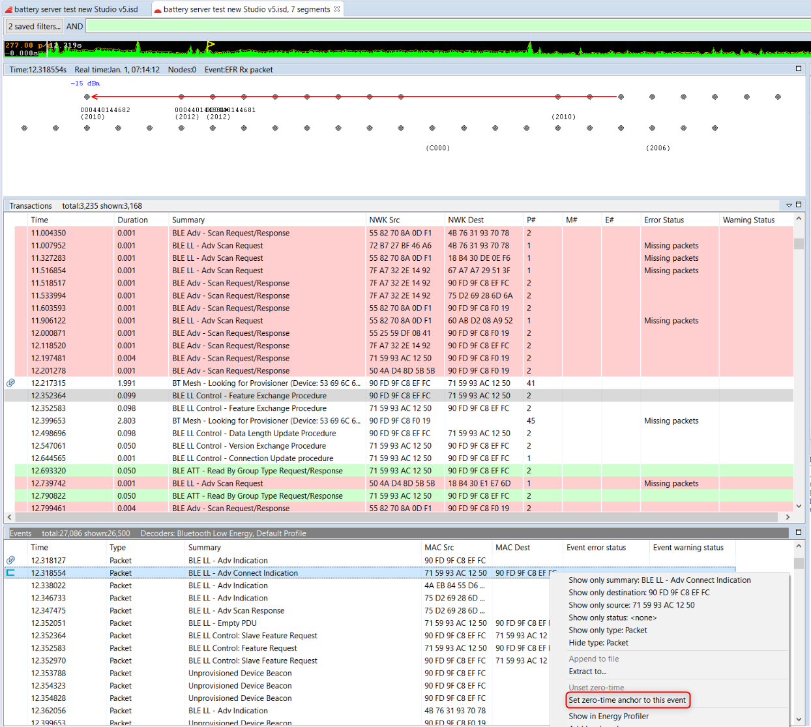

The timestamps of all events and transactions are then updated, taking into account the new anchor as time reference, as shown in the following figure.

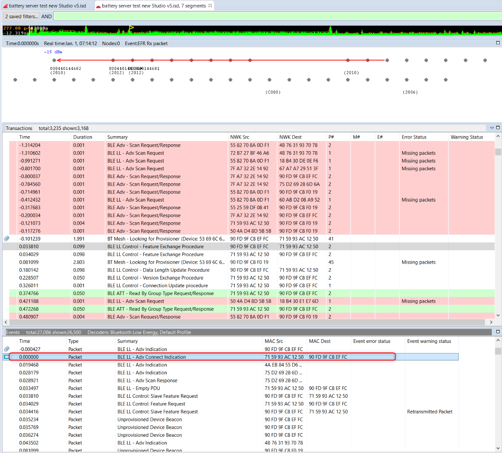

To remove the anchor, right-click the selected event or transaction and click **Unset zero-time**.

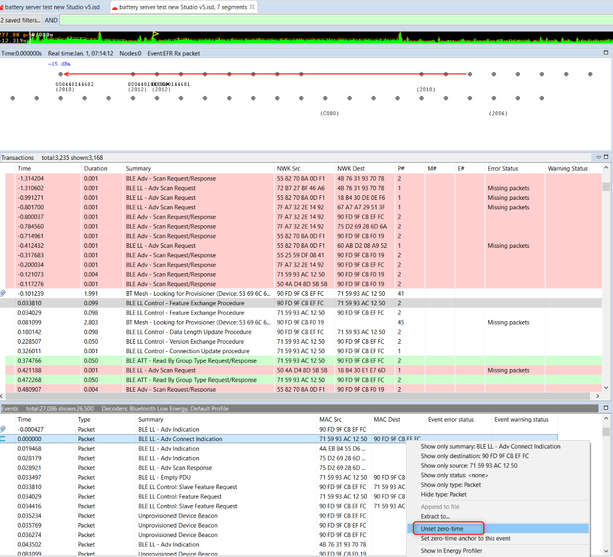

## Filters

Network Analyzer supports use of a set of built-in and manual filters.

### Built-In Filters

The following built-in filters can be enable/disabled when visualizing PTI data:

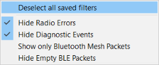

For example, you can filter Bluetooth LE data out in order to focus on Bluetooth mesh traffic. Radio errors and diagnostics can also be filtered out. Note that radio errors can be useful for debugging.

### Manual Filters

The filter bar is used to filter transactions and events. Each capture session has its own filters settings. When a session’s filter is changed and the filter is applied by clicking **Apply** in the Filter pane toolbar, Network Analyzer will refresh the display showing only the corresponding transactions or events. When you exit Network Analyzer, all sessions filters are cleared and must be reapplied when Network Analyzer is restarted.

Network Analyzer provides two ways to edit filters:

- Filter Manager: Maintains internally a set of saved filters that you can review and edit. You can also add new filters. You specify any of the saved filters for display on the Filters menu, where they are accessible for use in one or more sessions.

- Filter Bar: An editor that attaches to a given session, where you can enter one or more filter expressions on the fly. Network Analyzer discards filter bar expressions for all sessions when it exits. It does, however, store the expression for easier future access.

Multiple filters can be combined using logical expressions:

- && - And operator

- || – Or operator

Alternatively, conditions for individual filters can also be used:

- == - Equals

- != - Not equal

- |= - Contains

The following table shows examples of filtering in Bluetooth mesh traffic:

<table class="classic"><colgroup><col width="35%"><col width="auto"></colgroup><thead><tr><th>Filter example</th><th>Meaning</th></tr></thead><tbody><tr><td>
transaction.summary |= "BT Mesh" transaction.summary |= "Generic" && transaction.dest == "C001"
</td><td>
Show transactions where the summary field contains the text 'BT Mesh' Summary contains string Generic and the destination address is 0xC001
</td></tr><tr><td>
transaction.summary != "EFR Rx packet"
</td><td>
Do not show transactions with summary 'EFR Rx packet' → Hide those transactions that Network Analyzer cannot decode.
</td></tr></tbody></table>

The following figure shows an example of saved combined filters.

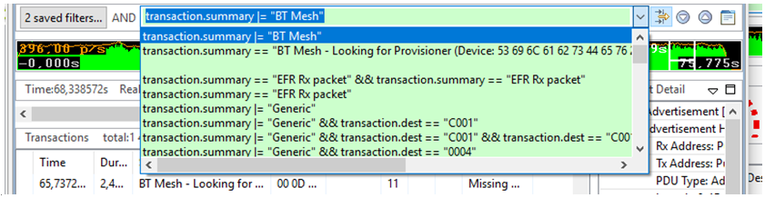

Alternatively, you can right-click and select preset filters.

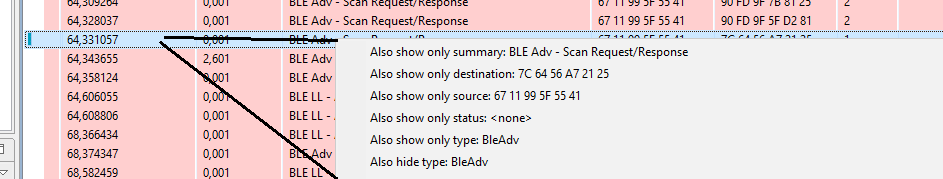
