# Network Analyzer for Bluetooth LE and Mesh

This section describes how the Network Analyzer can be used for Bluetooth Low Energy and Bluetooth mesh traffic monitoring. The current version of the Bluetooth core specification supported is 5.2. The current version of Bluetooth mesh profile and model specification is 1.0.1.

Bluetooth Low Energy profile support is limited. Additionally, there is no support for Bluetooth LE random addresses resolving.

## Network Analyzer for Bluetooth LE

This section reviews the capabilities of Network Analyzer for the Bluetooth LE protocol.

When Bluetooth Low Energy data is captured, Network Analyzer displays Bluetooth LE transactions and the corresponding events, as shown in the following figure.

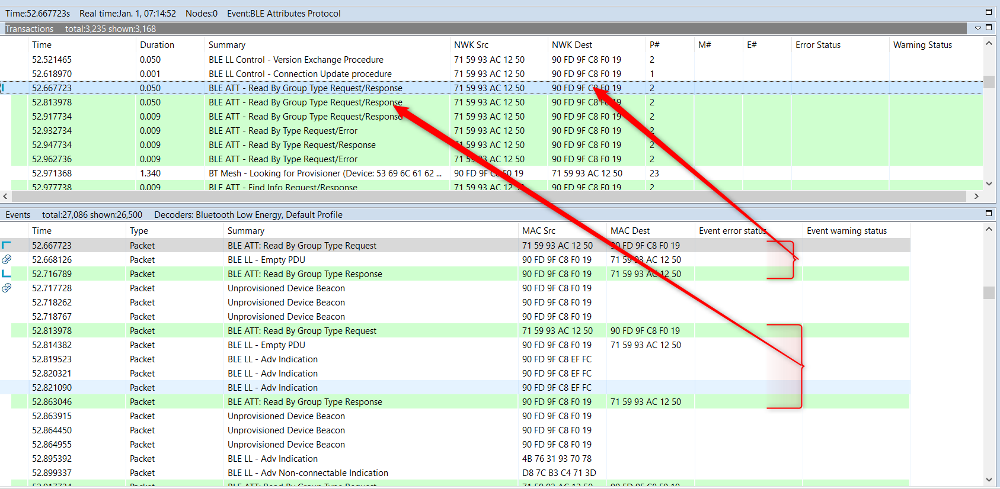

It shows that related packets like requests and responses together make a transaction. These transactions are listed separately in the Transactions pane. To find the first packet of the transaction, simply click on the transaction. To see the details of the packet, simply click on the packet. You can see both the raw and the parsed format of the packet in the Hex Dump / Event Detail pane (see section [Interval Editor](./03-network-analyzer-features.md#interval-editor) for more detail).

To disable the display of some transactions that are not of interest, use **Preference \> Network Analyzer \> Decoding \> Transaction Grouper**.

The following figure shows an example of “BLE Advertisement Grouper”.

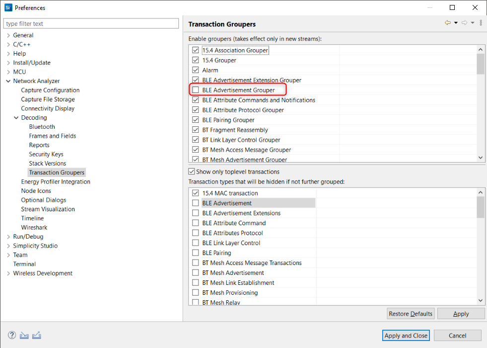

### Bluetooth Low Energy Transaction Example

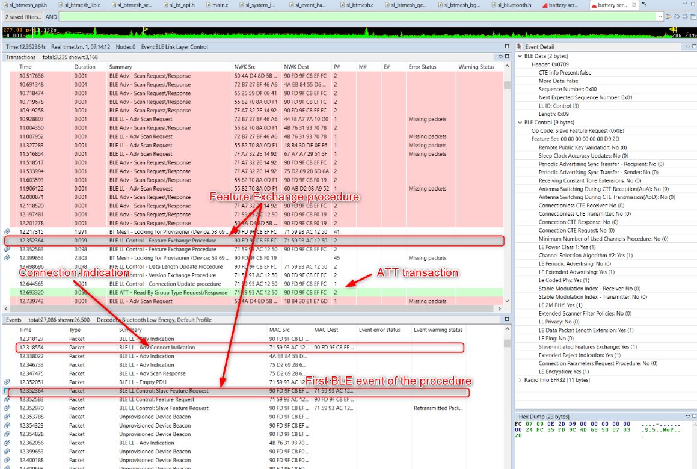

The Event Detail pane allows you to inspect packets at various levels, down to radio data. The example above shows a description of a Bluetooth Low Energy connection being established between a central and peripheral.

When the feature exchange transaction is selected, the Event panes display the corresponding Bluetooth LE events. Scroll up in the Event pane to find the Connection Indication packet.

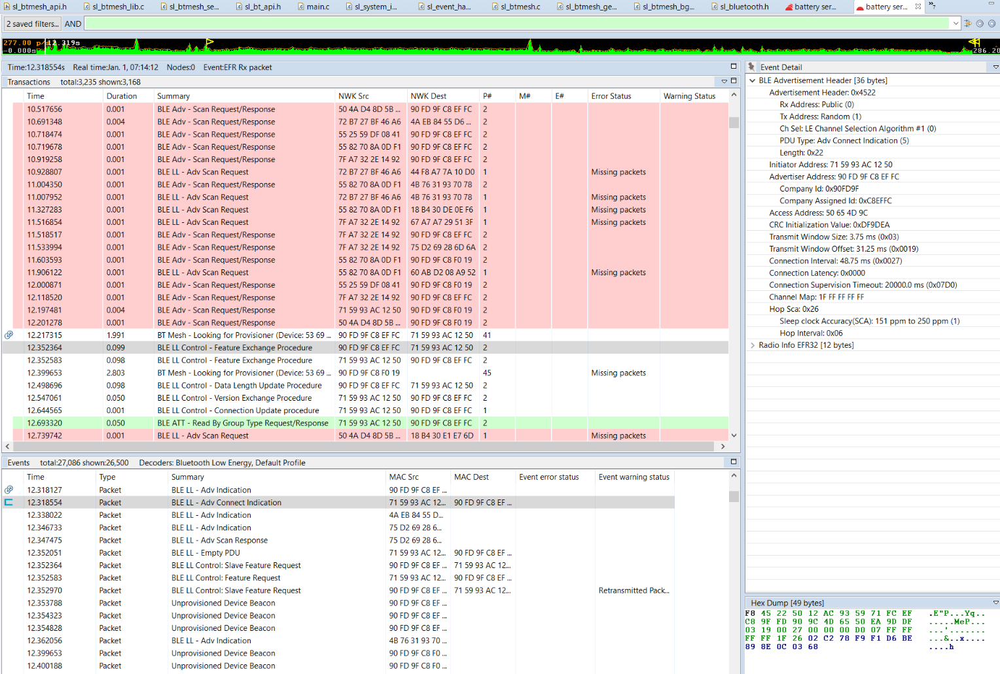

The packets corresponding only to a particular Bluetooth LE connection can be filtered using the radio synchronization word. To do so, in the Radio info in the Event detail pane, right-click on “Sync word” and add to the filter.

Once the Bluetooth LE connection is established, ATT transactions can take place. The following example illustrates a “Read by Group Type” ATT request and the corresponding response. Use the Event Detail pane on the right side to inspect the content of the request..

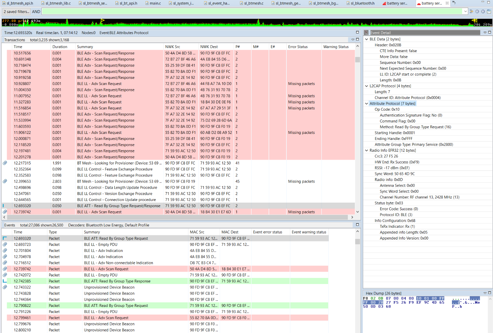

After a Bluetooth Low Energy connection is established, the next step is typically the GATT discovery of the GATT Client. A dedicated view is available for that under **Preferences \> Network Analyzer \> Decoding \> Bluetooth,** which lists all GATT services/characteristics/descriptors and handles, can be used. There, the ability to save the view is also provided.

For more information on how Bluetooth Low Energy operates and how it can be monitored with Network Analyzer, refer to the [Bluetooth LE connection](https://docs.silabs.com/bluetooth/2.13/general/connections/bluetooth-connection-flowcharts) and [GATT connection](https://docs.silabs.com/bluetooth/2.13/general/gatt-protocol/gatt-operation-flowcharts) flowcharts.

Additionally, the Event Difference pane can be used as a diffing tool between two different events. The following figure illustrates the event diff between a scan request and response.

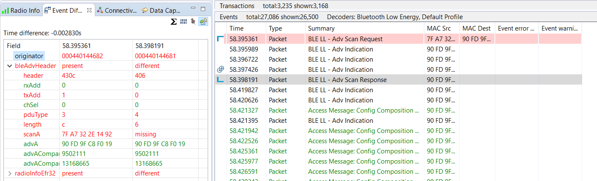

### Bluetooth Low Energy Data Decryption

Network Analyzer decrypts Legacy encryption automatically. In effect, the keys are harvested from the Bluetooth LE traffic data. When packets are encrypted using Secure Connection on the other hand, they can only be decrypted when using the security manager of the Bluetooth Low Energy stack in debug mode. In the Silicon Labs Bluetooth Low Energy stack, this can be turned on using the following routine:

`sl_status_t sl_bt_sm_set_debug_mode(void)`

When using Secure Connections, this has the effect of having the Security Manager using debug keys. Those keys are also known by the Network Analyzer, which allows it to decrypt the Bluetooth LE data traffic.

To disable debug mode, restart the device. For more information, refer to the [Bluetooth API reference](https://docs.silabs.com/bluetooth/latest/sl-bt-sm).

## Network Analyzer for Bluetooth Mesh

This section presents the capabilities of Network Analyzer for the Bluetooth mesh protocol. Network Analyzer offers the following features:

- Decryption of the Bluetooth mesh packets at all levels (network, application...)

- Handles Network-level segmentation / reassembly.

- Tracing packets from nodes out of RF reach from the PC (over Ethernet)

- Tracing packets from multiple nodes at once (several WSTKs connected over Ethernet)

As a reminder, Network Analyzer currently supports the Bluetooth mesh 1.0.1 profile and model specification. Support of Bluetooth mesh devices properties is limited. Provisioning Data PDUs cannot be decrypted and the map pane is not reliable.

### Default IV Index Value

A Bluetooth mesh live or recorded session that has a non-zero IV index will not be decrypted properly. This can be adjusted in the Bluetooth decoder (**Preferences \> Network Analyzer \> Decoding** \> **Bluetooth**) by setting the default IV index value. The following figure illustrates this.

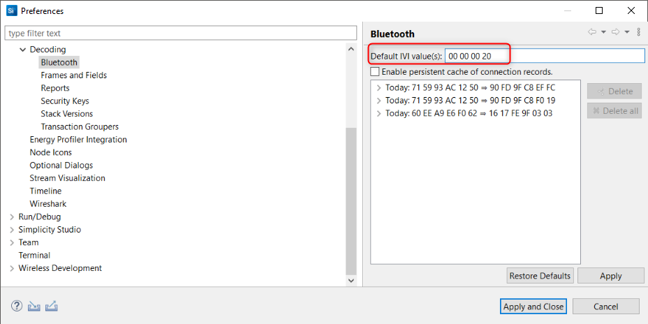

Make sure to import the ISD capture file again to see the change being applied.

Note: More information on the IV index can be found in [IV Update in a Bluetooth Mesh Network](https://docs.silabs.com/btmesh/latest/btmesh-iv-update).

### Keys

The Bluetooth mesh stack is composed of several layers, starting from the network layer up to the access layer. Data traffic can be encrypted in various context (that is, stack layer levels):

- Network: Each Bluetooth mesh network has its associated network key. A node can have several network keys.

- Device: Each device in a particular network has its own device key.

- Application: Each application, depending on how it is configured, has its own application key.

For more detail on how Bluetooth mesh security and encryption work, refer to the Bluetooth mesh profile specification.

When building a Bluetooth mesh network using a smart phone application or a gateway, it should be possible to export the corresponding security keys. The security keys can correspond to any of the three types: network, device, or application. The provisioner should allow you to export the keys in a text format that can then be shared with other applications.

This is useful typically in the case of analyzing network traffic or rebuilding a network from scratch. Network Analyzer can import and export Bluetooth mesh keys. With the Silicon Labs Bluetooth mesh mobile application, a JSON text format is used for keys import/export.

The following steps indicates how to export keys using the Silicon Labs Bluetooth mesh phone application. Note that the steps are independent from the phone operating system, but the graphic layout of the smart phone application might differ.

1. Browse to the export menu.

   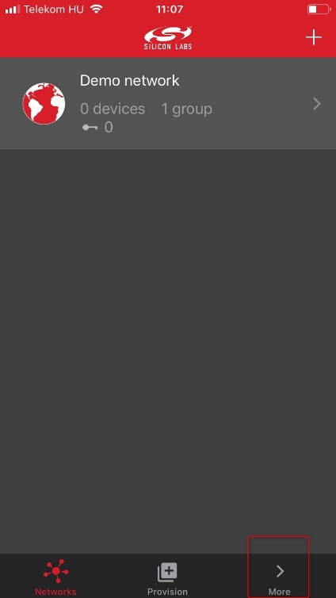

2. Use the Export cryptographic keys button to create the corresponding JSON file. The JSON file called **MeshDictionary.json** can now be sent via email.

   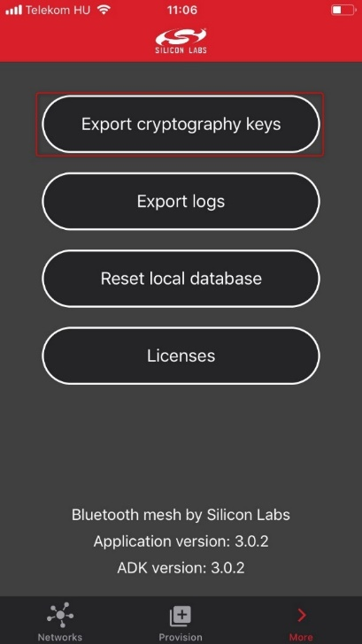

This should make a menu open allowing the user to select by which mean it wished to send the **MeshDictionary.json** file.

The content of the (generated) **MeshDictionary.json** JSON file is human readable text and contains a collection of keywords and hexadecimal coded Bluetooth mesh keys.

The following steps indicates how to import the corresponding keys in Network Analyzer.

1. Go to **Preferences \> Network Analyzer \> Decoding \> Security Keys**.

   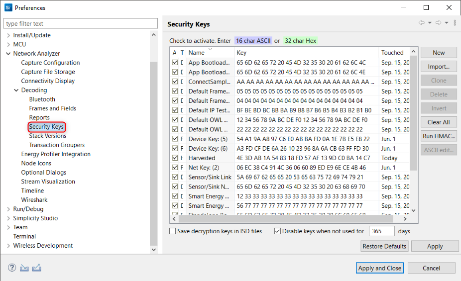

2. Deselect all default and saved keys that are already present and click **Import…**

3. Browse to the MeshDictionary.json file.

   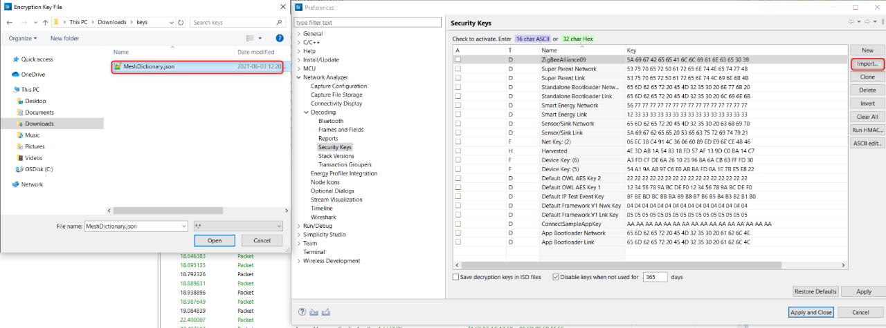

4. Click **Open** and see the keys imported in the “Security Keys“ window. For debugging purposes, the decryption keys can be saved in the ISD file (by checking the corresponding checkbox). This is not best practice from a security point of view but is acceptable for debugging. These instructions assume you have checked this.

5. Click **Apply and Close**.

   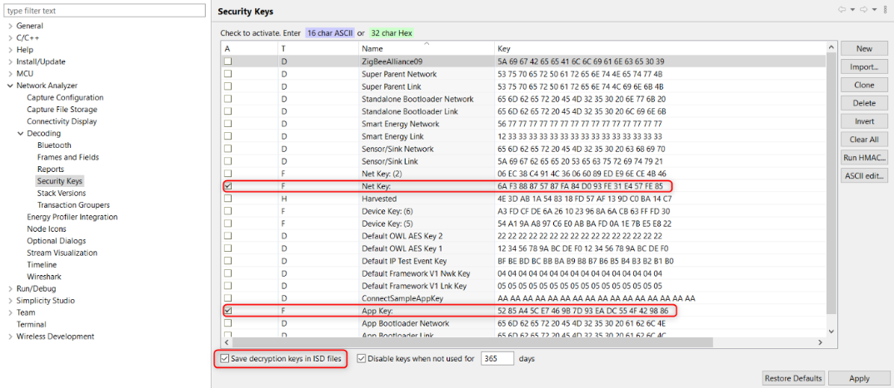

6. After importing the keyfile, select **File \> Other Network Analyzer Actions … \> Reload** to refresh the data.

7. Finally, save the ISD file (checkbox in the bottom left of the security key dialog box).

The access layer Bluetooth mesh data should now be decrypted. The following sections show the expected result, in green on the top right corner of the figures.

### Bluetooth Mesh Advertising Packets

The Bluetooth mesh technology is based on Bluetooth LE advertising packets. Bluetooth mesh traffic is differentiated from the regular Bluetooth LE traffic through the AD types used by the Bluetooth mesh advertising packets. Network Analyzer can filter advertising packets in a number of ways.

The following AD types are used for advertising bearer-based Bluetooth mesh traffic:

<table class="classic"><colgroup><col width="20%"><col width="30%"><col width="auto"></colgroup><thead><tr><th>AD Type value</th><th>Data type name</th><th>Reference for definition</th></tr></thead><tbody><tr><td>
0x29
</td><td>
PD-ADV
</td><td>
Bluetooth Mesh Profile specification section 5.2.1
</td></tr><tr><td>
0x2A
</td><td>
Mesh Message
</td><td>
Bluetooth Mesh Profile specification section 3.3.1
</td></tr><tr><td>
0x2B
</td><td>
Mesh Beacon
</td><td>
Bluetooth Mesh Profile specification section 3.9
</td></tr></tbody></table>

Based on this information, Bluetooth mesh advertising packets can be filtered. The following filters can be entered in the filter bar:

- `bleAdv.adv_type_0 == 0x2b`. This shows only Bluetooth mesh beacons that are used essentially for provisioning and secure data information propagation (secure beacons). The following shows an example.

   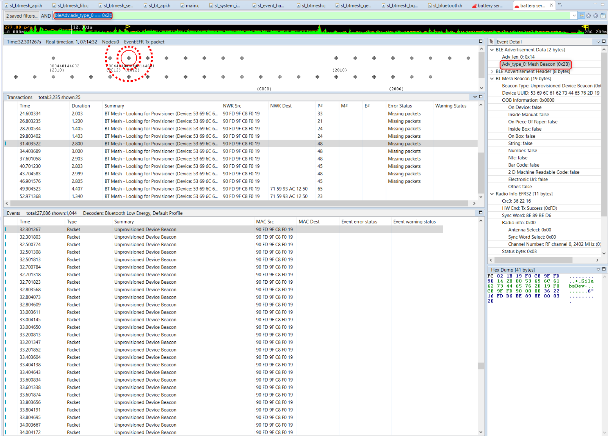

- `bleAdv.adv_type_0 == 0x2a`. Shows Bluetooth mesh messages. Bluetooth mesh messages are used for common Bluetooth mesh data traffic. The payload of those mesh advertising packets is called “Network PDUs” (specified by the Bluetooth mesh profile specification). “Network PDUs” are the containers of the Network layer data. This is very useful because it allows you to display only the data traffic using the advertising bearer on provisioned nodes in a network. The following figure shows an example:

   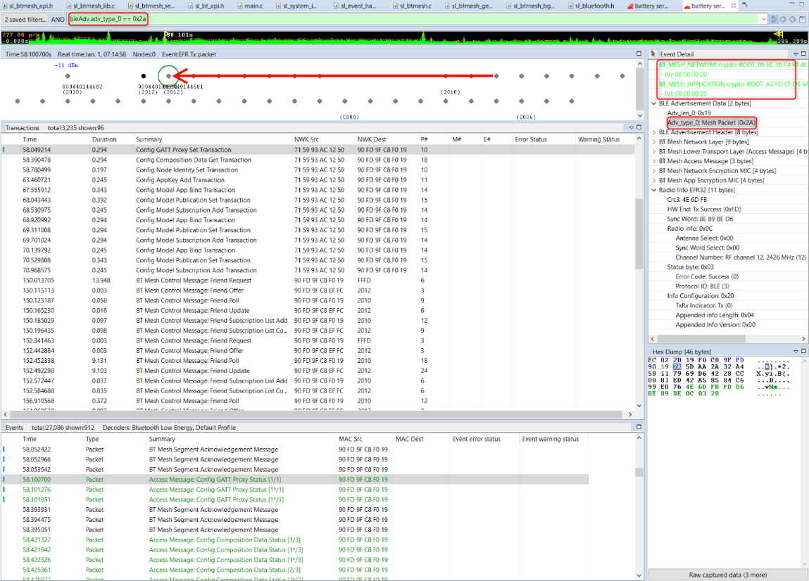

- `bleAdv.adv_type_0 == 0x29`. This shows Bluetooth mesh provisioning advertising packets. Those packets use the PB-ADV provisioning bearer and are used to provision a device using “Provisioning PDUs”.

### Proxy Protocol

The Bluetooth mesh technology is mainly based on Bluetooth LE advertisement packets used along with Bluetooth mesh AD types. Nevertheless, in some cases, some devices are not able to advertise using the Bluetooth mesh AD types. As a consequence, the Bluetooth mesh specification allows communication over a GATT connection and uses what is called the Proxy protocol to exchange Network PDUs.

The proxy protocol is designed to enable nodes to send and receive Bluetooth mesh network packets over a connection-oriented bearer. As mentioned earlier, a node could support GATT but not be able to advertise the Bluetooth mesh Message AD Type. This node will establish a GATT connection with another node that supports the Bluetooth LE ATT bearer, called GATT bearer, and the advertising bearer, using the Proxy protocol to forward messages between these bearers.

   >**Note**: The term "GATT bearer", in effect, corresponds exactly to the ATT bearer as specified in the Bluetooth Host specification (Bluetooth Core specification, Host Vol. 3, 3.2.11).

Once the Bluetooth LE connection is established, the node can send and receive what are called "Proxy PDUs". A Proxy PDU is essentially a data container for the following PDUs:

<table class="classic"><colgroup><col width="15%"><col width="25%"><col width="auto"></colgroup><thead><tr><th>Type</th><th>Name</th><th>Description</th></tr></thead><tbody><tr><td>
0x00
</td><td>
Network PDU
</td><td>
The message is a Network PDU as defined in Section 3.4.4 of the profile spec.
</td></tr><tr><td>
0x01
</td><td>
Mesh Beacon
</td><td>
The message is a Bluetooth mesh beacon as defined in Section 3.9 of the profile spec.
</td></tr><tr><td>
0x02
</td><td>
Proxy Configuration
</td><td>
The message is a proxy configuration message as defined in Section 6.5 of the profile spec.
</td></tr><tr><td>
0x03
</td><td>
Provisioning PDU
</td><td>
The message is a Provisioning PDU as defined in Section 5.4.1 of the profile spec.
</td></tr></tbody></table>

The Network PDU corresponds to all messages handled at the "Network Layer".

Network Analyzer allows you to filter Bluetooth mesh GATT bearer data in a live (or recorded) network session. Based on this information, Bluetooth mesh packets can be filtered. The following filters can be entered in the filter bar:

- `btMeshProxy.type == 0x0`. This shows all Network layer traffic. This is the GATT bearer equivalent to filter Bluetooth mesh Messages on advertising bearer traffic. The following figure shows an example (note the application and network key data in green in the top right corner).

   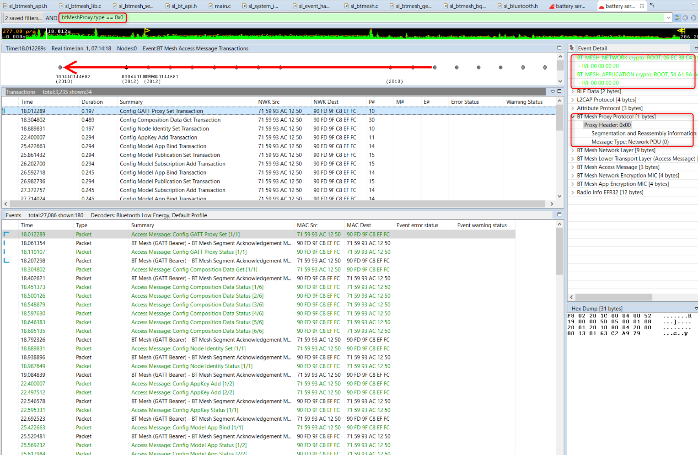

- `btMeshProxy.type == 0x1`. This shows Bluetooth mesh beacons on GATT bearer. The following figure shows an example, and shows an example of the secure beacon:

   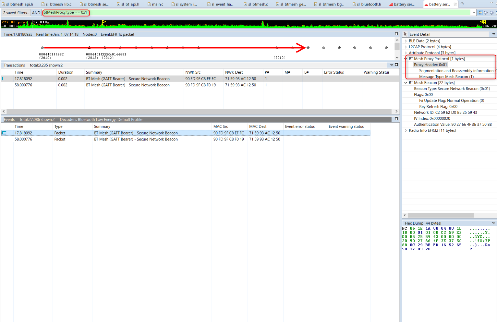

- `btMeshProxy.type == 0x2`. This shows Proxy client and server configuration messages. Proxy configuration messages are used to configure the proxy filters. The proxy server uses a filter to decide whether to forward the message to the proxy client or not. In practice that filter is only useful in certain specific cases.

- `btMeshProxy.type == 0x3`. This shows Provisioning PDUs over the GATT bearer. This is the GATT bearer equivalent of filtering PB-ADV adverting packet on advertising bearer Bluetooth mesh traffic. The following figure shows an example:

   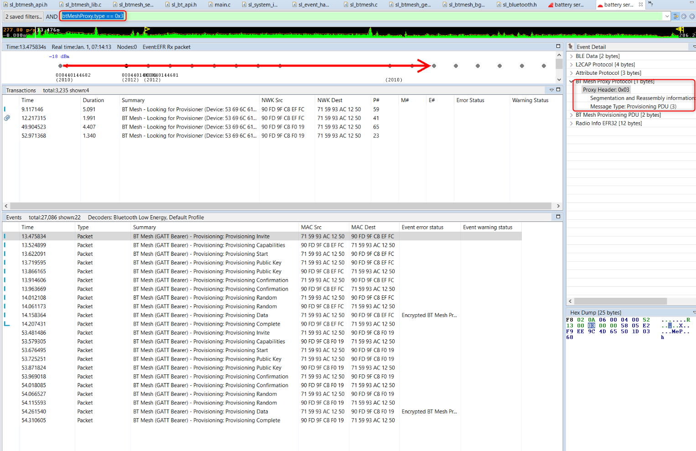

>**Note**: When using Bluetooth mesh, the node map may not be totally reliable. This is a known issue in Network Analyzer.

Alternatively, filtering can be done on both bearers using frame patterns. When selecting a packet containing Bluetooth mesh Network layer data, in the Event detail pane, right-click the Bluetooth mesh Network data of that packet and click **Filter by Frame Pattern**. This filters all Network messages regardless of the bearer. The same procedure can be done with Bluetooth mesh beacons and provisioning PDUs.
