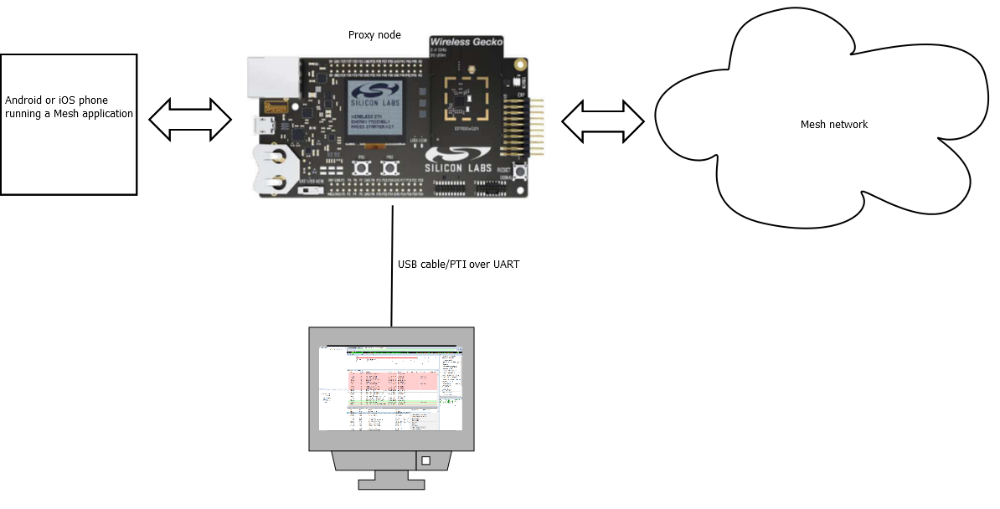
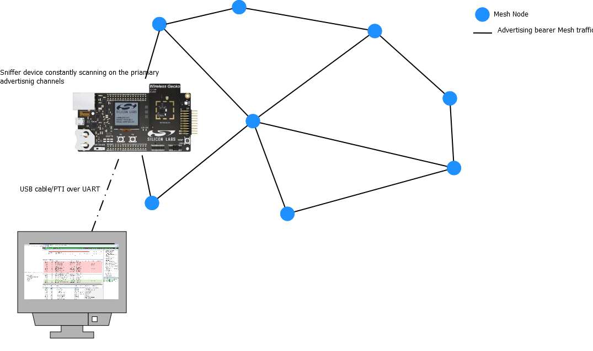

# Bluetooth Mesh Networking and the Network Analyzer

In a Bluetooth mesh network, especially on the field, node access can be challenging. Even when accessible, all nodes might not have the PTI pins exposed allowing network monitoring.

This section describes briefly what techniques can be used to monitor the Bluetooth mesh traffic in such environments.

The Silicon Labs recommendation for this use case is to set up a WSTK-based proxy node. That would be, in effect, a dedicated sniffer node. The sniffer node does not need to run any particular model beyond the basics. It would only need to have the network key associated with the Bluetooth mesh network to decipher the traffic.

Using a mobile phone application, connect to the proxy sniffer node that would be used with the Network Analyzer to see the Bluetooth mesh traffic. That way, not only traffic on the advertising channels can be monitored but also data using the GATT bearer. This can be quite helpful when debugging issues that occur between the mobile phone application and the nodes.

Alternatively, a sniffer node can be created in a Bluetooth mesh network by simply loading a demo or sample application that is constantly scanning onto a WSTK-based Bluetooth LE device (i.e. an EFR32BG radio board mounted on a WSTK).

As an example, the soc-thermometer-host, constantly scanning for health thermometer server devices, would receive all Bluetooth mesh advertising-based PDUs. The fact that it is not a Bluetooth mesh node is not a problem as this can be recorded and decoded later on in Network Analyzer (see section [Network Analyzer for Bluetooth Mesh](./04-network-analyzer-for-bluetooth-le-and-mesh.md#network-analyzer-for-bluetooth-mesh))

Although this type of sniffer is very useful in the field, it has a couple of limitations: GATT bearer Bluetooth mesh data would not be sniffed and only packets within radio range will be caught. In practice, the latter can be mitigated if the sniffer node is close to a relay node.

Finally, a standalone Java-based packet trace tool exist that is worth mentioning. The data stream recorded can be decoded in Network Analyzer (and Wireshark) or can simply be stored in text or binary format. For more detail, refer to [Github](https://github.com/SiliconLabs/java_packet_trace_library).
