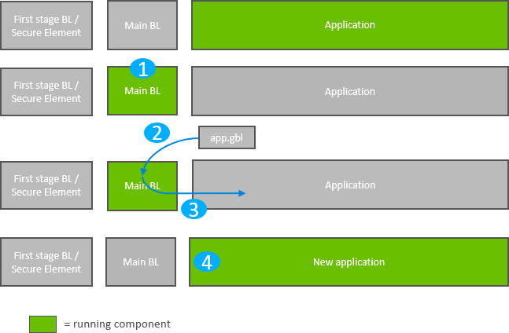
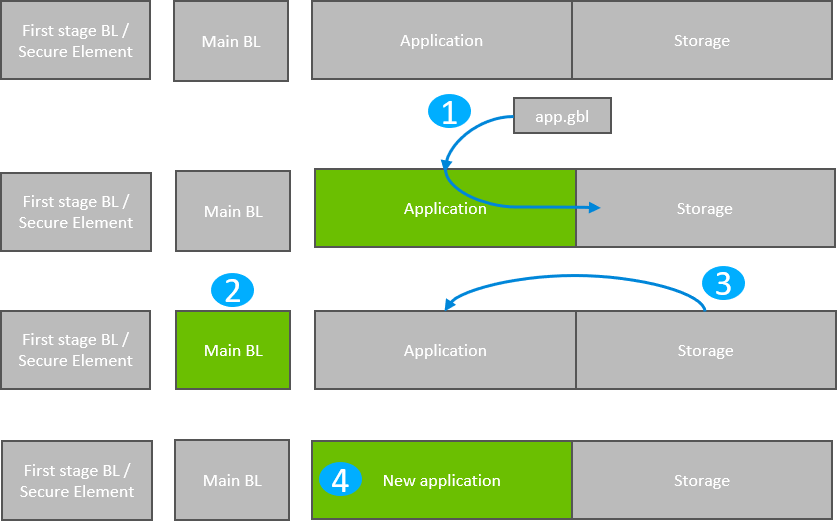
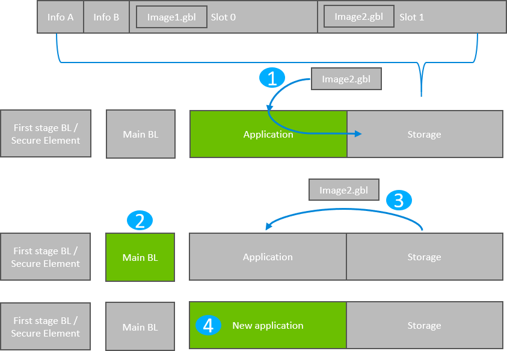

# Gecko Bootloader Operation - Application Upgrade

This section summarizes Gecko Bootloader operation for updating application firmware, first if the Gecko Bootloader is configured in standalone mode and then if it is configured in application mode. Section [Gecko Bootloader Operation - Bootloader Upgrade](./04-gecko-bootloader-operation-bootloader-upgrade.md#gecko-bootloader-operation-bootloader-upgrade) provides the same information for updating the bootloader firmware.

The figures that illustrate Gecko Bootloader operation in this section do not provide information about the bootloader memory layouts for different devices. For more details refer to the section "Memory Space for Bootloading" in [Bootloader Fundamentals](https://docs.silabs.com/mcu-bootloader/latest/bootloader-fundamentals/).

## Standalone Bootloader Operation

Standalone bootloader operation is illustrated in the following figure:

1. The device reboots into the bootloader.

2. A GBL file containing an application image is transmitted from the host to the device. If image encryption is enabled in the main stage bootloader and the image is encrypted, decryption is performed during the process of receiving and parsing the GBL file.

3. The bootloader applies the application upgrade from the GBL upgrade file on-the-fly. If image authentication is enabled in the main stage bootloader and the GBL file contains a signature, the authenticity of the image is verified before completing the process.

4. The device boots into the application. Application upgrade is complete.

### Rebooting Into the Bootloader

The Gecko Bootloader supports multiple mechanisms for triggering the bootloader. If the **GPIO activation** component is installed, the host device can keep this pin low/high (depending on configuration) through reset to make the device enter the bootloader. The bootloader can also be entered through software. The `bootloader_rebootAndInstall` API first signals to the bootloader that it should enter firmware upgrade mode by writing a command to the shared memory location at the bottom of SRAM, and then performs a software reset. If the bootloader finds the correct command in shared memory upon boot, it will enter firmware upgrade mode instead of booting the existing application.

### Downloading and Applying a GBL Upgrade File

When the bootloader enters firmware upgrade mode, it enters a receive loop waiting for data from the host device. The specifics of the receive loop depend on the protocol. Received packets are passed to the image parser, a state machine that parses the data and returns a callback containing any data that should be acted upon. The bootloader core implements this callback and flashes the data to internal flash at the address specified. If GBL file authentication or encryption is enabled, the image parser will enforce this, and abort the image upgrade if the authentication fails.

The bootloader prevents a newly uploaded image from being bootable by holding back parts of the application vector table until the GBL file CRC and GBL signature (if required) have been verified.

### Booting Into the Application

When an application upgrade is completed, the bootloader triggers a reboot with a message in shared memory at the bottom of SRAM signaling that an application upgrade has been successfully completed. The application can use this reset information to learn that an application upgrade was just performed.

Before jumping to the main application, the bootloader verifies that the application is ready to run. This includes verifying if the Program counter and Stack Pointer are valid. If secure boot is enabled, the bootloader expects a signed application and attempts to validate the signature of the application. In scenarios where secure boot is not enabled, the bootloader attempts to validate if the Application properties pointer points to valid app properties structure in the flash. If a valid app properties struct is found, the bootloader proceeds based on the signature type indicated by the application properties struct or else the bootloader assumes that the Application properties pointer points to the Reset Handler of the application (an app without application properties) and proceeds to boot into the application. In case the verification of the application fails at any stage, the bootloader enters the bootload mode instead of booting into the application.

### Error Handling

If the application upgrade is interrupted at any time, the device will be without a working application. The bootloader then resets the device, and re-enters firmware upgrade mode. The host device can easily restart the application upgrade process, to try loading the upgrade image again.

## Application Bootloader Operation

The following figure illustrates the application bootloader operation both for a single image/single storage slot, and multiple images/ multiple storage slots.

1. A GBL file is downloaded onto the storage medium of the device (internal flash or external dataflash), as described below, and the presence of an upgrade image is indicated.

2. The device reboots into the bootloader, and the bootloader enters firmware upgrade mode.

3. The bootloader applies the application upgrade from the GBL upgrade file.

4. The device boots into the application. Application upgrade is complete.

### Downloading and Storing a GBL Upgrade Image File

To prepare for receiving an upgrade image, the application finds an available storage slot, or erases an existing one using `bootloader_eraseStorageSlot`. If the bootloader only supports a single storage slot, a value of 0 should be used for the slot ID.

The application then receives a GBL file using an applicable protocol, such as Ethernet, USB, Zigbee, OpenThread, or Bluetooth, and stores it in the slot by calling `bootloader_writeStorage`.

When download is complete, the application can optionally verify the integrity of the GBL file by calling `bootloader_verifyImage`. This is also done by the bootloader before applying the image but can be done from the application in order to avoid rebooting into the bootloader if the received image was corrupt.

If multiple storage slots are supported, the application should write a bootload list by calling `bootloader_setImageToBootload`. The list is written to the two bootload info pages as shown in Figure The bootload list is a prioritized list of slots indicating the order the bootloader should use when attempting to perform a firmware upgrade. The bootloader attempts to verify the images in these storage slots in sequence and applies the first image to pass verification. If only a single storage slot is supported, the bootloader treats the entire download space as a single storage slot.

### Rebooting and Applying a GBL Upgrade File

The bootloader can be entered through software. The `bootloader_rebootAndInstall` API signals to the bootloader that it should enter firmware upgrade mode by writing a command to the shared memory location at the bottom of SRAM, and then performs a software reset. If the bootloader finds the correct command in shared memory upon boot, it enters firmware upgrade mode instead of booting the existing application.

The bootloader iterates over the list of storage slots marked for bootload and attempts to verify the image stored in each. Once it finds a valid GBL upgrade file, firmware upgrade is attempted from this GBL file. If the upgrade fails, the bootloader moves to the next image in the list. If no images pass verification, the bootloader reboots back into the existing application with a message in the shared memory location in SRAM indicating that no good upgrade images were found.

### Booting Into the Application

When an application upgrade is completed, the bootloader triggers a reboot with a message in shared memory at the bottom of SRAM signaling that an application upgrade has been successfully completed. The application can use this reset information to learn that an application upgrade was just performed.

Before jumping to the main application, the bootloader verifies that the application is ready to run. This includes verifying if the Program counter and Stack Pointer are valid. If secure boot is enabled, the bootloader expects a signed application and attempts to validate the signature of the application. In scenarios where secure boot is not enabled, the bootloader attempts to validate if the Application properties pointer points to valid app properties structure in the flash. If valid app properties struct is found, the bootloader proceeds based on the signature type indicated by the application properties struct or else the bootloader assumes that the Application properties pointer points to the Reset Handler of the application (an app without application properties) and proceeds to boot into the application. In case the verification of the application fails at any stage, the bootloader enters the bootload mode instead of booting into the application.
