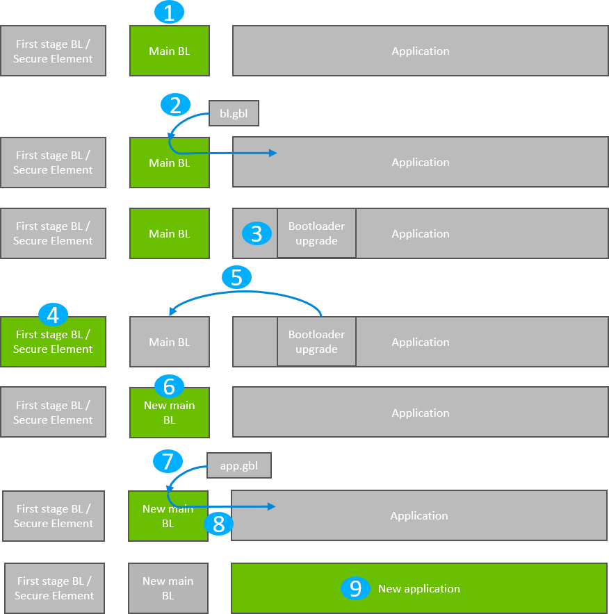
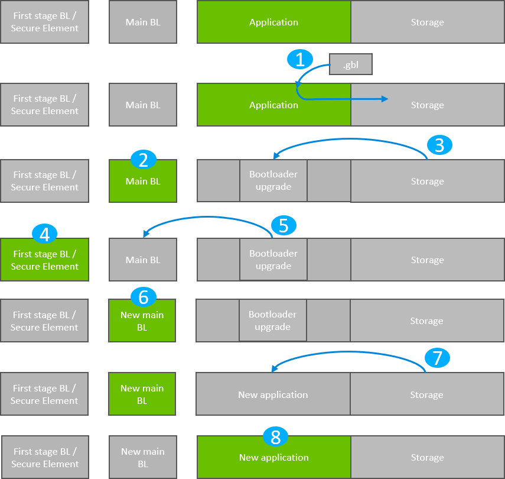

# Gecko Bootloader Operation - Bootloader Upgrade

Bootloader upgrade functionality is provided by the first stage bootloader on Series 1 devices, or the Secure Engine on Series 2 devices. The Secure Engine itself is also upgradable. For more details, see section [Gecko Bootloader Operation - Secure Engine Upgrade](./05-gecko-bootloader-operation-secure-engine-upgrade.md#gecko-bootloader-operation-secure-engine-upgrade). On Series 1 devices, the first stage bootloader is not upgradable.

Requirements for upgrading the main bootloader vary depending on the bootloader configuration:

- Application bootloader with storage: Upgrading the main bootloader requires a single GBL file containing both bootloader and application upgrade images.

- Standalone bootloader with communication interface: Upgrading the bootloader requires two GBL files, one with only the bootloader upgrade image, and one with only the application upgrade image.

Security of the bootloader upgrade process is provided by signing the GBL file. See section [Creating a Signed and Encrypted GBL Upgrade Image File from an Application](./09-gecko-bootloader-security-features.md#creating-a-signed-and-encrypted-gbl-upgrade-image-file-from-an-application).

The figures that illustrate Gecko Bootloader operation in this section do not provide information about the bootloader memory layouts for different devices. For more details refer to the “Memory Space for Bootloading” section in [Bootloader Fundamentals](https://docs.silabs.com/mcu-bootloader/latest/bootloader-fundamentals/). For convenience, the figures do not distinguish between SE and VSE.

## Bootloader Upgrade on Bootloaders with Communication Interface (Standalone Bootloaders)

The process is illustrated in the following figure:

1. The device reboots into the bootloader.

2. A GBL file containing only a bootloader upgrade image is transmitted from the host to the device.

3. The contents of the GBL Bootloader tag are written to the bootloader upgrade location in internal flash, overwriting the existing application.

4. The device reboots into the first stage bootloader / Secure Engine.

5. The first stage bootloader / Secure Engine replaces the main bootloader with the new version found in the bootloader upgrade location.

6. The device boots into the new main bootloader.

7. A GBL file containing only an application image is transmitted from the host to the device.

8. The bootloader applies the application image from the GBL upgrade file on-the-fly.

9. The device boots into the application. Bootloader upgrade is complete.

A bootloader upgrade is started in the same way as an application upgrade.

### Downloading and Applying a Bootloader GBL Upgrade File

When the bootloader has entered the receive loop, a GBL upgrade file containing a bootloader upgrade is transmitted to the bootloader. When a packet is received, it is passed to the image parser. The image parser parses the data and returns bootloader upgrade data in a callback. The bootloader core implements this callback and flashes the data to internal flash at the bootloader upgrade location.

The bootloader prevents a newly uploaded bootloader upgrade image from being interpreted as valid by holding back parts of the bootloader upgrade vector table until the GBL file CRC and GBL signature (if required) have been verified.

When a complete bootloader upgrade image is received, the main bootloader signals the first stage bootloader / Secure Engine that it should enter firmware upgrade mode. On Series 1 devices, this is done by writing a command to the shared memory location at the bottom of SRAM, and then performing a software reset. On Series 2 devices, Secure Engine communication is used to signal that bootloader upgrade is ready to be performed.

On Series 1 devices, the first stage bootloader verifies the CRC on the current main bootloader and verifies the CRC of the bootloader upgrade present in the bootloader upgrade location in internal flash.

- If the CRC in the upgrade image location and the CRC in the current main bootloader are both valid, then the upgrade image will be copied over the main bootloader if the version number of the upgrade is higher than the current main bootloader version.

- If the CRC in the upgrade image location is valid and the CRC in the current main bootloader location is not valid, the upgrade image will be copied over the main bootloader regardless of the version. This is because the version of the main bootloader cannot be relied upon if the main bootloader image is corrupt.

- If the CRC in the upgrade location is not valid, the upgrade will not be applied.

On Series 2 devices, the authenticity of the main bootloader optionally can be verified before applying the bootloader upgrade. See section [Setting a Version Number](./07-configuring-the-gecko-bootloader.md#setting-a-version-number) for more information about versioning bootloader images.

### Upgrading Bootloaders Without Secure Boot to Bootloaders with Secure Boot

A bootloader without the secure boot feature can be upgraded to a bootloader with the secure boot feature, using the following procedure:

1. Prepare a Gecko Bootloader image with secure boot enabled. The version of the bootloader needs to be higher than the bootloader on the device.

    - Turn on secure boot in Simplicity Studio by going to the **Bootloader Core** component and selecting the **Enable secure boot** option.

    - (Optional) In the **Bootloader Core** component, select the **Require signed firmware upgrade files** option. This means that the Gecko Bootloader will only accept signed GBL files.

2. Generate a public/private Signing Key pair. See section [Generating Keys](./09-gecko-bootloader-security-features.md#generating-keys) for more information on creating a Signing Key pair.

3. Write the public key generated from the previous step to the device. The public key is stored as a manufacturing token in the device by default. This key can be written by application code running on the device as long as the Lock Bits page is configured to allow flash writes. If the Lock Bits page is locked, it can only be erased by the debugger. Therefore, signing/decryption keys residing in the Lock Bits page cannot be erased from firmware. This means that, for devices in the field, those areas in flash cannot be replaced with new ones. However, the Gecko Bootloader prepared from step 1 can be modified to look for the decryption and signature keys in a different location. Key locations are defined in the bootloader project file `btl_security_tokens.c`.

4. Create a GBL file using the Gecko Bootloader image. The GBL file needs to be signed/unsigned depending on the current configuration of the Gecko Bootloader running on the device. For more details on creating a GBL file, see section [Creating a Signed and Encrypted GBL Upgrade Image File from an Application](./09-gecko-bootloader-security-features.md#creating-a-signed-and-encrypted-gbl-upgrade-image-file-from-an-application).

5. Upload the GBL file. For more details on the upgrade process, see section [Bootloader Upgrade on Bootloaders with Communication Interface (Standalone Bootloaders)](#bootloader-upgrade-on-bootloaders-with-communication-interface-standalone-bootloaders).

### Enabling Secure Boot RTSL on Series 2 Devices

Secure Boot RTSL (Root of Trust and Secure Loader) can be enabled using the following procedure:

1. Prepare a Gecko Bootloader image with secure boot enabled. The version of the Gecko Bootloader needs to be higher than the Gecko Bootloader on the device.

    - Turn on secure boot in Simplicity Studio by going to the **Bootloader Core** component and selecting the **Enable secure boot** option.

    - For EFR32xG21, in the **Bootloader Core** component, disable the **Allow use of public key from manufacturing token storage** option. This means that the Gecko Bootloader will never make use of the public key stored in the last page of the main flash

    - (Optional) In the **Bootloader Core** component, select the **Require signed firmware upgrade files** option. This means that the Gecko Bootloader will only accept signed GBL files.

2. Generate a public/private Signing Key pair. See section [Generating Keys](./09-gecko-bootloader-security-features.md#generating-keys) for more information on creating a Signing Key pair.

3. Prepare an application that installs the public key generated from step 2 to the Secure Engine One-time Programmable memory. Installing a key in the VSE requires a reset routine. Make sure that the application does not end up in the reset loop. Create an unsigned GBL file from this application and upload it. For more information on installing public keys, see section [Creating a Signed and Encrypted GBL Upgrade Image File from an Application](./09-gecko-bootloader-security-features.md#creating-a-signed-and-encrypted-gbl-upgrade-image-file-from-an-application).

4. Sign the Gecko Bootloader image generated from step 1 using the private key generated in step 2. See section [Signing an Application Image for Secure Boot](./09-gecko-bootloader-security-features.md#signing-an-application-image-for-secure-boot) for more information on signing binaries.

5. Make a custom application that turns on secure boot on the Secure Engine and sign this application binary with the private key generated from step 2. For more details on how to turn on secure boot on the Secure Engine, see [Series 2 and Series 3 Secure Boot with RTSL](https://docs.silabs.com/mcu-bootloader/latest/series2-secure-boot-with-rtsl/).

6. Create a GBL file using the Gecko Bootloader image from step 4.

7. Create a GBL file using the application from step 5. The GBL file need to be signed if the **Bootloader Core** component option **Require signed firmware upgrade files** was selected in step 1.

8. Upload the GBL file containing the Gecko Bootloader image.

9. Upload the GBL file containing the application.

### Downloading and Applying an Application GBL Upgrade File

Once the bootloader upgrade is completed, the existing application is rendered invalid, since the bootloader upgrade location overlaps with the application. A GBL upgrade file containing an application upgrade is transmitted to the bootloader. The application upgrade process follows that in section [Standalone Bootloader Operation](./03-gecko-bootloader-operation-application-upgrade.md#standalone-bootloader-operation).

## Bootloader Upgrade on Application Bootloaders with Storage

The process is illustrated in the following figure.

1. A single GBL file containing both a bootloader upgrade image and an application image is downloaded onto the storage medium of the device (internal flash or external SPI flash).

2. The device reboots into the main bootloader.

3. The main bootloader parses its upgrade image into internal flash at the bootloader upgrade location. Depending on the application size as well as how the “scratch space” is configured for the bootloader on Series 2 devices, the existing application may be overwritten.

4. The main bootloader verifies the integrity of the upgrade image and then resets the device with reset reason BOOTLOADER_RESET_REASON_UPGRADE to apply the upgrade.

5. The device reboots into the first stage bootloader / Secure Engine.

6. The first stage bootloader / Secure Engine replaces the main bootloader with the new version.

7. The device boots into the new main bootloader.

8. The bootloader applies the application image from the GBL upgrade file.

9. The device boots into the application. Bootloader upgrade is complete.

A bootloader upgrade is started in the same way as an Application Upgrade. A single GBL file containing both a bootloader and an application upgrade is written to storage by the application, and the bootloader is entered.

The bootloader iterates over the list of storage slots marked for bootload and attempts to verify the GBL file stored within. Verification returns information about whether the GBL file contains an application, or both a bootloader and an application. The image parser parses the file. If the GBL file contains a bootloader, the bootloader upgrade data is returned in a callback. The bootloader core implements this callback and flashes the data to internal flash at the bootloader upgrade location.

The bootloader prevents a newly uploaded bootloader upgrade image from being interpreted as valid by holding back parts of the bootloader upgrade vector table until the GBL file CRC and GBL signature (if required) have been verified.

On Series 1 devices, the main bootloader signals the first stage bootloader that it should enter firmware upgrade mode by writing a command to the shared memory location at the bottom of SRAM, and then performing a software reset. On Series 2 devices, Secure Engine communication interface is used to signal the Secure Engine that a bootloader upgrade is ready to be performed.

On Series 1 devices, the first stage bootloader verifies the CRC of the bootloader upgrade present in the bootloader upgrade location in internal flash and copies the bootloader upgrade over the main bootloader if the version number of the upgrade is higher than the version number of the existing main bootloader. On Series 2 devices, the authenticity of the main bootloader optionally can be verified before applying the bootloader upgrade. See section [Setting a Version Number](./07-configuring-the-gecko-bootloader.md#setting-a-version-number) for more information about versioning bootloader images.

The new main bootloader is entered, and the images in the list of storage slots marked for bootload are verified. When the image parser parses the slot containing the GBL file with the bootloader + application upgrade, the version number of the bootloader upgrade is equal to the running main bootloader version, so another bootloader upgrade will not be performed. Instead, the application upgrade data are returned in a callback. Bootloading of the new application proceeds as described in section [Application Bootloader Operation](./03-gecko-bootloader-operation-application-upgrade.md#application-bootloader-operation).

### Storage Space Size Configuration

The storage space size must be configured to have enough space to store the upgrade images. Depending on the configuration, the bootloader size can vary. For size requirements of the bootloader, see section [Size Requirements for Different Bootloader Configurations for Series 1 Devices](./07-configuring-the-gecko-bootloader.md#size-requirements-for-different-bootloader-configurations-for-series-1-devices).

### Upgrading Bootloaders without Secure Boot to Bootloaders with Secure Boot

A bootloader without the secure boot feature can be upgraded to a bootloader with the secure boot feature. The procedure is as follows:

1. Prepare a Gecko Bootloader image with secure boot enabled. The version of the bootloader needs to be higher than the bootloader on the device.

    - Turn on secure boot from the **Bootloader Core** component in Simplicity Studio by selecting the **Enable secure boot** option.

2. Generate a public/private Signing Key pair. See section [Generating Keys](./09-gecko-bootloader-security-features.md#generating-keys) for more information on creating a Signing Key pair.

3. Write the public key generated from the previous step to the device. The public key is stored as a manufacturing token in the device by default. This key can be written by application code running on the device as long as the Lock Bits page is configured to allow flash writes. If the Lock Bits page is locked, it can only be erased by the debugger. Therefore, signing/decryption keys residing in the Lock Bits page cannot be erased from firmware. This means that, for devices in the field, those areas in flash cannot be replaced with new ones. However, the Gecko Bootloader prepared from step 1 can be modified to look for the decryption and signature keys in a different location. Key locations are defined in the bootloader project file `btl_security_tokens.c`.

4. Prepare a signed application image using the private key generated in step 2. See section [Signing an Application Image for Secure Boot](./09-gecko-bootloader-security-features.md#signing-an-application-image-for-secure-boot) for more information on signing an application.

5. Create a GBL file using the Gecko Bootloader image and the signed application image. The GBL file needs to be signed/unsigned depending on the configuration of the Gecko Bootloader running on the device. For more details on creating a GBL file, see section [Creating a Signed and Encrypted GBL Upgrade Image File from an Application](./09-gecko-bootloader-security-features.md#creating-a-signed-and-encrypted-gbl-upgrade-image-file-from-an-application).

6. Upload the GBL file. For more details on the upgrade process, see section [Bootloader Upgrade on Application Bootloaders with Storage](#bootloader-upgrade-on-application-bootloaders-with-storage).

### Enabling Secure Boot RTSL on Series 2 Devices

Secure Boot RTSL can be enabled by using the following procedure:

1. Prepare a Gecko Bootloader image with secure boot enabled. The version of the Gecko Bootloader needs to be higher than the Gecko Bootloader on the device.

    - Turn on secure boot from the **Bootloader Core** component in Simplicity Studio by selecting the **Enable secure boot** option.

    - For EFR32xG21, in the **Bootloader Core** component, disable the **Allow use of public key from manufacturing token storage** option. This means that the Gecko Bootloader will never make use of the public key stored in the last page of the main flash.

    - (Optional) In the **Bootloader Core** component, select the **Require signed firmware upgrade files** option. This means that the Gecko Bootloader will only accept signed GBL files.

2. Generate a public/private Signing Key pair. See section [Generating Keys](./09-gecko-bootloader-security-features.md#generating-keys) for more information on creating a Signing Key pair.

3. Prepare an application that installs the public key generated from step 2 to the Secure Engine One-time Programmable memory. Installing a key in VSE requires a reset routine. Make sure that the application does not end up in the reset loop. Create an unsigned GBL file from this application and upload it. For more information on installing public keys, see [Series 2 and Series 3 Secure Boot with RTSL](https://docs.silabs.com/mcu-bootloader/latest/series2-secure-boot-with-rtsl/). For more details on creating a GBL file, see section [Creating a Signed and Encrypted GBL Upgrade Image File from an Application](./09-gecko-bootloader-security-features.md#creating-a-signed-and-encrypted-gbl-upgrade-image-file-from-an-application).

4. Sign the Gecko Bootloader image generated from step 1 using the private key generated in step 2. See section [Signing an Application Image for Secure Boot](./09-gecko-bootloader-security-features.md#signing-an-application-image-for-secure-boot) for more information on signing binaries.

5. Make a custom application that turns on secure boot on the Secure Engine and sign this application binary with the private key generated from step 2. For more details on how to turn on secure boot on the Secure Engine, see [Series 2 and Series 3 Secure Boot with RTSL](https://docs.silabs.com/mcu-bootloader/latest/series2-secure-boot-with-rtsl/).

6. Create a GBL file using the Gecko Bootloader image from step 4 and the application from step 5. The GBL file must be signed if the **Bootloader Core** component option **Require signed firmware upgrade files** was selected in step 1. For more details on creating a GBL file, see section [Creating a Signed and Encrypted GBL Upgrade Image File from an Application](./09-gecko-bootloader-security-features.md#creating-a-signed-and-encrypted-gbl-upgrade-image-file-from-an-application).

7. Upload the GBL file containing the Gecko Bootloader image and the application.
