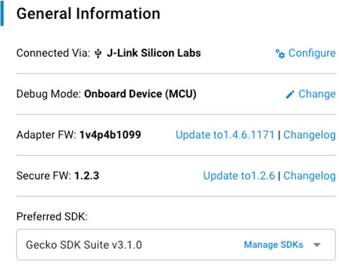
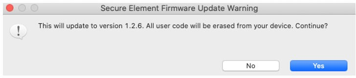
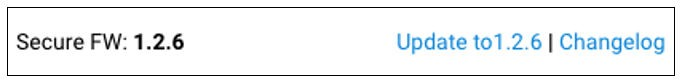
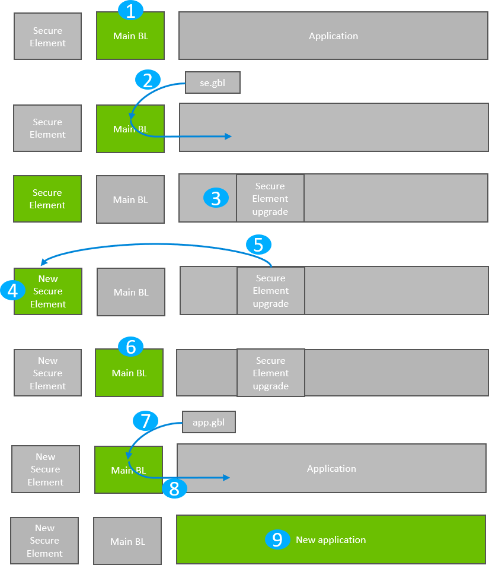
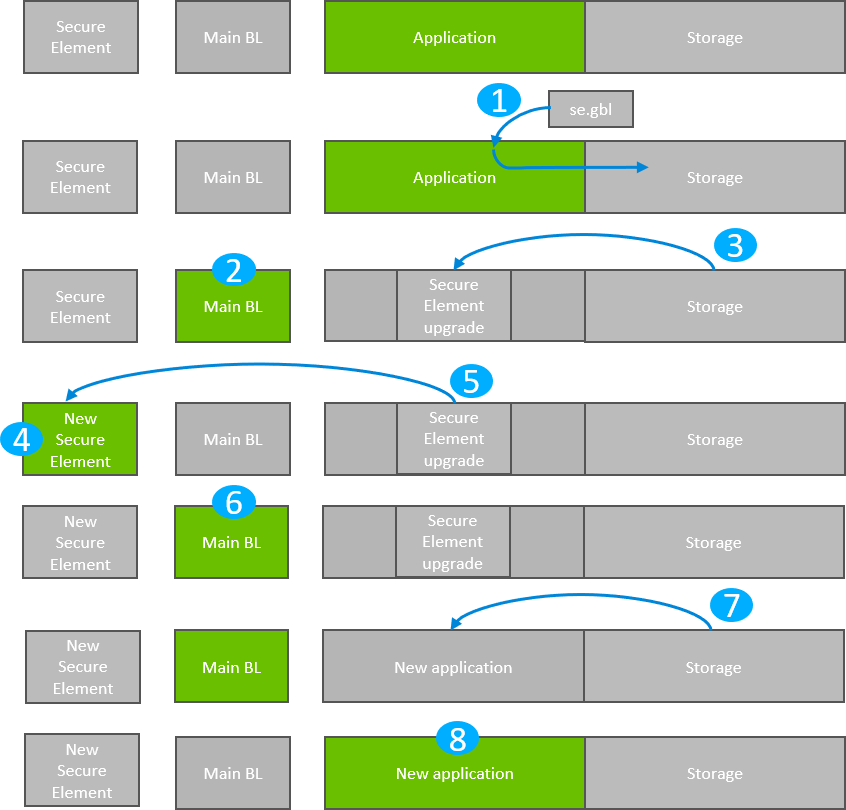

# Gecko Bootloader Operation - Secure Engine Upgrade

The Secure Engine is upgradable and requirements for upgrading the Secure Engine vary depending on the bootloader configuration:

- **Application bootloader with storage**: Upgrading the Secure Engine requires a single GBL file containing both Secure Engine and application upgrade images.

- **Standalone bootloader with communication interface**: Upgrading the Secure Engine requires two GBL files, one with only the Secure Engine upgrade image, and one with only the application upgrade image and optionally a third image containing only the Main bootloader upgrade.

A bootloader upgrade can also be included in the same GBL file in application mode, or as a third GBL file in standalone mode. The figures that illustrate Gecko Bootloader operation in this section do not provide information about the bootloader memory layouts for different devices. For more details refer to the section “Memory Space for Bootloading” in [Bootloader Fundamentals](https://docs.silabs.com/mcu-bootloader/latest/bootloader-fundamentals/).

Signed and encrypted Secure Engine upgrade images are provided by Silicon Labs through Simplicity Studio. Upgrade images with the same or lower version number than the running Secure Engine will be ignored.

To download Secure Engine firmware images, connect a Series 2 device and select a preferred SDK. The Secure Firmware **Update to x.x.x** link appears in the Launcher Perspective, as shown in the following figure.

Click **Update to x.x.x** next to Secure FW: x.x.x. A warning dialog box appears. Click **[Yes]** to continue.

The Launcher Perspective is then updated so that the current Secure Firmware version and link version are the same.

The Secure Engine firmware images can be found in the *util/se\_release/public* directory under the Gecko SDK. Simplicity Studio displays the SE firmware version available in the Gecko SDK selected.

## Secure Engine Upgrade on Bootloaders with Communication Interface (Standalone Bootloaders)

The process is illustrated in the following figure.

1. The device reboots into the bootloader.

2. A GBL file containing only a Secure Engine upgrade image is transmitted from the host to the device.

3. The contents of the GBL Secure Engine tag are written to the pre-configured upgrade location in internal flash, overwriting the existing application.

4. The device reboots into the Secure Engine.

5. The Secure Engine is replaced by the new version found in the pre-configured upgrade location.

6. The device boots into the main bootloader.

7. A GBL file containing only an application image is transmitted from the host to the device.

8. The bootloader applies the application image from the GBL upgrade on the fly.

9. The device boots into the application. Secure Engine upgrade is complete.

### Downloading and Applying a Secure Engine GBL Upgrade File

When the bootloader has entered the receive loop, a GBL upgrade file containing a Secure Engine upgrade is transmitted to the bootloader. When a packet is received, it is passed to the image parser. The image parser parses the data and returns Secure Engine upgrade data in a callback. The bootloader core implements this callback and flashes the data to internal flash at the pre-configured bootloader upgrade location.

When a complete Secure Engine upgrade image is received, the main bootloader signals the Secure Engine that it should enter firmware upgrade mode. This is done by the Secure Engine communication interface that is used to signal that bootloader upgrade is ready to be performed.

### Downloading and Applying an Application GBL Upgrade File

Once the Secure Engine upgrade is completed, the existing application is rendered invalid if the Secure Engine upgrade location overlaps with the application. A GBL upgrade file containing an application upgrade is transmitted to the bootloader. The application upgrade process follows that. For more information, see section [Standalone Bootloader Operation](./03-gecko-bootloader-operation-application-upgrade.md#standalone-bootloader-operation).

## Secure Engine Upgrade on Application Bootloaders with Storage

The process is illustrated in the following figure.

1. A single GBL file containing both a Secure Engine upgrade image and an application image is downloaded onto the storage medium of the device (internal flash or external SPI flash).

2. The device reboots into the bootloader.

3. a) The main bootloader copies its upgrade image into internal flash at the pre-configured upgrade location.

    b) Alternatively, if the no-staging Secure Engine upgrade option has been enabled, the upgrade image will be fetched directly from the GBL file in storage instead of first copying the image to the pre-configured upgrade location.

4. The device reboots into the Secure Engine.

5. The Secure Engine is replaced by the new version found in the pre-configured upgrade location (or directly from storage, ref. 3b).

6. The device boots into the main bootloader.

7. The bootloader applies the application image from the GBL upgrade file.

8. The device boots into the application. Secure Engine upgrade is complete.

### Storage Space Size Configuration

The storage space size must be configured to have enough space to store the upgrade images. The following table shows the reserved SE upgrade image sizes.

<table class="classic"><colgroup><col width="50%"/><col width="50%"/></colgroup><thead><tr><th>
Device Family
</th><th>
Reserved Flash for SE Upgrade Image
</th></tr></thead><tbody><tr><td>
EFR32xG21
</td><td>
48 kB
</td></tr><tr><td>
EFR32xG22
</td><td>
24 kB
</td></tr><tr><td>
EFR32xG23
</td><td>
96 kB
</td></tr></tbody></table>

Depending on the configuration, the bootloader size can vary. For size requirements of the bootloader, see section [Size Requirements for Different Bootloader Configurations for Series 1 Devices](./07-configuring-the-gecko-bootloader.md#size-requirements-for-different-bootloader-configurations-for-series-1-devices). The bootloader size for EFR32xG21 devices can be up to 16 kB and for EFR32xG22, EFR32xG23, and EFR32xG24 devices the bootloader size can be up to 24 kB. For more details, see [Bootloader Fundamentals](https://docs.silabs.com/mcu-bootloader/latest/bootloader-fundamentals/).
