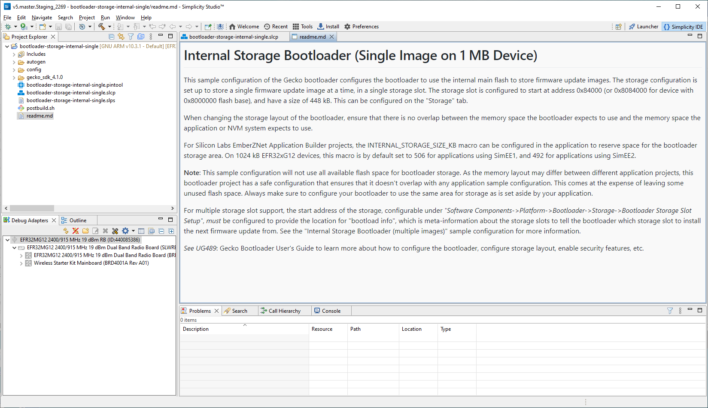
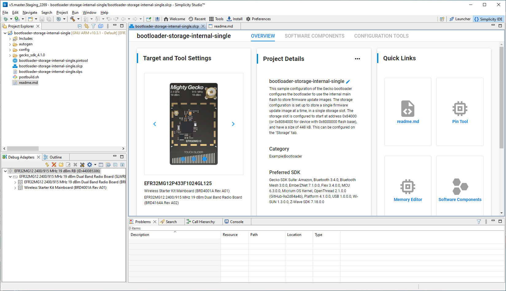
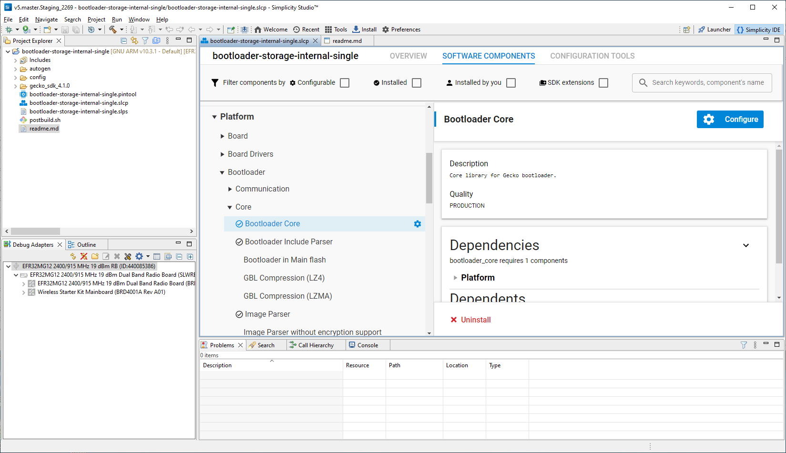
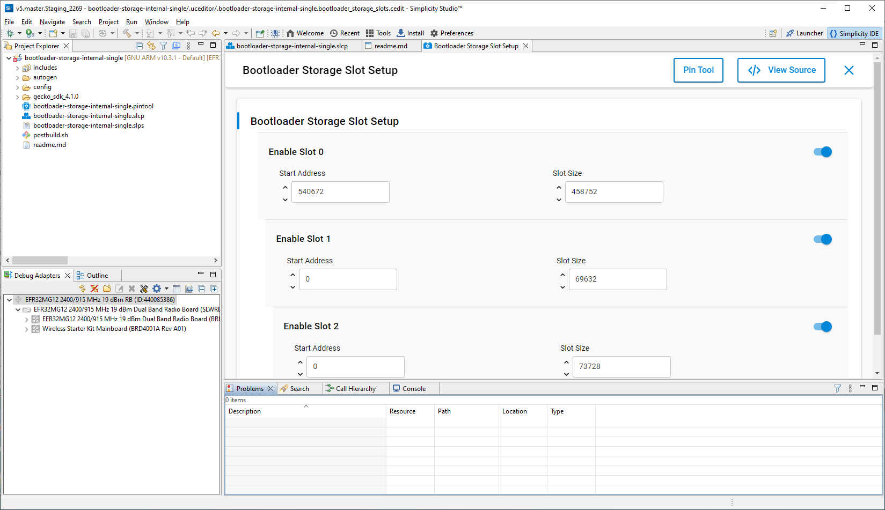
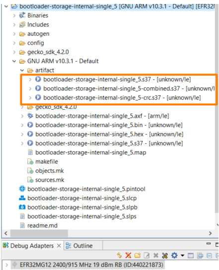

# Getting Started with the Gecko Bootloader

This section describes how to build a Gecko Bootloader from one of the provided examples. Simplicity Studio 5, used with Gecko SDK Suite (GSDK) v3.x and higher, differs from Simplicity Studio 4, used with GSDK v2.x, in how sample applications are selected and how projects are created. Refer to the documentation provided with your SDK for details. These instructions assume that you have installed Simplicity Studio 5, the GSDK and associated utilities as described in the SDK’s quick start guide, and that you are familiar with generating, compiling, and flashing an example application in the relevant version.

- [Bluetooth Getting Started Guide](https://docs.silabs.com/bluetooth/latest/bluetooth-getting-started-overview/)

- [Proprietary Flex SDK v3.x Quick-Start Guide](https://docs.silabs.com/connect-stack/latest/proprietary-flex-sdk-v3x-quick-start-guide/)

- [Silicon Labs OpenThread SDK Quick-Start Guide](https://docs.silabs.com/openthread/latest/openthread-quick-start-guide/)

- [Zigbee EmberZNet Quick-Start Guide for SDK 7.0 and Higher](https://docs.silabs.com/zigbee/latest/zigbee-7x-quick-start-guide/)

1. Create a project based on the Gecko Bootloader example of your choice. The project opens with a tab describing the example.

    

2. Click the project (\*.slcp) tab to move to the Project Configurator interface.

    

3. The Software Components tab shows the list of available components that can be installed in the project.

    

4. The **Storage Slot Setup** component allows you to configure storage slots to be used if a storage component is also installed. The default configuration matches the target part and bootloader type. This component supports a maximum of three storage slots.

    

5. Click the **Build** (hammer) icon.

6. After the build is complete, the bootloader binaries are available in the **artifact** folder as depicted in the image below.

    

On Series 1 devices, three bootloader images are generated into the build directory: a main bootloader, a main bootloader with CRC32 checksum, and a combined first stage and main bootloader with CRC32 checksum. The main bootloader image is called **\<projectname\>.s37**, the main bootloader with CRC32 checksum is called **\<projectname\>-crc.s37**, while the combined first stage image + main bootloader image with a CRC32 checksum is called **\<projectname\>-combined.s37**. The first time a device is programmed, whether during development or manufacturing, the combined image needs to be programmed. For subsequent programming, when a first stage bootloader is already present on the device, it is okay to download an image containing just the main bootloader. In this case, the main bootloader with CRC32 should be used.

The requirement is that any main bootloader image that is programmed via serial wire must contain the CRC32 in the image. Files downloaded via serial wire are “s37” files. Most often, the **\<projectname\>-combined.s37** file is the one downloaded during production programming. However, it is possible to download only the main bootloader over serial wire, in which case **\<projectname\>-crc.s37** should be used.

Any main bootloader that is upgraded with the OTA or host method should already contain CRC32 because bootloader-initiated upgrades use GBL files (not “s37” files) and Simplicity Commander adds the CRC32 when it constructs the GBL file. The input files to Simplicity Commander can (and should) use the non-CRC “s37” file.

On Series 2 devices, the combined image is not present, since the first stage bootloader does not exist. The image containing only a main bootloader is the image that must be used to create a GBL file for bootloader upgrade.
