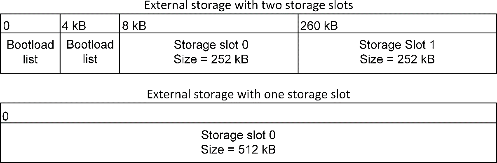
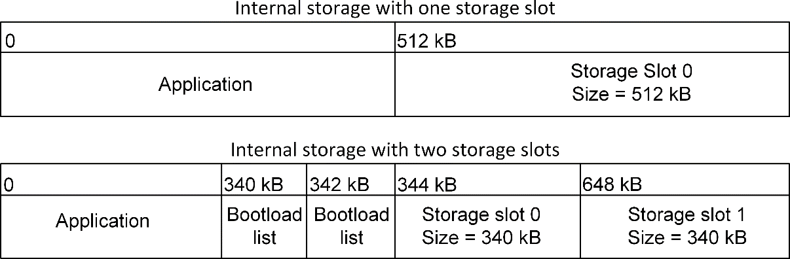
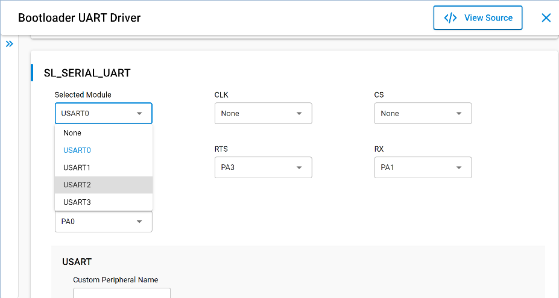

# Configuring the Gecko Bootloader

## Configuring Storage

Gecko Bootloaders configured as application bootloaders must include an API to store and access image files. This API is based on the concept of storage slots, where each slot has a predefined size and location in memory and can be used to store a single upgrade image. Slots are configured in the **Bootloader Storage Slot Setup** component.

When multiple storage slots are configured, a bootload list is used to indicate the order in which the bootloader should access slots to find upgrade images. If multiple storage slots are supported, the application should write the bootload list by calling bootloader_setImageToBootload before rebooting into the bootloader to initiate a firmware upgrade process. The bootloader attempts to verify the images in these storage slots in sequence and applies the first image to pass verification. If only a single storage slot is supported, the bootloader uses this slot implicitly. A maximum of three slots may be configured in the **Bootloader Storage Slot Setup** component.

### SPI Flash Storage Configuration

When configuring a Gecko Bootloader to obtain images from SPI flash, modify the following.

The **base address of the storage area** should be configured in the **Common Storage** component. This is the address at which the bootloader places the bootload list, if more than one storage slot is configured. In the default configuration, this address is set to 0. If only a single storage slot is configured, the bootload list is not used, so configuring it may be omitted.

The **location and size of the storage slots** can be configured using the **Bootloader Storage Slot Setup** component (supports a maximum of three configurable storage slots). The addresses input here are absolute addresses (they are not offsets from the base address). If more than a single slot is configured, space must be reserved between the base address as configured in the **Common Storage** component and the first storage slot configured in the **Bootloader Storage Slot Setup** component. Enough space to fit two copies of the bootload list must be reserved. These two copies need to reside on different flash pages, to provide redundancy in case of power loss during writing. Two full flash pages therefore need to be reserved. In the default example application, a SPI flash part with 4 kB flash sectors is used. This means that 8 kB must be reserved before the first storage slot. The following figure illustrates how the storage area can be partitioned, where the numbers in the top row represent the starting addresses.

### Internal Storage Configuration

When configuring a Gecko Bootloader to obtain images from internal flash, modify the following.

The **base address of the storage area** should be configured in the **Common Storage** component. This is the address at which the bootloader will place the prioritized list of storage slots to attempt to bootload from, if more than one storage slot is configured. In the default configuration, only a single storage slot is configured, so this value is set to 0, and isn’t used. If more than one storage slot is configured, this value needs to be configured too.

The **location and size of the storage slots** can be configured using the **Bootloader Storage Slot Setup** Component (supports a maximum of three configurable storage slots). The addresses input here are absolute addresses (they are not offsets from the base address). If more than a single slot is configured, enough space must be reserved between the base address as configured in the **Common Storage** component and the first storage slot configured in the **Bootloader Storage Slot Setup** component. Enough space to fit two copies of the bootload list must be reserved. These two copies need to reside on different flash pages, to provide redundancy in case of power loss during writing. Two full flash pages therefore need to be reserved. The following figure illustrates how the storage area can be partitioned.

>**Note**: The storage area partitioning in the example for two storage slots above does not take any NVM system into account. If using an NVM system like SimEE or PS Store, take care to place and size the storage area in such a way that bootloader storage does not overlap with NVM.

## Compressed Upgrade Images

The Gecko Bootloader optionally supports compressed GBL files. In a compressed GBL file, only the application upgrade data is compressed, any metadata and bootloader upgrade data (if present) stay uncompressed. This means that a compressed GBL file is identical to a normal (uncompressed) GBL file, except that the GBL Programming Tag containing the application upgrade image (as described in [Bootloader Fundamentals](https://docs.silabs.com/mcu-bootloader/latest/bootloader-fundamentals/)) has been replaced by a GBL LZ4 Compressed Programming Tag or GBL LZMA Compressed Programming Tag. Signature and encryption operations on a compressed GBL work identically to on an uncompressed GBL.

To be able to use compressed upgrade images, a decompressor for the relevant compression algorithm must be added to the Gecko bootloader. The following table shows which compression algorithms are supported by the Gecko Bootloader, and which Bootloader component should be added to enable the feature. The table also shows how much space the decompressor takes up in the bootloader, and how big of a size reduction to expect for the compressed application upgrade image. Be aware of the bootloader size requirement. The bootloader space might be too small to fit the decompressors, depending on the device and enabled components.

<table class="classic"><colgroup><col width="25%"/><col width="25%"/><col width="25%"/><col width="25%"/></colgroup><thead><tr><th>
Compression Algorithm
</th><th>
Component
</th><th>
Bootloader Size Requirement
</th><th>
Application Upgrade Size Reduction (typical)
</th></tr></thead><tbody><tr><td>
LZ4
</td><td>
GBL Compression (LZ4)
</td><td>
&lt; 1 kB
</td><td>
~ 10%
</td></tr><tr><td>
LZMA
</td><td>
Bootloader Compression (LZMA)
</td><td>
~5 kB flash, 18 kB RAM
</td><td>
~ 30%
</td></tr></tbody></table>

It is important to note that the compressed GBL file stays compressed while being transferred to the device, and while it is stored in the upgrade area. It is decompressed by the bootloader when the upgrade is applied. This means that the running application in main flash will be identical to one that was installed using an uncompressed (normal) GBL file.

Compressed GBL files can only be decompressed by the bootloader when running standalone, not through the Application Interface. This means that upgrade image verification performed by the application prior to reboot will not attempt to decompress the application upgrade, it will only verify the signature of the compressed payload. After rebooting into the bootloader, it will decompress the image as part of the upgrade process.

>**Note**: The above means that Bluetooth in-place application upgrades cannot be compressed, as they are processed by the Bluetooth Supervisor or AppLoader using functionality in the bootloader through the Application Interface. Supervisor/stack and AppLoader updates can be compressed, but the user application cannot.

### LZMA Compression Settings

LZMA decompression is only supported for images compressed with certain compression settings. Simplicity Commander automatically uses these settings when using the `commander gbl create --compress lzma` command.

- Probability model counters: lp + lc \<= 2. Simplicity Commander uses lp=1, lc=1.

- Dictionary size no greater than 8 kB. Simplicity Commander uses 8 kB.

Together, these settings cause the decompressor to require 18 kB of RAM for decompression – 10 kB for the counters and 8 kB for the dictionary.

The GBL LZMA Compressed Programming Tag contains a full LZMA file, containing the LZMA header, raw stream, and end mark. The Gecko bootloader only supports decompressing payloads that contain the end mark as the last 8 bytes of the compressed stream.

## Bootloader Example Configurations

The following sections describe the key configuration options for the example bootloader applications.

>**Note**: Security features are disabled for all example configurations. In development, Silicon Labs strongly recommends enabling security features to prevent unauthorized parties from uploading untrusted program code. See section [Using Application Image Security Features](./09-gecko-bootloader-security-features.md#using-application-image-security-features) to learn how to configure the security features of the Gecko Bootloader.

### UART XMODEM Bootloader

Standalone bootloader for EFM32 and EFR32 devices running the EmberZNet PRO and Silicon Labs Connect protocol stacks, using XMODEM-CRC over UART.

In this configuration, the **UART XMODEM** communication component, **XMODEM Parser** component, and **Bootloader UART Driver** component are installed. For the example application to run on a custom board, the GPIO ports and pins used for UART need to be configured in the **Bootloader UART Driver** component. Here, Hardware Flow Control can be enabled or disabled, and the baud rate and pinout can be configured.

The **GPIO activation** component is also installed by default, allowing bootloader entry into firmware upgrade mode by activating a GPIO through reset. The GPIO pin used can be configured here. This component can be uninstalled if this functionality is not desired.

### BGAPI UART DFU Bootloader

Standalone bootloader for the Bluetooth protocol stack, using the BGAPI protocol for UART DFU. This bootloader should be used for all NCP-mode Bluetooth applications.

In this configuration, the **BGAPI UART DFU** communication component and **Bootloader UART Driver** component are installed. For the example application to run on a custom board, the GPIO ports and pins used for UART need to be configured in the **Bootloader UART Driver** component. Here, Hardware Flow Control can be enabled or disabled, and the baud rate and pinout can be configured.

The GPIO activation component is also installed by default, allowing bootloader entry by activating a GPIO through reset. The GPIO pin used can be configured here. This component can be uninstalled if this functionality is not desired.

### EZSP SPI Bootloader

Standalone bootloader for EmberZNet PRO and Silicon Labs Connect protocol stacks using EZSP for SPI.

In this configuration, the **EZSP-SPI** communication component, **XMODEM Parser** component, and **Bootloader SPI Peripheral Driver** component are installed. For the example application to run on a custom board, the GPIO ports and pins used for SPI and EZSP signaling need to be configured in the **Bootloader SPI Peripheral Driver** and **EZSP-SPI** components, respectively.

The **EZSP GPIO activation** component is also installed by default, allowing bootloader entry into firmware upgrade mode by activating a GPIO through reset. The GPIO pin used can be configured here. This component can be uninstalled if this functionality is not desired.

### Bluetooth AppLoader OTA DFU Bootloader

Standalone bootloader for the Bluetooth protocol stack, using Bluetooth for Over-The-Air DFU.

In this configuration, the **Bluetooth AppLoader** communication component is installed.

### SPI Flash Storage Bootloader

Application bootloader for all wireless protocol stacks, using an external SPI flash to store upgrade images received over the air by the application.

In this configuration, the **SPI Flash Storage** and **Common Storage** components, as well as the **Bootloader SPI Controller Driver** component, are installed. For the example application to run on a custom board, the GPIO ports and pins used for SPI communication with the external flash need to be configured in the **Bootloader SPI Controller Driver** component, and the type of SPI flash needs to be configured in the **SPI Flash Storage** component. The base address of the storage area can be configured in the **Common Storage** component. The location and size of the storage slots themselves can be configured using the **Bootloader Storage Slot Setup** component (supports up to three configurable storage slots).

The SPI Flash storage bootloader provides customizable callback functions, which can be found in *bootloader-callback-stubs.c*. The callback functions *storage\_customInit* and *storage\_customShutdown*, for example, can be used for custom hardware setups. Those callback functions can be interfaced from the applications using the bootloader interface functions such as *bootloader\_init* and *bootloader\_deinit* from *api/btl\_interface.h*.

Currently, Silicon Labs supports the following SPI Flash storage bootloaders:

1. SPI Flash storage bootloader (multiple images)

2. SPI Flash storage bootloader (single image)

3. SPI Flash storage bootloader (single image with slot size of 1MB). **Note: This bootloader should only be used for systems with an external SPI Flash size \>= 1 MB**.

### SPI Flash Storage Bootloader SFDP

Application bootloader for all wireless protocol stacks, using an external SPI flash to store upgrade images received over the air by the application.

In this configuration, the **SPI Flash Storage SFDP** and **Common Storage** components, as well as the **Bootloader SPI Controller Driver** component, are installed. For the example application to run on a custom board, the GPIO ports and pins used for SPI communication with the external flash need to be configured in the **Bootloader SPI Controller Driver** component. The type of SPI flash is detected at runtime. The base address of the storage area can be configured in the **Common Storage** component. The location and size of the storage slots themselves can be configured using the **Bootloader Storage Slot Setup** component (supports up to three configurable storage slots).

The SPI Flash storage bootloader SFDP provides customizable callback functions, which can be found in *bootloader-callback-stubs.c*. The callback functions *storage\_customInit* and *storage\_customShutdown*, for example, can be used for custom hardware setups. Those callback functions can be interfaced from the applications using the bootloader interface functions such as *bootloader\_init* and *bootloader\_deinit* from *api/btl\_interface.h*.

### Internal Storage Bootloader

Application bootloader for all wireless protocol stacks, using internal flash to store upgrade images received over the air by the application.

Multiple examples are provided, including configurations for 512 kB flash memory devices like EFR32xG13, 1024 kB flash memory devices like EFR32xG12, and 2048 kB flash memory devices like EFM32GG11. **The storage layout should be modified before running the bootloader on any other devices**. In this configuration, the internal flash and common storage components are installed. The base address of the storage area is configured in the **Common Storage** component. The location and size of the storage slots can be configured using the **Bootloader Storage Slot Setup** component (provides up to three configurable storage slots). Default example applications are provided with configurations for both single storage slot and multiple storage slots.

The default storage slot configurations provided by the Gecko Bootloader **must** be configured to match the use-case-specific application configurations.

**Table**: Internal Storage Bootloader Default Storage Configurations

<table class="classic"><colgroup><col width="30%"/><col width="25%"/><col width="20%"/><col width="25%"/></colgroup><thead><tr><th>
Sample Applications
</th><th>
Storage Offset
</th><th>
Storage Size
</th><th>
Additional Notes
</th></tr></thead><tbody><tr><td>
Internal Storage Bootloader (single image on 256 kB device)
</td><td>
0x21800 (137216)
</td><td>
88064
</td><td>
This configuration is available for devices where flash base address is 0x00
</td></tr><tr><td>
'
</td><td>
0x8021800 (134354944)
</td><td>
88064
</td><td>
This configuration is only available for devices where the flash base address is 0x08000000
</td></tr><tr><td>
Internal Storage Bootloader (single image on 352 kB device)
</td><td>
0x28000 (163840)
</td><td>
147456
</td><td>
This configuration is available for devices where flash base address is 0x00
</td></tr><tr><td>
'
</td><td>
0x8028000 (134381568)
</td><td>
147456
</td><td>
This configuration is only available for devices where the flash base address is 0x08000000
</td></tr><tr><td>
Internal Storage Bootloader (single image on 512 kB device)
</td><td>
0x44000 (278528)
</td><td>
196608
</td><td>
This configuration is available for devices where flash base address is 0x00
</td></tr><tr><td>
'
</td><td>
0x8044000 (134496256)
</td><td>
196608
</td><td>
This configuration is only available for devices where the flash base address is 0x08000000
</td></tr><tr><td>
Internal Storage Bootloader (single image on 1 MB device)
</td><td>
0x84000 (540672)
</td><td>
458752
</td><td>
This configuration is available for devices where flash base address is 0x00
</td></tr><tr><td>
'
</td><td>
0x8084000 (134758400)
</td><td>
458752
</td><td>
This configuration is only available for devices where the flash base address is 0x08000000
</td></tr><tr><td>
Internal Storage Bootloader (single image on 2 MB device)
</td><td>
0x10000 (1048576)
</td><td>
1011712
</td><td>
This configuration is available for devices where flash base address is 0x00
</td></tr><tr><td>
'
</td><td>
0x8100000 (135266304)
</td><td>
1011712
</td><td>
This configuration is only available for devices where the flash base address is 0x08000000
</td></tr><tr><td>
Internal Storage Bootloader (multiple images on 1 MB device)
</td><td>
0x5A000 (368640)
</td><td>
337920
</td><td>
This configuration is available for devices where flash base address is 0x00
</td></tr><tr><td>
'
</td><td>
0xAC800 (706560)
</td><td>
337920
</td><td>
This configuration is available for devices where flash base address is 0x00
</td></tr><tr><td>
Internal Storage Bootloader (single image on 1536kB device)
</td><td>
0xC0000 (786432)
</td><td>
737280
</td><td>
This configuration is available for devices where flash base address is 0x00
</td></tr><tr><td>
'
</td><td>
0x80C0000 (135004160)
</td><td>
737280
</td><td>
This configuration is only available for devices where the flash base address is 0x08000000
</td></tr><tr><td>
Internal Storage Bootloader (single image on 1920kB device)
</td><td>
0x80E8000 (135168000)
</td><td>
966656
</td><td>
This example application is available for device families with flash size of 1920kB or higher (for example xG25 device family)
</td></tr></tbody></table>

## Image Acquisition Application Example Configuration

These examples illustrate applications that acquire and store a GBL upload image for an application bootloader. For the running bootloader to accept an application upgrade, the new application version must be higher than the existing version. The version number can be set in Appbuilder by defining the macro “APP_PROPERTIES_VERSION” in the **Additional Macros** field on the **Other** tab.

## Setting a Version Number

To distinguish between different builds of the Gecko Bootloader, it is useful to set a version number. To perform a bootloader upgrade, not only must the running bootloader pass its integrity checks (see section [Downloading and Applying a Bootloader GBL Upgrade File](./04-gecko-bootloader-operation-bootloader-upgrade.md#downloading-and-applying-a-bootloader-gbl-upgrade-file)), but the bootloader upgrade image must also have a higher version number than the running bootloader image. A version number can be set using Simplicity Studio by configuring the **Bootloader Version Main Customer** option of the **Bootloader Core** component. This macro will be picked up by the config file **btl\_config.h**, where it is combined with the version number of the Gecko Bootloader files provided by Silicon Labs.

## Placing Bootloader in Main Flash

For device families xG13 and xG14, the entire main stage bootloader might not fit into the bootloader flash if the user installs some extra components. In such scenarios, the main stage bootloader can be placed in the main flash by installing the Bootloader in Main Flash core component. This component internally provides a MACRO named MAIN_BOOTLOADER_IN_MAIN_FLASH which is used to set the appropriate address required to place the main bootloader in main flash. The MACRO is used to generate the linker file from the common linker template with the appropriate addresses to place the main stage bootloader in the main flash.

## Hardware Configuration

The Gecko Bootloader uses the Pin Tool for configuration of pinout and other hardware-related settings. When Pin Tool configuration is available for a bootloader component, the relevant settings are shown in the Component Editor for that component.

The standalone Pin Tool User Interface can also be used to configure settings for Gecko Bootloader if desired.

While the Pin Tool provides configuration for many different peripherals, the Gecko Bootloader uses only the following Pin Tool modules:

- SERIAL is used by the UART Driver component to configure baud rate, flow control mode and pinout.

- VCOM is used by the UART Driver component to enable the serial interface if necessary (only on Silicon Labs Wireless Starter Kits).

- EXTFLASH is used by the SPI Driver to configure frequency and pinout.

- SPINCP is used by the SPI Slave Driver to configure pinout.

- BTL_BUTTON is used by the GPIO Activation component.

- CMU HFXO frequency setting is used by the delay driver to calibrate timing if the core is running from the HFXO.

Other settings, like CMU oscillator configuration or DCDC configuration, are not taken into consideration by the default bootloader code. If using these configuration settings is desired, the required code must be added in btl_main.c.

>**Note**: While the delay driver uses the HFXO frequency setting from Pin Tool, the HFXO enable setting is not used to initialize the HFXO on startup. This setting is only used when calling the bootloader through the Application Interface (see section [Gecko Bootloader and TrustZone](./10-gecko-bootloader-and-trustzone.md#gecko-bootloader-and-trustzone)), and the application has switched to the HFXO prior to calling the Bootloader Application Interface API.

## Size Requirements for Different Bootloader Configurations for Series 1 Devices

Enabling different configuration options for the Gecko Bootloader changes the size of the resulting image. The following table shows a list of example bootloader configurations and the resulting approximate size of the main bootloader. Note that any size above 14 kB will be too large to fit in the bootloader area of flash of EFR32xG13, and that any size above 16 kB will be too large to fit in the bootloader area of flash on EFR32xG14 and EFM32TG11. This table was last updated for Gecko SDK Suite 4.0 (Gecko Bootloader 2.0), and no guarantees are made that a configuration of a specific size with one SDK version will maintain that size in future releases.

**Table**: Bootloader Size Requirements

<table class="classic"><colgroup><col width="30%"/><col width="50%"/><col width="20%"/></colgroup><thead><tr><th>
Base Configuration
</th><th>
Enabled Options
</th><th>
Size (kB)
</th></tr></thead><tbody><tr><td>
XMODEM UART
</td><td>
Default configuration
</td><td>
12.8
</td></tr><tr><td>
'
</td><td>
Secure boot, signed and encrypted upgrade
</td><td>
12.8
</td></tr><tr><td>
'
</td><td>
Secure boot, signed and encrypted upgrade, LZ4 compression
</td><td>
13.7
</td></tr><tr><td>
'
</td><td>
Secure boot, signed and encrypted upgrade, LZMA compression
</td><td>
17.9
</td></tr><tr><td>
Internal storage, single slot
</td><td>
Default configuration
</td><td>
11.5
</td></tr><tr><td>
'
</td><td>
Secure boot, signed and encrypted upgrade
</td><td>
11.5
</td></tr><tr><td>
'
</td><td>
Secure boot, signed and encrypted upgrade, LZ4 compression
</td><td>
12.4
</td></tr><tr><td>
'
</td><td>
Secure boot, signed and encrypted upgrade, LZMA compression
</td><td>
16.6
</td></tr><tr><td>
Internal storage, multiple slots
</td><td>
Default configuration
</td><td>
12.1
</td></tr><tr><td>
'
</td><td>
Secure boot, signed and encrypted upgrade
</td><td>
12.1
</td></tr><tr><td>
'
</td><td>
Secure boot, signed and encrypted upgrade, LZ4 compression
</td><td>
13
</td></tr><tr><td>
'
</td><td>
Secure boot, signed and encrypted upgrade, LZMA compression
</td><td>
17.1
</td></tr><tr><td>
SPI flash, single slot
</td><td>
Default configuration
</td><td>
12.6
</td></tr><tr><td>
'
</td><td>
Secure boot, signed and encrypted upgrade
</td><td>
12.6
</td></tr><tr><td>
'
</td><td>
Secure boot, signed and encrypted upgrade, LZ4 compression
</td><td>
13.5
</td></tr><tr><td>
'
</td><td>
Secure boot, signed and encrypted upgrade, LZMA compression
</td><td>
17.7
</td></tr><tr><td>
SPI flash, multiple slots
</td><td>
Default configuration
</td><td>
13.1
</td></tr><tr><td>
'
</td><td>
Secure boot, signed and encrypted upgrade
</td><td>
13.1
</td></tr><tr><td>
'
</td><td>
Secure boot, signed and encrypted upgrade, LZ4 compression
</td><td>
14
</td></tr><tr><td>
'
</td><td>
Secure boot, signed and encrypted upgrade, LZMA compression
</td><td>
18
</td></tr><tr><td>
SPI flash using SFDP, single slot
</td><td>
Default configuration
</td><td>
12.8
</td></tr><tr><td>
'
</td><td>
Secure boot, signed and encrypted upgrade
</td><td>
12.8
</td></tr><tr><td>
'
</td><td>
Secure boot, signed and encrypted upgrade, LZ4 compression
</td><td>
13.8
</td></tr><tr><td>
'
</td><td>
Secure boot, signed and encrypted upgrade, LZMA compression
</td><td>
18
</td></tr><tr><td>
BGAPI UART
</td><td>
Default configuration
</td><td>
11.8
</td></tr><tr><td>
'
</td><td>
Secure boot, signed and encrypted upgrade
</td><td>
11.8
</td></tr><tr><td>
'
</td><td>
Secure boot, signed and encrypted upgrade, LZ4 compression
</td><td>
12.7
</td></tr><tr><td>
'
</td><td>
Secure boot, signed and encrypted upgrade, LZMA compression
</td><td>
16.9
</td></tr><tr><td>
EZSP SPI
</td><td>
Default configuration
</td><td>
13.1
</td></tr><tr><td>
'
</td><td>
Secure boot, signed and encrypted upgrade
</td><td>
13.1
</td></tr><tr><td>
'
</td><td>
Secure boot, signed and encrypted upgrade, LZ4 compression
</td><td>
13.9
</td></tr><tr><td>
'
</td><td>
Secure boot, signed and encrypted upgrade, LZMA compression
</td><td>
18.1
</td></tr></tbody></table>

## EM4 GPIO Retention for OTA Upgrades

The EM4 GPIO Retention feature allows Series 2 devices to retain GPIO pin states during Over-The-Air (OTA) firmware upgrades by entering EM4 sleep mode instead of performing a full system reset. This is particularly useful for applications that must preserve GPIO states, such as LED indicators, relay outputs, or control signals throughout the upgrade process.

Normally, an OTA upgrade triggers a system reset that clears all GPIO configurations and output states. EM4 GPIO Retention avoids this by saving the GPIO configuration in Backup RAM (BURAM), which remains powered through EM4 sleep and wake cycles. When the device wakes, the GPIO configuration and output levels are automatically restored, ensuring uninterrupted operation during the upgrade.

When an OTA upgrade with GPIO retention is initiated, the bootloader performs the following sequence:
- Saves GPIO configurations to **BURAM**, which retains data during EM4 sleep.
- Configures **EM4 GPIO retention mode** to `SWUNLATCH`.  
- Sets up the **Backup Real-Time Counter (BURTC)** for the wake event.  
- Enters **EM4 sleep mode** instead of issuing a system reset.  
- On wakeup, validates BURAM contents and restores GPIO states.  
- Continues with the OTA process according to the reset reason stored in BURAM.

To protect against repeated boot failures, the bootloader uses a reset counter stored in BURAM. The counter increments whenever the device cannot find or validate a valid application image. After three failed wakeups, the system halts in a controlled infinite loop, requiring user intervention (e.g., a manual reset or power cycle) to recover.

The reason for boot failure is stored in BURAM using one of the following codes:
- `BADAPP`: Invalid application  
- `BADIMAGE`: Invalid or missing upgrade image  
- `FATAL`: Other unrecoverable error  

### Enabling and Usage of EM4 GPIO Retention

To use the EM4 GPIO Retention during OTA upgrades, complete the following two steps:

#### Step-1: Install the EM4 GPIO Retention Compoenent

Install the following component in the application via Simplicity Studio Configurator.

Component: **BTL_EM4_GPIO_RETENTION**

Path: **Platform → Bootloader → EM4 GPIO Retention**

This component enables the EM4 GPIO retention capability in the bootloader, to manage save and restore the GPIO states during OTA updates.

#### Step-2: Call the API from Application

After the OTA image has been received and stored, `bootloader_rebootAndInstallWithGpioRetention()` API must be called in the application.

This API saves the current GPIO configurations to BURAM and instructs the bootloader to perform OTA upgrade using EM4 sleep instead of a system reset. GPIO settings are defined with the `gpio_em4_retention_t` structure, which specifies the port, pin number, and output state. A maximum of 16 GPIO pins can be retained as mentioned in `MAX_EM4_RETAINED_PINS`.

For detailed API usage, parameter descriptions, and return values, refer to the README file located at `<Simplicity SDK>/platform/bootloader/em4-gpio-retention/`

### Limitations and Considerations

**Upgrade Type Support**

- GPIO retention is supported only for **application-level upgrades**.
- Upgrades involving the Secure Engine (SE) or the Bootloader are not supported because they involve multiple reset cycles that clear GPIO states.

**GPIO Configuration Limits**

- Maximum of **16 GPIO pins** can be retained.
- Supported ports: **A, B, C, and D** (ports 0–3).
- Pins are restored as **push-pull outputs**.
- Only **output states** are retained; input states are not preserved.

**Power Requirements**

- BURAM retains data only while the device remains powered.
- If power is lost during EM4, BURAM contents and GPIO states will be cleared.
- Continuous power must be maintained throughout the OTA process to ensure successful restoration of GPIO states.
