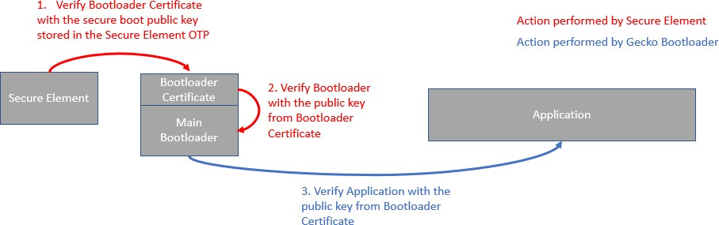
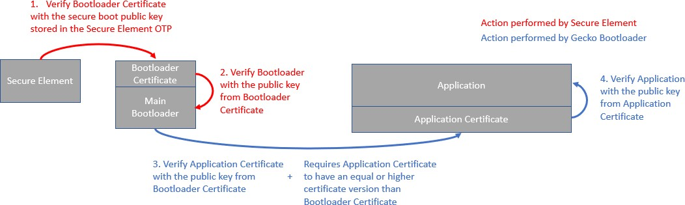

# Gecko Bootloader Security Features

## About Bootloader Image Security

Secure Boot and Secure Firmware Upgrade, discussed in the following sections, enable Gecko Bootloader to provide authenticity and integrity checks on the Application image, which provides a sufficient level of security for many applications. However, in systems without a hardware root of trust, no process checks the authenticity or integrity of the Gecko Bootloader itself. Its security is provided solely by the device hardware and the robustness of the software running on the device.

The native behavior of Firmware Upgrade will prevent accidental version rollback of Gecko Bootloader under normal usage conditions. However, without a hardware root of trust, intentional downgrade attacks may be feasible. If a higher level of security assurance is required by the application, using a Series 2 device with hardware root of trust and anti-rollback protection is recommended. For more information, refer to [Series 2 and Series 3 Secure Boot with RTSL](https://docs.silabs.com/mcu-bootloader/latest/series2-secure-boot-with-rtsl/).

## About Application Image Security

The Gecko Bootloader can enforce security on two levels:

- Secure Boot refers to the verification of the authenticity of the application image in main flash on every boot of the device.

- Secure Firmware Upgrade refers to the verification of the authenticity of an upgrade image before performing a bootload, and optionally enforcing that upgrade images are encrypted.

### Secure Boot Procedure

When Secure Boot is enabled, the cryptographic signature of the application image in flash is verified on every boot before the application is allowed to run. Secure Boot is not enabled by default in the example configurations provided by Silicon Labs, but enabling it is highly recommended to ensure the validity and integrity of firmware images.

**Signature Algorithms**

The Gecko Bootloader supports the ECDSA-P256-SHA256 cryptographic signature algorithm. This is the ECDSA (elliptical curve digital signature algorithm) of the SHA-256 digest of the application firmware image, using the NIST P-256 (secp256r1) curve.

**Summary of Operation**

1. On boot, the bootloader checks the application image for information about whether it is signed.

2. The type of signature and signature location is determined.

3. If the type of signature does not match the requirements of the bootloader, the bootloader enters device firmware upgrade mode and prevents the application from running.

4. According to the chosen signature algorithm, the signature of the contents of flash from the beginning of the application to the location of the signature is compared to the signature at the signature location.

5. If the signatures do not match, the bootloader enters device firmware upgrade mode and prevents the application from running.

**Secure Boot using ECDSA-P256-SHA256**

For an image to be signed for Secure Boot, the application needs to contain a copy of the **ApplicationProperties\_t** struct. This struct contains information about which signature algorithm is used, and where to find the signature.

On every boot, the bootloader calculates the SHA-256 digest of the application image, from the beginning of the application to the start of the signature. The signature of the SHA-256 digest is then verified using ECDSA-P256.

If the signature is valid, the application is allowed to boot. Else, the bootloader is entered, and an application upgrade is attempted if one is available.

The public key used for signature verification is stored as a manufacturing token on Series 1 and EFR32xG22 devices. OnEFR32xG21 devices, the public key can either be stored as a manufacturing token or stored in the Secure Engine One-time Programmable memory (OTP). Simplicity Commander can be used to generate a key pair and write the public key to the device. See [Simplicity Commander Reference Guide](https://docs.silabs.com/simplicity-commander/latest/simplicity-commander-start/) for more information.

**Secure Boot with Application Rollback Protection**

On every boot, the application version in the **ApplicationData\_t** struct is stored at the end of the bootloader area in flash, which is used to prevent applications from being downgraded. The application version can remain the same for upgrades. The bootloader will only allow applications to increment its version 6 times by default. The bootloader can be upgraded after that to reset the stored application versions and to allow application upgrades again. The allowed number of upgrades can be increased by modifying linkerfiles to reserve an extra 4 bytes for each version and by increasing SL_GBL_APPLICATION_VERSION_STORAGE_CAPACITY from *btl\_bootload.c*. **For Series 2 devices, this option is not applicable on devices with Secure Engine configured to perform full page lock**. If the bootloader area in flash is locked by Secure Engine, the bootloader will not be able to store the application versions in flash, and it would continue without performing that function.

When the application upgrade version check option is enabled in the **Bootloader Core** component, the bootloader checks where App properties points into flash. If app properties struct is present, then it will check compatibility of the application properties struct and check if the upgrade version is greater than the installed app; otherwise, it will check if product ID is correct before applying the upgrade image.

If app properties struct is absent at the app properties location, it is assumed that the previous upgrade was interrupted, and allows the upgrade to continue.

If application rollback prevention component is installed in the bootloader project, then before applying the upgrade image, the bootloader will check the application version in the application properties structure that resides inside the signed/encrypted GBL file and will only apply the OTA image to application area if the application version in ApplicationData structure is equal or higher than the highest application version last seen.

The application rollback prevention feature can be enabled in the **Bootloader Core** component by selecting the **Enable application rollback protection** option. The **Minimum application version allowed** option can be used to configure the minimum application version that should be allowed to boot.

The application versions are stored in the bootloader area in flash. To properly protect the stored application versions, it is recommended to lock the bootloader flash by selecting the **Prevent bootloader write/erase** option in the **Bootloader Core** component.

**Secure Boot Using a Certificate**

On Series 2 devices, a certificate-based secure boot operation is supported. The Certificate contains:

- Struct version: The version of the certificate structure.

- Public key: ECDSA-P256 public key, X and Y coordinates concatenated, used to validate the image.

- Certificate version: The version of the running certificate.

- Signature: ECDSA-P256 signature, used for the authentication of the public key and the certificate version.

The definition of the certificate struct can be found in api/application_properties.h.

To utilize certificate-based secure boot, configure Secure Engine to authenticate the bootloader image by configuring the certificate-based secure boot option in the Secure Engine OTP. Configure the Gecko Bootloader to enable certificate-based secure boot in the **Bootloader Core** component by selecting the **Enable certificate support** option. The Gecko Bootloader certificate must be signed by the private key pair of the public key stored in the Secure Engine OTP. For more information on the key storage, see section [Key Storage](#key-storage).

The certificate-based secure boot procedure is illustrated in the following figure.

Once the certificate-based secure boot option on Secure Engine is turned on, Secure Engine verifies the Gecko Bootloader certificate. The public key stored in the certificate is used to validate the signature of the Gecko Bootloader. Secure Engine will not accept bootloader images without a certificate.

If only the secure boot option is enabled (not certificate-based) on Secure Engine, and Secure Engine identifies a certificate, the certificate will be used to validate the bootloader image. If the certificate version from the bootloader image is higher than 0 and it gets verified once, Secure Engine will never again accept direct signed bootloader images without a certificate.

The Gecko Bootloader will authenticate the direct signed application using the public key stored in the Gecko Bootloader certificate. If the application contains a certificate, Gecko Bootloader will authenticate it. The procedure is illustrated in the following figure.

After authentication of the application certificate, Gecko Bootloader verifies the signature of the application using the public key from the application certificate. In addition, Gecko Bootloader compares the Gecko Bootloader certificate version against the application certificate version. All application images with a certificate version lower than the certificate version of the Gecko Bootloader will be rejected. Gecko Bootloader can be configured to only allow applications with certificate to boot by configuring the **Bootloader Core** component by selecting the **Reject direct signed images** option.

The **ApplicationProperties\_t** struct contains the certificate struct **ApplicationCertificate\_t**. The certificate struct can be injected to images that contain an **ApplicationProperties\_t** with **ApplicationCertificate\_t**. To inject a certificate to an image, issue the following command from Simplicity Commander:

`commander convert <image file> --secureboot --keyfile <signing key> --certificate <certificate>--outfile <signed image file with certificate>`

### Secure Firmware Upgrade

The Gecko Bootloader supports a secure firmware upgrade process. This is achieved by using symmetric encryption to encrypt the upgrade image, and asymmetric cryptography to sign the upgrade image. Symmetric encryption provides confidentiality and asymmetric cryptography provides integrity and authenticity. Note that encryption alone is not enough to provide authenticity.

**Encryption Algorithms**

The Gecko Bootloader supports the AES-CTR-128 encryption algorithm. The GBL upgrade file is encrypted using 128-bit AES in Counter mode with a random nonce as the initial counter value. Through configuration, the GBL file’s decryption duration can be improved by increasing the counter's block size. The block size is configurable with options 1, 2, 4, or 8 blocks. The configuration is available as part of the AES CTR Stream Block Config component.

The AES-128 key used for decryption, more commonly called the OTA decryption key, is stored as a manufacturing token on Series 1 and EFR32xG22 devices. On EFR32xG21 devices, the OTA decryption key can either be stored as a manufacturing token or stored in the Secure Engine OTP. To make use of the OTA decryption key stored in the Secure Engine OTP, the **Use symmetric key stored in Secure Engine storage** option in the **Bootloader Core** component must be selected. Simplicity Commander can be used to generate an OTA decryption key and write the key to the device. See [Simplicity Commander Reference Guide](https://docs.silabs.com/simplicity-commander/latest/simplicity-commander-start/) for more information. For more information on storing the OTA decryption key on Series 2 devices, see [Production Programming of Series 2 and Series 3 Devices](https://docs.silabs.com/iot-security/latest/prod-programming-series2-and-series3/).

The Secure Engine OTP key support depends on the SE Manager component, which is enabled by default.

**Signature Algorithms**

The Gecko Bootloader supports the ECDSA-P256-SHA256 cryptographic signature algorithm. This is the ECDSA signature of the SHA-256 digest of the GBL upgrade file, using the NIST P-256 (secp256r1) curve.

**Summary of Operation**

Before starting a firmware upgrade process, the application can verify an image in storage by calling into the bootloader verification functions. For bootloaders with Communication Interface, the host device should verify the image before sending it to the NCP or RCP.

During firmware upgrade, the GBL file is parsed, and if encrypted, decrypted on-the-fly. A GBL Signature Tag in the GBL file indicates to the bootloader that the file is signed, and the signature is verified. If signature verification fails, the firmware upgrade process is aborted.

On Series 2 devices, Gecko Bootloader will authenticate the GBL signature tag using the public key stored in the bootloader certificate if the **Enable certificate support** option is selected in the **Bootloader Core** component. A GBL Certificate tag in the GBL file indicates to the bootloader that the GBL certificate tag needs to be authenticated using the public key stored in the bootloader certificate. The certificate version in the GBL certificate tag is compared with the bootloader certificate and only a version equal or higher than the bootloader certificate is accepted. Once the GBL certificate tag is authenticated, the GBL file's signature is verified using the authenticated public key from the GBL certificate tag. On EFRxG21 devices, the GBL certificate tag can also be signed by the private key pair of the public key stored in the Secure Engine OTP.

## Using Application Image Security Features

This example assumes that a bootloader called **bootloader-uart-xmodem** has been built in Simplicity Studio. For a Series 1 device, three files of interest have been generated in the output directory:

- **bootloader-uart-xmodem.s37** – This file contains the main bootloader. Can be used for bootloader upgrade.

- **bootloader-uart-xmodem-crc.s37** - This file contains the main bootloader with CRC32 checksum.

- **bootloader-uart-xmodem-combined.s37** – This file contains the first stage and main bootloader with a CRC32 checksum in a single image. Can be used for manufacturing and initial deployment of the bootloader.

The relevant version can be flashed to the EFR32 using the Flash Programmer in Simplicity Studio or using Simplicity Commander. For Series 2 devices, only the main bootloader binary is generated.

This example provides two ways of signing the upgrade images. The first option uses Simplicity Commander to generate key material and sign data. This is suitable for development. The second option uses an external signer, such as a dedicated Hardware Security Module (HSM) to protect private key material and perform signing operations. Silicon Labs recommends using an HSM to safeguard private keys.

### Generating Keys

To use the security features of the Gecko Bootloader, encryption and signing keys need to be generated. These keys must then be written to the EFR32 device. The encryption key is used with the GBL file for secure firmware upgrade. The signing keys are used both with the GBL file for secure firmware upgrade and to sign the application image for Secure Boot.

**Generating a Signing Key Using Simplicity Commander**

`commander util genkey --type ecc-p256 --privkey signing-key --pubkey signing-key.pub --tokenfile signing-key-tokens.txt`

This creates an ECDSA-P256 key pair for signing; **signing-key** contains the private key in PEM format and **must be kept secret from third parties**. This key will later be used to sign images and GBL files. **signing-key.pub** contains the public key in PEM format and can be used to verify GBL files using commander gbl parse. **signing-key-tokens.txt** contains the public key in token format, suitable for writing to the EFR32 device.

**Generating a Signing Key Using a Hardware Security Module**

When using a Hardware Security Module, the private key is kept secret inside the HSM. According to the instructions from your HSM vendor, have it generate an ECDSA-P256 key pair and export the public key in PEM format to the file **signing-key.pub**. Then use Simplicity Commander to convert the key to token format, suitable for writing to the EFR32 device.

`commander gbl keyconvert --type ecc-p256 signing-key.pub --outfile signing-key-tokens.txt`

**Generating an Encryption Key**

`commander util genkey --type aes-ccm --outfile encryption-key`

This creates an AES-128 key for encryption in the file **encryption-key**. The file has token format, making it suitable to write to the EFR32 device using `commander flash --tokenfile`.

**Writing Keys to the Device**

To write the two token files containing the encryption key and public key as manufacturing tokens to the device, issue the following command:

`commander flash --tokengroup znet --tokenfile encryption-key --tokenfile signing-key-tokens.txt`

### Signing an Application Image for Secure Boot

If the bootloader enforces Secure Boot, the application needs to be signed to pass verification. On every boot, a SHA-256 digest of the application is calculated. The signature is verified using ECDSA-P256, with the same public key as for the GBL file signing. Signature verification failure prevents the application from booting.

Application images should contain an **ApplicationProperties\_t** struct declaring the application version, capabilities, and other metadata. If **ApplicationProperties\_t** is missing, the application image cannot be signed. For more details on adding **ApplicationProperties\_t**, see section [Application Properties](./12-application-interface.md#application-properties).

**Using Simplicity Commander**

Signing the application can be done with the command:

`commander convert myapp.s37 --secureboot --keyfile signing-key --outfile myapp-signed.s37`

**Using a Hardware Security Module**

The application can be prepared for signing by issuing the command:

`commander convert myapp.s37 --secureboot --extsign --outfile myapp-for-signing.s37`

### Creating a Signed and Encrypted GBL Upgrade Image File from an Application

To create a GBL file from an application, use `commander gbl create`.

Note that, as of this writing, secure application images can only be constructed through Simplicity Commander, not through the configuration options available through Simplicity Studio.

Application images should contain an **ApplicationProperties\_t** struct declaring the application version, capabilities, and other metadata. If **ApplicationProperties\_t** is missing, the application image cannot be signed. For more details on adding **ApplicationProperties\_t**, see section [Application Properties](./12-application-interface.md#application-properties).

**Using Simplicity Commander to Sign**

For an application called **myapp.s37**, use:

`commander gbl create myapp.gbl --app myapp.s37 --sign signing-key --encrypt  encryption-key`

This single command performs three actions:

- Creates a GBL file

- Encrypts the GBL file

- Signs the GBL file

If Secure Boot is also desired, the application must be signed using `commander convert --secureboot` prior to creating the GBL.

**Using a Hardware Security Module to Sign**

For an application called **myapp-signed.s37**, which has previously been signed for Secure Boot, use:

`commander gbl create myapp-for-signing.gbl --app myapp-signed.s37 --extsign --encrypt  encryption-key`

This command performs the following actions:

- Creates a partial GBL file

- Encrypts the partial GBL file

- Prepares the partial GBL file for signing by an external signer

Using an HSM, sign the output file **myapp-for-signing.gbl.extsign**, and supply the resulting DER-formatted signature file **signature.der** back to Simplicity Commander:

`commander gbl sign myapp-for-signing.gbl.extsign --signature signature.der --verify signing-key.pub --outfile myapp.gbl`

The GBL file is not valid until the signature has been applied using gbl sign.

## System Security Considerations

The Gecko bootloader security features can be used to create a secure device, but do not create a secure system by themselves. This section goes over considerations that need to be taken when designing a secure system where the Gecko Bootloader is a component.

### Key Storage

On Series 1 devices, the decryption and public sign keys used by the Gecko bootloader are stored in the Lockbits page in flash. To prevent a rogue application from being able to change or wipe the keys, the Lockbits page should be write protected after the keys have been written in manufacturing.

On Series 2 devices, the decryption key and the sign key used by the Gecko Bootloader can either be stored in the topmost page of the main flash or in the Secure Engine OTP. The decryption key can be provisioned in the Secure Engine OTP using Simplicity Commander or using the Secure Engine Mailbox interface. The keys are not accessible from the user applications on EFR32xG22 devices, which means that the keys used by Gecko Bootloader need to be stored in the topmost page of the main flash. Once a key value has been programmed into the Secure Engine OTP, it cannot be changed. For more details, refer to [Series 2 and Series 3 Secure Boot with RTSL](https://docs.silabs.com/mcu-bootloader/latest/series2-secure-boot-with-rtsl/) and [Simplicity Commander Reference Guide](https://docs.silabs.com/simplicity-commander/latest/simplicity-commander-start/).

The default behavior of the Gecko Bootloader is to use the sign key stored in the Secure Engine OTP to perform the signature verification. If the sign key is not provisioned, the Gecko Bootloader will try to use the public sign key stored in the topmost page of the main flash. This fallback mechanism can be disabled by disabling the “Allow use of public key from manufacturing token storage” component option from the **Bootloader Core** component in Simplicity Studio.

### Write-Protecting the Bootloader

By default, the region in flash used by the Gecko bootloader is readable and writeable. The region needs to stay readable for the Application Interface to be able to interact with the bootloader. Immediately after reset, the region also needs to be writable to be able to perform bootloader upgrades.

#### Series 1

It is possible to write-protect the bootloader region on EFR32xG12 and newer. This is done by setting the write-once MSC_BOOTLOADERCTRL_BLWDIS bit on every bootup on Series 1 devices. The pages are write-protected until the next reboot. This is done by the Gecko bootloader main stage if the “Prevent bootloader write/erase” component option is enabled in the **Bootloader Core** component in Simplicity Studio.

On EFR32xG1, where the bootloader resides in main flash rather than the information block, the BLWDIS option does not exist. On EFR32xG1, the first flash page containing the first stage bootloader can be write-protected with a Page Lock word, using commander `device protect --write --range 0x0:+0x800`. If bootloader upgrades are to be supported, the pages containing the main bootloader need to stay writeable.

>**Note**: Setting MSC_BOOTLOADERCTRL_BLWDIS will also prevent debuggers from flashing a new bootloader. This means that debug tools that do not completely halt and reset the target device before re-flashing might fail to flash the new bootloader, as the flash is write-protected. If you are unsure whether your debug tools will handle this gracefully, Silicon Labs recommends keeping this setting disabled during development, and enabling it before going into production. If your debug tools halt and reset the target device before flashing, this is not an issue, and Silicon Labs recommends enabling this setting early in the development cycle.

#### Series 2

On Series 2 devices, the write-once MSC_PAGELOCKx register is used to write-protect the pages used by the bootloader if the “Prevent bootloader write/erase” component option is enabled in the **Bootloader Core** component in Simplicity Studio. The pages are write-protected until the next reboot.

### Write-Protecting the Application

On Series 2 devices, it is also possible to write-protect the application. When the component option “Prevent write/erase of verified application” is enabled, the bootloader will write-protect the pages used by the application after successfully verifying the application signature, before allowing the application to start. This option is only available when Secure Boot of the application is enabled. The MSC_PAGELOCKx register is used to protect the pages, and the write protection lasts until the next reboot.

### Debug Access

#### Series 1

To prevent debugger access to the Series 1 devices, the Debug Lock word needs to be written. Device recovery after enabling the Debug Lock is possible but will erase the main flash and the Lockbits page. This will erase the main application and the key material stored in the Lockbits page. The Userdata page and bootloader area will survive Debug Unlock, so secrets should not be stored in these locations. To debug lock the device, issue `commander device lock --debug enable`. The AAP Lock can be used to permanently lock the debug port. This also prevents Debug Unlock. To AAP lock the device, please see the reference manual for your device for the address location of the AAP lock word, and use `commander flash --patch` to write the appropriate value to this address.

#### Series 2

On Series 2 devices, debugger access can be prevented through Secure Engine. Debugger access can be re-enabled after enabling the Debug Lock by issuing device erase. To debug-unlock the device, issue commander device lock --debug disable from Simplicity Commander. This also erases the main flash, which results in the top page of main flash that stores the encryption and signing keys being erased. To permanently lock the debug port, the device erase disable command can first be issued through Secure Engine. Thereafter, the debug lock command can be issued to the Secure Engine. For more details, refer to [Series 2 and Series 3 Secure Debug](https://docs.silabs.com/iot-security/latest/series2-secure-debug/).

#### Disabling Debug Access from Software

The software APIs `DBG_DisableDebugAccess(dbgLockModeAllowErase)` and `DBG_DisableDebugAccess (dbgLockModePermanent)` from the EMLIB DBG module can be used from the application to lock the debug interface.
