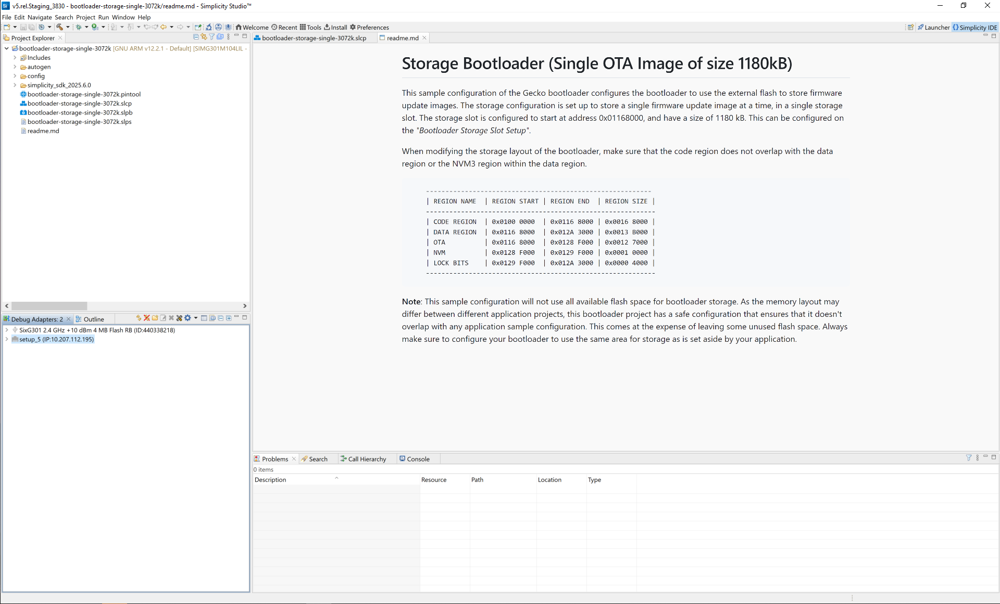
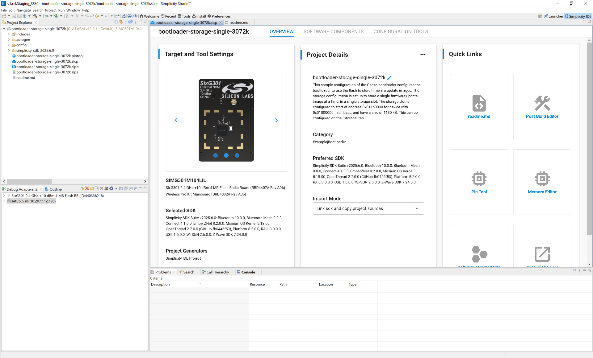
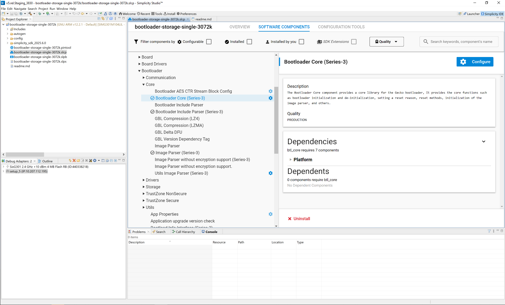
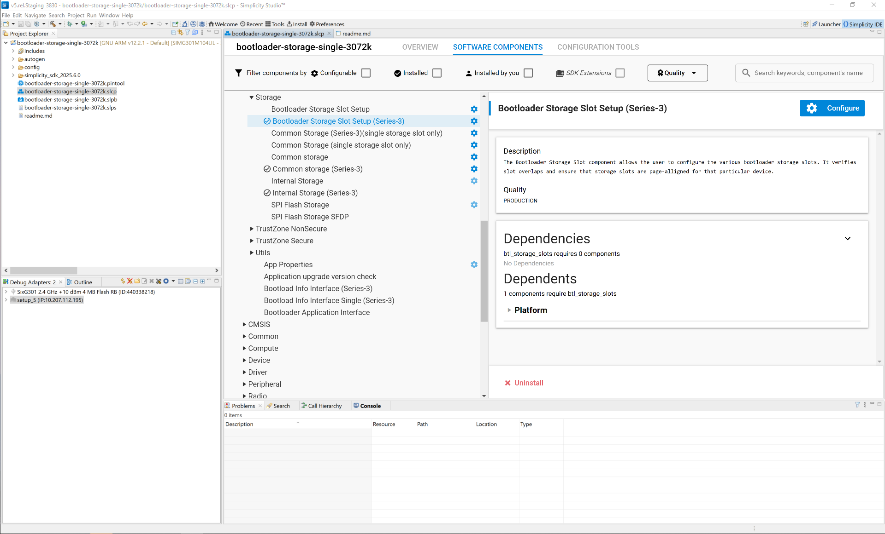
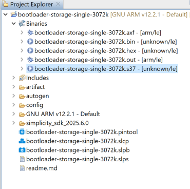

# Getting Started with the Gecko Bootloader

This section describes how to build a Gecko Bootloader from one of the provided examples. These instructions assume that you have installed Simplicity Studio 5, the SiSDK and associated utilities as described in the SDK’s quick start guide, and that you are familiar with generating, compiling, and flashing an example application in the relevant version.

1. Create a project based on the Gecko Bootloader example of your choice. The project opens with a tab describing the example.

   

2. Click the project (\*.slcp) tab to move to the Project Configurator interface.

   

3. The Software Components tab shows the list of available components that can be installed in the project.

   

4. The **Storage Slot Setup** component allows you to configure storage slots to be used if a storage component is also installed. The default configuration matches the target part and bootloader type. This component supports a maximum of three storage slots.

   

5. Click the **Build** (hammer) icon.

6. After the build is complete, the bootloader binaries are available in the **artifact** folder as depicted in the image below.

   

The image containing only a bootloader must be used to create a GBL file for bootloader upgrade.
