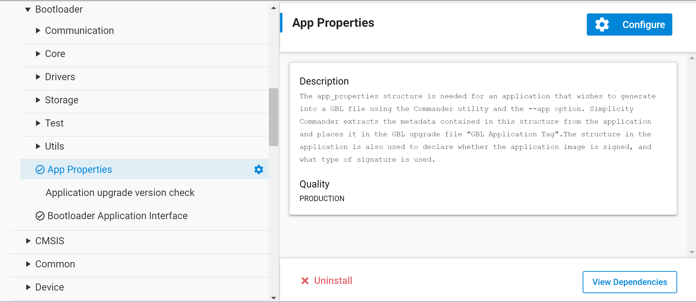
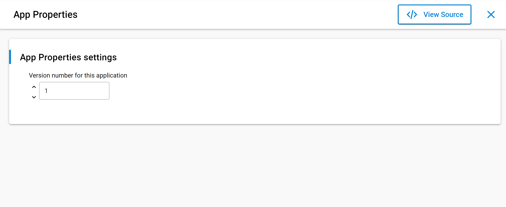

# Application Interface

The bootloader has an application interface exposed through a function table in the bootloader. The application interface provides APIs to use bootloader functions for storing and retrieving upgrade images and verifying their integrity. APIs to reboot into the bootloader are also provided. For details see the Gecko Bootloader API Reference, at https://docs.silabs.com/gecko-platform/5.1.2/platform-bootloading-overview/folder.

If you are not using a protocol stack from Silicon Labs, the **api/btl\_interface.h** header provides the bootloader application interface API. If you are using a protocol stack from Silicon Labs, the recommended bootloader interface API for the specific protocol stack should be used instead. The following files provide the implementation of the bootloader interface:

**api/btl\_interface.c** (common interface)

**api/btl\_interface\_storage.c** (interface to storage functionality)

The application interface consists of functions that can be included in the customer application, and that communicate with the bootloader through the **MainBootloaderTable\_t**. This table contains function pointers into the bootloader. The 10th word of the bootloader contains a pointer to this structure, allowing any application to easily locate it. Using the wrapper functions provided in the Bootloader Interface API is preferred over accessing the bootloader table directly. Modules include:

- **Application Storage Interface**: Application interface for interfacing with bootloader storage. The Storage Interface is only available on bootloaders that support the storage interface.

- **Common Application Interface**: Generic application interface available on all versions of the bootloader, independently of which components are present.

## Application Properties

Application images should contain an **ApplicationProperties\_t** struct declaring the application version, capabilities, and other metadata. The Simplicity Commander extracts the metadata contained in this structure from the application and places it in the UPDATE_MEMORY_SECTION tag in the GBL upgrade file. If the structure is not present in the application, Simplicity Commander will raise an error. The **ApplicationProperties\_t** struct is added to the application on installing the **bootloader\_interface** component to the application. The **bootloader\_interface** component installs **bootloader\_app\_properties** component which adds an instance of **ApplicationProperties\_t** named **sl\_app\_properties** to the project. The component adds a source file named **app\_properties.c** and a configuration file named **app\_properties\_config.h**. This configuration file allows users to configure the application version via Simplicity Studio’s Component Editor. To open the Component Editor, locate the **App Properties** component under **Platform \> Bootloader** as shown below.

Click **Configure** to open the Component Editor.

The application type is automatically populated based on the wireless stack used in building the project. The value of the application type is automatically set during the project generation step and can be found in **autogen/sl\_application\_type.h** file.

The contents of the **GBL Application Tag** can be extracted from a GBL file by a running application using the Application Storage interface. Note that the **GBL Application Tag** will only be added if the GBL file contains an application image, not if the GBL file only contains a bootloader upgrade or metadata.

The structure in the application is also used to declare whether the application image is signed, and what type of signature is used. This information is added by Simplicity Commander when signing the image using `commander convert (--secureboot, --extsign or -- signature)`. For the bootloader to locate the **ApplicationProperties\_t** struct, if not already done by the linker, Simplicity Commander modifies word 13 of the application to insert a pointer to the **ApplicationProperties\_t** struct when signing the application image for Secure Boot.

## Error Codes

Most Gecko bootloader APIs return error codes. The following table lists the groups of error codes that may be returned. The full list of error codes within each group can be found in *api/btl\_errorcode.h* in the platform/bootloader directory of the SDK, as well as in the API Reference.

| ID | Description |
|----|-------------|
| 0x0 | OK |
| 0x01xx | Initialization error |
| 0x02xx | Image verification error |
| 0x04xx | Storage error |
| 0x05xx | Bootload error |
| 0x06xx | Security error |
| 0x07xx | Communication error |
| 0x09xx | XMODEM parser error |
| 0x10xx | GBL file parser error |
| 0x11xx | SPI slave driver error |
| 0x12xx | UART driver error |
| 0x13xx | Compression error |
| 0x14xx | RTOS error |
