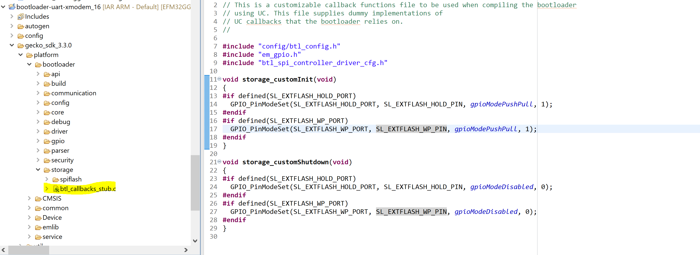

# Callbacks

In contrast to the AppBuilder workflow, callbacks are now part of **btl\_callbacks\_stub.c**. This file is added to the project when the **SPI Flash Storage** component is installed. This file contains dummy implementation of callbacks that the bootloader relies on. This file can be found in **gecko\_sdk\_\<version\> \> platform \> bootloader \> storage \> btl\_callbacks\_stub.c** as shown.

