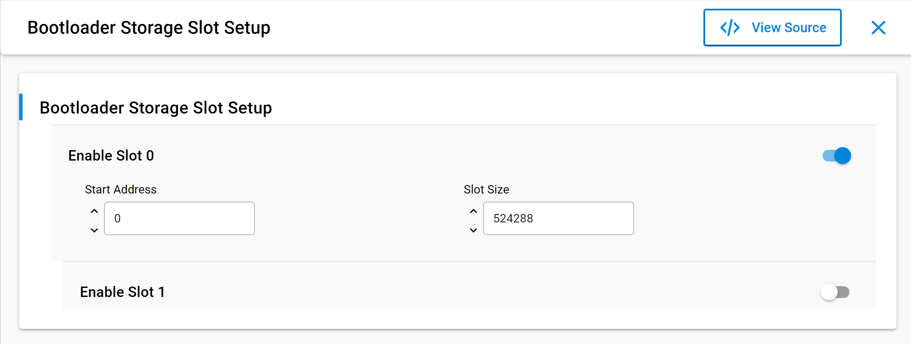

# Storage Slots

Gecko Bootloader supports the Application Bootloader mode. This mode supports single/multiple storage slots that can be configured at compile time. In Gecko Bootloader v2.x, the storage slots can now be configured in the **Bootloader Storage Slot Setup** component using the Component Editor. A maximum of 3 storage slots can be configured.

