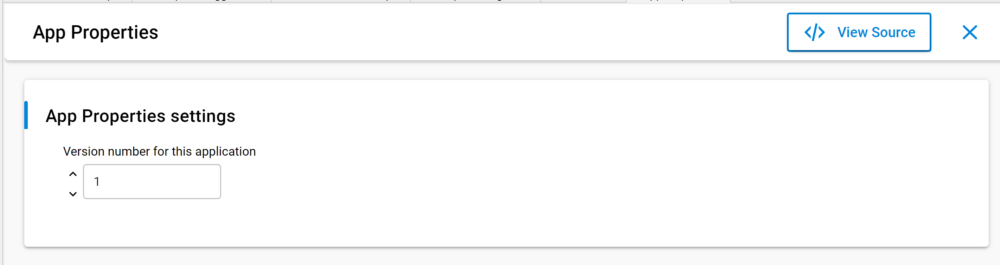

# App Properties

Previously, in the AppBuilder workflow, a variable of type **AppProperties\_t** had to be configured to add application properties to the application. This was then later used by Simplicity Commander during gbl file creation. Beginning with Gecko Bootloader version 2.x, a new configurable component named **App Properties** can be used to configure the application properties. This component can be installed using the Component editor which is available as part of Simplicity Studio. It is also installed automatically as a dependency on installing the **Bootloader Application Interface** component in the project. The component allows the user to configure the application version using Simplicity Studio’s Component Editor as shown below.

For more details on how to configure this component, see [Silicon Labs Gecko Bootloader User's Guide for GSDK 4.0 and Higher](https://docs.silabs.com/mcu-bootloader/latest/bootloader-user-guide-gsdk-4/).
