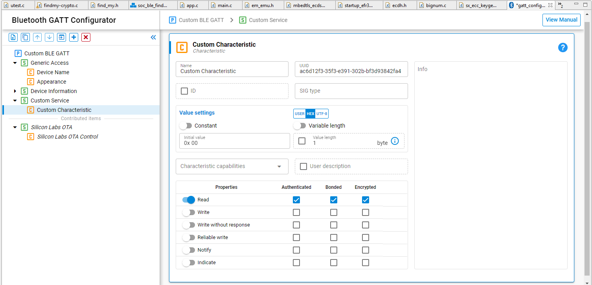
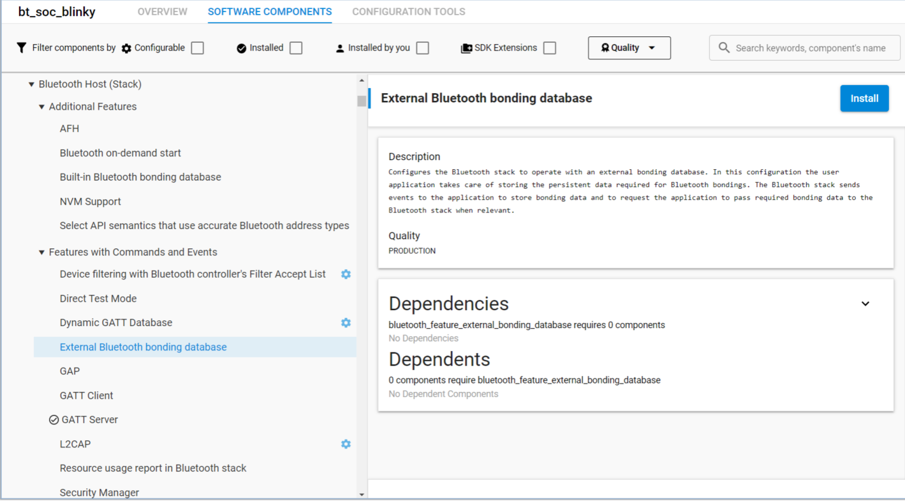

# Working with Stack Security Features

## Securing Connections

Bluetooth Low Energy connections can be secured in one of two ways:

- The peer device initiates an encrypted connection

- The connection is explicitly secured through an API call

### Protecting GATT characteristics

Silicon Labs provides a GATT configuration tool that allows users to create a GATT database from a graphical user interface shown in the following figure.

As shown, the properties such as read, write, notify, and so on can be enabled or disabled, and each property can be given the authenticated, *bonded, and encrypted properties individually. It is recommended to use the strongest possible security for all characteristics. It is also recommended to give the minimum level of access to characteristics needed to accomplish the required tasks. If a characteristic does not need to be writable, disable the write property. Note that, when using Bluetooth SIG services and characteristics, there will usually be requirements for each property. Applications should comply with these requirements for interoperability and to maintain qualification status. See [GATT Configurator User’s Guide for Bluetooth LE and Bluetooth Mesh](https://docs.silabs.com/bluetooth/latest/gatt-configurator-users-guide-ble-btmesh/) for general guidance on the Bluetooth GATT Configurator.

Accessing a characteristic using a connection that does not meet the minimum requirements results in an error response being sent from the GATT server to the client. It is recommended to require encryption and authentication on all characteristics, even when the data is not sensitive.

\*Bonded: the term bonded here is not a security requirement defined in the core specification like authentication or encryption but is an authorization policy for convenience; that is, the requirement is authorization and one specific implementation could be to require the device to be bonded.

### Explicitly Securing Connections

Once a connection is established, two events are raised by the stack that are useful for security purposes. The first is [sl_bt_evt_connection_opened](https://docs.silabs.com/bluetooth/latest/bluetooth-stack-api/sl-bt-evt-connection-opened). This event contains a bond handle. If the handle is set to 0xFF no bond is present. The other event of interest is [sl_bt_evt_connection_parameters](https://docs.silabs.com/bluetooth/latest/bluetooth-stack-api/sl-bt-evt-connection-parameters). This event contains the current security mode for the connection. The security modes are described in section [1.2.2 Security Modes and Levels](01-introduction.md#security-modes-and-levels) above. The default mode is 0. Either the GATT client or server can increase the security level of the connection by calling [sl_bt_sm_increase_security()](https://docs.silabs.com/bluetooth/latest/bluetooth-stack-api/sl-bt-sm#sl-bt-sm-increase-security).

### Security Configuration

The security configuration can be set on a device-wide basis by calling [sl_bt_sm_configure()](https://docs.silabs.com/bluetooth/latest/bluetooth-stack-api/sl-bt-sm#sl-bt-sm-configure). This API is used not only to set security requirements such as MITM protection and requiring bonding for encryption but also sets the I/O capabilities for the device. This information is used when bonding, to determine which type of authentication is used during the bonding process. It is recommended to use the strongest possible security configuration and to accurately report the IO capabilities of the device. The security requirements flags are explained below. It is also recommended to require bonding for encryption, since this establishes a persistent security relationship that can prevent spoofing by devices using the same MAC address.

| Security Feature | Description |
|------------------|-------------|
| Bonding requires MITM protection | When this flag is set, forming a new bond also requires man-in-the-middle (MITM) protection. This excludes the Just-works association model |
| Encryption requires bonding | Setting this flag requires a bond, rather than just pairing, for a connection to be encrypted |
| Require Secure Connections | Setting this flag requires that LE Secure Connections be used for exchanging cryptographic keys. This may prevent connections with older devices that do not support this feature |
| Bonding Requests Require Confirmation | Setting this flag requires the application to confirm any new bond request. This makes it possible to require user input for forming new bonds |
| Allow only Connections from Bonded Devices | Setting this flag requires that a peer device have an existing bond to successfully form a connection. This flag should be cleared to allow a new device to connect and bond. |
| Prefer authenticated pairing | Setting this flag causes the device to prefer authenticated pairing if both authenticated pairing and JustWorks are available. |
| Require SC OOB Data from both devices | Setting this flag requires secure connections out of band data to be present |
| Reject debug keys | Setting this this flag rejects pairing if the remote device uses debug keys. |

The following table shows the different pairing or bonding methods available based on the I/O capabilities when using secure connections.

| Responder | Initiator - DisplayOnly | Initiator - DisplayYesNo | Initiator - KeyboardOnly | Initiator - NoInputNoOutput | Initiator - KeyboardDisplay |
|-----------|-------------------------|--------------------------|--------------------------|-----------------------------|-----------------------------|
| **DisplayOnly** | Just Works | Just Works | Passkey Entry (R displays, I inputs) | Just Works | Passkey Entry (R displays, I inputs) |
| **DisplayYesNo** | Just Works | Numeric Comparison | Passkey Entry (R displays, I inputs) | Just Works | Numeric Comparison |
| **KeyboardOnly** | Passkey Entry (I displays, R inputs) | Passkey Entry (I displays, R inputs) | Passkey Entry (R and I inputs) | Just Works | Passkey Entry (I displays, R inputs) |
| **NoInputNoOutput** | Just Works | Just Works | Just Works | Just Works | Just Works |
| **KeyboardDisplay** | Passkey Entry (I displays, R inputs) | Numeric Comparison | Passkey Entry (R displays, I inputs) | Just Works | Numeric Comparison |

**Just Works**: This method is used when one or both devices do not have a user interface that allows entering or confirming a passkey. Encryption is enabled so the connection is protected against passive eavesdropping, but MITM protection is not available since no identifying information is available. If this method is used, it is recommended to enable bonding only for short periods of time.

**Passkey Entry**: This method requires a passkey to be entered on one of the devices and displayed on the other. This method allows MITM to be enabled. It is recommended to allow the stack to generate random passkeys.

**Numeric Comparison**: This method requires that both devices display a passkey and give the user some method for confirming that the passkeys match. This is the most secure method and should be used if the I/O capabilities support it.

The logical flow in each pairing association model between the initiator and the responder is documented in [pairing processes](https://docs.silabs.com/bluetooth/latest/bluetooth-security-pairing-processes/).

### Out of Band Pairing/Bonding

Out-of-band (OOB) pairing can be used to establish a security relationship by exchanging information through a method other than Bluetooth, such as NFC. Devices that do not have a user interface can use OOB pairing to establish MITM protection through authentication and should do so whenever possible. If OOB data is not available from both devices (or legacy OOB used), the data needs to be kept secret. If OOB data is available from both devices, it does not need to be kept secret.

### External Bonding Database

While using the external bonding database, the secure storage of the encryption keys is the responsibility of the application. For SoC case, refer to [Secure Key Storage](https://docs.silabs.com/iot-security/latest/efr32-secure-key-storage/) about how to import the keys to the secure key storage.

Note that some of the sensitive keys like the Long Term Key (LTK) generated after a pairing process are not always exportable and are totally managed and used by the stack.

For NCP projects the keys are usually stored on the host, so the communication between the target and the host needs to be encrypted. Silicon Labs provides two solutions for that: you can either use the “Secure NCP” feature to encrypt the serial connection, or you can use the NCP over CPC feature, and use a secured CPC channel (for details see [Using the Bluetooth Stack in Network Co-Processor Mode](https://docs.silabs.com/bluetooth/latest/bluetooth-network-coprocessor-mode/)).

When the Bluetooth stack needs bonding data, it will send the request to the user application with a sl_bt_evt_external_bondingdb_data_request event that contains the requested data type. The application must respond to the request by sending data using the command [sl_bt_external_bondingdb_set_data](https://docs.silabs.com/bluetooth/latest/bluetooth-stack-api/sl-bt-external-bondingdb) for setting the external bonding data.

To enable support for the external bonding database, install the External Bluetooth bonding database software component as shown here:

### Other Stack Security Features

**Disconnecting on Failed Bond Creation**. The Bluetooth specification does not require a connection to be closed after a failed bonding attempt, but it is a good idea. A failed bonding may indicate that an attacker is attempting to guess the passkey. An unsuccessful bonding attempt causes the stack to raise the [sl_bt_evt_bonding_failed](https://docs.silabs.com/bluetooth/latest/bluetooth-stack-api/sl-bt-evt-sm-bonding-failed) event. This event indicates the connection used in the failed attempt as well as a reason for the failure. The status codes are documented in the [Platform API Reference](https://docs.silabs.com/gecko-platform/latest/platform-common/status). The connection can be closed with a call to [sl_bt_connection_close()](https://docs.silabs.com/bluetooth/latest/bluetooth-stack-api/sl-bt-connection#sl-bt-connection-close).

**Disable Bonding Except When Needed**. Leaving bondable mode enabled always is unnecessary and may make it easier for an attacker to establish a trusted relationship with your device. For this reason, it is recommended to limit the length of time that new bonds can be formed, either a short duration after power-up or by requiring some user action such as a button press to enable bondable mode. The bondable mode is set by a call to [sl_bt_set_bondable_mode()](https://docs.silabs.com/bluetooth/latest/bluetooth-stack-api/sl-bt-sm#sl-bt-sm-set-bondable-mode).

**Minimum Key Size for Bonding**. It is possible to set the minimum key size required for bonding using [sl_bt_sm_set_minimum_key_size()](https://docs.silabs.com/bluetooth/latest/bluetooth-stack-api/sl-bt-sm#sl-bt-sm-set-minimum-key-size). It is recommended to use the default, largest setting of 16 bytes.

**Bonding Configuration**. The maximum number of bonds can be set from 1 to 32. The bonding policy determines what happens when the bonding table is full. It is recommended to use policy 0 – new bonding attempts fail. It is better for the application to explicitly delete bonds that are no longer needed. use |[sl_bt_store_bonding_configuration()](https://docs.silabs.com/bluetooth/latest/bluetooth-stack-api/sl-bt-sm#sl-bt-sm-store-bonding-configuration) to set the number of bonds and the bonding policy.

## Coexistence with Wi-Fi

Designs using PTA for managed coexistence with Wi-Fi should take precautions against attacks against the PTA interface. Such attacks may include Denial-of-service and information disclosure. If the Wi-Fi PTA master is compromised, channel access may never be granted. One possible solution is to disable the PTA interface if channel access is denied for extended periods of time. The coexistence API includes counters to determine the number of times channel access is denied or aborted and is documented in this section of the [Bluetooth API Reference](https://docs.silabs.com/bluetooth/latest/bluetooth-stack-api/sl-bt-coex). See [Bluetooth Coexistence with Wi-Fi](https://docs.silabs.com/bluetooth/latest/bluetooth-coexistence-with-wifi/) for more detailed information.
