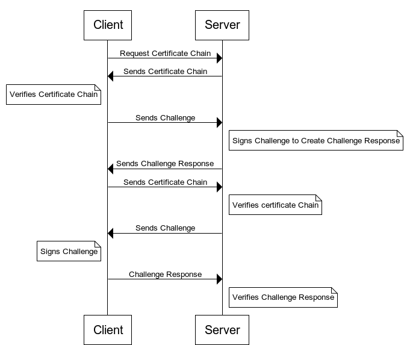
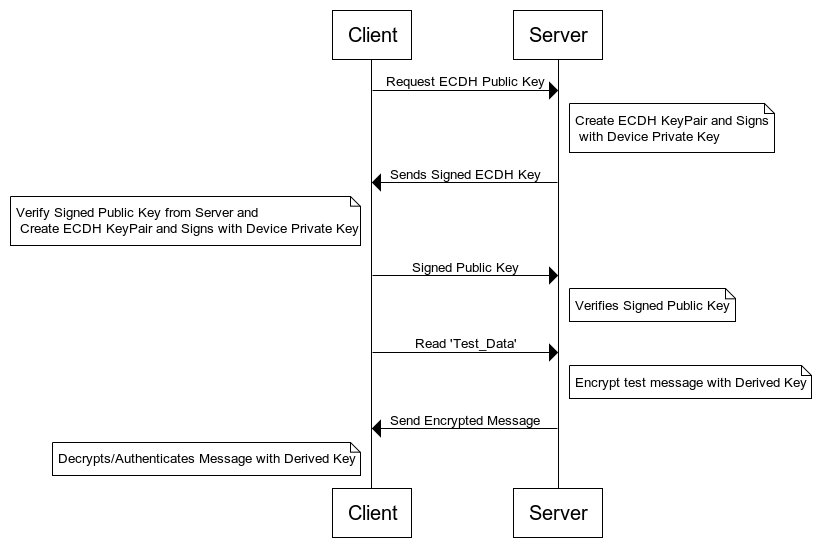

# Application Layer Security

Relying entirely on Bluetooth security features also means relying on the security of the peer device’s Bluetooth stack. Doing so introduces additional unknowns. As well as the potential of unpatched vulnerabilities in an unknown stack, the remote device may share the Bluetooth connection with multiple applications. This can lead to compromised integrity and/or confidentiality. The solution to this problem is for the application to form a secure link on top of the Bluetooth connection by establishing an authenticated, shared secret key and encrypting data with that key before sending it over the Bluetooth connection. This section discusses the key components involved in using application layer security: authentication, key agreement, key derivation, and encryption.

## Secure Identity

A common problem with small IoT devices is that they have no user interface to authenticate the device’s identity, such as entering or confirming a passkey. A device that cannot be authenticated is unable to take advantage of man-in-the-middle (aka machine-in-the-middle) protection. One solution to this problem is to use secure identity certificates to uniquely identify a device. A signed certificate chain, along with the corresponding private signing key, is stored on the device. The device’s certificate chain can be sent over the Bluetooth LE GATT to the peer device to authenticate its identity. More information on secure identity certificates is available in [Authenticating Silicon Labs Devices Using Device Certificates](https://docs.silabs.com/iot-security/latest/authenticating-devices-using-device-certificates/). The communication flow is illustrated in the following figure.

### Key Agreement

An important step in securing data at the application is for the two peer devices is to establish a shared secret. The accepted method for doing so is by ECDH as mentioned earlier. A brief description is found at [https://en.wikipedia.org/wiki/Elliptic-curve_Diffie%E2%80%93Hellman](https://en.wikipedia.org/wiki/Elliptic-curve_Diffie%E2%80%93Hellman). To perform ECDH over Bluetooth Low Energy, GATT characteristics can be set up to store the public key for each device and then the keys exchanged like any other data. To ensure that keys have come from a trusted source, they can be signed with the sender’s secure identity key. Once the public keys have been exchanged, a shared secret can be computed. A key derivation function is usually applied rather than using the shared secret directly.

### Key Derivation Function

A key derivation function takes a shared secret and transforms it to introduce some additional entropy, or randomness. A typical method for deriving keys is by using a cryptographically-secure hash such as SHA-2/256. Silicon Labs series 2 devices also provide hardware acceleration for other key derivation functions such as PBKDF2 and HKDF. Derived keys with persistent storage should be stored using the most secure method available. Secure Vault High parts can wrap, or encrypt, keys. See [Secure Key Storage](https://docs.silabs.com/iot-security/latest/efr32-secure-key-storage/)for more information on this topic.

## Application Layer Encryption

This section describes the encryption of user data before it is passed to the Bluetooth stack to be sent to a peer device.

### Encrypting and Authenticating Data

Once a shared secret has been established and symmetric keys derived, sensitive data can be encrypted/decrypted and authenticated. Several cipher modes are accelerated in hardware.

**Counter with Cipher Block Chaining Mode (CCM)**. This cipher mode combines a counter with CBC-MAC to provide several benefits. It is possible to authenticate both encrypted and unencrypted data in the same message, known as authenticated encryption of associated data (AEAD). A unique initialization vector is required for each message sent. A brief description is found at [https://en.wikipedia.org/wiki/CCM_mode](https://en.wikipedia.org/wiki/CCM_mode). When this mode is used, the data, initialization vector and authentication tag can be sent together in a single block

**Galois Counter Mode (GCM)**. This cipher mode is like CCM described above but uses a different method for authenticating data and lends itself to parallelization. A brief description is found at [https://en.wikipedia.org/wiki/Galois/Counter_Mode](https://en.wikipedia.org/wiki/Galois/Counter_Mode). As with CCM, the initialization vector, data and authentication tag can be sent together in a single block.

### Encryption-Only Cipher Modes

Encryption-only cipher modes are also supported in Silicon Labs series 2 devices in case authentication is not desired. The reference manual for your chosen device documents all cipher modes accelerated in hardware.

### Application Layer Encryption Example

The example accompanying this application note, available on [https://github.com/SiliconLabs/bluetooth_applications](https://github.com/SiliconLabs/bluetooth_applications) , demonstrates a method for implementing application layer encryption with authenticated key exchange using device identity certifications. Two projects are included: one for the client and the other for the server. The communication flow is summarized in the following table.

| Client | Initiator | Server |
|--------|-----------|--------|
| **Certificate Chain Exchange** | | |
| Scans for devices advertising Secure Attestation service | @Manually needed Symbol @Manually needed Symbol | Advertises Secure Attestation service |
| Connects to server and requests connection be encrypted with JustWorks pairing | @Manually needed Symbol @Manually needed Symbol | Accepts and encrypts connection |
| Reads Device and Batch certificates from Server | @Manually needed Symbol @Manually needed Symbol | Sends Device and Batch certificates |
| Verifies server’s certificate chain and sends random challenge | @Manually needed Symbol @Manually needed Symbol | Signs random challenge with private device key and returns signature |
| Verifies the server’s signature, saves the public key, and sends Device and Batch certificates | @Manually needed Symbol @Manually needed Symbol | Saves Device and Batch certificate, verifies client’s certificate chain, and sends random challenge |
| Signs random challenge and returns signature | @Manually needed Symbol | Verifies client’s signature, and saves the public key. |
| **ECDH Key Exchange** | | |
| Generates ECDH keypair and signs with private device key | | Generates ECDH keypair and signs with private device key |
| Requests signed ECDH public key from server | @Manually needed Symbol @Manually needed Symbol | Sends signed ECDH public key to client |
| Receives and verifies Server’s signed public key. Sends signed public key to server | @Manually needed Symbol @Manually needed Symbol | Receives and verifies Client’s signed public key |
| **AES Operation** | | |
| Derives AES key using SHA2/256-based function | | Derives AES key using SHA2/256-based function |
| Requests encrypted message from server | @Manually needed Symbol @Manually needed Symbol | Encrypts sample message using AES key and sends to client |
| Decrypts message using AES key | | Idle |

The characteristics used in this communication flow are summarized the following table.

| Attribute Name | Description |
|----------------|-------------|
| Device Certificate | The server’s device identity certificate |
| Batch Certificate | The server’s batch certificate |
| Peer Device Certificate | The client’s device identity certificate |
| Peer Batch Certificate | The client’s batch certificate |
| Server public key | Server’s ECDH public key |
| Client public key | Client’s ECDH public key |
| Challenge | Random challenge |
| Response | Signature of the random challenge |
| Test_data | Test data to encrypt |

## Other Application Security Concerns

Beyond using the security features incorporated into the Bluetooth specification itself, an application can take several steps to implement higher security.

A common type of attack relies on buffer overflows. For this reason, it is highly recommended that applications validate the size of data being received before attempting to store it. Whether a block of data is received through a notification/indication, write or a response to a read request, the size of the data received is always reported by the stack. The size parameter must be used to determine if the application has reserved sufficient space to store it.

## Secure Boot

The ability to ensure that authentic firmware is running on the device is possibly one of the most valuable security features available. Many attacks rely on the attacker’s ability to gain control of the device by some method such as remote code injection. Silicon Labs’ secure boot with root of trust secure loader (RTSL) provides additional security by verifying the authenticity of the firmware using an [ECDSA](https://en.wikipedia.org/wiki/Elliptic_Curve_Digital_Signature_Algorithm) digital signature and an immutable public key stored on the device. See [Series 2 and Series 3Secure Boot with RTSL](https://docs.silabs.com/mcu-bootloader/latest/series2-secure-boot-with-rtsl/) for specifics on using secure boot.

## Signed and Encrypted Firmware Updates

One concern with over-the-air (OTA) updates is that the firmware could be stolen by sniffing the Bluetooth connection, since the Silicon Labs AppLoader does not support encrypted connections. The solution is to encrypt the firmware image itself and allow the bootloader on the device to be updated to perform the decryption. Firmware images can also be signed to prevent inauthentic images from being flashed into active memory in the first place. The signature of the update images is verified using the device public signing key.

## Subscribe to Security Advisories

Silicon Labs recommends that all customers subscribe to security advisories to be aware of the latest threats and mitigations. See [www.silabs.com/security](https://www.silabs.com/security) for instructions.

## Additional Reading

<table class="classic">
	<colgroup>
		<col width="30%">
		<col width="45%">
		<col width="auto">
	</colgroup>
	<thead>
		<tr>
			<th>Document</th>
			<th>Summary</th>
			<th>Applicability</th>
		</tr>
	</thead>
	<tbody>
    <tr>
			<td>
<a href="https://docs.silabs.com/iot-security/latest/iot-endpoint-security-fundamentals/">IoT Endpoint Security Fundamentals</a>
</td>
			<td>
Introduces the security concepts that must be considered when implementing an Internet of Things (IoT) system
</td>
			<td>
Secure Vault Mid, High, and Series 3 devices
</td>
		</tr>
		<tr>
			<td>
<a href="https://docs.silabs.com/iot-security/latest/series2-secure-debug/">Series 2 and Series 3 Secure Debug</a>
</td>
			<td>
How to lock and unlock Series 2 and Series 3 debug access, including background information about the SE
</td>
			<td>
Secure Vault Mid, High, and Series 3 devices
</td>
		</tr>
		<tr>
			<td>
<a href="https://docs.silabs.com/mcu-bootloader/latest/series2-secure-boot-with-rtsl/">Series 2 and Series 3 Secure Boot with RTSL</a>
</td>
			<td>
Describes the secure boot process on Series 2 and Series 3 devices using SE
</td>
			<td>
Secure Vault Mid, High, and Series 3 devices
</td>
		</tr>
		<tr>
			<td>
<a href="https://docs.silabs.com/iot-security/latest/efr32-secure-vault-tamper/">Anti-Tamper Protection Configuration and Use</a>
</td>
			<td>
How to program, provision, and configure the anti-tamper module
</td>
			<td>
Secure Vault High, and Series 3 devices
</td>
		</tr>
		<tr>
			<td>
<a href="https://docs.silabs.com/iot-security/latest/authenticating-devices-using-device-certificates/">Authenticating Silicon Labs Devices using Device Certificates</a>
</td>
			<td>
How to authenticate a device using secure device certificates and signatures, at any time during the life of the product
</td>
			<td>
Secure Vault High, and Series 3 devices
</td>
		</tr>
		<tr>
			<td>
<a href="https://docs.silabs.com/iot-security/latest/efr32-secure-key-storage/">Secure Key Storage</a>
</td>
			<td>
How to securely "wrap" keys so they can be stored in non-volatile storage.
</td>
			<td>
Secure Vault High, and Series 3 devices
</td>
		</tr>
		<tr>
			<td>
<a href="https://docs.silabs.com/iot-security/latest/prod-programming-series2-and-series3/">Production Programming of Series 2 and Series 3 Devices</a>
</td>
			<td>
How to program, provision, and configure security information using SE during device production
</td>
			<td>
Secure Vault Mid, High, and Series 3 devices
</td>
		</tr>
        <tr>
			<td>
AN1504: Series 3 Security Overview</a>
</td>
			<td>
High level overview of the security features included in Series 3 devices
</td>
			<td>
Series 3
</td>
		</tr>
        <tr>
			<td>
AN1509: Series 3 AXiP</a>
</td>
			<td>
How to encrypt and authenticate memory contents
</td>
			<td>
Series 3
</td>
		</tr>
	</tbody>
</table>
