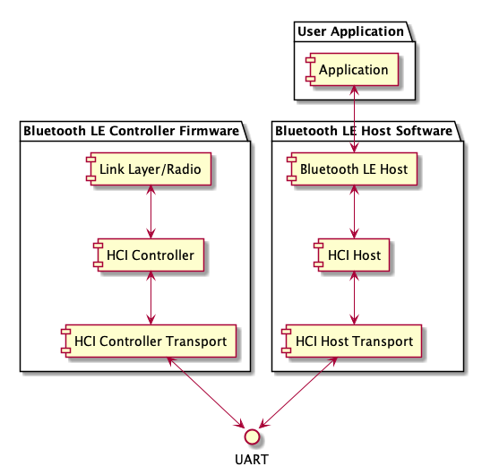
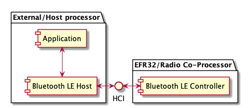
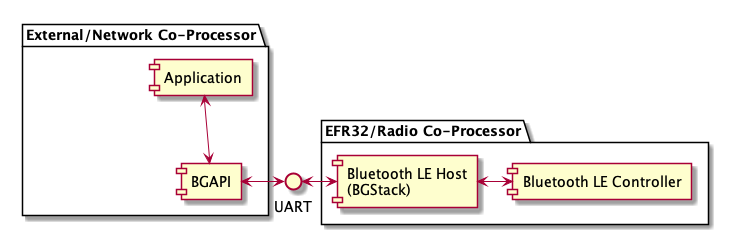
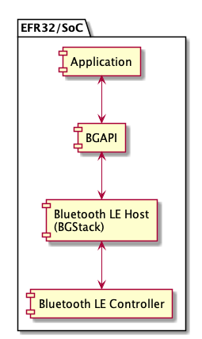

# Introduction

The HCI is described in detail in Bluetooth Core Specification, Vol 4: Host Controller Interface. In the Silicon Labs software and documentation, the HCI is also referred to as RCP (Radio Co-Processor).

The HCI is a standardized way for Bluetooth host and controller to communicate with each other. Since the interface is standard, the host and controller can be from different vendors.

The following figure illustrates the layered communication mechanism between the Bluetooth Controller and Host protocol stacks, and the user application.

The lowest layer between the host and controller communication is the HCI Transport. Currently, the RCP (Radio Co-Processor) sample applications support the HCI Three-Wire UART, or UART (Universal Asynchronous Receiver-Transmitter) as the HCI transport layer using either:

- Bluetooth SIG’s UART (H4) transport protocol or

- Silicon Labs’ proprietary CPC (Co-Processor Communication) protocol.

The next layer is the HCI, which provides set of commands and events, and ACL data packets. The Host side sends commands to the controller. The commands are used to start advertising or scanning, establish connection to another Bluetooth device, read status information from the controller, and so on.

The events are sent from the Controller side to the Host. The events are used as a response to commands or to indicate various events in the controller such as scanning reports, connection establishment or closing, and various failures.

The ACL (Asynchronous ConnectionLess) data packets are used to deliver user application data between the host and controller in both directions. The data packets are exchanged between Bluetooth devices.

The Silicon Labs Bluetooth LE Controller does not support SCO (Synchronous Connection Oriented) and ISOC (Isochronous Channels) modes, and the related HCI messages are not supported.

The Bluetooth specification defines three types of controllers: Low Energy (LE), BR/EDR (classic) and AMP (alternate MAC and PHY). Silicon Labs supports only the LE controller.

The Silicon Labs Bluetooth LE Controller runs on EFR32 Radio Co-Processors, and external Bluetooth Host stacks can communicate with the controller over the HCI. This is also called RCP mode, and is illustrated in the following figure.

Silicon Labs’ previously provided solutions, NCP (Network Co-Processor) mode and SoC mode, are illustrated in figure NCP Mode and figure SoC Mode below, respectively. In the NCP mode the Silicon Labs Host and Controller protocol stacks run on the EFR32 Radio Co-Processor. The application runs on a separate processor and communicates with Silicon Labs Bluetooth stack over the proprietary NCP protocol (BGAPI), which is exposed to the application via UART.

In SoC mode the application runs on the same processor as the Silicon Labs Bluetooth LE protocol stacks. The application communicates with the Bluetooth LE protocol stack via BGAPI.

